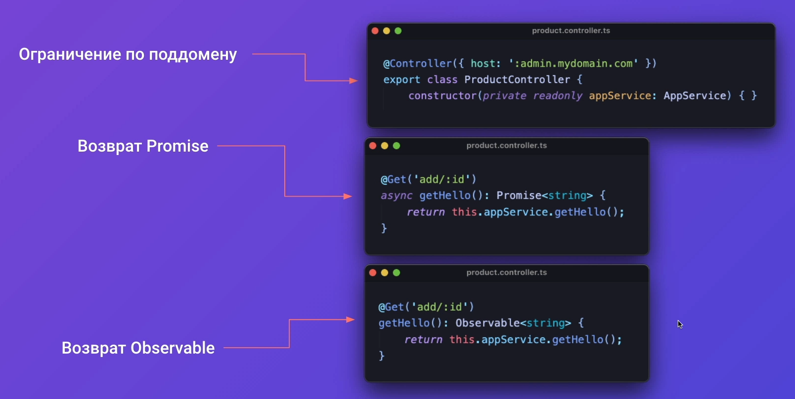
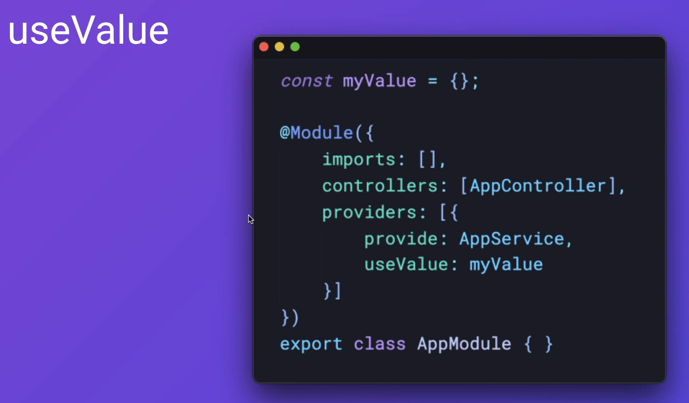
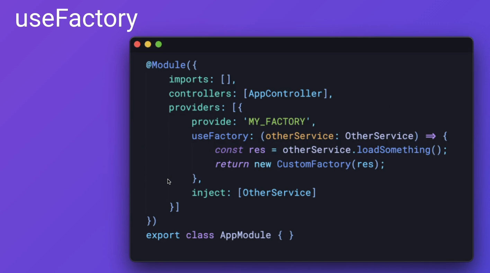

## 001 Обзор структуры проекта

Конфиг для TS

`tsconfig.json`
```JSON
{
  "compilerOptions": {
    "strict": true,           /* активирует строгий режим */
    "strictNullChecks": true, /* если значение может быть null, то это нужно явно указать */
    "noImplicitAny": true,    /* обязательно нужно везде указывать типы */
    "strictPropertyInitialization": false,  /* разрешит использовать классы как интерфейсы*/
    "skipLibCheck": true,                   /* позволяет игнорировать проверку библиотек */
    "module": "commonjs",
    "declaration": true,
    "removeComments": true,
    "emitDecoratorMetadata": true,
    "experimentalDecorators": true,
    "allowSyntheticDefaultImports": true,
    "target": "es2017",
    "sourceMap": true,
    "outDir": "./dist",
    "baseUrl": "./",
    "incremental": true,
    "strictBindCallApply": false,
    "forceConsistentCasingInFileNames": false,
    "noFallthroughCasesInSwitch": false
  }
}
```

Тут используется TSLint вместо ESLint. Конфиг для тслинта:

`tslint.json`
```JSON
{
	"rules": {
		"no-var-requires": true,
		"no-any": true,
		"promise-function-async": true,
		"await-promise": true,
		"curly": true,
		"prefer-for-dcof": true,
		"forin": true,
		"no-console": [true, "log", "error"],
		"no-debugger": true,
		"no-duplicate-super": true,
		"no-duplicate-switch-case": true,
		"no-invalid-template-strings": true,
		"no-misused-new": true,
		"no-return-await": true,
		"no-shadowed-variable": true,
		"no-switch-case-fall-through": true,
		"no-tautology-expression": true,
		"no-unused-variable": true,
		"no-var-keyword": true,
		"static-this": true,
		"switch-default": true,
		"triple-equals": false,
		"no-require-imports": false,
		"prefer-const": true,
		"arrow-return-shorthand": true,
		"class-name": true,
		"file-name-casing": [true, "kebab-case"],
		"interface-name": [true, "always-prefix"],
		"prefer-switch": [true, { "min-cases": 3 }],
		"switch-final-break": true,
		"import-spacing": true,
		"max-line-length": [true, 120],
		"no-trailing-whitespace": false,
		"quotemark": [true, "single"],
		"semicolon": [true, "always"],
		"trailing-comma": false,
		"indent": [true, "tabs", 4],
		"linterOptions": {
			"exclude": ["./src/**/*.d.ts"]
		}
	}
}
```

Данная команда запустит сервер в режиме просмотра (перекомпиляции при изменениях)

```bash
npm run start:dev
```


## 002 Введение в модули

Модули - это строительные блоки, из которых состоит приложение. 

У всех приложений на NestJS должен быть хотя бы один модуль (например, `AppModule` для главного модуля неста)

Зачастую, на больших проектах вложенность по модулям не составляет больше трёх (первый - второй - третий уровни модулей)

Модули позволяют разделять приложения на разные кусочки, что упрощает вынесение нужного функционала в отдельный микросервис


Модуль объединяет в себе различные зависимости одной области практического применения. 

Декоратор модуля (`@Module`) принимает в себя данные значения:
- `imports: []` - что импортируется в данный модуль
- `controllers: []` - контроллеры данного модуля (позволяют с ним связаться извне / http-контроллеры запросов / принимают запрос от клиента и выполняют методы из сервиса, а так же выкидывают ошибки)
- `providers: []` - сервисы, репозитории (базы данных)
- `exports: []` - что экспортируется из данного модуля

Все данные передаются в декораторы, так как по декораторам строится дерево зависимостей в NestJS. Идя от корневого модуля до конечных вложенностей, фреймворк собирает все импорты, контроллеры, провайдеры и строит данное дерево.


Если модуль используется в нескольких других модулях, то такая практика приемлема


Импортированные модули можно повторно переэкспортировать


Если нам нужно использовать модуль глобально (во всех модулях приложения), то мы можем объявить его как `@Global()`. 

Например, если нам нужно использовать модуль по работе с базой данных в нескольких местах, то мы можем сделать его глобальным, что нам позволит им пользоваться без дополнительного импорта. *Однако глобальный модуль должен быть импортирован в корневой модуль*.


Часто, при подключении определённых модулей (например БД), нам нужно не просто импортировать определённый модуль, но и так же нужно передать определённую информацию (например, строку подключения к базе данных). Обычно для таких вещей используют динамические модули. 

Динамический модуль - это статический метод, который возвращает модули, провайдеры, экспорты и импорты.

Метод именуется `forRoot()`, если он используется глобально (`@Global`) или `forFeauture()`, если он используется только в определённом скоупе модулей

Так же можно в `return` указать `global: true`, чтобы модуль был глобальным

То есть, мы реализовали модуль работы с базой данных и нам нужно в него передавать строку подключения. Для этого реализуется метод `forRoot` внутри этого модуля (работы с БД), чтобы мы могли внутрь него передать строку подключения или любые другие параметры


## 003 Деление на модули

Так выглядит наша страница в итоге:
- Мы должны иметь возможность зайти на сайт, чтобы получить доступ к административным возможностям (удаление комментариев)
- Мы имеем топ продуктов (курсов), с оценками о них 
- Мы имеем определённое количество отзывов, которые относятся к определённым курсам
- Боковое меню должно получать данные для заполнения с сервера


По итогу мы имеем:
- Модуль авторизации
- Модуль продукта
- Модуль отзыва
- Модуль страницы (пункты меню и так далее)
- Модуль приложения, который объединяет все представленные модули


Для генерации модулей можно воспользоваться встроенным ==CLI== неста

```bash
nest g module auth
nest g module product
nest g module review
nest g module top-page
```

По итогу нест нам сам сгенерирует нужные модули, сделает для них папки и сам обновит импорты в корневом модуле `AppModule`, добавив в него сгенерированные модули


## 004 Создание моделей

В качестве моделей данных будут использоваться классы, которые опишут те данные, с которыми будет работать модуль

Описываем модели данных с помощью классов, а не интерфейсов по следующим причинам:
- на них можно навесить декораторы для валидации
- использовать сразу в БД
- так же можно добавлять полезные методы для самой сущности с данными

(`--no-spec` позволяет не создавать спеки)

```bash
nest g class product/product.model --no-spec
nest g class auth/auth.model --no-spec
nest g class review/review.model --no-spec
nest g class top-page/top-page.model --no-spec
```


И примерно так выглядят логи:


В моделях нам нужно описать все те базовые значения, которые в себе будут хранить определённые сущности. Здесь главное описать базовую модель, которую в будущем можно будет дополнять.

Первым делом опишем продукты, которые в себе будут содержать: изображение, заголовок, цену (которая может иметь скидку и для этого мы можем указать цену без скидки, а так же стоимость в кредит), рейтинг курса, описание курса, преимущества, недостатки, категории (под которое попадает курс), теги и характеристики курса (сложность, длительность и так далее, где будет неограниченное количество ключей-строк и значений-строк).  

`src / product / product.model.ts`
```TS
export class ProductModel {
  	_id: string;
	image: string;
	title: string;
	price: number;
	oldPrice: number;
	credit: number;
	calculatedRating: number;
	description: string;
	advantages: string;
	disAdvantages: string;
	categories: string[];
	tags: string;
	characteristics: {
		[key: string]: string;
	};
}
```


Аутентификация пригодится только для администрации (отзывы может оставлять любой пользователь сайта). Для входа будет нужна только почта и пароль. 

`src / auth / auth.model.ts`
```TS
export class AuthModel {
	email: string;
	passwordHash: string;
}
```

Модель комментария. Как описывалось выше, комментарий может оставить любой пользователь.

`src / review / review.model.ts`
```TS
export class ReviewModel {
	_id: string;
	name: string;
	title: string;
	description: string;
	rating: number;
	createdAt: Date;
}
```


И далее будет представлена модель страницы. Она будет:
- Подстраиваться под выбранную категорию товара
- Подстраиваться под выбранную подкатегорию
- Будет иметь свой заголовок
- Будет иметь выбранную категорию
- Иметь возможность получать доступ к данным `hh.ru` и возвращать от него нужные данные
- Иметь сео-текст
- Иметь теги

`src / top-page / top-page.model.ts`
```TS
// верхнии категории списка
export enum TopLevelCategory {
	Courses,
	Services,
	Books,
	Products
}

export class TopPageModel {
	_id: string;
	// категория, в которой мы сейчас располагаемся
	firstCategory: TopPageModel;
	secondCategory: string;
	title: string;
	category: string;
	// Этот блок будет появляться только для курсов
	hh?: {
		count: number; // количество вакансий
		juniorSalary: number;
		middleSalary: number;
		seniorSalary: number;
	};
	advantages: {title: string; description: string}[];
	seoText: string;
	tagsTitle: string;
	tags: string[];
}
```


## 005 Введение в контроллеры

Контроллер - это входная точка в приложение, куда приходят запросы


Через метод `setGlobalPrfix` мы можем установить, по какому порту мы сможем получить доступ к приложению на сервере (у нас установлено `'api'`). 

При использовании декоратора `@Controller('название_роута')` мы сможем обращаться к методам, к которым имеет доступ контроллер (к методам его класса).

Далее через декораторы `@Get()`, `@Post()` и так далее мы можем указать вызываемые методы, которые и будут определять вызваемый метод по типу запроса (когда мы с клиента будем выбирать тип вызываемого запроса). 

Конкретно `'add/:id'` позволяет нам определить тот роут в контроллере, по которому мы выполняем метод. `:id` - это некоторый строковый параметр, по которому мы будем определять, что нам нужно. 

Всё то, что вернёт данный метод - это то, что уйдёт нашему клиенту в виде JSON-объекта (nest автоматом под капотом преобразует данные).


Основные декораторы аргументов - это `@Req()` и `@Res()`. Всё, что находится ниже черты - это дополнительные декораторы, которые входят в первые два основных.
- `@Params()` - позволяет вытащить параметр из запроса (тот же `id`, что представлен выше)
- `@Body()` - тут мы получаем тело запроса, которое приходит нам с фронта (если пришёл пост-запрос, то из него уже можем вытащить определённые данные)
- `@Query()` - если у нас есть `query`-параметры в строке запроса
- `@Headers()` - выдаёт заголовки (всё, что связано с авторизацией, контент-тайпом и т.д.)
- `@Session()` - возвращает сессиюпользователя


И тут показан пример того, что мы получим при переданной ссылке:
- `@Params` вернёт нам `1`
- `@Query` вернёт нам всё то, что идёт после `?`
- `@Body` - вернёт нам тело запроса на АПИ
- `@Headers` - вернёт нам тот же `Bearer` токена


Так же дополнительные возможности контроллеров:
- Мы можем знаком `*` обозначить, что тут может быть любой символ `_, - и так далее` (конкретно тут будут выполняться методы по пути `product`/`products`)
- Так же мы можем прописать кастомный HTTP код, который вернётся пользователю
- Мы можем вставить кастомный хедер ответа
- Так же мы можем перенаправить запрос пользователя на другое место (если у нас не MVC приложение, то тот же реакт может выдать ошибку и отказаться перенаправить на другую страницу)
- Так же мы можем очень большое АПИ разграничить по поддоменам
- Вернуть промис или вернуть отслеживаемый объект (то есть нест сам разрезолвит данные методы или получит первое значение из observable и вернёт как ответ)




- Так же мы можем вернуть ответ объектом типа `Response` (однако нам обязательно нужно импортировать данный тип из модуля `express`)


## 006 Создание контроллеров

Первым делом определим префикс, который предоставит доступ к АПИ

`src / main.ts`
```TS
import { NestFactory } from '@nestjs/core';
import { AppModule } from './app.module';

async function bootstrap() {
	const app = await NestFactory.create(AppModule);

	// Устанавливаем глобальный префикс для доступа к АПИ
	app.setGlobalPrefix('api');

	await app.listen(3000);
}
bootstrap();
```

Все контроллеры, которые мы создадим создадут файл самого контроллера и файл `.module`, в котором будут описаны связи контроллеров и определённого модуля.
Нам нужно сгенерировать контроллеры под все созданные модули.

```bash
nest g controller auth --no-spec
nest g controller product --no-spec
nest g controller review --no-spec
nest g controller top-page --no-spec
```

И тут CLIка сама создаст шаблонный код контроллера и обновит зависимости в модуле данного функционала


Далее опишем модель данных, которую принимает в себя контроллер аутентификации. 
Описывать модель будем с помощью классов.

==DTO== (*Data Transfer Object*) - это модель, при которой класс описывает тело (`body`) запроса. Конкретно в несте мы будем описывать ту модель данных, которая будет попадать в контроллер.

В системе будет использоваться логин и регистрация. Они будут принимать в себя одинаковый набор данных, поэтому файл можно использовать один 

Такой подход позволит описать Swagger-нотацию для АПИ

`src / auth / dto / auth.dto.ts`
```TS
export class AuthDto {
	login: string;

	// тут мы принимаем от клиента не хеш пароля, а сам пароль от пользователя
	password: string;
}
```

Контроллер аутентификации должен уметь принимать данные на регистрацию и на логин пользователя в системе.

Конкретно при регистрации мы создаём нового пользователя в базе данных и сохраняем его. Уже при логине пользователь должен получать уведомление об успешном входе, что можно отобразить через статускод успеха (`200`). *Данный код можно добавлять для всех методов, когда мы ничего не создаём, а просто получаем с сервера*.

`src / auth / auth.controller.ts`
```TS
import { Body, Controller, HttpCode, Post } from '@nestjs/common';
import { AuthDto } from './dto/auth.dto';

@Controller('auth')
export class AuthController {
	@Post('register')
	async register(@Body() dto: AuthDto) {}

	@HttpCode(200)
	@Post('register')
	async login(@Body() dto: AuthDto) {}
}
```

Далее мы реализуем контроллер для продукта, который сможет принимать новые посты и создавать их, удалять их, искать, отдавать найденные и обновлять.

Данная утилита типа `Omit<ProductModel, '_id'>` позволит нам получить все данные по модели продукта исключая поле `_id`, которое нам не требуется на данный момент (метод `create` будет только создавать продукт).

`src / product / product.controller.ts`
```TS
import { Body, Controller, Delete, Get, HttpCode, Param, Patch, Post } from '@nestjs/common';
import { ProductModel } from './product.model';
import { FindProductDto } from './dto/find-product.dto';

@Controller('product')
export class ProductController {
	// метод получения продукта на сервере и создания
	@Post('create')
	async create(@Body() dto: Omit<ProductModel, '_id'>) {}

	// метод отправки продукта клиенту
	@Get(':id')
	async get(@Param('id') id: string) {}

	// метод удаления продукта
	@Delete(':id')
	async delete(@Param('id') id: string) {}

	// метод обновления продукта
	@Patch(':id')
	async patch(@Param('id') id: string, @Body() dto: ProductModel) {}

	// метод поиска продуктов
	@HttpCode(200)
	@Post()
	async find(@Body() dto: FindProductDto) {}
}
```

Так же реализуем DTO, которая будет определять лимит выведенных продуктов для пользователя, который их ищет и категорию поиска.

`src / product / dto / fint-product.dto.ts`
```TS
export class FindProductDto {
	category: number;
	limit: number;
}
```

Контроллер обзора имеет в себе методы для отправки обзора на сервер, удаление обзора и получение обзора по продукту, к которому относится данный обзор (получаем обзор по `id` продукта).

`src / review / review.controller.ts`
```TS
import { Body, Controller, Delete, Get, Param, Post } from '@nestjs/common';
import { ReviewModel } from './review.model';

@Controller('review')
export class ReviewController {
	// метод получения обзора сервером
	@Post('create')
	async create(@Body() dto: Omit<ReviewModel, '_id'>) {}

	// метод удаления обзора
	@Delete(':id')
	async delete(@Param('id') id: string) {}

	// получение обзора по продукту (заходим в продукт и видим его обзоры)
	@Get('byProduct:productId')
	async getByProduct(@Param('productId') productId: string) {}
}
```

Далее идёт контроллер главной страницы, который позволяет делать почти всё то же самое, что и контроллер продукта.

`src / top-page / dto / top-page.controller.ts`
```TS
import { Body, Controller, Delete, Get, HttpCode, Param, Patch, Post } from '@nestjs/common';
import { TopPageModel } from './top-page.model';
import { FindTopPageDto } from './dto/find-top-page.dto';

@Controller('top-page')
export class TopPageController {
	@Post('create')
	async create(@Body() dto: Omit<TopPageModel, '_id'>) {}

	@Get(':id')
	async get(@Param('id') id: string) {}

	@Delete(':id')
	async delete(@Param('id') id: string) {}

	@Patch(':id')
	async patch(@Param('id') id: string, @Body() dto: TopPageModel) {}

	@HttpCode(200)
	@Post()
	async find(@Body() dto: FindTopPageDto) {}
}
```

Модель DTO позволяет нам определить какие данные нам нужны для вывода определённой страницы по нужной нам категории. 

`src / top-page / dto / find-top-page.ts`
```TS
import { TopLevelCategory } from '../top-page.model';

export class FindTopPageDto {
	firstCategory: TopLevelCategory;
}
```

Так выглядит структура проекта в итоге:


## 007 Введение в провайдеры

Провайдер - это класс, значение, фабрика, которая позволяет использовать модель неста по внедрению зависимостей и встраиваться друг в друга (в контроллеры, сервисы) и выполнять те или иные функции (чтение из БД, запросы к другим сервисам, величина, которую мы хотим шерить между сервисами и так далее) 


`@Injectable()` позволяет указать, что данный класс используется в качестве провайдера и находится в дереве зависимостей.


Чтобы использовать, указанный выше провайдер, нужно просто вставить его в зависимости модуля (`providers: [имя_провайдера]`) и вставить в контроллер в качестве зависимости (внутрь конструктора). 
Чтобы использовать провайдер в другом модуле, нужно его экспортировать.

Если обе зависимости ссылаются друг на друга, то они формируют циклические зависимости. Это приводит к использованию `forwardRef` в зависимостях, что говорит нам о том, что архитектура приложения построена не оптимально и выбранный подход является неоптимальным.


Провайдеры делятся на 4 основных типа:
- Провайдер класса
- Значение (которые мы хотим шерить между другими модулями)
- Фэктори, который генерирует другие провайдеры 
- Использовать существующий провайдер, но с псевдонимом


Это стандартная запись провайдера класса. Она автоматически сокращена до записи одного элемента массива с наименованием класса.
Полная запись представляет из себя массив объектов:
- `provide` говорит нам, как будет называться представленная зависимость
- `useClass` позволяет нам указать какой класс будет провайдиться


Так же мы можем через `useValue` распространять готовую величину, которую мы укажем сами между другими модулями.

Это может быть полезно, когда нам нужно написать тест: например, нам нужно сделать вместо настоящего обращения к базе и провайдера искусственное, при котором мы используем уже готовые данные для возврата.



Так же мы можем использовать `useValue` не с классом, а просто распространять как отдельное значение.


Провайдер `useFactory` позволяет нам инициализировать класс с уже готовыми конфигами (возвращаем новый инстанс класса с выбранными нами параметрами). Удобнее всего использовать для инициализации базы данных внося некоторые настройки.



Когда мы имеем уже существующий сервис в качестве провайдера, мы можем дать ему другое имя через `useExisting` и переиспользовать его.


В NestJS есть несколько скоупов выполнения:
- ==default== - если записываем любой сервис с пустыми параметрами декоратора `@Injectable()`. 
- ==request== - этот скоуп будет на каждый запрос к серверу создавать новый инстанс сервиса.
- ==transient== - каждое новое внедрение данного сервиса возвращает новый инстанс данного сервиса.


На всё приложение будет 1 инстанс данного сервиса. Это приводит к использованию паттерна ==Singleton==.


При одном запросе будет каждый раз генериться новый инстанс `GenerateSrvice`. При этом, если два сервиса используют данный сервис, то они получат один инстанс.


Сколько раз будет внедряться `GenerateSrvice` в другие сервисы, столько разных `GenerateSrvice` они и получат - всем своё, отдельное


