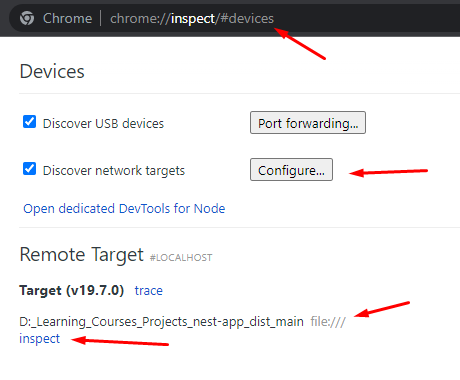

## 001 Debug

Команда дебага

```bash
npm run start:debug
```

Самое важное тут - это строка прослушивания, которая позволит подключиться другим инструментам к дебагу


## 002 Анализ памяти

Создадим искусственную утечку памяти (при каждом запросе на поиск обзора будет создаваться новый класс, который не удаляется)


Далее можно в хромовском инспекте запустить девтулз по порту `9229` 



И далее во вкладке *Memory* можно сделать снепшот приложения на данный момент времени, который покажет все инстансы нашего приложения. На данный момент времени занято не так много ОЗУ, так как в приложение не поступало запросов


Далее нам нужно будет произвести искусственную нагрузку на наше приложение отправляя на него искусственные запросы в большом количестве. Можно, конечно, отправлять самостоятельно запросы через *insomnia*, но лучше автоматизировать данный подход через модуль `autocannon`

```bash
npm i -g autocannon
```

В автокэннон нужно передать ссылку, которая отправит большое количество запросов на данный роут сервера


И при повтором запуске скриншота будет отображено количество созданных классов


Профайлер позволяет сделать проверки нагрузки на ЦП


## 003 Анализ производительности

Устанавливаем глобально клинику

```bash
npm i -g clinic
```

Далее нужно будет сбилдить проект

```bash
npm run build
```

Дефолтная строка подключения:

```bash
clinic doctor --on-port 'autocannon localhost:$PORT' -- node slow-event-loop
```

Строка подключения для проекта (стоит обратиться к документации):

```bash
clinic doctor --on-port 'autocannon localhost:$PORT/api/review/byProduct/8123864918273189237sad23' -- node dist/main.js
```

Далее у нас запускается проект


И формируется данная страница, которая показывает 4 показателя с частой утечкой памяти по ним (нагрузка на ЦПУ, использование памяти, задуржки ивент лупа, количество активных хэндлеров)


