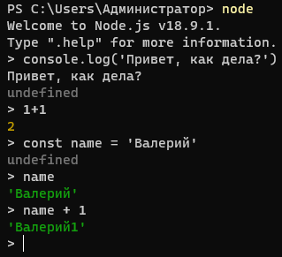

### 009 Сравнение сред выполнения JS

==NodeJS== имеет своё собственное API, которое несовместимо с браузером, поэтому могут быть некоторые сложности из-за несовместимости со стандартным ==JS== (в браузере). Так же нода имеет свои глобальные переменные, так как она работает непосредственно с ПК


Так же есть и более свежый вариант бэка на ==JS== - это ==Deno==. Единственная его проблема заключается в том, что он пока очень молод и коммьюнити не такое и большое.


### 010 Запускаем код и REPL

REPL-режим - это режим, при котором мы можем запустить определённую среду в консоли

Запускается REPL в ноде командой:
```bash
node
```

И работать в этом режиме так же как и в браузере



Создаём поток чтения `fs`, который будет читать наш текстовый файл и выводить его в консоль
 
```JS
fs = require("fs");  
  
const data = fs.readFileSync("./data.txt");  
console.log(data.toString());
```


### 011 Модули в JavaScript

Плюсы модулей:


История выраженности нужности импортов достаточно небольшая и она состояла из трёх этапов:
1) IIFE функции
2) Второй стандарт появился в NodeJS и работал через `require`. Для работы в браузере он требовал сборку в один файл (через сборщики модулей)
3) Последняя версия стандарта появилась сначала для работы на фронте, но в последние несколько лет её можно использовать и на бэке


Самые первые импорты - **IIFE**. Это функции, которые вызвались самостоятельно. Внутри них происходил не просто самовызов на странице пользователя, а взаимное связывание и присвоение отдельных компонентов функции к главному скриптовому файлу.
Порядок подключения был важен.


Второй способ - **CommonJS** . В первую очередь, они работают именно на бэке. Для работы на фронте им был нужен сборщик модулей, который собирал бы на ноде файл в один модуль.


И последний способ импорта - **ES Modules**. Особенность ноды заключается в том, чтобы использовать современные импорты, нужно использовать расширение `.mjs`


Главным преймуществом CommonJS является то, что его можно использовать в любом месте кода, а так же в условиях (что позволяет нам не подключать какой-либо модуль, если нам то не нужно)
Главным преймуществом ES Modules является то, что он подключает тольк указанные части модуля, а не его полностью (если то не требуется) + он асинхронен (не останавливает выполнение приложения, если импорт не подгрузился)


Подключить модули в NodeJS можно тремя способами:


### 012 CommonJS Modules

Напишем небольшой пример, где мы будем определять владельца кольца. 
С помощью `module.exports = { имена экспортов };` мы определяем, что будем экспортировать из модуля

`characters.js`
```JS
let characters = [  
   { name: 'Фродо', hasRing: false },  
   { name: 'Бильбо', hasRing: false },  
];  
  
function steelRing(characters, owner) {  
	// тут функция конкретно изменяла вложенное в неё значение
   characters.map(c => {  
      if (c.name == owner) {  
         c.hasRing = true;  
      } else {  
         c.hasRing = false;  
      }  
   });  
}  
  
module.exports = { characters, steelRing };
```

Уже тут через деструктуризацию и функцию `require()`, мы получаем доступ к экспортированным объектам модуля

`app.js`
```JS
const { characters, steelRing } = require('./characters.js');  
  
steelRing(characters, 'Фродо');  
  
for (const c of characters) {  
   console.log(c);  
}
```


И дальше нужно переписать код так, чтобы функция работала правильно и не мутировала внутри себя значение, а возвращала изменённое значение вовне.

```JS
// characters.js
let characters = [  
   { name: 'Фродо', hasRing: false },  
   { name: 'Бильбо', hasRing: false },  
];  
  
function steelRing(characters, owner) {  
   return characters.map(c => {  
      if (c.name == owner) {  
         c.hasRing = true;  
      } else {  
         c.hasRing = false;  
      }  
   });  
}  
  
module.exports = { characters, steelRing };


// app.js
const { characters, steelRing } = require('./characters.js');  

// Нужно создать новую переменную, которая будет хранить старую версию массива и принимать изменённый
let myChars = characters;  
myChars = steelRing(myChars, 'Фродо');  
  
for (const c of characters) {  
   console.log(c);  
}
```

так же экспортировать можно непосредственно и функцию прямо на месте её создания

```JS
// characters.js
module.exports = function log() {  
   console.log('log');  
}

// app.js
const log = require('./characters.js');  
log();
```

>[!warning] Круговые зависимости, когда у нас есть импорты и экспорты между двумя файлами - могут привести к ошибке (потому как интерпретатор будет пытаться достучаться до элемента, которого пока не существует)

И тут далее можно увидеть пример, когда мы подгружаем модуль в проект по условию (при выполнении условия - модуль подгружается)

```JS
// characters.js
console.log('characters.js загружен');  
  
module.exports = function log() {  
   console.log('log');  
}

// app.js
const a = 1;  
if (a > 0) {  
   const log = require('./characters.js');  
   log();  
} else {  
   console.log('Меньше 0');  
}
```

### 013 ES Modules

Чтобы сказать ноде, что мы пользуемся модулями, нужно:
1) Либо добавить расширение файлу `.mjs`
2) Либо указать это в `package.json`
3) Либо в `tsconfig`

В обычной модульной системе, мы можем через `export` экспортировать объект из модуля

`characters.mjs`
```JS
export const characters = ["Фродо", "Бильбо"];

export function greet(character) {
	console.log(`Поздравляю, ${character}!`);
}
```

Далее через конструкцию `import` импортировать его в другом файле

`app.mjs`
```JS
import { characters, greet } from "./characters.mjs";

for (const c of characters) {
	greet(c);
}
```

Так же мы можем импортировать сразу все объекты через конструкцию `* as имя` 

`app.mjs`
```JS
import * as char from "./characters.mjs";

for (const c of char.characters) {
	char.greet(c);
}
```

Так же мы имеем дефолтный экспорт `export default` - это принимаемое значение из модуля по умолчанию

`characters.mjs`
```JS
export const characters = ["Фродо", "Бильбо"];

export function greet(character) {
	console.log(`Поздравляю, ${character}!`);
}

export default function log() {
	console.log("log");
}
```
`app.mjs`
```JS
import log, { characters, greet } from "./characters.mjs";

for (const c of characters) {
	greet(c);
}

log();
```

Так же нам ничто не мешает объединять конструкции и импортировать дефолтную функцию + все объекты модуля 

`app.mjs`
```JS
import log, * as char from "./characters.mjs";

for (const c of char.characters) {
	char.greet(c);
}

log();
```

Дальше мы можем столкнуться с такой проблемой при большом количестве импортов, что имена совпадают у объектов. Чтобы решить проблему, можно переопределить импортируемый объект

`app.mjs`
```JS
import log, {characters, greet as hello} from "./characters.mjs";

for (const c of characters) {
	hello(c);
}

log();
```

Так же присутствует в ноде асинхронный импорт модуля, который позволяет произвести es module испорт из любого места. Сразу нужно сказать, что он возвращает промис, поэтому его нужно дожидаться

`app.mjs`
```JS
async function main() {
	const { characters, greet } = await import("./characters.mjs");

	for (const c of characters) {
		greet(c);
	}
}
main();
```

Так же никто нам не мешает ловить и обрабатывать ошибки при данных импортах

`app.mjs`
```JS
async function main() {
	try {
		// ошибка при импорте
		const { characters, greet } = await import("./charactersыфвв.mjs");

		for (const c of characters) {
			greet(c);
		}
	} catch (error) {
		console.log("Ошибка");
	}
}
main();
```


>[!note] По возможности стоит пользоваться конкретно таким импортом, потому что он позволяет импортировать только то, что нужно, он асинхронен и удобен


### 014 Глобальные переменные

Глобальные переменные - это переменные, доступ к которым мы можем получить из любого места приложения без дополнительных импортов и вызовов.

Модули делятся на глобальные и глобальные модульные. Конкретно вторые зависят от того модуля, из которого мы их вызваем 

Модуль `global` - это корневой объект всех переменных. Мы можем записать `global.console`, а так же и просто `console`

1) Группа глобальных объектов, которые не категоризируются
	1) `preformance` - помогает определить производительность 
	2) `Buffer` - читает набор байт
	3) `AbortController` - позволяет прерывать API, основанные на промисах
	4) `queueMicrotask` - это планировщик задач для `V8`
	5) `WebAssembly` - хранит модули `WebAssembly`
3) Группа таймеров
4) Группа работы с URL
5) Группа работы с сообщениями (используются в вебсокетах)
6) Группа работы с событиями
7) Группа работы с текстом (например, перевод текста в другую кодировки и обратно)
8) Группа модулей
	1) `__dirname` - получает путь до модуля
	2) `__filename` - получает имя файла
	3) `exports`
	4) `module`
	5) `require()`


`__dirname` возвращает нам просто путь до нашего модуля


А уже `__filename` возвращает нам путь с именем файла


### 015 Events

Модуль ==Event Emitter== - это модуль, который позволяет обмениваться сообщениями между модулями внутри приложения на ноде. Мы как и на фронте можем подписаться на определённый ивент и при срабатывании ивента передавать определённое сообщение в другой модуль

Есть два способа генерировать события для наших модулей системы, но стоит пользоваться только одним - ==Event Emitter==, который полностью покрывает все потребности в повседневной разработке


Через функции `addListener` и `on` мы подписываем слушателя на определённые события и можем выполнять их через `emit`. 
Чтобы удалить события, нам нужно воспользоваться `removeListener`, `removeAllListeners` или `off`. Удалять события важно, так как они отвечают за огромные утечки памяти.  

`app.js`
```JS
// добавляем модуль ивентов
const EventEmitter = require("events");

// создаём отдельный инстанс события (их может быть много)
const myEmitter = new EventEmitter();

// функция подключения к базе данных
const lodDBConnection = () => {
	console.log("DB Connected");
};

// тут мы создаём новое событие, при триггере которого будет срабатывать подключение к базе данных
myEmitter.addListener("connected", lodDBConnection);

// это сам триггер этого события
myEmitter.emit("connected"); // "DB Connected"

// так же нам стоит удалять подписки на ивент листенеры, так как это является одной из основных проблем утечек памяти программы
myEmitter.removeListener("connected", lodDBConnection);
// myEmitter.off("connected", lodDBConnection); // отклюает листенер с события
// myEmitter.removeAllListeners("connected"); // удалит все листенеры с события

// уже этот вызов листенера не сработает, так как мы убрали листенер с события
myEmitter.emit("connected"); // ничего не произойдет
```

Таким образом мы можем передавать данные в наши листенеры

`app.js`
```JS
// Создание листенера с приёмом данных
myEmitter.on("message", (data) => {
	console.log(`Получено: ${data}`);
});

// триггерим листенер с передачей в него данных
myEmitter.emit("message", {
	name: "Valery",
	surname: "Lvov",
});
```

Так же функция `once()` позволяет создать событие, которое сработает только однажды, а потом удалится

`app.js`
```JS
// Это событие сработает только один раз и потом удалится
myEmitter.once("off", () => {
	console.log("Я отключился");
});

myEmitter.emit("off"); // "Я отключился"
myEmitter.emit("off"); // ничего не произойдёт
```

Мы можем определить своё собственное максимальное количество слушателей на наше событие и получить это количество

`app.js`
```JS
console.log(myEmitter.getMaxListeners()); // 10
myEmitter.setMaxListeners(1); // устанавливаем максимальное число листенеров на наше событие
console.log(myEmitter.getMaxListeners()); // 1

console.log(myEmitter.listenerCount("message")); // 1 - так как этот листенер до сих пор существует
console.log(myEmitter.listenerCount("off")); // 0 - так как уже отработал и удалился
```

Так же у листенеров есть порядок выполнения. Самыми первыми выполняются те, что находятся в начале массива. Мы можем влиять на выполнение этих листенеров определёнными методами.

```JS
// Создание листенера с приёмом данных
myEmitter.on("message", (data) => {
	console.log(`Получено: ${data}`); // вызовется вторым
});

myEmitter.prependListener("message", () => {
	console.log("Prepand"); // вызовется первым
}); 

// триггерим листенер с передачей в него данных
myEmitter.emit("message", {
	name: "Valery",
	surname: "Lvov",
});

console.log(myEmitter.listeners("message")); // выведет массив листенеров данного события
```

Тут мы можем вывести все имена наших имеющихся событий 

```JS
console.log(myEmitter.eventNames()); // выведет массив имён событий
```

Так же ивенты можно использовать для обработки ошибок в приложении

```JS
// Обработка ошибок
myEmitter.on("error", (err) => {
	console.log(`Error ${err.message}`);
});

myEmitter.emit("error", new Error("BOOOOOOOOOOOOOOOOOOM!"));
```


Использование ==Event Target== (*не рекомендуется*): 

```JS
// инициализация ивента
const target = new EventTarget();

// какая-то функция
const logTarget = () => {
	console.log("That's a target");
};

// добавление слушателя
target.addEventListener("connected", logTarget);

// вызов ивента
target.dispatchEvent(new Event("connected"));
```