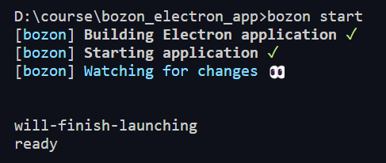
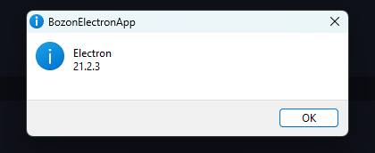
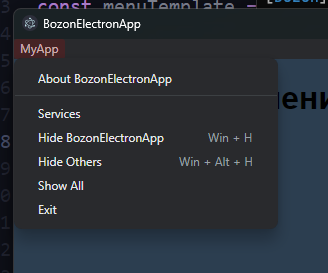
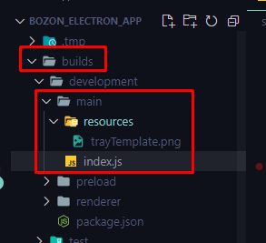
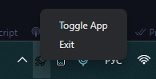

## 010 Модуль [app](https://www.electronjs.org/docs/latest/api/app)

Модуль `app` это уже готовый объект со своими методами, к которому мы можем подключаться  

С помощью метода `on` электрон подписывает основной процесс на определённые события 

`src > main > index.js`
```JS
import { app } from "electron";

// это ивент, который срабатывает на macOS при загрузке приложения
app.on("will-finish-launching", () => {
	console.log("will-finish-launching");
});

// Это ивент, который срабатывает при загрузке приложения
app.on("ready", () => {
	console.log("ready");
});
```


Так же мы можем воспользоваться вполне конкретным промисом, который будет срабатывать при загрузке программы 

```JS
import { app } from "electron";
app.whenReady().then(() => console.log("App is ready"));
```


Так же у нас есть ивенты на выход:
- `before-quit` до закрытия всех окон приложения
- `will-quit` после закрытия всех окон приложения
- `quit` срабатывание при выходе из приложения

От смены порядка их выхода ничего не поменяется - они всегда имеют своё собственное время вызова 

```JS
import { app } from "electron";

app.on("before-quit", () => console.log("before quit"));
app.on("will-quit", () => console.log("will quit"));
app.on("quit", () => console.log("quit"));

app.whenReady().then(() => {
	// функция quit выключит приложение
	setTimeout(() => app.quit(), 3000);
});
```


Так же мы имеем два метода выхода из приложения:
- `quit()` - выполняет ивенты `quit`. Обычный выход.
- `exit()` - выходит, выполняя только ивент `quit` и без спрашивания пользователей. Выход, который стоит использовать при ошибке

Методы `getAppPath()` (получить путь до программы) и  `getPath()` (получить любой путь) позволяют получить доступ к пути на компьютере.

Конкретно тут при запуске дебаггера мы один раз тыкаем по выполнению и переходим к точке останова до того момента, где мы сгенерировали переменную `application`.
```JS
import { app } from "electron";

app.whenReady().then(() => {
	let application = app;
	debugger;
});
```


А тут уже мы можем получить путь до приложения


Дальше идёт функция `getPath()`, через которую мы можем получить важные пути:
- `temp` - временные данные
- `userData` - все данные связанные с пользователем
- `logs` - папка с логами программы
- `exe` - папка программы


>[!note] ##### Все имена, которые мы можем вложить в `getPath()`
> - `name` string - You can request the following paths by the name:
    >-   `home` User's home directory.
    >-   `appData` Per-user application data directory, which by default points to:
    >    -   `%APPDATA%` on Windows
    >    -   `$XDG_CONFIG_HOME` or `~/.config` on Linux
    >    -   `~/Library/Application Support` on macOS
    >-   `userData` The directory for storing your app's configuration files, which by default is the `appData` directory appended with your app's name. By convention files storing user data should be written to this directory, and it is not recommended to write large files here because some environments may backup this directory to cloud storage.
    >-   `sessionData` The directory for storing data generated by `Session`, such as localStorage, cookies, disk cache, downloaded dictionaries, network state, devtools files. By default this points to `userData`. Chromium may write very large disk cache here, so if your app does not rely on browser storage like localStorage or cookies to save user data, it is recommended to set this directory to other locations to avoid polluting the `userData` directory.
    >-   `temp` Temporary directory.
    >-   `exe` The current executable file.
    >-   `module` The `libchromiumcontent` library.
    >-   `desktop` The current user's Desktop directory.
    >-   `documents` Directory for a user's "My Documents".
    >-   `downloads` Directory for a user's downloads.
    >-   `music` Directory for a user's music.
    >-   `pictures` Directory for a user's pictures.
    >-   `videos` Directory for a user's videos.
    >-   `recent` Directory for the user's recent files (Windows only).
    >-   `logs` Directory for your app's log folder.
    > -   `crashDumps` Directory where crash dumps are stored.

Так же у нас может быть только один запущенный экземпляр `app`. Дело в том, что если бы у нас было несколько запущенных основных процессов, то все бы они отправляли запросы на один API и это вызвало бы различные конфликты. 

Чтобы решить проблему, пользователю дали возможность запускать несколько окон в приложении вместо запуска одного и того же приложения несколько раз

Однако нужно упомянуть, что мы можем запустить второй экземпляр программы через консоль, что может привести к неприятным последствиям. Для решения этой проблемы, можно написать:

```JS
// получаем экземпляр блокировки данного приложения
const lock = app.releaseSingleInstanceLock();

// если мы не получили блокировку, то значит, что может быть запущено второе приложение, поэтому
if (!lock) {
	// выход из приложения
	app.quit();
} else {
	// если пытаемся создать второй инстанс, то
	app.on("second-instance", () => {
		// создаёт фокус на включённом приложении
		app.focus();
		// выполнит лог при попытке запуска второго проекта
		console.log("App is alredy running");
	})
}
```

#блокировка_запуска_второго_экземпляра_приложения
Обычно **именно данный паттерн**, представленный ниже используют в каждом приложении:

```JS
import { app, BrowserWindow } from "electron";

let myWindow = null;

const gotTheLock = app.requestSingleInstanceLock();

if (!gotTheLock) {
	app.quit();
} else {
	app.on("second-instance", (event, commandLine, workingDirectory) => {
		// когда кто-то пытается запустить второй экземпляр приложения, нужно сфокусироваться на первом
		if (myWindow) {
			if (myWindow.isMinimized()) myWindow.restore();
			myWindow.focus();
		}
	});
	// создаём myWindow и продолжаем реализовывать приложение
	app.on("ready", () => {
		let window = new BrowserWindow({
			width: 1280,
			height: 720,
		});

		window.loadURL("https://google.com");
	});
}

```

Функция `showAboutPanel()` покажет панель о нашей программе. Однако без инстанса нашего окна, у нас выйдет окно о версии электрона

```JS
import { app } from "electron";

const lock = app.releaseSingleInstanceLock();

if (!lock) {
	app.quit();
} else {
	app.on("second-instance", () => {
		if (win) {
			win.focus();
		}
	})
}

app.whenReady().then(() => {
	// покажет панель о программе
	app.showAboutPanel();
});

```


## 011 Модуль [BrowserWindow](https://www.electronjs.org/docs/latest/api/browser-window)

Модуль `BrowserWindow` хранит в себе класс, который предоставляет нам конструктор нового браузерного окна, которое позволяет рендерить контент в приложении

```JS
import { app, BrowserWindow } from "electron";

app.on("ready", () => {
	let window = new BrowserWindow({
		width: 1280,
		height: 720,
	});

	// загружает страницу интернет-ресурса
	window.loadURL("https://google.com");
});
```


Уже метод `loadFile()` рендерит структуру страницы из нужного нам файла

```JS
app.on("ready", () => {
	let window = new BrowserWindow({
		width: 1280,
		height: 720,
	});

	// этот метод позволяет рендерить в окне наши страницы
	window.loadFile("renderer/index.html");
});
```

Так же, в процессе разработки нашего приложения, мы можем столкнуться с тем, что у нас могут не работать некоторые вещи (по типу импортов) на фронте компьютера.
Чтобы решить проблему, мы можем воспользоваться свойством веб-настройки `nodeIntegration`, который предоставит работу с приложением и компьютером из devtools.
Это небезопасная опция, которой не стоит пользоваться, но во время разработки ей можно пользоваться.
Заменить эту настройку можно будет вдальнейшем прелоадом

```JS
app.on("ready", () => {
	let window = new BrowserWindow({
		width: 1280,
		height: 720,
		// открывает рендерер-процессу доступ к node API
		webPreferences: {
			nodeIntegration: true,
		},
	});

	window.loadFile("renderer/index.html");
	window.webContents.openDevTools();
});
```

Далее мы так же можем избавиться от фликер-эффекта (эффект, при котором у нас сначала рендерится сама HTML-структура, а уже затем подгружаются стили). Для этого мы можем задать ивент, при котором окно покажется только после полного рендера страницы и так же можем задать цвет для нашего окна браузера по умолчанию (чтобы не смотреть на белое окно)

```JS
app.on("ready", () => {
	let window = new BrowserWindow({
		width: 1280,
		height: 720,
		// не показываем окно сразу
		show: false,
		// фон изначально будет равен тому, что находится в стилях
		backgroundColor: "#2c3e50",
		webPreferences: {
			nodeIntegration: true,
		},
	});

	window.loadFile("renderer/index.html");

	// подписываемся на событие, которое сработает, когда окно полностью загрузится
	window.on("ready-to-show", () => {
		// ... нужно будет отобразить его
		window.show();
	});

	window.webContents.openDevTools();
});
```

Так же мы можем задать максимальный и минимальный размер нашего окна через модуль `screen`, который хранит в себе методы и свойства работы с размером окна пользователя

```JS
import { app, screen, BrowserWindow } from "electron";

app.on("ready", () => {
	// тут получаем размер окна пользователя
	const { width, height } = screen.getPrimaryDisplay().workAreaSize;
	console.log(`${width} - ${height}`);

	let window = new BrowserWindow({
		width: 1280,
		height: 720,
		// тут минимальные размеры окна
		minHeight: 500,
		minWidth: 500,
		// тут максимальные размеры окна
		maxHeight: height < 1080 ? 1080 : height,
		maxWidth: width,
		show: false,
		backgroundColor: "#2c3e50",
		webPreferences: {
			nodeIntegration: true,
		},
	});

	window.loadFile("renderer/index.html");

	window.on("ready-to-show", () => {
		window.show();
	});

	window.webContents.openDevTools();
});

```

Дальше уже идут свойства работы с окном приложения

- `frame: false` - скроет рамку у приложения впринципе

- `titleBarStyle: "hidden"` - имеет несколько свойств (почти все для мака), которые определяют положение элементов кнопок и самой рамки 


И теперь нам нужно создать искуственную драг-область, за которую мы сможем перетаскивать приложение, так как у нас сейчас нет верха

```HTML
<div class="title-bar"></div>
```
```CSS
.title-bar {
	position: absolute;
	top: 0;
	left: 0;
	width: 100%;
	height: 30px;
	background: #3498db;
	
	// эта настройка наделяет элемент с данным классом поведением перетаскивания 
	-webkit-app-region: drag;
}
```


## 012 Модуль [Menu](https://www.electronjs.org/docs/latest/api/menu)

Сразу нужно сказать, что мы либо используем стоковое меню, либо создаём своё меню полностью с нуля.

Это самый первый способ создания меню приложения (самый долгий и длинный с повторением кода):

```JS
import { app, screen, BrowserWindow, Menu, MenuItem } from "electron";

app.on("ready", () => {
	// создаём наш собственный инстанс меню
	const menu = new Menu();

	// тут уже добавляем пункты меню в наше меню
	menu.append(
		// первый раздел, который уже создаётся через инстанс объекта меню
		new MenuItem({
			// название раздела
			label: "MyApp",
			// определяем массив подменю
			submenu: [
				// первое подменю
				new MenuItem({
					// имя подменю
					label: "Option 1",
					// логика при нажатии
					click() {
						console.log("Option 1 clicked");
					},
				}),
				// так же через менюАйтем мы можем задавать разные типы объектов
				new MenuItem({
					// это будет разделитель пунктов
					type: "separator",
				}),
				new MenuItem({
					label: "Option 2",
					click() {
						console.log("Option 2 clicked");
					},
				}),
			],
		})
	);

	// применяем инстанс нашего меню в качестве меню приложения
	Menu.setApplicationMenu(menu);

	let window = new BrowserWindow({
		width: 1280,
		height: 720,
		show: false,
		webPreferences: {
			nodeIntegration: true,
		},
	});

	window.loadFile("renderer/index.html");

	window.on("ready-to-show", () => {
		window.show();
	});

	window.webContents.openDevTools();
});
```


Так же есть более короткий способ создать новое меню, через `Menu.buildFromTemplate([{}])`

```JS
const menu = new Menu.buildFromTemplate([
	{
		label: "MyApp",
		submenu: [
			{
				label: "option 1",
				click() {
					console.log("Option 1 is clicked");
				},
			},
			{
				type: "separator",
			},
			{
				label: "option 2",
				click() {
					console.log("Option 2 is clicked");
				},
			},
		],
	},
]);
```


Самое основное удобство последнего подхода заключается в том, что мы можем вынести шаблон в любое другое место кода или проекта, чтобы не разводить мусорку


Так же электрон позволяет нам пользоваться его собственными элементами меню в нашем приложении

```JS
const menuTemplate = [
	{
		label: "MyApp",
		submenu: [
			{ role: "about" },
			{ type: "separator" },
			{ role: "services" },
			{ role: "hide" },
			{ role: "hideothers" },
			{ role: "unhide" },
			{ role: "quit" },
		],
	},
];
```


Так же мы можем комбинировать подходы в реализации приложения

```JS
const menuTemplate = [
	{
		label: "MyApp",
		submenu: [
			{ role: "about" },
			{ type: "separator" },
			{ role: "services" },
			{ role: "hide" },
			{ role: "hideothers" },
			{ role: "unhide" },
			{ role: "quit" },
		],
	},
	{
		label: "MyMenu",
		submenu: [
			{
				label: "Option 1",
				click() {
					console.log("Option 1");
				},
			},
		],
	},
];
```


А тут уже показан пример создания **контекстного меню**, которое вызывается на *ПКМ*

```JS
// шаблон контекстного меню
const contextMenuTemplate = [
	{ role: "about" },
	{ type: "separator" },
	{ label: "option 1" },
	{ label: "option 2" },
];

// создание контекстного меню
const contextMenu = new Menu.buildFromTemplate(contextMenuTemplate);

// создание окна
const createWindow = () => {
	let window = new BrowserWindow({
		width: 1280,
		height: 720,
		show: false,
		webPreferences: {
			nodeIntegration: true,
		},
	});

	window.loadFile("renderer/index.html");

	window.on("ready-to-show", () => {
		window.show();
	});

	// при вызове контекстного меню, у нас будет оно появляться
	window.webContents.on("context-menu", (e, params) => {
		contextMenu.popup(window, params.x, params.y);
	});
};
```


## 013 Модуль [Tray](https://www.electronjs.org/docs/latest/api/tray)

Этот модуль позволяет создавать иконку трея нашего приложения.

Первым делом, нам нужно установить в вебпак лоадер, который будет компилировать нормально изображения в наш выводной проект.

```bash
npm install file-loader --save-dev
```

```JS
module.exports = {
	renderer: {
		entry: "./src/renderer/javascripts/index.js",
	},
	preload: {
		entry: "./src/preload/index.js",
	},
	main: {
		entry: "./src/main/index.js",
		// 
		module: {
			rules: [
				// наастраиваем первое правило для лоадера
				{
					test: /\.(png|jpe?g|gif)$/i,
					use: [
						{
							// выбираем лоадер
							loader: "file-loader",
							options: {
								// паттерн компиляции
								name: "[path][name].[ext]",
							},
						},
					],
				},
			],
		},
	},
};
```

По сути очень важно, чтобы вебпак компилировал файл со своим именем, так как в конце у иконки должен быть суффикс `Template`, чтобы на мак-устройствах иконка выполняла свою анимацию корректно



Дальше уже создаём инстанс трея со всеми входными параметрами

```JS
import path from "path";
import { app, BrowserWindow, Tray } from "electron";
import icon from "trayTemplate.png";

const createWindow = () => {
	// new Tray() - генерирует иконку в трее
	// конкретно через path.resolve мы генерируем полный путь к иконке для приложения
	const tray = new Tray(path.resolve(__dirname, icon));

	// Выведет текст при наведении на иконку
	tray.setToolTip("Electron Application");

	tray.on("click", () => {
		window.isVisible() ? window.hide() : window.show();
	});

	let window = new BrowserWindow({
		width: 1280,
		height: 720,
		show: false,
		webPreferences: {
			nodeIntegration: true,
		},
	});

	window.loadFile("renderer/index.html");

	window.on("ready-to-show", () => {
		window.show();
	});
};

app.on("ready", () => {
	createWindow();
});
```

Теперь мы видим саму иконку приложения в трее, его тултип и можем выполнить логику, которая повешана на тултип.
Так же нужно отметить, что мы можем подписаться на разные клики мышью, чтобы реализовать разную логику.


И теперь мы можем создать менюшку для нашего трея:

```JS
import path from "path";
import { app, BrowserWindow, Tray, Menu } from "electron";
import icon from "trayTemplate.png";

const createWindow = () => {
	// создаём контекстное меню для трея
	const trayMenu = new Menu.buildFromTemplate([
		{
			label: "Toggle App",
			click: () => {
				window.isVisible() ? window.hide() : window.show();
			},
		},
		{
			role: "quit",
		},
	]);

	const tray = new Tray(path.resolve(__dirname, icon));

	// присваиваем контекстное меню для трея
	tray.setContextMenu(trayMenu);
	tray.setToolTip("Electron Application");

	tray.on("click", () => {
		window.isVisible() ? window.hide() : window.show();
	});

	let window = new BrowserWindow({
		width: 1280,
		height: 720,
		show: false,
		webPreferences: {
			nodeIntegration: true,
		},
	});

	window.loadFile("renderer/index.html");

	window.on("ready-to-show", () => {
		window.show();
	});
};

app.on("ready", () => {
	createWindow();
});
```

На *ПКМ* программа туглится, на *ЛКМ* открывается менюшка

