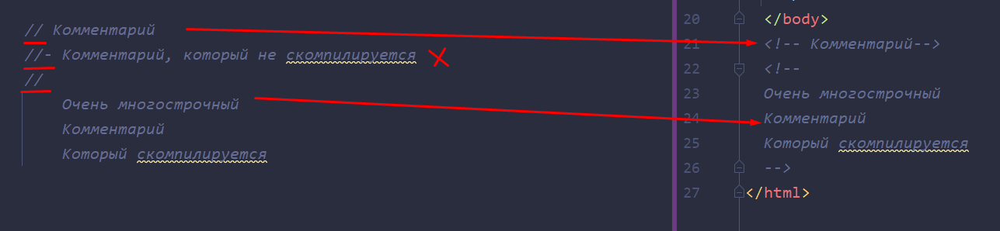
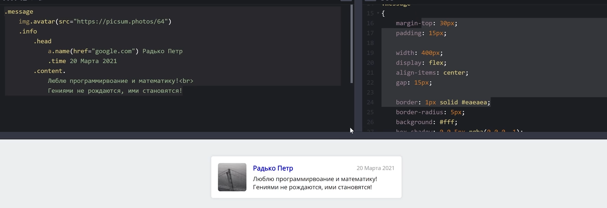
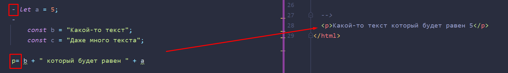

# Pug
## Часть 1
### Чем плох HTML? 


### Что такое Pug? 

Pug - это препроцессор, который позволяет нам упростить написание кода и добавить функциональность для HTML

### Преимущества Pug 


### Теги 

Теги теперь мы можем писать без кавычек и закрывающих тегов. Вложенность обозначается через табуляцию. 
Так же если нам нужно вписать в один тег много строк, можно так же, сохраняя табуляцию, писать контент, однако после тега нужно поставить "." (чтобы заработала многострочность контента)

```Pug
h1 Текстовая строка  

p. 
	Some text
	Some text
	Some text
	Some text  

div someBox

ul
    li текст  
    li текст2
```

### Атрибуты 

Атрибуты мы указываем в круглых скобках сразу после тегов

```Pug
h1(class="title") Текстовая информация  
```

### Классы и идентификаторы 

Классы и идентификаторы можно прописывать без "()" просто через "." или "#"
Чтобы прописать внутри атрибуты, нужно так же прописывать их в "()", но уже после наименования класса

```Pug
p.text Some text  
div.box someBox
a.name(href="google.com")
ul#myId  
    li текст  
    li текст2
```

### Тег div 

Особенность тега div заключается в том, что он самый частоиспользуемый и позволяет представить абстракцию какого-то контейнера. Поэтому разработчик пага не обязует его писать (но какой-либо из его тегов указать нужно)


### Комментарии 

Комментарии мы задаём через "//". Если нам нужно, чтобы комментарий не компилировался, то можно использовать "//-" 



### Пример: Красивое сообщение 

И вот пример красивой и лаконичной записи PUG-кода



### Блоки JavaScript кода 

Если нам нужно написать JS внутри пага, то нам нужно отметить через "-", что у нас начинается блок с JS кодом

```Pug
- let a = 5;  
-  
    const b = "Какой-то текст";  
    const c = "Даже много текста";
```

### JavaScript внутри тегов

Чтобы вставить JS внутрь тега, нужно сделать тег выражением. Делается это через "имя_тега=" писать "=" нужно обязательно слитно с тегом. И теперь мы можем юзать особенности пага



23:07

### Неэкранированный JavaScript внутри тегов 
### JavaScript в атрибутах 
### Неэкранированный JavaScript в атрибутах 
### Javascript в атрибутах и внутри тегов 
### Встраивание JavaScript в контент 
### Условия. if ... else 
### Условия. case ... when 
### Цикл while 
### Цикл each по массивам 
### Цикл each по объектам 
### Атрибуты без значения 
### Атрибуты через объект 
### Продвинутая работа с классами 
### Пример: Радуга 
### Пример: Массив сообщений 
### Понятие миксина 
### Миксины без параметра 
### Миксины с параметрами 
### Пример: Акцент-блок. Начало 
### Ключевое слово block 
### Пример: Акцент-блок. Завершение 
### Атрибуты миксина 
### Пример: Много сообщений через миксин 
### Пример: Рекурсивный миксин
### Заключение

## Часть 2
### Вступление 
### Про Node JS 
### Установка пакета Pug 
### Рендер строк. Функция render 
### Рендер файлов. Функция renderFile 
### Проблема статичности 
### Передача данных в разметку 
### Передача функций в разметку 
### Ошибки рендера 
### Функции compile и compileFile 
### Пример: Соцсеть. Начало 
### include. Включение разметки 
### include. Включение миксинов 
### include. Включение сторонних файлов 
### Относительный путь 
### Абсолютный путь 
### basedir и данные 
### Не запутайтесь с путями! 
### Пример: Система "Патриот" 
### Наследование. Основы 
### append и prepend 
### Цепочки наследований 
### Проблемы с наследованием 
### Пример: Соцсеть. Конец 
### Обзор реального примера 
### Заключение