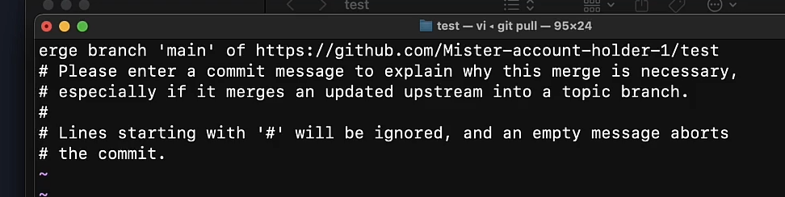

Первое, что нужно сделать, когда садимся за ПК:

```bash
// Первым делом всегда скачиваем себе актуальную версию проекта
git pull
```

Так как мы работаем в коллективе, то наши коммиты не всегда совпадают (как и файлы на сервере), поэтому могут вылезать такие вот ошибки:


Поэтому нам нужно написать `git pull` и ==git== нам сам предложит слить два коммита в один и выкинет нас в вим. По итогу мы получим как свои изменения (свой сделанный коммит) + чужие изменения (коммит на гитхабе)



И теперь мы можем спокойно написать эту команду и она сработает
```bash
git push origin main
```

И на самом гитхабе можно будет увидеть, что гит произвёл мёрдж двух коммитов двух разработчиков между собой

