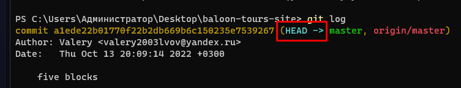
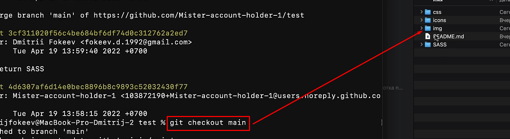

```bash
git branch // Выведет существующие ветки

git branch -v // Выведет информацию о том, на какой ветке и коммите мы находимся прямо сейчас

git branch animation // Создаст новую ветку с именем animation

git checkout animation // Переход на другую ветку
```

Конкретно когда мы выводим лог наших коммитов, мы так же можем увидеть, где именно находится наш хед (ветка и коммит, на котором мы находимся)



При смене ветки через `checkout` и создании коммита, мы увидим, что ==HEAD== располагается теперь в другом месте


И тут можно конкретно увидеть, как меняется проект, при переходе от одной ветки к другой


