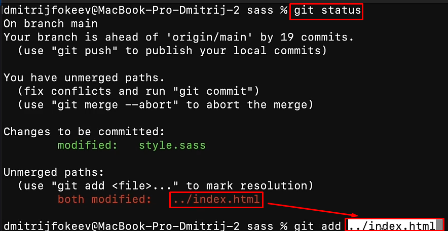

Стандартный способ объединения: ==fast-forward==. 
Тут мы отходили от работы с основной веткой и работали в другой ветке. После завершения работы с веткой, мы производили мёрдж. Так как изменений в мейне не было, то голова с мейном переходили на последний коммит той ветки, где мы работали (например, делали фиксы) 


Но в обычной жизни мы работаем сразу на нескольких ветках и сделать обычное слияние у нас не получится. Тут уже в дело входит ==истинное слияние==.


И тут мы мёрджим ветки самым обычным для нас образом: через `merge`. Дальше нам нужно лезть в редактор и там будет отображаться все наши конфликты, которые мы можем решить на месте

```bash
git merge new
```


После выполнения слияния, нужно добавить файлы в индексацию. Если они не добавляются через `git add .`, то нужно будет добавлять конкретный файл, скопировав его прямо из лога гита



Так же можно сделать следующий ==коммит== после мёрджа через эту команду(так будет семантически правильнее): 

```bash
git merge --continue
```