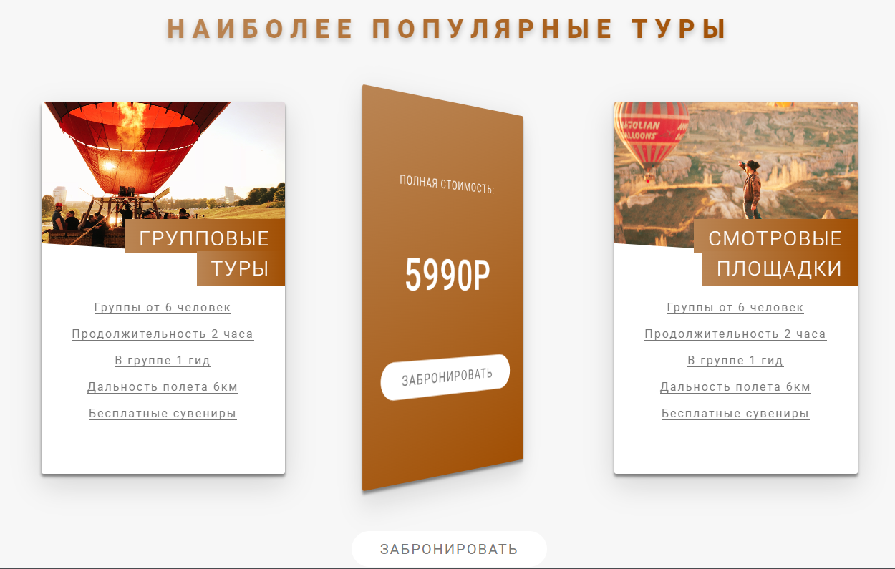

### **3.17 Доделываем секцию с карточками**

Это код первой карточки:
```HTML
<section class="fourth-section">  
    <div class="fourth-section__container">
		<!-- Заголовок -->

<!-- Первая карточка -->
<div class="tours__card">  
    <div class="tours__card-side tours__card-side_front">  
        <div class="tours__img tours__img_first"></div>  
        <h4 class="tours__title">  
            <span class="tours__span tours__span_first">групповые</span>  
            <br>  
            <span class="tours__span tours__span_second">туры</span>  
        </h4>  
        <div class="tours__description">  
            <ul>  
                <li>Группы от 6 человек</li>  
                <li>Продолжительность 2 часа</li>  
                <li>В группе 1 гид</li>  
                <li>Дальность полета 6км</li>  
                <li>Бесплатные сувениры</li>  
            </ul>  
        </div>  
    </div>  
    <div class="tours__card-side tours__card-side_back">  
        <div class="tours__back-box">  
            <p class="tours__text tours__text_first">полная стоимость:</p>  
            <p class="tours__text tours__text_second">5990Р</p>  
            <a href="#" class="tours__button button button_animation">  
                забронировать  
            </a>  
        </div>  
    </div>  
</div>

<!-- Тут ещё две карточки... -->
	
	</div>
</section>  
```
Это стили для первой карточки (`_tour-card.scss`):
```SCSS
.tours {  
   &__box {  
      display: inline-flex;  
      //justify-content: space-between;  
  
      margin-bottom: 8rem;  
   }  
  
   &__card {  
      position: relative;  
      top: 0;  
      left: 0;  
      width: 34rem;  
      height: 52rem;  
      margin-right: 60px;  
  
      perspective: 150rem; // Ставим дальность нашего расположения относительно карточки  
      -moz-perspective: 150rem; // для работы в мозилле  
  
      &-side {  
         overflow: hidden;  
  
         position: absolute;  
         height: 52rem;  
         color: black;  
         // Так же в транзишене можно указать плавность анимации  
         transition: all 1s ease;  
  
         // Нужно восстановить ширину, так как absolute её съедает  
         width: 100%;  
         border-radius: 3px;  
         backface-visibility: hidden;  
         &_front {  
            background: #FFFFFF;  
  
            box-shadow: 0px 4px 4px rgba(0, 0, 0, 0.25), 0px 4px 4px rgba(0, 0, 0, 0.25), 0px 15px 40px rgba(0, 0, 0, 0.15);  
         }  
  
         &_back {  
            background: linear-gradient(156.85deg, $color-brown-light, $color-brown-dark);  
  
            transform: rotateY(180deg);  
  
            box-shadow: 0px 4px 4px rgba(0, 0, 0, 0.25), 0px 4px 4px rgba(0, 0, 0, 0.25), 0px 15px 40px rgba(0, 0, 0, 0.15);  
         }  
      }  
  
      &:last-child {  
         margin: 0;  
      }  
      // Два разных ховера делаем для того, чтобы карточка поворачивалась каждый раз (когда наводим и убираем мышку)  
      &:hover &-side_front {  
         transform: rotateY(-180deg);  
      }  
      &:hover &-side_back {  
         transform: rotateY(0deg);  
      }   }  
  
   &__back-box {  
      position: absolute;  
      top: 50%;  
      left: 50%;  
  
      transform: translate(-50%, -50%);  
   }  
  
   &__text {  
      text-transform: uppercase;  
      color: white;  
      margin-bottom: 8.7rem;  
  
      &_first {  
         font-size: 16px;  
         font-weight: 300;  
      }      &_second {  
         font-size: 60px;  
         font-weight: 500;  
      }   }  
  
   &__img {  
      background-blend-mode: hard-light;  
  
      &_first {  
         background: $color-brown-light url('../img/card-1.jpg') center / cover no-repeat;  
      }  
      &_second {  
         background: $color-brown-light url('../img/card-2.jpg') center / cover no-repeat;  
      }  
      &_third {  
         background: $color-brown-light url('../img/card-3.jpg') center / cover no-repeat;  
      }  
      height: 22rem;  
      width: 341px;  
  
      clip-path: polygon(0 0, 100% 0, 100% 100%, 0 90%);  
  
      margin-bottom: 6rem;  
   }  
  
   &__title {  
      position: absolute;  
      top: 17.7rem;  
      right: 0;  
      font-size: 2.8rem;  
      letter-spacing: .2rem;  
      font-weight: 300;  
      text-transform: uppercase;  
      color: white;  
  
      text-align: right;  
   }  
  
   &__span {  
      background: linear-gradient(90deg, $color-brown-light, $color-brown-dark);  
      padding: 1rem 2rem .3rem 2rem;  
  
      &_first {  
  
      }  
      &_second {  
         // тут мы допозиционируем относительно того, что споцизионировали в &__title  
         position: absolute;  
         top: 3.2rem;  
         right: 0;  
         padding-bottom: 1rem;  
      }   }  
  
   &__description {  
  
      ul {  
         list-style-type: none;  
         text-align: center;  
         li {  
            display: inline-block;  
            font-size: 16px;  
            letter-spacing: .2rem;  
            color: $color-gray;  
  
            border-bottom: $color-gray 1px solid;  
            &:not(:last-child) {  
               margin-bottom: 2rem;  
            }  
         }  
      }  
   }  
}
```
