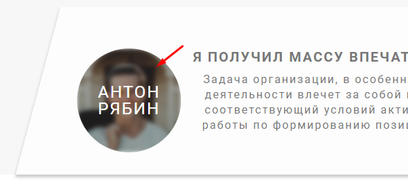

### **3.19 Как работают CSS фильтры**

Фильтры у нас задаются через свойство `filter`

```SCSS
&:hover img {  
   transform: scale(1);  
   // Свойство filter хранит в себе много эффектов обработки фото  
   filter: blur(3px) brightness(70%);  
}
```


Все значения можно потрогать непосредственно в DevTools


Лучше будет все свойства взглянуть [тут](https://developer.mozilla.org/ru/docs/Web/CSS/filter).