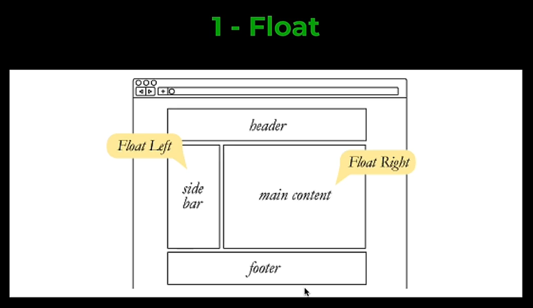
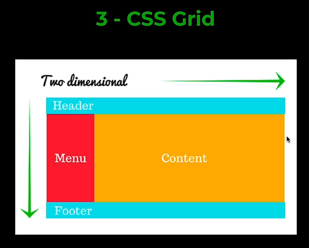

### **3.8 3 способа позиционирования элементов**

- Глобально есть три системы позиционирования элементов. Float – самая старая из них и сейчас уже не используется, так как есть более современная система позиционирования

