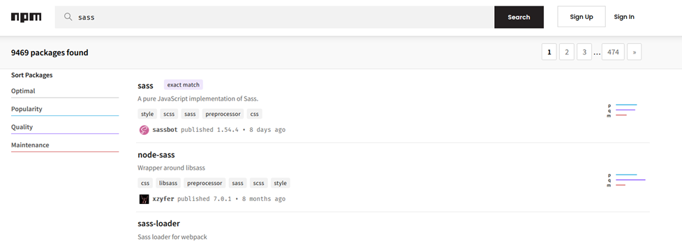
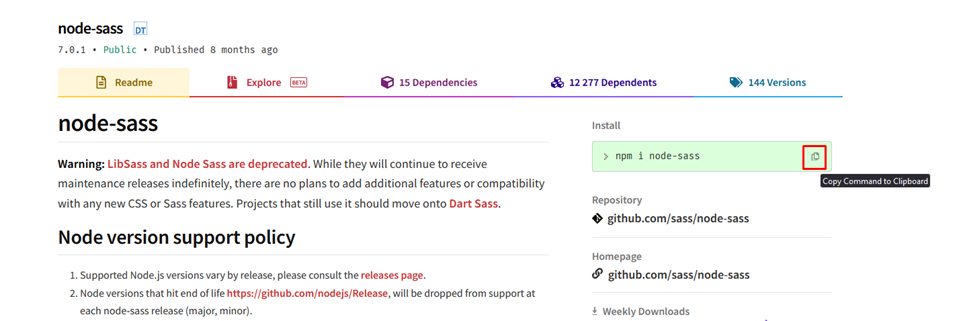

## **5  Node package manager**
#Npm 
### **5.2** **Что** **такое** **node.js** **и** **npm**

==node.js== – это серверный фреймворк для JS. Он позволяет запускать на ПК код JS.

```bash
touch test.js //создание JS-файла
node test.js //запуск данного файла
```

`npm` – это пакет с плагинами, который можно использовать через ноду. На данной площадке плагинов можно найти огромное количество расширений, которые очень помогут в разработке

Конкретно нам могут помочь плагины, которые помогут сжать изображение на сайте, помогут компилировать сасс-код и обновлять страницу


### **5.3 Готовим к использованию первый npm пакет**

Первым делом, чтобы начать пользоваться npm-пакетами, нам нужно прописать `npm init`. Конечно, заранее нужно перейти в папку нашего проекта. Далее у нас пойдёт инициализация проекта – будет создан файл с его спеками


Далее находим на сайте нужный пакет


И вставляем код его скачивания. Дополнительно пропишем `--save-dev`


И тут нужно кратко пояснить за ключи
```bash
--save-dev // (devDependencies) - устанавливает только те пакеты, которые нужны для разработки

--save // (dependencies) - нужен для работы самого продукта (сайта). То есть тут вложены зависимости для итогового продукта
```

Через второй ключ можно установить библиотеку jQuery, а через первый устанавливаем только то, что нужно для работы нам – Sass-компилятор тот же

Так же после установки мы видим, что у нас добавляются строчки в наш стоковый инициирующий файл. А так же появилась папка нод-модулей


И вот так просто выглядит удаление модулей


### **5.4 Запускаем первый npm пакет**


### **5.5 Используем gulp в нашем проекте**


### **5.6 Как открыть сайт на мобильном телефоне**


