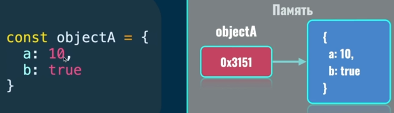

### 001 Переменные

Переменные дают возможность повторного доступа к значениям

Именование переменных:

### 002 Объявление переменных

В JS есть три основных ключевых словf, через которые идёт объявление переменных. `var` – устаревший стандарт, который в ES6 уже не советуют использовать

Разница между ==let== и ==const== заключается в том, то ==const== – это константное (неизменяемое) значение

### 003 Практика по созданию переменных

Тут хочется отметить, что `console.log()` всегда возвращает `undefined`. И если мы введём `clg(clg(значение))`, то вместе с выполнением самого лога у нас выйдет и выходное значение этого метода

Это работает так же как и при написании выражения `5+4` в девтулзе. Однако там выходит значение `9` как результат работы интерпретатора

### 004 Примитивные типы

Примитивные потому, что представленные данные сохраняются непосредственно в оперативной памяти.

`Null` – назначает сам программист данной переменной. То есть в данный момент времени у переменной значения – нет

`Undefined` – тип не определён программистом

Это непосредственно объекты, которые хранятся в памяти на ПК. Переменная хранит ссылку на значения в памяти

### 005 Ссылочный тип

Чтобы перезагрузить консоль, можно нажать на Ctrl+R. Это сотрёт все прошлые вводимые переменные и кэш консоли

### 006 Динамическая типизация

ЯПы обычно имеют либо статическую либо динамическую типизацию данных. В JS используется динамическая типизация

И тут присутствует пример непосредственной ошибки, которая часто может возникать из-за такой типизации. У нас имеется функция (object), которой присвоили другой тип данных – число. И проблема в том, что это будет работать (переменная будет хранить в себе число). Сама функция при этом исчезнет

И для решения данной проблемы призвано ключевое слово **const**

С помощью него мы можем воспользоваться стрелочной функцией (такую функцию нестрашно использовать, так как она защищена от переопределения). Впоследствии у нас выпадет ошибка, связанная с тем, что нельзя переприсвоить константу и функция у нас сохранится

