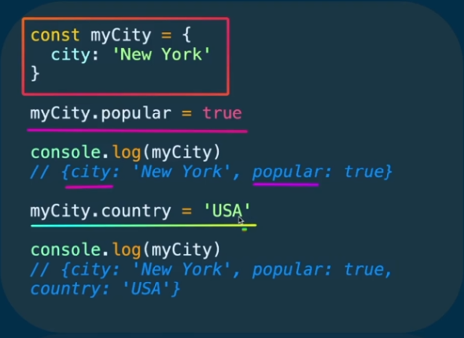

### 001 Объекты

Порядок свойств значения не имеет

Получение значений

Изменение значений свойств

### 002 Создание и удаление свойств объектов

Добавление значений. И тут видно, что мы меняем наш объект, хотя у нас и стоит ключевое слово const. Основное примечание заключается в том, что мы не меняем переменную, ссылку на которую она хранит - мы меняем именно объект, который находится в памяти компьютера

Удаление свойства из объекта осуществляется оператором delete

Так же стоит упомянуть скобочную запись. Она позволяет не просто добавлять новые свойства (название свойства в кавычках), но и использовать выражения для их наименования.

Тут в примере в `countOfPeople` была введена строка `“count”`, которая в дальнейшем стала свойством объекта JS

### 003 Вложенные свойства

Тут уже работает подобная схема, как и с прошлыми, но вложенность увеличивается. Обращения лучше делать через точечную запись. Скобочную запись стоит использовать только тогда, когда будем использовать выражение или приравнивать значение

### 004 Сокращенный формат записи свойств

Во-первых, хочется отметить, что для задания значения свойства можно использовать переменные. Во-вторых, так же можно сокращённо записывать свойства в объекте – если совпадает название предполагаемого свойства в объекте и наименование переменной, то можно опустить полную запись и вписать сокращённое свойство (коли переменная которого была определена ранее в проекте)

### 005 Глобальные объекты

И в JS у нас есть глобальные объекты. Это своего рода объекты, методы которых вызываются без дополнительных прописей

Если мы решим вывести `window`, то у нас появятся все его методы. Использовать их можно и без написания window

В NodeJS аналог глобального метода - `globalThis`

Вызываются свойства (методы) глобальных объектов свободно

### 006 Методы объекта

`Метод` – это свойство объекта, значение которого является функцией. У методов так же есть несколько способов записи, один из которых сокращённый, а второй - стандартный

### 007 JSON - JavaScript Object Notation

Это формат обмена данными между компьютерами по сети

Передаются нам данные файлы по сети в виде такой вот строки

Потом эти данные нам нужно распарсить через `JSON.parse(имя_переменной_объекта)`

Превратить в JSON наш объект можно через `JSON.stringify()`

Во вкладке ==response== можно увидеть то, что отправил на наш компьютер сервер, а во вкладке ==preview== видим, что наш браузер распарсил

