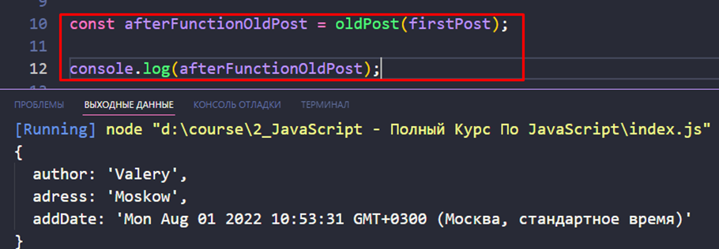

### 001 Функциональные выражения


Последний пункт отвечает за концепцию ==call-back== функций. Чаще всего там используются функциональные выражения


Тут уже идёт такая структура:

Переменная – присвоение переменной – само функциональное выражение (оно идёт сразу после `=` и только оно является функциональным выражением)


И так как `setTimeout()` принимает в себя только функцию и время* (опционально*), то в нём можно вызвать анонимную функцию (потому что тут нет необходимости в объявленной)


### 002 Стрелочные функции


Тут стоит сразу сказать, для чего мы присваиваем функции к переменной. Мы делаем это для того, чтобы защитить их от переприсвоения (`const`).


Так же стрелочную функцию можно быстро и просто использовать


Так же есть сокращённые варианты написания функций:

1) Тут стоит заметить, что лучше всё-таки написать круглые скобки, даже если используется один параметр
2) Тут в функции автоматически будет выполняться оператор `return` над нашей инструкцией


### IIFE (Immediately Invoked Function Expression) 

Это [JavaScript](https://developer.mozilla.org/ru/docs/Glossary/JavaScript) функция, которая выполняется сразу же после того, как она была определена (оба примера на картинках равнозначны и работают почти одинаково)

```JS
(function () {
	return 4 * 4;
})();

(function () {
	return 4 * 4;
}());
```

Функция становится мгновенно выполняющимся функциональным выражением. Переменные внутри функции не могут быть использованы за пределами её области видимости.

Функциональное выражение, которое было тут описано, не будет хранить в себе вызываемую функцию. Оно будет хранить только результат выражения

```JS
const result = (function () {
	const rounded = Math.round(4, 56);
	return rounded;
})();

console.log(result); // выведет результат вызова функции, так как переменная функцию не хранит
```

Так же можно вызвать эту функцию представленным ниже образом. Вообще, в такой вариации можно использовать не только `!`, а заменить его на `+`,  `-` или `~`. В общем, подойдет любой унарный оператор.

Стоит отметить, что после вызова функции – она исчезнет и больше не будет совершать никаких действий на странице


В этом примере мы объявили две переменные внутри ==IIFE== и тут они приватные, то есть только для самой ==IIFE==. Никто за пределами ==IIFE== не имеет к ней доступа. Так же, у нас есть функция `init`, к которой ни у кого нет доступа за пределами ==IIFE==. Но функция `init` имеет доступ к приватным переменным.


>[!info] Преймущество использования IIFE:
>В следующий раз, когда вы будете создавать группу переменных и функций в глобальной области видимости, которые никто не использует за пределами вашего кода, просто оберните все их в IIFE и получит в ответочку много хорошей JavaScript кармы за такие дела. Ваш код будет также работать, но только теперь вы не будете загрязнять глобальную область видимости. А еще вы защитите ваш код от тех, кто может случайно внести изменения в глобальные переменные, ну а может быть и не случайно.

Так же в такую функцию можно передавать аргументы


### Проименованные функциональные выражения

Так же для реализации рекурсии в функциональных выражениях можно использовать такой синтаксис


### 003 Значения параметров функции по умолчанию

Так же никто нам не запрещает использовать значения по умолчанию для избегания ошибок реализации функции


Тут изображена функция, которая выполняет действие над объектом. Первый параметр – сам объект, второй параметр – стоковая дата. Дальше, в теле функции, мы раскладываем переданный объект и добавляем новое значение. Тем самым мы избежали мутаций и создали новый объект, который будет иметь дополнительно дату

Скобки `()` выполняют роль неявного возвращения объекта. То есть, если опустить скобки, то интерпретатор подумает, что начинается тело функции и нам нужно будет использовать return

**То есть явное возвращение результата функции – `return`, неявное – с использованием `()`**


К слову, это встроенная функция, у которой можно посмотреть ещё её методы (`now`, `parse`)


Вот явный способ возвращения объекта из функции


Так же можно присваивать возвращённые из функции значения переменной



Вот неявный способ возвращения значения объекта из функции


То есть тут стоит пояснить, что в первом случае, мы возвращаем **неявно целую группу свойств**, а во втором – **явно указываем, что возвращать**

