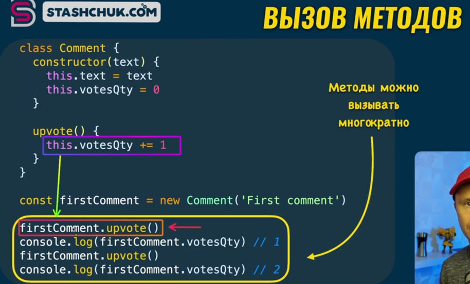

### 001 Введение в классы и прототипы

 

### 002 Пример класса

Класс – это шаблон для написания экземпляров класса.

Тут показан пример создания экземпляра комментария.

При обращении через `this`, мы обращаемся к элементу класса комментария. Когда мы пишем `this.text = text` (а в конструктор нам передаётся этот самый текст), то мы говорим, что тексту класса комменарий будет присвоено значение текста извне.

Методы `constructor()` и `upvote()` будут наследоваться всеми дочерными элементами класса комментария (то есть ими можно будет воспользоваться из дочерних элементов этого класса)

То есть это работает как методы высшего порядка для массивов (тот же `forEach`, который можно увидеть в прототипе массива)

### 003 Создание экземпляров класса

Создание нового экземпляра происходит через синтаксис:

`ключевое_слово переменная = new названиеКласса(«аргументы»)`

При выводе данного экземлпяра, мы можем увидеть его собственные свойства и в прототипе увидеть его методы, которые располагаются в классе.

**Собственными** свойствами тут являются: `text` и `votesQty`

**Унаследованным** методом тут является метод `upvote` (унаследован с родительского класса `Comment`)

Наследование по цепочке представляет из себя все те методы и свойства, к которым мы можем обратиться через точечную запись. А именно, мы сначала увидим **собственные свойства** данного объекта, потом увидим методы класса `Comment` (то есть он их унаследовал) и потом у нас пойдут методы объекта

### 004 Цепочка прототипов

Такое наследование (методы класса и методы объекта) возможно благодаря цепочке прототипов

То есть тут можно увидеть цепочку прототипов и по всей этой цепочке у нас наследуются методы всех прототипов (т.е. родительских классов)

### 005 Проверка принадлежности классу

Чтобы проверить принадлежность определённого элемента к определённому прототипу, нужно воспользоваться оператором `instanceof`. Он нам вернёт булевое значение, которое будет отвечать за принадлежность объекта к определённому прототипу.

Тут объект `firstComment` принадлежит к прототипам `Comment` и `Object` одновременно

### 006 Вызов унаследованных методов

Переменная `this` динамически будет указывать изменение переменной для нашего экземпляра. Если мы создадим другой экземпляр класса комментарий (например, secondComment), то `this` будет автоматически ссылаться на переменную внутри другого экземпляра.

То есть `this` указывает на конкретный объект (экземпляр класса), который вызывает данный метод

### 007 Практика по созданию классов и экземпляров

Когда мы создаём класс, то мы создаём прототип, который является свойством переменной `Comment` (наименование нашего класса)

Когда мы используем `prototype`, мы вызываем прототип нашего объекта и при вызове конструктора данного прототипа мы получим саму переменную нашего созданного класса

Происходит всё так потому, что JS изначально не ООП ЯП и построен внутри на объектах и функциях

### 008 Проверка принадлежности свойств объектов

С помощью метода `hasOwnProperty` (который принадлежит прототипу объекта и является методом высшего порядка) мы можем проверить принадлежность свойства к нашему объекту.

### 009 Создание нескольких экземпляров

### 010 Статические методы

Далее у нас идёт модификатор для нашего метода как `static`. Он позволяет не наследовать нашим экземплярам класса данный метод, но взамен

### 011 Практика по созданию статических методов

И тут уже нужно сказать, что все статические методы являются частью конструктора и данные методы только потому не наследуются экземплярами класса

### 012 Расширение других классов

Так же мы можем расширять функционал стоковых прототипов в JS.

В данном примере мы создали класс, родителем которого является прототип `Array`. При создании экземпляра данного класса, мы создадим массив, который будет сначала наследовать методы `NumbersArray`, а потом уже будет наследовать методы прототипа `Array`. Тем самым мы расширили функционал Array собственным массивом

И примерно так со всеми манипуляциями выглядит наша цепочка прототипов

Так же кратко опишем метод `reduce`. Он принимает в себя два значения: колбэк функцию, внутри которой два значения (одно – аккумулятор, который суммирует все значения, второе – само значение, над которым проводится операция) и начальное значение (которое присваивается аккумулятору – тут 0).

Как итог, мы получаем сумму всех значений массива (так же можно проводить любую другую операцию)

### 013 Что же такое прототип

У любого экземпляра класса есть скрытое свойство, которое называется `__proto__`

==Прототип== - это класс-предок объекта, всё как в ООП - разница только в том, что ==прототип== в ==JS== - это уже сконструированный "готовый" объект, а в классическом ООП ==прототип== - неотделим от самого класса-потомка: то есть не является ни объектом, ни чем-либо "физическим".

### 014 Строки и числа ведут себя как объекты

Строки и числа хоть и выглядят как простые методы, но они имеют под собой список собственных методов, которые к ним относятся (прототипы `String` и `Number`)

И тут мы можем увидеть, что у нашей строки есть собственные методы, которые наследуются от прототипа `String` (у которого, кстати, нет структуры), который в свою очередь наследуется от Object (который имеет структуру)

