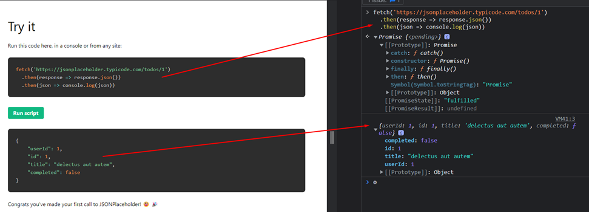
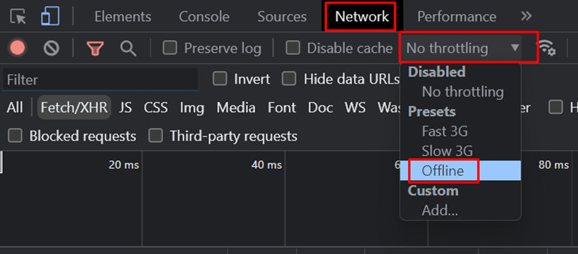

### 001 Введение в промисы

Промисы позволяют выполнять задачи, на которые ещё сервер не успел дать ответ. JS код сможет выполнять определённые действия, пока выполняется другая задача

Так же у промиса есть три состояния:

1) Ожидание выполнения (промис создан)
2) Промис исполнен (вернул результат)
3) Отклонён (вернул ошибку)

### 002 Создание и использование промисов

При создании промиса, он находится в режиме `pending` (ожидание). В сам промис мы передали в виде аргументов две функции, одну из которых нужно вызвать в самом промисе (`resolve` – задача решена, `reject` – вышла ошибка)

Получить значение из промиса можно через методы `.then().catch()`. Первый возвращает значение в результате успешного выполнения, второй выполняется результате ошибки. Внутрь данных методов мы вкладываем колбэк функции. В качестве аргумента функции (`then()`) выступает значение `resolve`, которое было вложено в сам промис

### 003 Использование промисов в `fetch`

Когда мы посылаем запрос через `fetch`, то пока мы не получим ответ от сервера, промис будет оставаться в режиме `pending`. После получения ответа у нас срабатывает один из методов, которые мы подцепили к фетчу. Они выполняются по цепочке: выполняется сначала первый `then()`, а затем уже второй (тут возвращается JSON и второй метод выводит данный формат)

Так же метод json возвращает промис, так как компьютеру нужно время, чтобы распарсить полученные значения от сервера

Так же есть сайт, который позволяет получить JSON-данные

### 004 Практика по использованию промисов и fetch

Сама по себе функция `fetch()` возвращает промис, а не результат, поэтому требуется использовать для получения результата `then()`

Так же если мы будем выполнять инструкции, то нам понадобится вписывать в стрелочную функцию ещё и «`{}`», что потребует от нас *явного возвращения результата*

Так же нужно упомянуть, что в node нет функции `fetch` (там для такого же функционала используются другие функции и npm-пакеты)

### 005 Практика с отклонением промисов

Тут можно имитировать отключение интернета

И вот мы видим ошибку от нашего промиса (нет возможности отправить запрос браузеру)

### 006 Вызов fetch внутри промиса

Уже тут пошёл пример создания своего промиса, который упростит работу с фетчем. Тут мы сделали стрелочную функцию, которая неявно будет возвращать созданный внутри промис, который внутри имеет фетч, который в свою очередь будет получать данные от сервера (сложно). И далее в любом месте программы можем вызвать данную функцию

