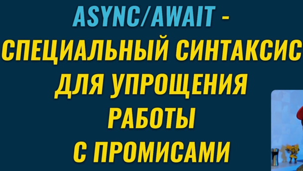

### 001 Асинхронные функции

Это специальный синтаксис для упрощения работы с промисами

Асинхронная функция вместо какого-либо значения всегда возвращает промис

Данная функция вернёт в результате промис, а в качестве аргумента resolve будет передана возвращаемая строка

И так же мы можем к вызову функции применить `then()` и `catch()` для обработки результата функции и работы с ней

При появлении ошибки, мы будем видеть в статусе промиса `rejected`

Обработка ошибок промиса

### 002 Использование `await` внутри асинхронных функций

Ключевое слово `await` позволяет нам не ожидать выполнение промиса, а сразу приступать к выполнению остальных инструкции внутри асинхронной функции. Данное ключевое слово работает только в асинхронной функции

### 003 Пример с `async await`

Мы имеем, собственно, асинхронную функцию. Создали первую функцию, которая возвращает нам результат промиса. Вторая функция выполняет промис, который выполняется обязательно прежде чем продолжить выполнение кода дальше (промисы дают выполнять код дальше в отличие от асинхронок)

### 004 Переход с промисов на `async await`

И вот пример функции `getDate()`, которая возвращает по итогу json формат данных. Переменные внутри функции заменяют `then()` и читаются лучше. Если выпадет ошибка, то промис просто будет автоматически отклонён

И вот представлен пример сокращённого написания как самого промиса, так и быстрый вывод его результата (заменой then()). Однако в этом случае мы можем словить непойманную ошибку, так как обработки ошибки - нет

>Тут нужно напомнить, что `await` можно использовать только внутри асинхронных функций. Дело в том, что браузер может обработать такой код, а внешние интерпретаторы - нет

### 005 Обработка ошибок в асинхронных функциях

Чтобы отловить ошибку, нужно будет поместить код вывода результата в блок `try/catch`

### 006 Ключевые принципы в async await

Тут нужно поподробнее остановиться на последнем пункте. В асинхронных функциях будет ожидаться выполнение промиса, **но промисы** _не блокируют выполнение остальных частей фронт-энд приложения_ (например, нажатие каких-либо кнопок). И только тогда, когда выполнение промиса будет закончено (`resolve`/`rejected` – и не `pending`), функция продолжит своё выполнение

