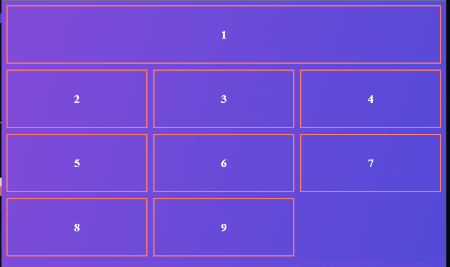

#CSS #CSSGrid 

## 001 Обзор модуля

>[!info] Плюсы `CSS Grid`:
> - Легко адаптировать сайты, написанные на гридах
> - Макеты верстаются куда быстрее, чем на `flexbox` (особенно быстрее, чем на `float` или таблицах)
> - Элементы можно гибко располагать на странице (в отличие от того же определённого потока, что мы задали в `flexbox`)

## 002 Template и gap

Код `HTML` ячеек:

```HTML
<body>
	<div class="container">
		<div class="c1">1</div>
		<div class="c2">2</div>
		<div class="c3">3</div>
		<div class="c4">4</div>
		<div class="c5">5</div>
		<div class="c6">6</div>
		<div class="c7">7</div>
		<div class="c8">8</div>
		<div class="c9">9</div>
	</div>
</body>
```

Стандартные свойства для страницы:

```CSS
body {
	background: linear-gradient(107.32deg, #804bd8 5.53%, #544ad8 97.3%);
}

.container {
}

.container > div {
	font-weight: bold;
	font-size: 20px;
	color: white;
	border: 2px solid #fe7a71;
	display: flex;
	align-items: center;
	justify-content: center;
}
```

Так выглядит страница без гридов:


Первым делом, мы должны установить дисплей в значение `grid`. 
Свойство `grid-template-columns` позволит нам установить ширину наших колонок на странице. 

```CSS
.container {
	display: grid;
	grid-template-columns: 100px 100px;
}
```

Так же можно нажать на кнопку в девтулзе, который отобразит, как выглядит и работает грид на странице


Так же в системе `grid` присутствует единица измерения `fr` (фракции), которые равномерно заполняют всё доступное пространство и делят его с остальными столбцами

```CSS
.container {
	display: grid;
	grid-template-columns: 1fr 1fr;
}
```


Так же мы можем использовать проценты для описания размера ячеек, но проще сделать это было бы фракциями

```CSS
.container {
	display: grid;
	grid-template-columns: 33% 33% 33%;
}
```


Так же можно указать автозаполнение всего оставшегося пространства для колонок 

```CSS
.container {
	display: grid;
	grid-template-columns: 10% auto 10%;
}
```


Так же существует функция `repeat()`, которая повторит нам определённое количество раз определённое значение

```CSS
.container {
	display: grid;
	grid-template-columns: repeat(10, 1fr);
}
```


Так же свойство `grid-auto-rows` позволит нам указать определённые размеры для строк

```CSS
.container {
	display: grid;
	grid-template-columns: repeat(5, 1fr);
	grid-template-rows: 200px 200px;
}
```


Но как можно увидеть, если не описать свойства для всех колонок, которые в будущем могут появиться, то они будут иметь дефолтный размер (под размер контента)

```CSS
.container {
	display: grid;
	grid-template-columns: repeat(2, 1fr);
	grid-template-rows: 200px 200px; /* широкими остаются только первые две колонки */
}
```


Свойство `grid-auto-rows` позволяет назначить для всех незатронутых другими свойствами строк своё значение размеров
Мы изменили размер первых двух строк на 120 пикселей, а все остальные уже будут по 50 пикселей

```CSS
.container {
	display: grid;
	grid-template-columns: repeat(2, 1fr);
	grid-template-rows: 120px 120px;
	grid-auto-rows: 50px;
}
```


Так же в гридах присутствует значение `auto-fill`, которое будет автоматически заполнять всё пустое пространство - конкретно тут будут создаваться колонки под ширину экрана сайта.
Функция `minmax()` уже принадлежит `CSS` и она позволит нам создавать колонки шириной от 100 пикселей до одной фракции.
Все вышеописанные свойтва позволят нам переносить избыток ячеек на следующие строки и подстраивать количество колонок под размер экрана

```CSS
.container {
	display: grid;
	grid-template-columns: repeat(auto-fill, minmax(100px, 1fr));
}
```


`auto-fit`, в свою очередь, уже будет подстраивать под размер экрана уже имеющиеся ячейки и растягивать их 

```CSS
.container {
	display: grid;
	grid-template-columns: repeat(auto-fit, minmax(100px, 1fr));
}
```


Свойство `gap` позволяет создать отступы между ячейками

```CSS
.container {
	display: grid;
	grid-template-columns: repeat(auto-fit, minmax(100px, 1fr));
	gap: 10px;
}
```


Так же можно указать отступы для определённых осей

```CSS
.container {
	display: grid;
	grid-template-columns: repeat(auto-fit, minmax(100px, 1fr));
	gap: 10px 100px;
}
```


И так же существуют отдельные свойства для указания отступов для разных осей

```CSS
.container {
	display: grid;
	grid-template-columns: repeat(auto-fit, minmax(100px, 1fr));
	row-gap: 10px;
	column-gap: 100px;
}
```


Так же есть и старые свойства данной технологии, которые не нужно использовать - некст за нас пишет адаптивные стили под старые браузеры и вставит это значение, если потребуется


## 003 Justify и align


Свойство `justify-items` определяет расположение элементов по оси `X`
`stretch` - свойство по умолчанию

```CSS
.container {
	display: grid;
	height: 500px;
	border: 2px solid white;

	justify-items: stretch;
}
```


Так же мы можем задать любую другую сторону через `left/right` или `flex`
Небольшое дополнение: *значения left и flex-start имеют немного разное значение. Если нам нужно будет сделать мультиязычный сайт (например, на английском и арабском), то старт для арабов будет справа (справа-налево), а для англо-саксов слева (чтение слева-направо)* 

```CSS
.container {
	display: grid;
	height: 500px;
	border: 2px solid white;

	justify-items: left; /* или flex-start */
}
```


`center` отцентрирует объекты

```CSS
.container {
	display: grid;
	height: 500px;
	border: 2px solid white;

	justify-items: center;
}
```


Дальше идёт свойство `align-items`, которое меняет положение объекта по оси `Y`

```CSS
.container {
	display: grid;
	height: 500px;
	border: 2px solid white;
	justify-items: stretch;

	align-items: flex-end;
}
```

`flex-end`


`center`


`flex-start` - прибьёт элементы кверху ячеек


`stretch` - столбцы растянуты


Свойство `align-content` уже двигает не просто сами элементы внутри ячеек сетки, а деформирует саму сетку

```CSS
.container {
	display: grid;
	height: 500px;
	border: 2px solid white;

	align-content: flex-end;
}
```

`flex-start`


`flex-end`


`center`


`space-around` - создаёт равномерные отступы между всеми элементами, включая отступы от начала таблицы


`space-between` - создаёт отступы только между элементами сетки без отступов от таблицы


`space-evenly` - создаёт равномерные отступы в пространстве


`justify-content` работает ровно так же как и прошлое, но по горизонтали

```CSS
.container {
	display: grid;
	height: 500px;
	border: 2px solid white;

	justify-content: center;
}
```

Дальше уже идут свойства, которые позволят расположить элементы отдельно конкретно под себя:
- `align-self` - выравнит элемент по вертикали
- `justify-self` - выравнит по горизонтали

```CSS
.container {
	display: grid;
	height: 500px;
	border: 2px solid white;
}

.c1 {
	justify-self: end;
	align-self: start;
}
```


## 004 Распределение ячеек

Начальный сетап:

```CSS
.container {
	display: grid;
	gap: 10px;
	grid-template-columns: repeat(3, 1fr);
	grid-auto-rows: 100px;
}

.container > div {
	font-weight: bold;
	font-size: 20px;
	color: white;
	border: 2px solid #fe7a71;
	display: flex;
	align-items: center;
	justify-content: center;
}
```


При отображении грид-сетки в девтулзе можно увидеть ярлыки сетки - они показывают индекс определённого направления (1, 2, 3, 4 колонка и так далее так же для строк). С другого конца идёт такой же отсчёт но в минусовых значениях.


Свойства `grid-column-start` и `grid-column-end` позволят указать откуда и докуда можно будет растянуть нашу ячейку. Так же можно указать короткой записью через свойство `grid-column`

Конкретно сейчас мы растянули нужный нам блок и расположили его в нужной для нас плоскости экрана на три колонки (с 1 по 4 линию).

```CSS
.c1 {
	grid-column-start: 1;
	grid-column-end: -1;
}
```

или...

```CSS
.c1 {
	grid-column: 1 / -1;
}
```



Сразу нужно сказать, что если указать с первой по пятую линию (то есть по линию, которой не существует, то появится определённая коллизия и ячейки могут деформироваться, что приведёт к неприятному эффекту)


Так же куда удобнее будет для определения ширины ячейки использовать не линии, а сами ячейки. 
`span` говорит, что мы сейчас указываем ячейки, а не линии, которые нам нужны.

Приведённым кодом ниже мы говорим, что ячейка `c1` должна занимать с первой по третью ячейку 

```CSS
c1 {
	grid-column: 1 / span 3;
}
```


Так же мы можем проименовать линии через `[имя]`, а не использовать цифры. 
Такой подход более уместен, если мы строим сложную сетку, которую будем дальше использовать в продакшене.

Те же самые манипуляции можно выполнять и с `row`-свойствами грида

```CSS
.container {
	display: grid;
	gap: 10px;
	grid-template-columns: [startline] 1fr [middle] 1fr 1fr [endline];
	grid-auto-rows: 100px;
}

.c1 {
	grid-column-start: middle;
	grid-column-end: endline;
}
```


Чтобы увидеть имена нужных мест сетки, нужно их отобразить в лейауте внутри девтулз


Свойство `grid-auto-flow` определяет в каком порядке и в каком виде будут располагаться ячейки внутри сетки

```CSS
.container {
	display: grid;
	gap: 10px;
	grid-template-columns: [startline] 1fr [middle] 1fr 1fr [endline];
	grid-auto-rows: 100px;

	grid-auto-flow: row;
}
```

`row` - стандартное расположение ячеек


`column` - расположение только в колонку


`dense` - вмещает ячейки как может в свободное пространство


## 005 Template-area

Начальный теvплейт:

```CSS
.container {
	display: grid;
	padding: 10px;
	
	gap: 10px;
	grid-template-columns: 1fr 1fr 1fr;
	grid-template-rows: 1fr 1fr 1fr;
}
```


Свойство `grid-area` позволяет указать на какой линии начинать и на какой заканчивать:
*начало по вертикали / начало по горизонтали / конец по вертикали / конец по горизонтали*

```CSS
.container {
	display: grid;

	padding: 10px;

	gap: 10px;
	grid-template-columns: 1fr 1fr 1fr;
	grid-template-rows: 1fr 1fr 1fr;
}

.header {
	grid-area: 1 / 1 / 3 / 4;
}
```


Так же можно показать расположение объектов на странице с использованием `grid-template-areas`, который хранит в себе названия ячеек и представляет их в виде сетки. Чтобы сетка с этими элементами начала работать, нужно в сам элемент ячейки запихнуть `grid-area` и проименовать его  

```CSS
.container {
	display: grid;
	padding: 10px;

	gap: 10px;
	grid-template-columns: 1fr 1fr 1fr;

	grid-template-areas:
		'header header header'
		'sidebar body body'
		'footer footer footer';
}

.header {
	grid-area: header;
}

.sidebar {
	grid-area: sidebar;
}

.body {
	grid-area: body;
}

.footer {
	grid-area: footer;
}
```


Так же мы можем спокойно менять элементы сетки с использованием адаптива

```CSS
@media (max-width: 720px) {
	.container {
		display: grid;
		padding: 10px;

		gap: 10px;
		grid-template-columns: 1fr 1fr 1fr;

		grid-template-areas:
			'header header header'
			'body body body'
			'sidebar sidebar sidebar'
			'footer footer footer';
	}
}
```


Либо мы можем сделать вообще одноколоночную сетку и получить тот же результат, что представлен выше

```CSS
@media (max-width: 720px) {
	.container {
		display: grid;
		padding: 10px;

		gap: 10px;
		grid-template-columns: 1fr;

		grid-template-areas:
			'header'
			'body'
			'sidebar'
			'footer';
	}
}
```

Если использовать `.` в сетке, то можно отобразить пустое пространство в сетке

```CSS
.container {
	display: grid;
	padding: 10px;

	gap: 10px;
	grid-template-columns: 1fr 1fr 1fr;

	grid-template-areas:
		'header header header'
		'sidebar body body'
		'. footer footer';
}
```


Чтобы упростить и ускорить запись, можно воспользоваться записью `grid-template`, которая принимает в себя: 
`'footer footer footer'` - запись колонки
`200px` - размер колонки 
`/ 1fr 1fr 1fr` - распределение колонок (через `/`)

```CSS
.container {
	display: grid;
	padding: 10px;

	gap: 10px;
	grid-template:
		'header header header' 100px
		'sidebar body body' 150px
		'. footer footer' 200px
		/ 1fr 1fr 1fr;
}
```


## 006 Лучшие практики

1) **Если в макете много колонок, то не обязательно создавать столько же в гриде**
Мы создаём только нужное под макет количество колонок. Дизайнер мог сделать такое количество просто для более удобного для себя позиционирования объектов. 
Однако, если все 20 колонок используются для обычной страницы и того же адаптива, то придётся создать все 20 колонок. 


2) **Стоит всегда использовать именованные колонки и пространства**
Это позволит сохранять корректную вёрстку, если мы добавим между колонками ещё колонки или если добавим новые ячейки в нашу сетку - ссылка останется той же, что и была до


3) **Использовать фракции более предпочтительно**
Фракции - это гибка единица, которая описывает часть от пространства, что позволит просто и быстро распределить его на всю сетку


## 007 Вёрстка layout

Первым делом нужно добавить стили в компонент `Layout` и так же вместо фрагмента сейчас использовать `wrapper` для всего контента

`Layout.tsx`
```TSX
const Layout = ({ children }: ILayoutProps) => {
	return (
		<div className={styles.wrapper}>
			<Header className={styles.header} />
			<Sidebar className={styles.sidebar} />
			<div className={styles.body}>{children}</div>
			<Footer className={styles.footer} />
		</div>
	);
};

export const withLayout = <T extends Record<string, unknown>>(Component: FunctionComponent<T>) => {
	return function withLayoutComponent(props: T): JSX.Element {
		return (
			<Layout>
				<Component {...props} />
			</Layout>
		);
	};
};
```

Далее нужно сверстать сетку и адаптив страницы.

Глобально на странице мы имеем 3 строки: 
- `Header` - скрыт на десктопах, занимает ширину равную контентной части
- `Sidebar`/`Body` - сама контентная часть
- `Footer` - должен уметь растягиваться на всю страницу

Даже если для строки задан `display: none`, то она продолжает участвовать в сетке, но просто не отображается

Для создания сетки мы будем использовать 4 колонки: 
- Пустую для растягивания (самая левая)
- `Sidebar`
- `Body`
- Пустую для растягивания (самая правая)
Пустые колонки будут иметь размер `auto`, чтобы они спокойно растягивались под ширину экрана пользователя. В них не будет никакого контента - они предназначены лишь для возможности растягивания страницы

`Layout.module.css`
```CSS
.wrapper {
	display: grid;

	/* Растянет сетку на всю страницу */
	min-height: 100vh;

	/* определит ширину колонок - слева и справа для растягивания сайта */
	grid-template-columns: auto 230px minmax(320px, 1200px) auto;
	/* определит высоту колонок - хедер и футер под размер контента */
	grid-template-rows: auto 1fr auto;
	/* определит шаблон расположения колонок - точки остаются под растягиваемые колонки*/
	grid-template-areas:
		'. header header .'
		'. sidebar body .'
		'footer footer footer footer';
}

.header {
	/* скроем заголовок на десктопах */
	display: none;
	grid-area: header;
}

.body {
	grid-area: body;
}

.sidebar {
	grid-area: sidebar;
}

.footer {
	grid-area: footer;
}

/* Адаптив под мобилки */
@media (max-width: 765px) {
	/* тут нужно перестроить колонки, так как после удаления сайдбара остаётся пустое пространство */
	.wrapper {
		grid-template-columns: minmax(320px, 1fr);
		grid-template-areas:
			'header'
			'body'
			'footer';
	}

	/* Показываем наш хедер */
	.header {
		display: block;
	}

	/* Скрываем сайдбар */
	.sidebar {
		display: none;
	}
}
```

## 008 Упражнение - Вёрстка footer

Установим модуль для форматирования даты

```bash
npm i date-fns
```

Сюда будут добавлены просто три даты. 
Для поддержания даты прав на сайт, будет создаваться всегда новая дата, от которой мы будем брать только год с помощью функции `format()`.
Чтобы при нажатии на ссылку, она открывалась в другом окне, нужно добавить в неё `target='_blank'`

`Footer.tsx`
```TSX
import React from 'react';
import styles from './Footer.module.css';
import cn from 'classnames';
import { IFooterProps } from './Footer.props';
import { format } from 'date-fns';

export const Footer = ({ className, ...props }: IFooterProps) => {
	return (
		<footer className={cn(className, styles.footer)} {...props}>
			<div>OwlTop © 2020 - {format(new Date(), 'yyyy')} Все права защищены</div>
			<a href='#' target='_blank'>
				Пользовательское соглашение
			</a>
			<a href='#' target='_blank'>
				Политика конфиденциальности
			</a>
		</footer>
	);
};
```

Тут мы поделили сетку футера на три колонки, которые в планшетной версии трансформируются в одну. Так же добавлена анимация на наведение мышки.

`Footer.module.css`
```CSS
.footer {
	display: grid;
	grid-template-columns: 1fr auto auto;
	gap: 10px 40px;

	color: var(--white);
	font-size: 16px;
	line-height: 20px;

	background: var(--primary);
	padding: 25px 30px;
}

.footer a:hover {
	transition: all 0.2s;
	color: var(--gray);
}

@media (max-width: 765px) {
	.footer {
		grid-template-columns: 1fr;
	}
}
```

Версия для десктопа (не имеет хедера, но имеет сайдбар)


Версия для планшетов (имеет хедер, но без сайдбара)

