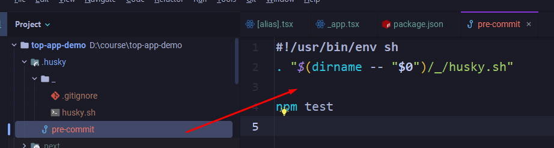
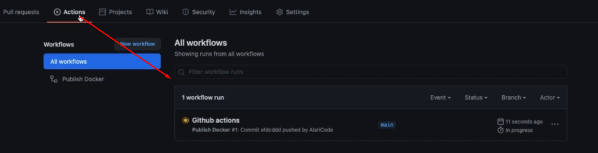

#Docker #DockerCompose

## 001 Добавление meta на страницу

Очень важно в рамках SEO-оптимизации для каждой страницы правильно сгенерировать передачу информации в тайтл и дескрипшн страницы. Это поможет правильно ранжировать страницу в поиске, так как поисковик выбирает ключевые слова со страницы и потом уже по ним выводит страницу.

Первым делом настроим тайтл и дескрипшн. Будем выводить в компоненте некста `Head` информацию по странице. Эта информация генерируется на сервере, поэтому всё будет подставляться динамически

`pages / [type] / [alias].tsx`
```TSX
function TopPage({ firstCategory, page, products }: TopPageProps): JSX.Element {  
   return (  
      <>  
    {/* данный компонент позволит перезаписать мета-информацию страницы */}  
         <Head>  
            <title>{page.metaTitle}</title>  
            <meta name={'description'} content={page.metaDescription} />  
         </Head>  
         <TopPageComponent firstCategory={firstCategory} page={page} products={products} />;  
      </>  
   );  
}
```


При передаче ссылки другому человеку в интернете некоторые ресурсы позволяют из ссылки вытащить определённые элементы, которые дополнят эту ссылку полезной информацией для пользователя.

Теги для передачи:
- `og:image` - изображение, которое будет браться для другого сайта
- `og:title` - заголовок
- `og:description` - описание


Вот пример того, что можно получить с хабра при пересылке в вк:


Далее для каждой отдельной страницы алиаса будут добавлены несколько тегов, которые позволят отобразить содержание страницы:
- `og:title`
- `og:description`
- `og:type` - позволит описать назначение страницы

`pages / [type] / [alias].tsx`
```TSX
function TopPage({ firstCategory, page, products }: TopPageProps): JSX.Element {  
   return (  
      <>  
    {/* данный компонент позволит перезаписать мета-информацию страницы */}  
         <Head>  
            <title>{page.metaTitle}</title>  
            <meta name={'description'} content={page.metaDescription} />  
            <meta property={'og:title'} content={page.metaTitle} />  
            <meta property={'og:description'} content={page.metaDescription} />  
            <meta property={'og:type'} content={'article'} />  
         </Head>  
         <TopPageComponent firstCategory={firstCategory} page={page} products={products} />;  
      </>  
   );  
}
```

Так же в компоненте страниц нужно указать мета-теги, которые будут распространятся на все страницы в приложении:
- `og:url` - будет генерировать в нашем случае ссылку до страницы, которая будет использоваться для перехода на наш ресурс 
- `og:locale` - скажет, что сайт построен на русском языке

`pages / _app.tsx`
```TSX
function MyApp({ Component, pageProps, router }: AppProps): JSX.Element {  
   return (  
      <>  
         <Head>  
            <title>MyTop - наш лучший топ</title>  
            <link rel='icon' href='/favicon.ico' />  
            <link rel='preconnect' href='https://fonts.gstatic.com' />  
            <link  
               href='https://fonts.googleapis.com/css2?family=Noto+Sans+KR:wght@300;400;500;700&display=swap'  
               rel='stylesheet'  
            />  
            {/* сюда уже помещаем ссылку на страницу и через роутер получаем путь до открытой страницы */}  
            <meta  
               property={'og:url'}  
               content={process.env.NEXT_PUBLIC_DOMAIN + router.asPath}  
            />  
            {/* тут уже просто указываем язык страницы */}  
            <meta property={'og:locale'} content={'ru_RU'} />  
         </Head>  
         <Component {...pageProps} />  
      </>  
   );  
}
```

И теперь все добавленные опенграф теги можно увидеть на странице


## 002 Установка метрики

Первым делом нужно установить в проект зависимость яндекс-метрики

```bash
npm i react-yandex-metrika
```

Яндекс метрика является достаточно тяжёлым дополнительным функционалом в программу, что замедлит работу приложения в целом. Однако мы можем немного оптимизировать его работу.

Функция `ym` производит подсчёт каунтера при определённых условиях. Конкретно мы будем её триггерить при изменении страницы на фронте.

Далее идёт компонент `YMInitializer` который в целом инициализирует работу с метрикой.

`pages / _app.tsx`
```TSX
import ym from 'react-yandex-metrika'; // каунтер  
import { YMInitializer } from 'react-yandex-metrika'; // инициализирует работу с метрикой

function MyApp({ Component, pageProps, router }: AppProps): JSX.Element {  
   // далее при удачном событии изменении пути роута  
   router.events.on('routeChangeComplete', (url: string) => {  
      // проверяем, что мы не на сервере  
      if (typeof window !== 'undefined') {  
         // и тут выполняем событие hit перехода на определённый url  
         ym('hit', url);  
      }  
   });  
  
   return (  
      <>  
         <Head>  
            <title>MyTop - наш лучший топ</title>  
            <link rel='icon' href='/favicon.ico' />  
            <link rel='preconnect' href='https://fonts.gstatic.com' />  
            <link rel='preconnect' href='https://mc.yandex.ru' />  
            <link  
               href='https://fonts.googleapis.com/css2?family=Noto+Sans+KR:wght@300;400;500;700&display=swap'  
               rel='stylesheet'  
            />  
            <meta  
               property={'og:url'}  
               content={process.env.NEXT_PUBLIC_DOMAIN + router.asPath}  
            />  
            <meta property={'og:locale'} content={'ru_RU'} />  
         </Head>  
         {/* сама инициализация яндекс-метрики */}  
         <YMInitializer  
            // массив id счётчиков метрики  
            accounts={[]}  
            // далее передаём опции  
            // первый параметр позволит просматривать статистику посещений, а второй откладывает метрику до загрузки приложения            
            options={{ webvisor: true, defer: true }}  
            // так же можно указать версию счётчика  
            version={'2'}  
         />  
         <Component {...pageProps} />  
      </>  
   );  
}
```

## 003 Husky

Husky - если говорить грубо, то это хуки для гита. Мы можем подписаться на определённые действия с гитом (на те же коммиты) и выполнять определённые действия внутри нашего проекта (например, прогон линтеров)

Устанавливаем husky:

```bash
npm i -D husky
```

Далее нужно установить скрипт `prepare`, который установит нам хаски в проект:

```JSON
"scripts": {  
   "prepare": "husky install",  
   "dev": "next dev",  
   "debug": "NODE_OPTIONS='--inspect' next dev",  
   "build": "next build",  
   "start": "next start",  
   "stylelint": "stylelint \"**/*.css\" --fix"
},
```

Запускаем его и получаем папку с `.husky`:

```bash
npm run prepare
```

Далее мы можем добавить файл, который будет содержать команды, выполняемые в определённый промежуток через выполнение хаски.
Конкретно тут мы добавляем процедуру, которая будет выполняться перед коммитом 

```bash
npx husky add .husky/pre-commit "npm test"
```



Поменяем тест на выполнение команды стайллинта. И теперь перед каждым коммитом будет прогоняться стайллинт.

```
#!/usr/bin/env sh  
. "$(dirname -- "$0")/_/husky.sh"  
  
npm run stylelint
```

## 004 Next export

Перед тем, как билдить приложение, нужно исправить несколько ошибок:

Нужно использовать роутер не полученный из приложения, а импортированный из некста

`pages / _app.tsx`
```TSX
import Router from 'next/router';

Router.events.on('routeChangeComplete', (url: string) => {  
   if (typeof window !== 'undefined') {  
      ym('hit', url);  
   }  
});  
  
function MyApp({ Component, pageProps, router }: AppProps): JSX.Element {  
   return (  
      <>  
         <Head>  
            <title>MyTop - наш лучший топ</title>  
            <link rel='icon' href='/favicon.ico' />  
            <link rel='preconnect' href='https://fonts.gstatic.com' />  
            <link rel='preconnect' href='https://mc.yandex.ru' />  
            <link  
               href='https://fonts.googleapis.com/css2?family=Noto+Sans+KR:wght@300;400;500;700&display=swap'  
               rel='stylesheet'  
            />  
            <meta  
               property={'og:url'}  
               content={process.env.NEXT_PUBLIC_DOMAIN + router.asPath}  
            />  
            <meta property={'og:locale'} content={'ru_RU'} />  
         </Head>  
         <YMInitializer accounts={[]} options={{ webvisor: true, defer: true }} version={'2'} />  
         <Component {...pageProps} />  
      </>  
   );  
}
```

Далее тут нужно производить подмену мета-данных страницы только если мы получили с сервера страницы и продукты

`pages / [type] / [alias].tsx`
```TSX
function TopPage({ firstCategory, page, products }: TopPageProps): JSX.Element {  
   return (  
      <>  
         {page && products && (  
            <>  
               <Head>  
                  <title>{page.metaTitle}</title>  
                  <meta name={'description'} content={page.metaDescription} />  
                  <meta property={'og:title'} content={page.metaTitle} />  
                  <meta property={'og:description'} content={page.metaDescription} />  
                  <meta property={'og:type'} content={'article'} />  
               </Head>  
               <TopPageComponent  
                  firstCategory={firstCategory}  
                  page={page}  
                  products={products}  
               />  
               ;  
            </>  
         )}  
      </>  
   );  
}
```

Далее нужно добавить скрипт для `export` из некста

```JSON
"scripts": {  
   "prepare": "husky install",  
   "dev": "next dev",  
   "export": "next export",  
   "debug": "NODE_OPTIONS='--inspect' next dev",  
   "build": "next build",  
   "start": "next start",  
   "stylelint": "stylelint \"**/*.css\" --fix"
},
```

Последовательность выполнения операций:
- `build` - билдит приложение некста в папку `.next`
- `export` - берёт сбилженное приложение и экспортирует в папку `out`, где лежит статический полностью рабочий сайт, который можно закинуть на сервер и пользоваться им

```bash
npm run build
npm run export
```

Однако при выполнении команды `export` мы получим ошибку, так как мы не можем пользоваться серверными возможностями некста:
- нужно убрать компонент `Image`


Далее нужно будет убрать возможность производить `fallback` страницы


И теперь выполняем последовательно команды:


И на выходе мы получим просто фронт-енд приложение со статическими страничками


У нас нет преимуществ NextJS:
- Нет оптимизированных изображений
- Нет фонового обновления данных
- Нет добавления новых страниц, если добавляются роуты


Итог:

>[!note] Использовать такой подход можно в нескольких случаях:
> - Если нам нужен просто статический сайт
> - Если страницы обновляются не часто и можно делать билд под обновления

В противном случае нужно поднимать сервер некста, чтобы страницы работали со всеми фичами

## 005 Страницы 404, 500

Чтобы заменить страницы 404 и 500, нам нужно воспользоваться стандартными именами `404.tsx` внутри папки страниц (мы заменяем стандартный элемент ошибки)

`pages / 404.tsx`
```TSX
import React from 'react';  
import { withLayout } from '../layout/Layout';  
import { Htag } from '../components';  
  
export const Error404 = (): JSX.Element => {  
   return (  
      <>  
         <Htag tag={'h1'}>Ошибка 404</Htag>  
      </>  
   );  
};  
  
export default withLayout(Error404);
```

`pages / 500.tsx`
```TSX
import React from 'react';  
import { withLayout } from '../layout/Layout';  
import { Htag } from '../components';  
  
export const Error500 = (): JSX.Element => {  
   return (  
      <>  
         <Htag tag={'h1'}>Ошибка 500</Htag>  
      </>  
   );  
};  
  
export default withLayout(Error500);
```

Так выглядит структура страниц:


Далее тут будем выводить страницу с ошибкой, если у нас не будет пропсов продуктов и страниц

`pages / [type] / [alias].tsx`
```TSX
function TopPage({ firstCategory, page, products }: TopPageProps): JSX.Element {  
   if (!page || !products) {  
      return <Error404 />;  
   }  
  
   return (  
      <>  
         <Head>  
            <title>{page.metaTitle}</title>  
            <meta name={'description'} content={page.metaDescription} />  
            <meta property={'og:title'} content={page.metaTitle} />  
            <meta property={'og:description'} content={page.metaDescription} />  
            <meta property={'og:type'} content={'article'} />  
         </Head>  
         <TopPageComponent firstCategory={firstCategory} page={page} products={products} />  
      </>  
   );  
}
```


Однако нужно сказать, что у нас остаётся возможность использовать некстовские ошибки, если их импортировать:


## 006 Сборка контейнера Docker

Первым делом нужно создать энв-переменные для продакшена. Они не должны иметь никаких секретов и выгружаются на гит.

`.env.production`


Далее нам нужно запустить две данные команды:
- собирает приложение
- стартует его

```bash
npm run build
npm run start
```

Теперь переход по страницам происходит максимально быстро, так как они пребилжены и получили информацию со всех страниц заранее


И далее уже на этом билде можно посмотреть оптимизацию нашего приложения по лайтхаусу


И теперь мы можем запустить наше приложение внутри докера.

- Создаём в корне файл `Dockerfile`, в котором опишем настройки докера
- Пишем на каком образе будет стартовать приложение: `FROM` база 14 ноды и ОС Linux Alpine `node:14-alpine`
- Далее указываем рабочую директирию `WORKDIR` - подойдёт любая директирия
- Далее мы добавляем внешний `package.json` в тот, что будет внутри контейнера
- Далее запускаем команду установки всех зависимостей проекта `RUN`
- И потом переносим всю папку приложения в докер через `ADD . .`. Работает такой переход, так как каждая команда работает как слои и все эти слои кешируются - если изменений не было от прошлых слоёв, то докер не будет перезатирать данные файлы
- Далее мы устанавливаем окружение в продакшн через `ENV`
- Далее нам нужно запустить билд нашего приложения
- И потом нужно через `prune` оставить только зависимости нужные для продакшн сборки приложения, чтобы не раздувать вес контейнера
- далее нам нужно выполнить команду через `CMD`, чтобы запустить приложение
- и в конце нужно показать один отдельный порт наружу через `Expose` - 3000

`Dockerfile`
```Dockerfile
FROM node:14-alpine  
WORKDIR /opt/app  
ADD package.json package.json  
RUN npm install  
ADD . .  
ENV NODE_ENV production  
RUN npm run build  
RUN npm prune --production  
CMD ["npm", "start"]  
EXPOSE 3000
```

Далее нам нужно решить определённые ошибки по проекту, чтобы запуск приложения в контейнере не падал:

- Нужно запретить неописанное `any`

- Все пути названия файлов должны быть правильными

- Импорт парсера должен происходить из `querystring`, а не из `node:querystring`


Далее запускаем сборку контейнера:

```bash
docker build -t top-app-front .
```


И через данную команду можно посмотреть доступные образы докера, которые мы создали

```bash
docker images
```


## 007 Запуск через docker-compose

Дальше нам нужно написать настройки для докер-композа. Они пишутся на ямле и поэтому в качестве вложенности используется 2 пробела.

- `version` - это та версия, которую должен поддерживать докер-композ
- `services` - это сервисы приложения
- `app` - наше описываемое приложение
- `image` - то изображение, которое используется для нашего приложения
- `container_name` - имя контейнера
- `restart` - если приложение упадёт, то оно само перезапустится
- `ports` - так как контейнер закрыт от внешнего мира, ему нужно будет указать, по какому порту мы сможем попасть внутрь контейнера. Внешний порт `3000` будет мапиться на внутренний порт `3000`.

`docker-compose.yml`
```YML
version: "3"  
services:  
  app:  
    image: top-app-demo  
    container_name: top-app-demo  
    restart: always  
    ports:  
    - 3000:3000
```

Поднимет контейнер докера по тому файлу, что находится в той же папке, где мы запустили команду

```bash
docker-compose up -d
```

Покажет все запущенные контейнеры

```bash
docker ps
```


Теперь по тому же порту будет доступно наше приложение


Так же при запуске на реальном сервере у нас поднимется и перфоманс сайта


## 008 Github actions

==Github Actions== - это пайплайны, которые позволяют автоматизировать наши процессы. Конкретно нам нужно автоматизировать сборку проекта при выгрузке его на гитхаб.

Первым делом нужно создать такую структуру пути, чтобы у нас работали наши окружения гитхаба


Далее описываем то окружение, которое нам нужно:
- name - имя нашего окружения
- on - описываем на каком действии триггерится окружение
	- push - при пуше на гитхаб
		- branches - выбираем ветку или ветки
- jobs - действия, которые будут осуществляться
	- build - сборка проекта
		- runs-on - запуск на какой ОС
		- steps - шаги, которые нужно выполнить для действия
			- uses - какую ветку используем
			- name - название того экшена, который мы используем
			- uses - указываем гитхаб экшена, который мы используем (можно использовать чужие экшены, а можно свои)
			- with - указывает параметры выполнения экшена (у каждого экшена свои параметры)
				- name - состоит из самого имени на гитхабе, имени профиля, имени репозитория и конечного названия пакета, который будет опубликован на гитхабе

`.github / workflows / main.yml`
```YML
name: Publish Docker  
  
# Controls when the action will run. Triggers the workflow on push or pull request  
# events but only for the master branch  
on:  
  push:  
    branches: [ main ]  
  
jobs:  
  build:  
    runs-on: ubuntu-latest  
    steps:  
      - uses: actions/checkout@master  
      - name: Publish to Registry  
        uses: elgohr/Publish-Docker-Github-Action@master  
        with:  
          registry: docker.pkg.github.com  
          name: docker.pkg.github.com/alaricode/top-app-demo/top-app-demo  
          username: ${{ secrets.DOCKER_USERNAME }}  
          password: ${{ secrets.DOCKER_PASSWORD }}  
          tags: "develop"
```

Поля `password` и `username` задаются в секретах в самом гитхабе


При пуше на гитхаб мы увидим такую жёлтую точку, которая скажет нам, что сейчас запущен экшен


Запущенные экшены можно увидеть во вкладке с экшенами



После того, как экшен будет выполнен, мы увидим, что у нас в наличии имеется пакет с докером


И тут можно увидеть путь до докерного файла


И теперь в ямле `Dockerfile` нужно указать путь до образа на гитхабе


И потом при сборке композа будет скачиваться образ


