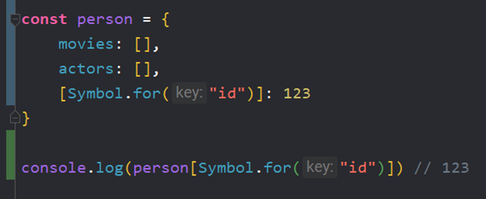

Символы используются для создания уникального идентификатора – они уникальны и неизменяемы

В качестве ключа у нас всегда используется строка. Мы можем записать её как в кавычках, так и без. Кроме **строк** свойствами объектов могут быть ещё и **символы** – *и только эти два типа данных*

```JS
const person = {
	'name': 'Alexey'
};
```

Символы – это всегда уникальные идентификаторы (даже если есть идентификаторы с одинаковыми значениями). По точечной записи обратиться к ним нельзя. Создать через `new` – не получится


Символы позволяют создать скрытые при обычном доступе свойства, которые не показываются при переборе объекта


Получаем значение ключа:


Получаем сам ключ:


Мы можем написать отдельный метод через `this[]`, чтобы получить символ из объекта


И так же есть отдельный метод, который позволяет получить массив символов из объекта


Основная причина создания символов – это защита данных. Символы исключают возможность перезаписи нужных данных в объекте. Когда в проекте огромное количество строк кода и множество библиотек, то сложно будет уследить за тем, не будут ли перезаписаны нужные нам данные


Тут мы записываем ключ `id` в объект, но не меняем при этом символ `id`


Когда мы формируем символ через синтаксис `Symbol.for(‘id’)`, то у нас формируется глобальный реестр символов и теперь это описание не будет уникальным



Есть и обратный метод, который получает ИЗ глобального реестра значение

