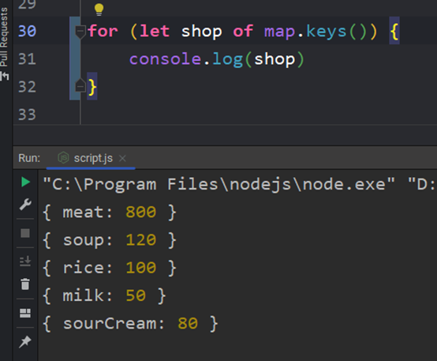

Тут хочется пояснить, что в качестве ключа объекта всегда используется строка. Даже если мы напишем число, то оно переведётся в строку. Однако, если вставить `{}` объект, то мы получим ошибку

`Map` – это специфический тип данных, который выглядит как объект, но по-сути может представлять из себя и массив, и строку, и число и любой другой тип данных

Тут можно увидеть, как `map` используется для создания объекта, у которого в качестве ключа используется объект

Так же можно сократить запись, если записывать через цепочку либо можно делать присваивание через цикл

Однако самым рациональным методом будет присваивать значения через цикл из массива или определённой базы данных, которая может к нам подгрузиться

Так же мы имеем метод `get()`, который позволяет получить map-значение из массива

Метод `has()` проверяет наличие значения в мапе

И вот несколько методов для работы с нашей картой

`Map` по сути своей представляет из себя массив массивов. Это можно было определить через `[entries]` в консоли браузера. Начальные данные через конструктор можно задать так:

Ну и через перебор можно вывести ключи из нашей карты

Тут представлен код, который в массив закинет ключи ключей объектов карты. Тут мы берём через метод `keys()` ключи из карты и внутри `push()` (закидывания элемента в массив) мы вычленяем из объекта - бывшего ключа (который до этого был ключом элемента карты) ключ

Коротко: `keys()` -> берёт ключи из карты, `Object.keys()` -> берёт ключ объекта (который является ключом карты)

Получается такое получение ключей

Сейчас мы получаем вторую часть от элементов карты – значения. Получаем их просто перебирая `Map` через метод `values()`, который возвращает значения

Тут мы получаем сами значения, записанные в карту

Так же можно произвести отдельно получение значений объекта-ключа и значения через деструктуризацию массива (карта – хранит каждое значение в виде массива)

Нужно отметить, что метод `entries()` возвращает как-раз таки массивы

Ну и самый рекомендуемый способ перебора – через встроенный метод `forEach`. В его колбэк-функцию передаётся значение, ключ и сама карта (к ней вполне можно обратиться)

Перевод объекта в карту

Перевод карты в объект

>[!info] Все особенности `Map()`:
>1) У карт ключами могут быть любые типы данных: строки, массивы, объекты, функции, числа (В объектах только строки)
>2) Карты добавляют новые значения всегда в конец и всегда в них соблюдается порядок (В объектах могут добавляться куда угодно)
>3) В картах при создании нет никаких наследуемых свойств через прототип (В объектах могут быть)
>4) Карты легко перебирать
>5) Размеры карты легко получить (`size()`)