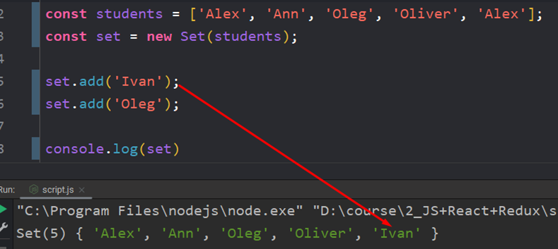

Это массив, где каждое значение встречается только один раз

И так же мы можем добавить новые значения в такой массив

Ну и так же нам доступна ещё и цепочная запись через точку

И второй способ – перебор через `forEach()`. Его особенность заключается в том, что у нас нет ключей в таком массиве и поэтому в качестве второго аргумента передаётся это же значение, но снова. Последний аргумент – сам сет

Ну и у нас так же есть методы, присущие структуре Map. Методы `keys()` и `entries()` созданы для обратной совместимости с `Map`

В практическом применении `Set` используют для быстрой фильтрации массивов. Писать фильтр самому – это долго и неэффективно. Сет изначально хорошо оптимизирован и будет работать быстрее, чем самописный фильтр

