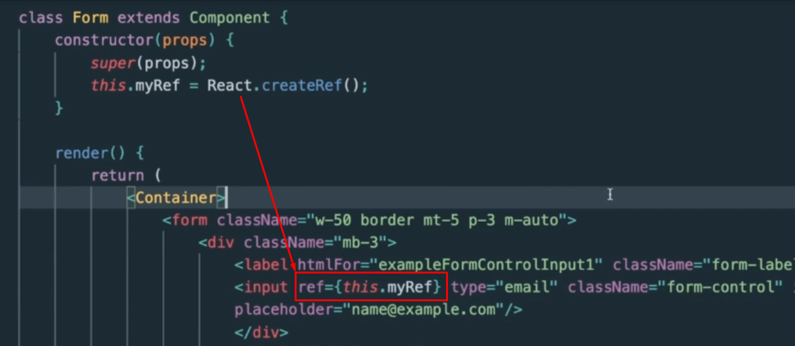

Стартовый проект:

```JS
import React, { Component } from 'react';
import { Container } from 'react-bootstrap';
import './App.css';

class Form extends Component {
	constructor(props) {
		super(props);
	}

	render() {
		return (
			<Container>
				<form className='w-50 border mt-5 p-3 m-auto'>
					<div className='mb-3'>
						<label htmlFor='exampleFormControlInput1' className='form-label'>
							Email address
						</label>
						<input
							type='email'
							className='form-control'
							id='exampleFormControlInput1'
							placeholder='name@example.com'
						/>
					</div>
					<div className='mb-3'>
						<label htmlFor='exampleFormControlTextarea1' className='form-label'>
							Example textarea
						</label>
						<textarea
							className='form-control'
							id='exampleFormControlTextarea1'
							rows='3'
						></textarea>
					</div>
				</form>
			</Container>
		);
	}
}

function App() {
	return <Form />;
}

export default App;
```

`ref` - это ссылка на элемент вёрстки из ДОМ-дерева на странице

Чтобы создать ссылку в функциональном компоненте, нужно вызвать через React функцию `createRef()`. Далее на нужный нам элемент навешиваем данный реф.



Так же можно рефы указывать в полях класса


И далее мы можем воспользоваться стандартными функциями API браузера на элементах вёрстки


И сейчас можно увидеть, что фокус срабатывает на форме


Если нам нужно будет навесить `ref` на компонент React, то тут уже придётся проделать определённые манипуляции 


И теперь, чтобы мы смогли воспользоваться рефом компонента у нас есть два пути:
- обернуть функциональный компонент в `forwardRef` и прокинуть вторым аргументом `ref` в нужное нам поле компонента
- можно просто сделать компонент классовым


Но проблема теперь будет заключаться в том, что мы не сможем воспользоваться стандартным API и вызвать `focus()`, так как он вызывается сейчас на компоненте, а не на элементе ДОМ-дерева. Однако мы можем вызвать функции самого компонента, поэтому можно будет вызывать фокус в самом компоненте.


Так же мы имеем такой подход как коллбэк-реф. Это подход, при котором мы должны навешивать реф к элементу через функцию. 
Так же тут нужно сказать, что у нас будет отсутствовать свойство `current` и `ref` будет хранить чистую ссылку на элемент вне объекта


И далее реализуем выделение карточки персонажа через клавиатуру и навешивание на него стилей

`src > components > charList > CharList.js`
```JS
class CharList extends Component {  
   state = {  
      charList: [],  
      loading: true,  
      error: false,  
      newItemLoading: false,  
      offset: 210,  
      charEnded: false,  
   };  
  
   marvelService = new MarvelService();  
  
   componentDidMount() {  
      this.onRequest();  
   }  
  
   onRequest = (offset) => {  
      this.onCharListLoading();  
      this.marvelService.getAllCharacters(offset)
	      .then(this.onCharListLoaded)
	      .catch(this.onError);  
   };  
  
   onCharListLoading = () => {  
      this.setState({  
         newItemLoading: true,  
      });  
   };  
  
   onCharListLoaded = (newCharList) => {  
      let ended = false;  
      if (newCharList.length < 9) {  
         ended = true;  
      }  
  
      this.setState(({ offset, charList }) => ({  
         charList: [...charList, ...newCharList],  
         loading: false,  
         newItemLoading: false,  
         offset: offset + 9,  
         charEnded: ended,  
      }));  
   };  
  
   onError = () => {  
      this.setState({  
         error: true,  
         loading: false,  
      });  
   };  

   // массив элементов ссылок
   itemRefs = [];  

   // функция установки рефа
   setRef = (ref) => {  
      this.itemRefs.push(ref);  
   };  

   // при фокусе на элемент
   focusOnItem = (id) => {  
      // Я реализовал вариант чуть сложнее, и с классом и с фокусом  
      // Но в теории можно оставить только фокус, и его в стилях использовать вместо класса      
      // На самом деле, решение с css-классом можно сделать, вынеся персонажа в отдельный компонент. Но кода будет больше, появится новое состояние и не факт, что мы выиграем по оптимизации за счет бОльшего кол-ва элементов  
      // По возможности, не нужно злоупотреблять рефами
      this.itemRefs.forEach((item) => item.classList.remove('char__item_selected'));  
      this.itemRefs[id].classList.add('char__item_selected');  
      this.itemRefs[id].focus();  
   };  
    
   renderItems(arr) {  
      const items = arr.map((item, i) => {  
         let imgStyle = { objectFit: 'cover' };  
         if (  
            item.thumbnail ===  
            'http://i.annihil.us/u/prod/marvel/i/mg/b/40/image_not_available.jpg'  
         ) {  
            imgStyle = { objectFit: 'unset' };  
         }  
  
         return (  
            <li  
               className='char__item'  
               // делаем элемент кликабельным
               tabIndex={0}  
               // устанавливаем его в массив рефов через метод
               ref={this.setRef}  
               key={item.id}  
               // при клике на элемент вызваем функции
               onClick={() => {  
                  this.props.onCharSelected(item.id);  
                  // добавляем функцию фокуса
                  this.focusOnItem(i);  
               }}  
               // и те же функции будем вызывать при нажатии на кнопку
               onKeyDown={(e) => {  
                  if (e.key === ' ' || e.key === 'Enter') {  
                     this.props.onCharSelected(item.id);  
                     this.focusOnItem(i);  
                  }  
               }}  
            >               
	                 
               <div className='char__name'>{item.name}</div>  
            </li>  
         );  
      });  

		// тут уже выводим все элементы списка
		return <ul className='char__grid'>{items}</ul>;  
   }  
  
   render() {  
      const { charList, loading, error, offset, newItemLoading, charEnded } = this.state;  
  
      const items = this.renderItems(charList);  
  
      const errorMessage = error ? <ErrorMessage /> : null;  
      const spinner = loading ? <Spinner /> : null;  
      const content = !(loading || error) ? items : null;  
  
      return (  
         <div className='char__list'>  
            {errorMessage}  
            {spinner}  
            {content}  
            <button  
               className='button button__main button__long'  
               disabled={newItemLoading}  
               style={{ display: charEnded ? 'none' : 'block' }}  
               onClick={() => this.onRequest(offset)}  
            >  
               <div className='inner'>load more</div>  
            </button>  
         </div>  
      );  
   }  
}
```

Итог: мы имеем выделение персонажей при клике


