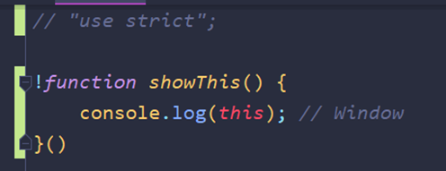
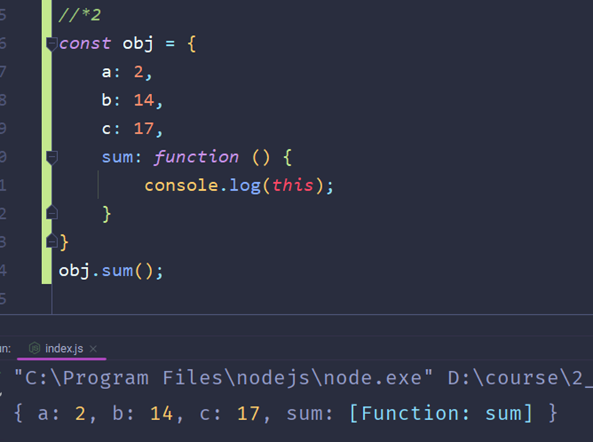

Понимать контекст вызова с «`this`», стоит как присваивание переменной к определённому контексту (функции). То есть любая переменная, которую мы создаём – принадлежит всей области видимости. Если мы создаём переменную с «`this`», то она будет принадлежать только данной области

Так же тут стоит отметить, что при обычном вызове функции с `this` внутри, у нас будет выходить глобальная переменная `Window`. Если мы добавим `“use strict”`, то получим `undefined`

И тут представлен пример, когда мы используем «**this**» и избегаем его. Благодаря «**замыканию функции**» в обычной ситуации (первый скрин) у нас переменные ищутся сначала внутри самой функции, потом поиск заходит в функцию родителя.

На втором изображении уже используется вызов переменной через «`this`» и функция ищет переменную **только** внутри себя и дальше не выходит. Поэтому и возвращается `undefined`

> Контекст вызова у методов объекта – это сам объект

Уже в данном примере контекст вызова (объект) теряется, так как внутри метода просто вызывается функция

> This в конструкторах и классах – это новый экземпляр объекта

То есть при создании свойства в конструкторе через «`this`», это значение будет присваиваться только созданным экземплярам через данный конструктор

Ручная привязка `this`: `call`, `apply`, `bind`

Так же мы можем вызывать функцию и подвязать ей контекст вызова через методы `call` и `apply` (оба метода выполняют одно и то же, но по-разному передают аргументы в функцию)

Так же можно сделать много вариаций одной и той же функции, используя контекст вызова и функцию `bind`. `bind` принимает в себя значение «`this`» и возвращает в переменную новую функцию, где `this` заменён на данный аргумент метода

И когда мы используем конструкцию с `function()` в ивенте мы так же можем пользоваться и «`this`», так как он будет вызывать конкретно наш нажатый объект

И работать с этим объектом мы так же можем

Как помним из примера выше – функция внутри функции имеет свой контекст вызова и поэтому в объекте такая вложенная функция вернёт `undefined`. Но отличительной особенностью **стрелочных функций** является то, что у них **нет своего контекста вызова**. Контекст вызова они наследуют от родителя и поэтому код, приведённый ниже, будет работать

Ну и так как нет собственного контекста вызова у стрелочной функции, то берём пример чуть выше с `function()` и переделываем его на стрелочную функцию. Работать уже такой ивент не будет, так как контекст, опять же, берётся у родителя

И чтобы заменить «`this`» в таких функциях, используют таргет ивента

