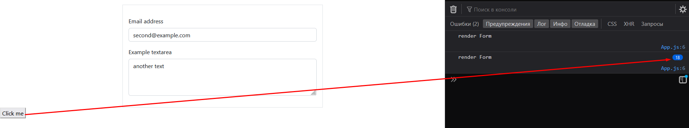
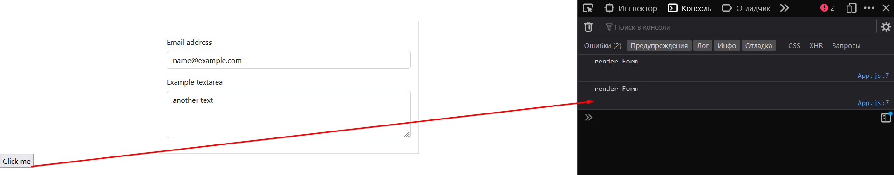

> `React.memo` - это компонент высшего порядка (HOC), который предназначен для мемоизации рендера компонента. Если в компонент не пришли новые пропсы или не изменился стейт, то компонент не перерендерится и сохранит ресурсы компьютера пользователя. 

Например, мы имеем форму. При нажатии на кнопку компонент формы получает новые пропсы и перерендеривается.

```JS
import { useState } from 'react';
import { Container } from 'react-bootstrap';
import './App.css';

const Form = (props) => {
	console.log('render Form');

	return (
		<Container>
			<form className='w-50 border mt-5 p-3 m-auto'>
				<div className='mb-3'>
					<label htmlFor='exampleFormControlInput1' className='form-label mt-3'>
						Email address
					</label>
					<input
						value={props.mail}
						type='email'
						className='form-control'
						id='exampleFormControlInput1'
						placeholder='name@example.com'
					/>
				</div>
				<div className='mb-3'>
					<label htmlFor='exampleFormControlTextarea1' className='form-label'>
						Example textarea
					</label>
					<textarea
						value={props.text}
						className='form-control'
						id='exampleFormControlTextarea1'
						rows='3'
					></textarea>
				</div>
			</form>
		</Container>
	);
};

function App() {
	const [data, setData] = useState({
		mail: 'name@example.com',
		text: 'some text',
	});

	return (
		<>
			<Form mail={data.mail} text={data.text} />
			<button
				onClick={() =>
					setData({
						mail: 'second@example.com',
						text: 'another text',
					})
				}
			>
				Click me
			</button>
		</>
	);
}

export default App;
```



Чтобы решить вышеописанную проблему, нужно просто обернуть компонент в `memo()`, который сохранит результат рендера и при неизменных значениях не будет рендерить компонент заново

```JS
// обернём компонент в memo()
const Form = memo((props) => {
	console.log('render Form');

	/// CODE ...
});
```


Однако тут нужно упомянуть, что перерендер будет происходить, если внутри пропсов мы передаём свойства с вложенными объектами

```JS
function App() {
	const [data, setData] = useState({
		// объект внутри свойства объекта
		mail: { name: 'name@example.com' },
		text: 'some text',
	});

	return (
		<>
			<Form mail={data.mail} text={data.text} />
			<button
				onClick={() =>
					setData({
						// передаём mail - name
						mail: { name: 'name@example.com' },
						text: 'another text',
					})
				}
			>
				Click me
			</button>
		</>
	);
}
```


Чтобы указать, что в приложении нам нужно реализовать для определённого пропса глубокую проверку (проверять изменение вложенных значений), то нам нужно реализовать функцию, которая будет сравнивать значения и возвращать `boolean`

```JS
// функция для сравнения пропсов
const propsCompare = (prevProps, nextProps) => {
	return prevProps.mail.name === nextProps.mail.name;
};

const Form = memo((props) => {
	console.log('render Form');

	return (
		<Container>
			<form className='w-50 border mt-5 p-3 m-auto'>
				<div className='mb-3'>
					<label 
						htmlFor='exampleFormControlInput1' 
						className='form-label mt-3'
					>	
						Email address
					</label>
					<input
						value={props.mail.name}
						type='email'
						className='form-control'
						id='exampleFormControlInput1'
						placeholder='name@example.com'
					/>
				</div>
				<div className='mb-3'>
					<label 
						htmlFor='exampleFormControlTextarea1' 
						className='form-label'
					>	
						Example textarea
					</label>
					<textarea
						value={props.text}
						className='form-control'
						id='exampleFormControlTextarea1'
						rows='3'
					></textarea>
				</div>
			</form>
		</Container>
	);
}, propsCompare);
```


> `React.PureComponent` - это расширение классовых компонентов, которое в отличе от `Component` триггерит каждый раз функцию `shouldComponentUpdate()`, которым мы определяем потребность в обновлении компонента

Всю логику, что мы реализовывали через `memo` данный компонент реализует сам. Однако нам нужно будет так же проводить сравнение внутри `shouldComponentUpdate()`, если мы будем передавать вложенные объекты

```JS
class Form extends PureComponent {
	render() {
		console.log('render Form');

		return (
			<Container>
				<form className='w-50 border mt-5 p-3 m-auto'>
					<div className='mb-3'>
						<label htmlFor='exampleFormControlInput1' className='form-label mt-3'>
							Email address
						</label>
						<input
							value={this.props.mail}
							type='email'
							className='form-control'
							id='exampleFormControlInput1'
							placeholder='name@example.com'
						/>
					</div>
					<div className='mb-3'>
						<label htmlFor='exampleFormControlTextarea1' className='form-label'>
							Example textarea
						</label>
						<textarea
							value={this.props.text}
							className='form-control'
							id='exampleFormControlTextarea1'
							rows='3'
						></textarea>
					</div>
				</form>
			</Container>
		);
	}
}

function App() {
	const [data, setData] = useState({
		mail: 'name@example.com',
		text: 'some text',
	});

	return (
		<>
			<Form mail={data.mail} text={data.text} />
			<button
				onClick={() =>
					setData({
						mail: 'name@example.com',
						text: 'another text',
					})
				}
			>
				Click me
			</button>
		</>
	);
}

export default App;
```



Если мы хотим контролировать перерендер в обычном компоненте, который наследуется от `Component`, то нам нужно будет использовать функцию `shouldComponentUpdate()`

> Тут стоит сделать пометку, что логику очень глубокого сравнения делать не стоит

```JS
class Form extends Component {
	shouldComponentUpdate(nextProps) {
		if (this.props.mail.name === nextProps.mail.name) {
			return false;
		}

		return true;
	}

	render() {
		console.log('render Form');

		return (
			<Container>
				<form className='w-50 border mt-5 p-3 m-auto'>
					<div className='mb-3'>
						<label 
							htmlFor='exampleFormControlInput1' 
							className='form-label mt-3'
						>	
							Email address
						</label>
						<input
							value={this.props.mail.name}
							type='email'
							className='form-control'
							id='exampleFormControlInput1'
							placeholder='name@example.com'
						/>
					</div>
					<div className='mb-3'>
						<label 
							htmlFor='exampleFormControlTextarea1' 
							className='form-label'
						>	
							Example textarea
						</label>
						<textarea
							value={this.props.text}
							className='form-control'
							id='exampleFormControlTextarea1'
							rows='3'
						></textarea>
					</div>
				</form>
			</Container>
		);
	}
}
```


>[!info] Вывод:
> - `memo()` используется для функциональных компонентов
> - Для классовых компонентов используется `PureComponent` или `Component` вместе с функцией `shouldComponentUpdate()` 
> - Используется мемоизация для компонентов, которые часто получают одинаковые пропсы

>[!warning] Если добавить мемоизацию на компонент, который постоянно получает новые пропсы, то можно только затормозить работу приложения дополнительным сохранением данных - поэтому использовать данный функционал нужно аккуратно

Например, если мы передадим функцию, то компонент даже с `memo()` будет перерендериваться постоянно из-за того, что каждый раз при передаче будет создаваться новая функция (а функция является объектом в ==JS==).

Это так же будет происходить, если мы вынесем эту функцию в отдельную именованную стрелочную, потому что наш компонент `App` перерендеривается каждый раз, когда в нём меняется состояние и из-за этого пересоздаётся функция внутри него


Чтобы закешировать функцию и не пересоздавать её по-новой каждый раз, можно просто замемоизировать её через `useCallback()`


