## 001 Что такое JS и как его подключить к странице

Подключается скрипт к сайту таким образом. Больше никаких тегов внутри прописывать не надо. Если присутствует тег «type», то его нужно будет убрать. Скрипт мы помещаем в самый конец, так как он работает только с существующей вёрсткой на сайте и так же может долго загружаться, что застопорит загрузку сайта


## 003 Переменные и строгий режим

Объявлять переменные через `var` – **нельзя**. В современных структурах она может принести очень много вреда. Дело в том, что такая переменная не учитывает своё положение в коде и видна во всех областях видимости. Приведённый ниже код сработает и вернёт `undefined`:


Данная директива позволяет писать код только по современному защищённому стандарту, исключая старый


Стиль написания кода JS:


## 004 (д) Правила и типы названия переменных


Наименования названий переменных должны быть понятны для любого человека, который читает наш код


Стиль наименования переменной «snake_case» или написание в камеле, но с нижнего подчёркивания используется для написания константы (которую точно не стоит менять в коде)


## 005 Классификация типов данных в JavaScript


В первом столбце – примитивные типы данных, во втором – комплексные (могут хранить в себе разные типы данных)


Так же мы можем получить при определённых операциях `Infinity` (когда получаем бесконечность) и `NaN` (когда ожидаем выполнение числовой операции, но вступают в расчёт другие числа)


Объект представляет из себя набор свойств (ключ + значение). Массив – это частый случай от типа данных объект (в качестве ключа используется индекс). Поэтому работа с массивом и объектом достаточно похожа


## 006 (д) Разница между объектами и массивами и неочевидные синтаксические возможности

Разница между объектом и массивом заключается в разных прототипах (которые определяют функционал)


## 007 Простое общение с пользователем


Самый простой способ общения с пользователем – это `alert()`, `confirm()` и `prompt()`. Последняя функция всегда возвращает строковое значение от пользователя


Так же можно вернуть и число (динамическая типизация в число)


Так же можно сделать серию вызовов диалоговых окон и предоставить их пользователю.

`Document.write()`- перезатирает страницу и выводит нашу переменную


## 008 Интерполяция (ES6)


Интерполяция в JS реализуется с использованием `${действия}`, либо через сложение строк


## 009 Операторы в JS


Все операторы присутствуют на MDN


## 010 Учимся работать с системой контроля версий Git и с сервисом GitHub


В современном мире встала такая проблема, что нужно сохранять огромное количество вариантов кода. Если нам нужно добавить фичу, а она может крашнуть весь проект, нам нужно иметь возможность откатиться обратно. Если сохранять каждую папку отдельно, то это может оказаться накладно как по месту, так и по ориентированию между папками


Дальше стоит чекнуть курс по гиту, который ниже или чекнуть данный сайт:


## 011 Как работать с GitHub с разных компьютеров, gitignore и Git Kraken

Всегда перед началом работы с проектом пишем: `git pull`. Может оказаться так, что проект на гите имеет более новую версию, чем сейчас имеется на компьютере, поэтому будет хорошей практикой его себе загрузить.

Так же стоит игнорировать рабочие инструменты (не пушить те же sass файлы)


## 012 (д) Сетевые протоколы. Подключение компьютера к аккаунту Github через SSH


Существует множество протоколов для передачи данных по сети. Для подключения к нашему гитхабу используется `HTTPS` (логин-пароль). Но так же может использоваться и `SSH` (ключ локальный на компьютере сравнивается с открытым в проекте и даётся доступ к проекту)


Сравнение HTTPS и SSH

[https://ourtechroom.com/tech/https-vs-ssh-in-git/](https://ourtechroom.com/tech/https-vs-ssh-in-git/)

Подключение к гитхабу через SSH

[https://docs.github.com/en/authentication/connecting-to-github-with-ssh](https://docs.github.com/en/authentication/connecting-to-github-with-ssh)

## 013 Практика, ч.1. Начинаем создавать приложение


Задание:


Реализация:


## 014 Условия


## 015 (д) Логические операторы


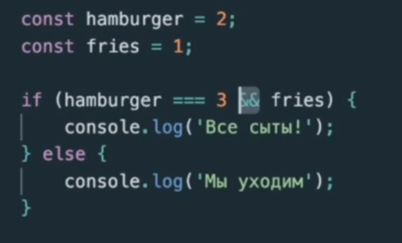

## 016 Циклы

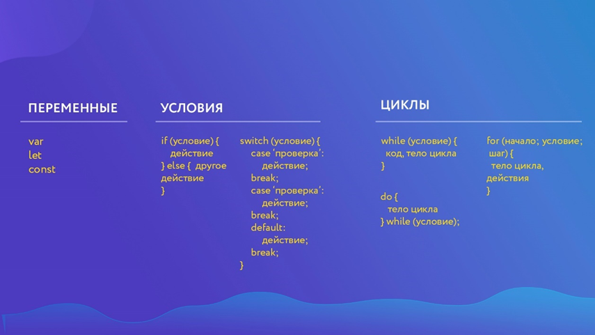

## 017 (д) Цикл в цикле и метки


Реализация вложенного цикла:


**Метки.** Можно отправить цикл выполнять другой цикл, который является его частью (тут если `k === 2`, то будет выполняться самый первый цикл). 

`continue` и `break` работают похожим образом как и в других языках


## 018 Практика, ч2. Применяем условия и циклы


Тут стоит отметить, что если пользователь нажал на «отмену» при вводе значения в `prompt`, то к нам вернётся `null`


```JS
'use strict';  
  
let numberOfFilms = +prompt('Сколько фильмов вы посмотрели?')  
  
  
const personalMovieDB = {    
	count: numberOfFilms,    
	movies: {},    
	actors: {},    
	genres: [],    
	private: false,  
}  
  
	while (true){    
	if (numberOfFilms >= 0) {    
	    if(personalMovieDB.count < 10){   
			alert('Просмотрено довольно мало фильмов') 
			break 
		} else if(personalMovieDB.count >= 10 && personalMovieDB.count <= 30){    
			alert('Вы классический зритель')   
			break     
		} else if(personalMovieDB.count > 30){     
	          alert('Вы киноман')
	          break
		}
	} else {
		alert('Вы ввели не число или неверное число')    
	}  
}  
  
let name, mark;
  
cycle: for (let i = 0; i < 5;){  
	name = prompt('Один из последних просмотренных фильмов?');
	mark = prompt('На сколько оцените его по десятибальной шкале?', '5'); 
	if (name != null && name != '' 
		&& name.length < 50 
		&& mark != '' 
		&& mark != null 
		&& mark >= 0 
		&& mark <= 10) {       
		personalMovieDB.movies[name] = mark;
		i++; 
	} else {     
		alert('Одно из введённых вами значений неверно');      
		continue cycle;
	}  
}
```

И стоит отметить, что если мы тут оставим «+», то при отмене ввода значения пользователем, данный оператор переведёт значение `null` в `0`

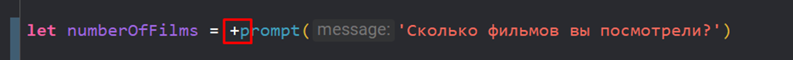


## 019 Функции, стрелочные ф-ции (ES6)

Виды функций:


## 020 (д) Еще раз про аргументы функций


## 021 (д) Про важность return

Оператор `return` в первую очередь нам нужен для того, чтобы вернуть результат из функции (например в переменную, которая вызвала эту функцию)


Так же можно вернуть значение из цикла (и цикл сразу же завершится)


Но так же важно сказать, что функция (когда она не имеет `return`) всегда возвращает undefined. И `console.log()` тоже всегда возвращает `undefined`


## 022 Методы и свойства строк и чисел

Основные методы строк и чисел:


## 023 Практика , ч3. Используем функции

Тут хочется показать не очевидное условие. Нам нужно, чтобы пользователь в любом случае ввёл число. Чтобы функция работала, как надо, нужно сформулировать такое условие:

```JS
let numberOfFilms;

function numberChecker() {
	numberOfFilms = +propmpt('Сколько фильмов вы посмотрели?');
	while (numberOfFilms == '' || numberOfFilms == null || isNan(numberOfFilms)) {
		numberOfFilms = +propmpt('Сколько фильмов вы посмотрели?');
	}
}

numberChecker();
```


## 024 (д) Метод trim()

Метод `trim()` стоит использовать почти везде, где есть ввод данных пользователем. Это позволяет избегать пустых строк и огромного количества пробелов, так как данный метод убирает лишние пробелы из строки


## 025 Callback- функции

**Callback-функция** - это функция, которую мы передаём в другую функцию и выполняем там же

Сюда мы передаём анонимную функцию (исчезнет после использования):


А сюда мы передаём стрелочную:

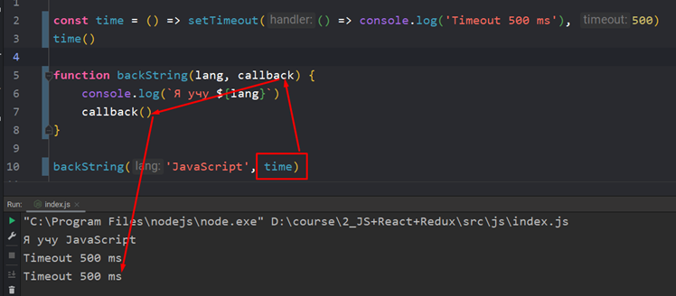


## 026 Объекты, деструктуризация объектов (ES6)

Тут мы получаем ключ и его значение из объекта, а так же проходимся по объектам внутри объекта


Это пример части деструктуризации объекта, где мы получаем из вложенного объекта `movies` его внутренние свойства

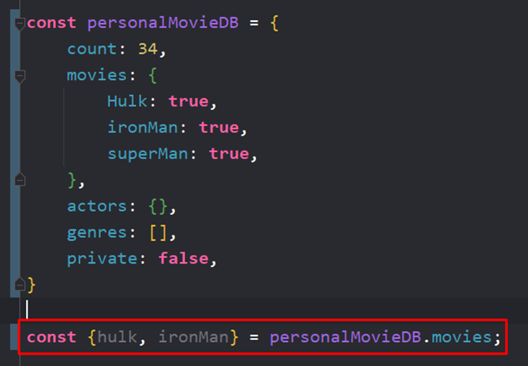

## 027 Массивы и псевдомассивы


## 030 Основы ООП, прототипно-ориентированное наследование

Тут описывается цепочка наследования и особенности ==ООП== в ==JS==, где все элементы языка являются объектами


```JS
const car = {
  model: 'Bentley',
  ride: () => {
    console.log('врум-врум');
  }
} 

const Bentley = {
	model: 'H720P',
}

// Bentley.__proto__ = car; // устаревший способ указать прототип
// Object.setPrototypeOf(Bentley, car); // более современный способ создания прототипа

const Proshe = Object.create(car); // тут сразу реализован прототипно-наследуемый объект

Proshe.ride(); 
```

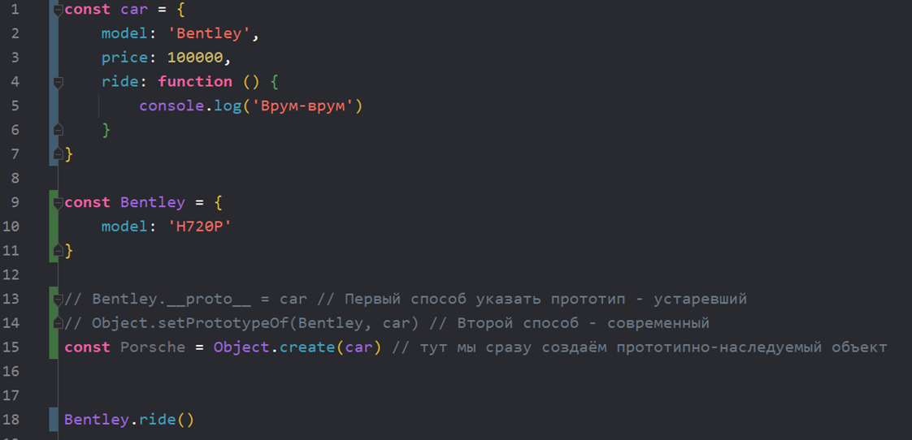


## 031 Практика , ч4. Используем объекты

Очень важный мем! Чтобы проверить, что наш пользователь ввёл число, нужно проверять не само равенство введённого значения к типу (`count === Number`), а тип введённого числа к типам, которые выдаёт typeof (пример на рисунке)


Выводим любимый жанр и его номер


Так же есть ещё один интересный способ, как можно принять значения от пользователя в виде массива. Метод `split(‘, ’)` позволяет указать разделитель для строчки и по этому разделителю разложить значения в массив.

Тут впринципе показана реализация, когда мы приводим сначала строку к нижнему регистру (потому что сортировка, которая идёт дальше, будет производиться по юникоду, а в юнкоде сначала идут заглавные буквы)


## 032 Отлавливаем ошибки в своем коде при помощи консоли разработчика. Breakpoints

На данной вкладке нашего инструмента разработчика находится инструмент просмотра сурсов и дебаггинга


На номерах строк мы ставим маркеры. Справа находятся кнопки стартаа программы, перехода в другую функцию (вызванную), входа внутрь функции, выхода из функции (она выполнится) и выполнения одного шага. Так же есть снятие маркера и паузы на ошибках


## 033 Динамическая типизация в JS


Способы перевода в другие типы данных:


## 034 Замыкание и лексическое окружение


В данном примере кода мы доходим до такого понятия как **лексическое окружение** или **область видимости**. Любая переменная – это свойство объекта лексического окружения. И мы имеем внутреннее лексическое окружение (например, область той же функции) и внешнее (всё, что находится на глобальном уровне).

Тут стоит пояснить, что бОльший приоритет имеют свойства внутренней области, но так же внутреннее окружение может брать значения из внешнего. Так же те же функции берут самое последнее значение переменной, которая может изменяться далеко дальше по коду


Тут функция так же будет брать только актуальное значение переменной (6, а затем уже 8). Так же тут же отметим, что при каждом вызове функции, у нас создаётся разное лексическое окружение, что говорит нам о том, что в функции в разных местах кода спокойно могут находиться разные значения переменных. Но так же эти пространства удаляются, когда они выполняются и полностью исчезают из выполненного программного кода


Тут так же можно увидеть, что при вызове функции у нас создаётся определённая область видимости, где сохраняются ссылки на переменные, которые были им доступны на время создания этих функций (создание == вызов)


## 035 Задачи с собеседований на понимание основ


## 036 Получение элементов со страницы


На нашей странице располагается бокс. Через метод `getElementById` мы можем получить (*один*) элемент по его `id`, указанному в HTML-вёрстке, и выводим его в консоль разработчика. 

Обращаемся мы к `document`, так как это наша страница, с которой мы работаем.


Метод `getElementsByTagName` позволяет получить псевдомассив элементов по их тегу (`div`, `button`, `li` and etc...)

Здесь мы получаем уже не один элемент, а *псевдомассив* - это массив, который не имеет методов высшего порядка массивов


Но мы так же можем обратиться к определённому элементу этого псевдомассива и получить нужное нам значение через массивное указание индекса элемента (`[число]`)

>[!note] Тут стоит отметить, что даже если у нас на странице будет всего один элемент, то на выходе мы так же получим `HTMLCollection` (псевдомассив), но из одного элемента


Тут уже псевдомассив элементов вызываем по имени класса с помощью метода `getElementsByClassName()`


Все вышеописанные методы являются устаревшими. Сейчас для получения элементов со страницы используются два современных метода: `querySelector` и `querySelectorAll`. Они позволяют обращаться к элементам как при использовании CSS-селекторов. То есть тут уже для указания элемента нам нужно будет прописывать `.`, `#`, `:`, `*` и так далее. Такой способ рекомендуется к использованию и является более правильным. Так же он имеет один из методов массива - `forEach()`


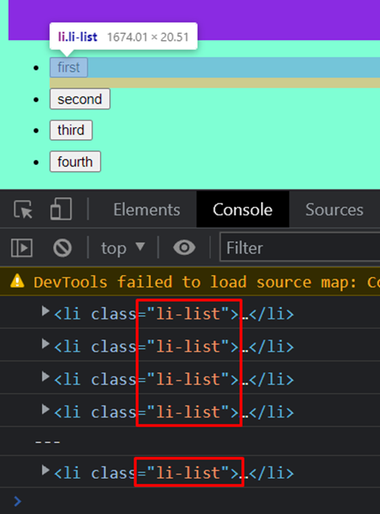


## 037 Действия с элементами на странице


Так же мы можем добавить инлайновые стили определённому элементу страницы через `имя_элемента.style.стиль = 'значение[px]'`.

Тут так же нужно отметить, что мы в основном имеем дело в псевдомассивами, поэтому нужно не забывать обращаться к элементам по индексу.

Так же нужно отметить, что на элемент можно повесить стили через обращение к элементу `cssText`, который представляет из себя просто набор текста стилей элемента `элемент.style.cssText = 'стили'`


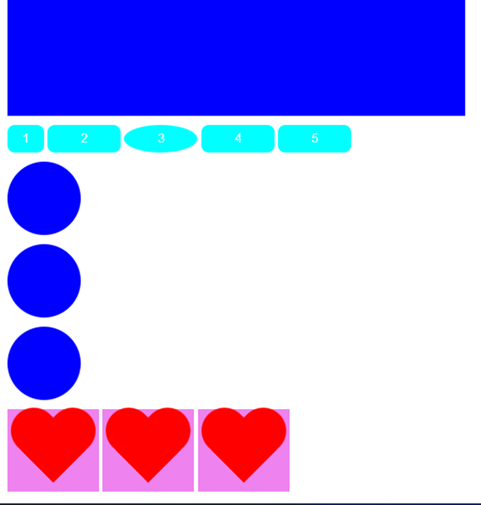

И вот тут представлено создание нового элемента нашей страницы с классом black (в CSS заранее прописаны свойства цвета, ширины и высоты данного блока по названию класса):
- `createElement()` - позволит создать элемент на странице по тегу
- `classList()` - свойство объекта, которое позволяет производить манипуляции над классом элемента на странице
	- `add()`- метод добавления класса элементу
	- `remove()` - метод, который позволит удалить определённый стиль с элемента
- `append()` - добавляет определённый элемент в конец
- `querySelector().append()` - такая конструкция позволит добавить элемент в конец определённого блока кода


Это второй вариант записи обращения к элементу (тут мы запихиваем див во враппер)


Так же у нас есть возможность добавить элемент в начало объекта, но через другой метод: `prepend()`


Так же мы можем поместить элемент на страницу через метод `before()` до того элемента, на котором мы вызвали данный метод

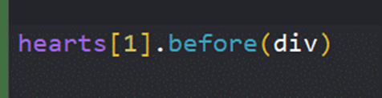


Так же мы можем поместить элемент после того, на котором вызвали функцию `after()`


Но есть куда более старый метод, который тоже подойдёт для вставки элемента - `insertBefore()`. Ему нужно передать в качестве аргументов два объекта: вставляемый объект и тот, перед которым вставляем


Тут уже представлено удаление одного из трёх кружков. Осуществляется удаление элемент через вызов на нём метода `remove()`


Раньше был актуален метод `removeChild()`, который позволял удалить дочерний элемент из родительского


Так же мы имеем возможность крайне просто и быстро поменять объекты местами между друг другом с помощью метода `заменяемый.replaceWith(заменяем_на)`


И вот ещё один абсолютно аналогичный по логике выполнения код, но более старый по записи `replaceChild()`


И вот тут уже нужно познакомиться с двумя свойствами `innerHTML` и `innerText`.

Первый добавляет на страницу код HTML, а второй добавляет только текст (который мог ввести, например, пользователь)


Метод `insertAdjacentHTML(позиция, значение)` позволяет вставить HTML-код несколькими заранее определёнными способами. В качестве первого аргумента мы передаём способ вставки, в качестве второго – сам код.

- `afterbegin` - вставит код в самом элементе, на котором вызываем данную функцию
- `afterend` - вставит после блока
- `beforebegin` - вставит до блока
- `beforeend` - вставит как и первый в самом элементе, на котором вызываем данную функцию


Так же при инициализации HTML элемента в JS можно указывать откуда мы будем конкретно брать вложенные элементы. То есть, мы можем искать элементы не по всему документу, а внутри враппера, который мы импортнули в JS


## 038 Практика. Задание на отработку действий со страницей


Дано 5 задач и начальный объект, внутри которого располагается массив


Приведены мои решения и решения преподавателя

Тут хочется обратить внимание на textContent. Он позволяет обратиться к контенту внутри блока


## 039 События и их обработчики


Существует огромное количество событий в JS. Все они применяются при взаимодействии пользователя и нашей формы


Самое первое и простое взаимодействие – это нажатие кнопки пользователем, которое мы можем прописать прямо в теге (но так делать не рекомендуется)


Так будет правильнее писать событие, но всё равно этот метод достаточно устаревший. Этот код плох тем, что мы можем забыть и переназначить кнопке другое действие далее в коде. А это уже точно приведёт к сбою логики программы


Это уже современная форма записи через `addEventListener()`. Первым делом записывается название самого события (нажатие -> `'click'`), уже потом вставляем колбэк-функцию, которая сработает при этом событии


`'mouseenter'` – вызывает срабатывание ивента при наведении мыши на элемент


Выводим сам ивент (так же можно ввести `event.target` – выведет элемент (на котором произошло событие), `event.type` – тип ивента)


Удаляет блок кода (сам элемент), на который навелись мышкой


Так же мы имеем `removeEventListener(событие, функция)`, которая позволяет удалить само событие с элемента 

Тут логика нашей программы описывается так: у нас есть чекер кликов, после нажатия на первую кнопку – она пропадает и вместе с ней удаляется чекер кликов со второй кнопки


Тут показаны **вложенные события**. Когда на родительсском и дочернем элементе находится один и тот же обработчик. Сначала всегда срабатывает вложенное событие


Свойство `currentTarget` указывает на событие каждого конкретного элемента по отдельности (сработали отдельно дочерний, потом родительский элементы)


`event.preventDefault()` – позволяет отменить выполнение стандартной логики для определённого элемента (например, отменяет перезагрузку страницы при нажатии на кнопку-сабмит (отправка) формы)


Так же мы можем через `forEach()` повесить событие сразу на все элементы псевдомассива


Так же в mdn можно увидеть, что метод, добавляющий ивенты, может принимать в себя до трёх значений, последний из которых - модификатор


Пример использования опции:

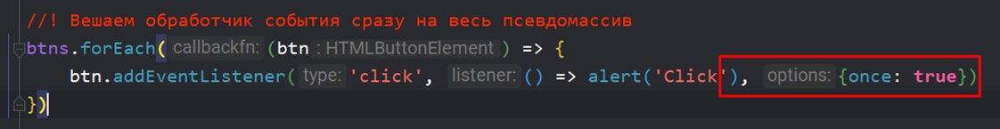


## 040 Навигация по DOM - элементам, data-атрибуты, преимущество forof

Мы можем легко вывести и увидеть элементы через JS. Тут хочется выделить такую особенность, что `documeentElement` – это `<html></html>` тег, внутри которого всё находится.

Так же, когда мы используем `childNodes` (вывод всех дочерних элементов), мы можем увидеть очень много разных объектов. В качестве `text` выступает перенос строки, который мы можем увидеть в коде, но который не отображается

И тут уже стоит пояснить, что в ДОМ-дереве не всё является элементами или узлами. **Элемент** – это видимая часть HTML, а **узел**, в свою очередь, – это та связующая часть между элементами и текст. Например, кнопка – это элемент, а текст в кнопке – это узел (нода)


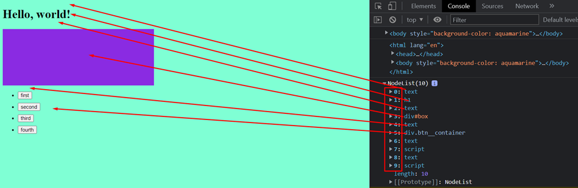

`parentNode` выводит родительский узел и повторять его можно много раз


Так же мы можем обращаться к определённым атрибутам в HTML-коде (тут так же работает логика CSS, так как обращение к артрибуту там идёт через `[такой синтаксис]`)


Используя предыдущий синтаксис, мы можем обратиться к предыдущему и следующему объекту (тут как предыдущий, так и следующий объект – это текстовая нода переноса строки)

Но такими методами неудобно пользоваться, так как мы можем попасться на ноду переноса строки, что нам может быть и не нужно


Выводит предыдущий/следующий **элемент** после того, к которому обратились


`firstElementChild` - выводит первого ребёнка в выбранном элементе
`parentElement` - выводит родителя выбранного элемента


И вот как данный функционал пишется: мы перебираем все элементы объекта `body`, и если имя элемента `text`, то данная итерация цикла пропускается (`continue` – пропускает итерацию цикла, `break` – завершает цикл досрочно)


## 041 Рекурсия


Рекурсия - это функция, которая выполняет саму себя конечное количество раз.

Рекурсия позволяет множество раз перевыполнять код до выполнения поставленной задачи.

Так же имеются основные понятия как: база рекурсии, шаг рекурсии и глубина рекурсии

Нужно сразу упомянуть, что рекурсии менее производительны, нежели чем стандартные функции языка по перебору информации. Однако рекурсии более удобны в большинстве остальных методов

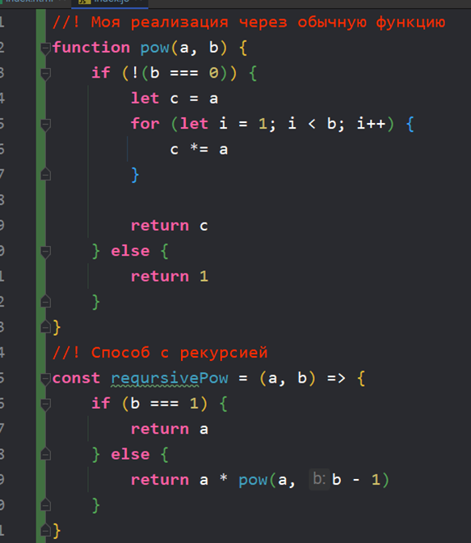

Первый метод `Object.values()` переводит объект в массив, второй метод `Array.isArray()` проверяет является ли объект массивом


Тут представлен объект, который хранит в себе данные о студентах и завершённости прохождения курса


И нам нужно создать переборщик объекта, который выведет общий процент прхождения курсов. Основная проблема этого переборщика заключается в том, что при переборе объекта он не зайдёт в ещё более вложенные объекты кроме тех, что мы описали – это и есть ограничение нерекурсивных методов


И вот представление кода с рекурсией. Он уже может обработать объекты любой сложности и вложенности, так как при каждой встрече объекта, он переходит во второй условный блок кода, где располагается `else` и там запускает массив заново, чтобы дойти до массива, где сработает блок кода `true`


С представленным выше объектом оба массива справляются одинаково


Но если немного изменить структуру


## 042 Практика. Используем события на странице проекта


Задание:


`DOMContentLoaded` – браузер полностью загрузил HTML, было построено DOM-дерево, но внешние ресурсы, такие как картинки `` и стили, могут быть ещё не загружены


[Статья по событию DOMContentLoaded](https://learn.javascript.ru/onload-ondomcontentloaded)

обращение ко всем изображениям внутри класса

```JS
const ads = document.querySelectorAll('.promo__adv img');
```

Тут находятся все переменные в проекте (и необычные селекторы вызова)

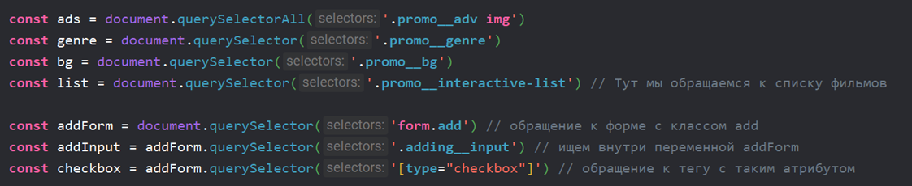

Это одна из самых сложных частей данного сайта – формирование списка фильмов. Первым делом, в текст вкладываемого родителя мы вставляем пустую строку, которая нам позволит очистить имеющиеся айтемы списка `<li>`. Дальше мы сортируем массив. Потом мы заменяем элемент списка, и именно вставляем новый айтем включая добавление HTML-структуры. Добавляем структуру через «+=», так как мы добавляем айтем списка - `<li>`.

Потом мы добавляем функционал удаления фильма из писка элементов. Сначала вызываем иконки с классом `delete`, в которые через `forEach` вставляем ивент, который будет срабатывать при нажатии `click`. Внутри ивента будем обращаться к родителю иконки и удалять его. Удалять уже фильм из массива будем через метод splice, в который поместим номер элемента (второй аргумент `forEach`) и количество элементов. Потом уже вызовем рекурсией наш фонрмировщик списка (для формирования обновлённой структуры)


Это дополнительные методы. Первый удаляет рекламу со страницы. Второй вносит изменения в жанре и фоне. Третий сортирует массив. Четвёртый проводит проверку наличия фильма в массиве (вызываем тоже при нажатии кнопки)


Это полное описание события `‘submit’`, которое хранит в себе порядок действий при нажатии на кнопку в форме


А тут мы вызываем методы для изменения нашего списка (внутри него и сортировка тоже), внесения изменений (смена жанра и заднего фона) и удаления рекламы


## 043 События на мобильных устройствах


На телефоне в основе своей нет кликов мышкой – есть тачи. Однако события с кликами нормально отрабатывают и в мобильных версиях браузеров

Мобильных событий всего 6:
- `touchstart` – возникает при соприкосновении
- `touchmove` – возникает при перемещении пальцем
- `touchend` – палец отпускается от элемента с данным ивентлистенером
- `touchenter` – срабатывает как только палец при скольжении попадает на элемент с данным ивентом
- `touchleave` – срабатывает когда палец выходит за пределы элемента
- `touchcancel` – срабатывает тогда, когда точка соприкосновения не регистрируется на поверхности (если палец выйдет за пределы браузера)

И вот примеры отображения ивентов в браузере. Первый ивент срабатывает при первом клике на объект, второй ивент срабатывает когда мы тыкаем по объекту и водим по нему, третий срабатывает, когда мы отпускаем палец с объекта


Так же стоит упомянуть, что у ивентов есть свои методы. И вот три из них, которые позволяют отслеживать тачи относительно объекта:


Сама информация о тачах представляет из себя: положение в пространстве, поворот, радиус, количество пальцев и так далее


Вот пример вывода всех методов о клике и вывода положения по X пальца, который перемещается по боксу


_Ресурс, который позволит немного упростить работу с тачами_ - [https://hammerjs.github.io/](https://hammerjs.github.io/)


## 044 Async, defer, динамические скрипты


Тут нужно уопмянуть, что при расположении скрипта в `<head>` страницы у нас вылазит две проблемы:

1) Так как скрипт загрузился, а страница нет, то скрипту не с чем будет работать и он выдаст ошибку
2) Сам по себе скрипт стопорит загрузку HTML-страницы и при большом его весе у нас страница может долго загружаться


Но так же перед нами может встать другая проблема: очень большой проект. Сайт может содержать в себе тысячи элементов, которые могут очень долго загружаться. Это приведёт к тому, что скрипт может не сработать в тех местах, где нам это нужно было


Атрибут `defer` сообщает браузеру, чтобы он продолжал загружать страницу, но так же браузер должен загружать и скрипт в фоновом режиме, а затем запустить скрипт, когда он загрузится.

1) Скрипты с `defer` никогда не блокируют страницу
2) Скрипт запустится только тогда, когда DOM-дерево уже готово


Так же ещё одной особенностью является то, что скрипты выполняются последовательно друг за другом, даже если какой-то загрузился раньше.

Это позволяет нам закинуть те же скрипты в хедер сайта, но гугл сео-тест будет ругаться на такое расположение скриптов


Ещё один атрибут, который модифицирует работу скриптов – это `async`.

1) Страница не ждёт асинхронных скриптов – содержимое загружается и обрабатывается
2) Событие `DOMContentLoaded` и асинхронные скрипты не ждут друг друга

Тут уже нужно убедиться, что скрипты не зависят от DOM-структуры, так как выполняются они сразу же


И вот пример подключения скриптов по нужному порядку к сайту


## 045 Ресурсы для оттачивания навыков программирования

СсылОчки:

[Freecodecamp](https://www.freecodecamp.org/learn/javascript-algorithms-and-data-structures/)
[Hackerrank](https://www.hackerrank.com/)
[Leetcode](https://leetcode.com/)
[Codewars](https://www.codewars.com/)
