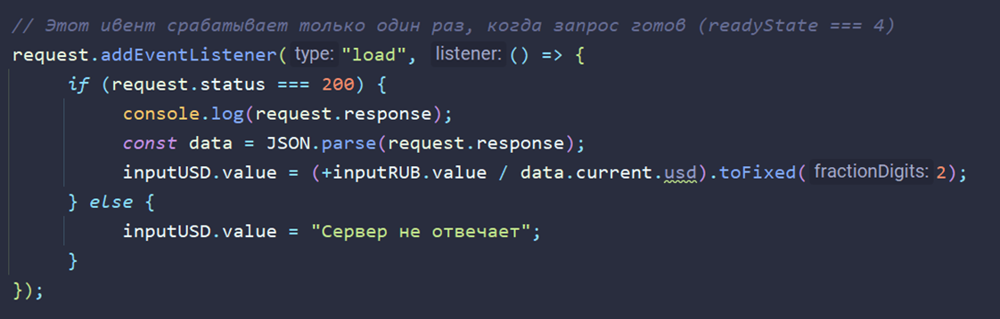
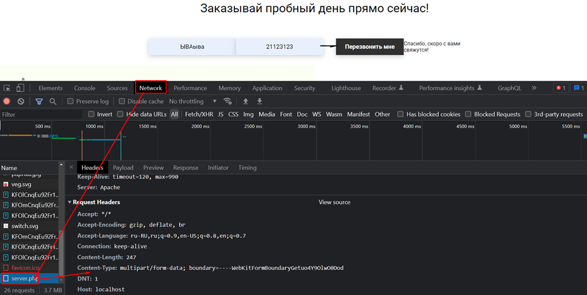
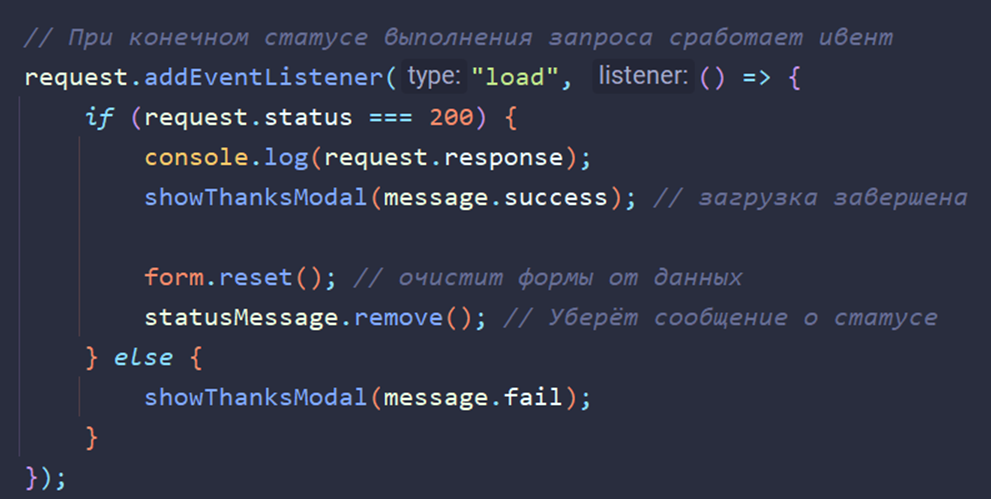
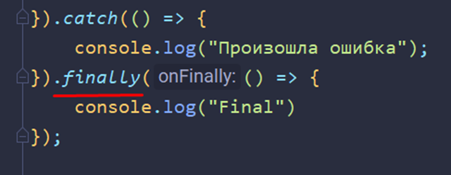
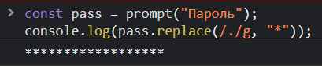
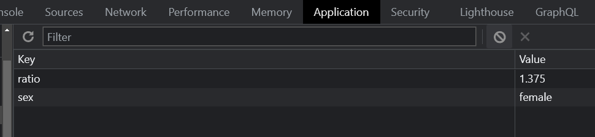
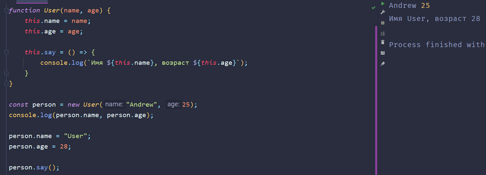

## 001 Локальные сервера

Сервер

HTTP-запросы: `post-` (отправить данные на сервер – отправка введённых данных в форму) и `get`-запросы (получить из google ответ по запросу)

Самыми популярными запросами являются пост-запросы. И зачастую с ними и придётся работать в вебе, так как нам нужно обрабатывать получаемую от пользователя информацию.

Однако тут мы предстаём перед другой проблемой – маленькие локальные сервера (`live-server`, ==prepros==, встроенные мелкие сервера в IDE) не могут обрабатывать запросы, которые мы на них отправляем.

Чтобы работать с запросами с сайта, нам нужно воспользоваться более полноценными локальными серверами. Например, можно скачать Open Server

## 002 JSON формат передачи данных, глубокое клонирование объектов

JSON – более современный формат обмена данными между сервером и клиентом. Он пришёл на смену XML, который был куда более тяжёловесным.

Мы имеем два основных метода. `JSON.parse()` переводит объект в JSON, `JSON.stringify()` возвращает из JSON нужный нам объект

Так же такой подход позволяет сделать глубокое копирование объектов (когда копируются объекты полностью любой вложенности), как тут показано на примере, когда мы меняем значения вложенных объектов


## 003 AJAX и общение с сервером


Технология AJAX (Async JS and XML) используется для динамической генерации контента на странице. Она позволяет интерактивно менять контент, что выглядит красиво и позволяет не перезагружать страницу для изменения контента. Это снижает количество потребляемого трафика (так как грузится только часть страницы, а не вся страница) и снижает нагрузку на сервер


Тут представлен код HTML и слева код – данные с сервера


Получаем инпуты


Два ивента для инпутов:


Три основных метода запросов на сервер

`Open`(`метод`(пост- или гет-запрос), `ссылка на файл запроса`, `асинхронность` (`true`/`false` – изначально стоит в `true`, так как выполняется запрос к серверу и работа страницы асинхронно и это нормально), `логин`, `пароль`)

`get`-запросы можно реализовать даже на простом сервере (тот же *Live Server*)

`setRequestHeader` – отправляет сам json-файл. В него мы вставляем заголовок типа и сам тип

`send` – в данном случае отправляет пустой запрос на получение данных. Однако, если мы будем использовать пост-запрос, то нужно будет в сенд передать отправляемые данные


Так же у нас есть определённые свойства, которые хранит наш реквест:

`status` - Содержит статус нашего [запроса](https://ru.wikipedia.org/wiki/%D0%A1%D0%BF%D0%B8%D1%81%D0%BE%D0%BA_%D0%BA%D0%BE%D0%B4%D0%BE%D0%B2_%D1%81%D0%BE%D1%81%D1%82%D0%BE%D1%8F%D0%BD%D0%B8%D1%8F_HTTP) (404 и тд)
`statusText` - текстовое описание ответа от сервера (OK(200), Not Found(404))  
`response` - ответ от сервера (задаёт бэк-энд разработчик)  
`readyState` - текущее состояние запроса (таблица)


Тут представлен код, который выполняет запрос на сервер, получает данные и обрабатывает их, чтобы вывести данные в инпут


Данный ивент срабатывает при выполнении запроса. Однако выполниться запрос может и с ошибкой, поэтому полностью условие убрать на проверку правильности – не получится. В остальном код работает ровно так же, только уже можно не проверять на полное выполнение запроса



И так выглядит итог


Полный код:


Первый вариант


Второй вариант


## 004 Реализация скрипта отправки данных на сервер


Сейчас нужно будет реализовать ПОСТ-запрос отправку данных на сервер и ответ пользователю

PHP файл будет возвращать данные, которые мы отправляем на сервер (принимает данные с клиента, превратит в строку и вернёт обратно) – это response от сервера


В классической работе браузера (без модификаций через JS) при отправке данных – они перезагружают страницу и показывают отправленные данные в url

Если инпут создан через тег `button`, то его тег `type` автоматически будет иметь `submit`


Самым первым делом мы получим все формы на нашей странице и заранее подготовим ответы пользователю по статусу отправки данных


И дальше нам нужно будет создать фунцию, которая будет отправку наших данных на удалённый сервер. Внутри функции будет располагаться ивент, который будет срабатывать на инпутах формы при сабмите (баттоны изначально имеют в себе такой вшитый атрибут). Обязательно в начале нужно сбросить обычное поведение объекта при срабатывании (чтобы страница не перезагружалась)


Так же отдельно хочется выделить данный функционал. Он позволяет не брать отдельно каждую форму и не перебирать отдельно значения. Данный конструктор позволяет собрать автоматически все данные с формы, которую в него пихнули


> Однако обязательно, чтобы сработал `FormData`, нужно чтобы в инпутах внутри формы были прописаны атрибуты `name=”имя_формы”`


И дальше нам нужно создать ивент листенер внутри функции, который при полной загрузке запроса будет выводить в консоль сам отправленный запрос (для нас), показывать статус отправки для пользователя и очищать формы.

`reset` – сбросит форму
`remove` – удаляет объект со страницы


И в конечном итоге нам нужно применить нашу созданную функцию на все формы (через функцию мы накидываем ивент-листенеры на формы и формируем из них данные)


И сразу при запуске мы встречаемся с непонятной ошибкой, которая нам говорит, что наши данные анонимны и не могут быть обработаны сервером


И тут уже кроется очень важная особенность работы с ПОСТ-запросами. Если мы используем `XMLHttpRequest`, *ПОСТ-запрос* и передаём данные через `FormData`, то *указывать хедер нам нелья*, так как вылезет ошибка




И так же теперь в консоли мы можем увидеть данные


Ну и так же в нетворке можно просмотреть и данные, которые были отправлены на сервер


И так же можно переписать немного код для работы с JSON-данными, а не отправлять через FormatData. Тут уже хедер нам нужно использовать

Так же нужно упомянуть, что PHP не умеет нативно работать с JSON


Вот php-код, который обработает JSON-данные с сервера


- И код работает нормально и ровно так же, как и раньше


Полный код:


## 005 Красивое оповещение пользователя


На сегодня нам нужно сделать красивое оповещение пользователя о загрузке (если она будет долгой).

Первым делом – уберём код с нашего крестика для закрывания модального окна. Мы можем вызвать закрывание прямо внутри условия определения закрытия модального окна (обратиться к крестику через его персональный атрибут `data-close`)


Дальше мы должны превести наше модальное окно в генеративный вариант. То есть мы его должны возвращать с помощью JS. Сохраним оригинал в виде prevModal и скроем его. Дальше уже реализуем саму генерацию этого окна и будем сгенерированное окно вставлять в сам блок кода с модальным окном


И далее применяем нашу функцию



И теперь обе модалки какое-то небольшое время показывают окно диалога


Дальше добавляем наш загрузочный спиннер (это свг-анимация, которую можно добавить как картинку)


И такой код позволит вставить нашу СВГшку после блока форм снизу (чтобы не ломать вёрстку)


## 006 Promise (ES6)


`Promise` (обещание) – это блок кода, который будет выполняться асинхронно относительно другого кода. Промис позволяет избежать **collback-hell** ситуации, когда у нас огромное количество таймаутов и вложенных функций

Это код через `setTimeout`, который не гарантирует нам 100% на выполнение кода и может выдать ошибку


И коротко о том, что такое промисы. Они позволяют реализовать код, который обещают выполнить асинхронно относительно остального кода – они не останавливают выполнение основного потока кода и выполняются параллельно

Промисы создаются через конструктор. Внутрь промиса вкладывается функция, которая принимает в себя два аргумента – `resolve` и `reject`, которые тоже являются функциями. Обе вложенные функции отвечают за возврат значения в разных ситуациях.

`resolve` – возвращает значение, когда функция выполнилась успешно  
`reject` – возвращает значение, когда функция выполнилась с ошибкой

Дальше идёт уже чейновая природа обработки промиса. Мы пишем имя промиса и `then().(много then).catch().(много catch).finally()`. Каждый чейн выполняет свою работу, которую мы для него пропишем. **then** срабатывает, когда `Promise` завершается резолвом и так же резолв передаёт своё значение в этот `then`. `catch` срабатывает, когда промис завершается реджектом и реджект так же передаёт вписанное в него значения в этот `catch`


И опять же про природу чейнов. Мы могли бы полностью прописывать промисы внутри thenов и создавать всё новые и новые промисы. Однако из thenов мы можем возвращать промисы (будет возвращаться значение внутри резолва или реджекта) и данные будут передаваться дальше по цепочке (выполнилось – передалось дальше и так бесконечно)


И основной преймущество, из-за которого мы используем промисы – это их чейновое выполнение. Конкретно тут выполняется сначала первый промис, потом резолв возвращает в then объект. Внутри первого чейна создаём новый промис, который у нас возвращается через ретёрн (возвращается то, что передаёт резолв при выполнении промиса). Дальше у нас идут ещё два чейна, которые выполняют действия последовательно друг за другом


И если у нас выполняется в конце промиса `reject`, то блок кода чейнится в `catch` (вместо `then`)


Чейн `finally` срабатывает при любом исходе промиса (`reject`/`resolve`) и всегда добавляется в конец



Тут пример небольшого промиса для следующих двух методов


И далее идёт так же важная команда, которая позволяет реализовать выполнение кода при выполнении сразу нескольких промисов - `Promise.all`. Например, мы отправили запрос на несколько разных серверов и нам обязательно нужно, чтобы выполнились сразу все нужные запросы


И так же есть метод, который выполняется сразу при выполнении первого промиса – `Promise.race()`


## 007 Fetch API


`fetch` – это конструкция с GET-запросом, которая внутри представляет из себя промис (то есть чейны работают так же как и в промисах)

Стандартно фетч возвращает промис, который выполняется в любом случае (кроме отсутствия интернета)


Чтобы отправить данные на сервер, нужно уже будет немного модифицировать фетч-запрос

Вторым аргументов в фетч передаётся объект с настройками, который заменяет сразу три метода стандартного реквеста. Мы прописываем тип запроса, бади с отправляемыми данными на сервер (например, отправим данные из формы) и тип заголовков (если отправляем JSON)


И сейчас на сайте с едой можно будет заменить все наши `XMLHTTPRequests` на короткий и понятный `fetch`, который в себе содержит все нужные нам реквесты, да ещё и исполняется асинхронно


И как итог мы заменили огромное количество кода с реквестами и данной проверкой


На данную короткую запись


Так же если мы допишем этот короткий участок кода, то мы сможем увидеть текст нашего запроса


Теперь так же можно удалить парсинг объекта и перенести его прямо в фетч


Ну и примерно так выглядит ответ от серера


Ну и так же нужно работать с особенностями фетча. Дело в том, что он не вернёт реджект, даже если у нас проблемы при связи с сервером. Единственное что, так это статус фетча поменяется с ОК на false.

Реджект сработает только при сбое сети / отсутствии интернета


## 008 Методы перебора массивов


И у нас есть основные методы массивов, которые мы можем использовать на постоянной основе

Метод `forEach` – просто выполняет какую-то операцию над каждым объектом в массиве. Сам массив он никак не изменяет
`filter` – позволяет отфильтровать массив по определённому критерию
`map` – перерабатывает массив нужным нам образом и записывает значения в новый массив. Можно записать значения в тот же самый массив, но это уже будет неправильно


`reduce` – самый необычный метод для перебора массива. Через него так же можно создать новый массив. Основная особенность данного метода заключается в том, что в качестве аргумента в него передаётся аккумулятор (переменная, которая сохраняет своё значение на каждую итерацию) и новый элемент массива.

В первом случае мы подсчитали сумму массива. Во втором сумму с начальным элементом для аккумулятора (задаётся через запятую – тут 3). В третьем методе подсчитали зарплату работников. В четвёртом вывели строку с именами сотрудников (тут показана особенность, что выведется строка без запятой сначала, так как метод выполняет сразу вторую итерацию)


И дальше у нас идут булевые методы, которые позволяют быстро проверить наличие определённого элемента в массиве.

`every` – проверяет, чтобы каждый элемент выполнял определённое условие (все работники с зп больше 100$)
`some` – проверяет наличие хотя бы одного элемента, который удовлетворяет условию (хотя бы один работник с зп больше 1000$)


И далее у нас идёт пример: пришёл ответ от сервера и нам нужно отсортировать ответ так, чтобы остались только люди

Первым делом можно перевести объект в массив массивов (чтобы была возможность сортировки)


Дальше фильтруем массив и оставляем только персон


И уже в конце трансформируем массив так, чтобы в нём остались только люди (под нулевым индексом)


## 009 Подробно про npm и проект. JSON-server


Для использования npm в проекте, сначала нужно инициализировать этот проект

```bash
npm init

npm i json-server --save-dev
```


Чтобы не загружать на облако папку с модулями, можно её добавить в гитигнор


Так же если перед нами встанет такая ситуация, когда нам нужно будет установить нод-модули для проекта, у которого есть только json с зависимостями, то нужно прописать

```bash
npm i
```


Если мы напишем запрос именно к нашей базе данных, то мы будем получать все данные со страницы сразу, но в реквестах ничего не будет (так как там отображаются пост-запросы)


Чтобы активировать установленный `json-server` на ПК, нужно прописать

`json-server ссылка_на_датабазу`

И дальше вставить одну из ссылок на ресурсы (нам расширение сразу выдаёт ссылки на данные)


Ну и так же в расширении будет прописываться скорость выполнения запроса и сам запрос. Уже в браузере будет возвращаться не огромный объект, а конкретный массив


## 010 Получение данных с сервера. AsyncAwait (ES8)


В данном уроке нужно заменить отображение карточек на сайте с самостоятельного их создания через свои аргументы на создание по аргументам, полученным с сервера (а именно с нашей базы данных)


Ну и далее нашу датабазу нужно поместить в корень проекта и отдельно запустить json-server, чтобы работать с этой датабазой


И дальше нам нужно заменить фетч-запрос в нашем `postData`, чтобы мы могли запрашивать разыне данные по определённым параметрам.

Для этого сначала переименуем нашу основную функцию и сам пост данных забьём в отдельную функцию, внутри которой и будем вызывать фетч. Результат фетча (это промис) будем сразу переводить в JSON


И дальше мы встречаемся с проблемой. `Promise` – это асинхронный код, который выполняется вне основного потока функции. Поэтому на момент возвращения результата мы получим `error`, так как `res` будет равен `undefined`. Чтобы решить проблему, нужно превратить код в синхронный, чтобы `return` дождался выполнения промиса


И далее нам приходит на помощь конструкция `async`/`await`. Она работает примерно по такому принципу:

`async` говорит, что в функции есть асинхронные функции (промисы), а уже сам `await` говорит этой функции, что это и есть асинхронная функция и что её результата выполнения нужно дождаться, прежде чем выполнять код дальше. То есть выполнение кода остановится до получения любого результата этой функции

Так же `await` можно накинуть и на метод, который переводит промис в json (так как неизвестно насколько большой ответ от сервера придёт)


Примерно так выглядит итоговый запрос. Ссылка взята из `json-server` и перевод данных в текст убран (самый первый чейн)


И такой ответ от сервера мы получаем


И самая прикольная вещь тут – это наш первый постинг данных на сервер с записью ответа в датабазу


Ну и далее мы можем немного заменить такой формат записи данных из формдаты в объект


Мы можем это реализовать через метод `entries`, который переводит свойства объекта в массивы


И поэтому мы сейчас выполним такую комбинацию:
1) Сначала `formData` переведём в массив массивов (можно записать и `Object.entires(formData)`)
2) Потом переведём через `Object.fromEntires()` этот массив массивов в обычный объект
3) Потом через `stringify` переведём объект в json-формат данных
4) Передадим переменную с джсоном в `postData`


Дальше переходим ко второй части, где мы должны заменить генерацию наших карточек из собственных запросов и генераций.

Тут нам нужны простые гет-запросы, поэтому оставляем только ссылку.

Дальше нам нужно решить проблему с тем, что `fetch` может вернуть `error`. `catch` нам недоступен, так как он вызывается только при отсутствии интернета. Делается это просто. У `fetch` есть свойство «`ok`» и нам нужно проверить, что если он отрицательный, то нам нужно будет выдать ошибку. В ошибке можно указать ещё и свойство статуса фетча


И дальше нам нужно выполнить наш запрос. При отправке запроса на сервер, мы получаем всю нашу дадабазу.

Затем в `then` обрабатываем наш запрос. Все данные (само меню) хранятся в массиве (массив объектов, где объект - менюшка), поэтому нужно будет перебрать полученную дату через `forEach`.

В переборе мы не передаём `item`, а сразу можем деструктуризировать полученный элемент на отдельные свойства, чтобы было проще (чтобы не обращаться постоянно `item.img`, `item.altimg` и так далее)


Так же можно таким способом реализовать рендер элементов на странице – не через наш созданный класс, а через функцию, которая принимает в себя массив карточек


## 011 Дополнительно Что такое библиотеки. Библиотека axios


Часть про библиотеки: вставляем все библиотеки над нашим скриптом, чтобы при выполнении логики основного файла, он смог ссылаться на эту библиотеку


А сейчас про библиотеку `axios`: [https://github.com/axios/axios](https://github.com/axios/axios). Это библиотека, основанная на промисах и позволяющая быстро писать пост- и гет-запросы на сервер

Сразу нужно сказать, что если мы вставили `axios` ссылкой в HTML, то импортить его не нужно – это и будет ошибкой


Пишем данный коротенький запрос и получаем на выходе конечный объект, конвертация в нужный тип, расширенные свойства и проверка на ошибки – из коробки

Все полученные данные хранятся в `data`


И вот такой код заменит нам то, что мы делали в прошлом уроке. Тут мы получили сразу нужные данные и сразу же их и вывели


## 012 Создаем слайдер на сайте. Вариант 1 - простой


Простой вариант создания слайдера:

```JS
// Получаем массив слайдеров и стрелочки
const slides = document.querySelectorAll(".offer__slide"),  
      prev = document.querySelector(".offer__slider-prev"),  
      next = document.querySelector(".offer__slider-next");  
// Получаем доступ к номерам слайдеров
const currentSlide = document.querySelector("#current"),  
      totalSlides = document.querySelector("#total");  
// Будем менять индекс выводимых слайдеров
let slideIndex = 1;  

// Выводим первый слайд
showSlides(slideIndex);  

// Будем менять номер слайдера по идентификатору
function showSlideIndex(slideIdentifier, slideDependency) {  
    if (slides.length < 10) {  
        slideIdentifier.textContent = `0${slideDependency}`;  
    } else {  
        slideIdentifier.textContent = slideDependency;  
    }
}  

// Выводим общее количество слайдеров
showSlideIndex(totalSlides, slides.length);  

// Тут уже реализовано отображение слайдов
function showSlides(n) {  
    // Проверяем границы значений слайдов  
    if (n > slides.length) {  // После последнего слайда выводим первый
        slideIndex = 1;  
    }  
    if (n < 1) {  // Если тыкнем меньше первого слайда, то выведем последний слайд
        slideIndex = slides.length;  
    }  
    
    // Скрываем все слайды  
    slides.forEach(item => item.style.display = 'none');  

	// Отображаем слайдер по индексу
    slides[slideIndex - 1].style.display = 'block'; // так же можем поставить ""  

	// Отображаем номер текущего слайда 
    showSlideIndex(currentSlide, slideIndex);  
}  

// Тут мы будем менять отображаемый слайдер через вызов показа слайдов и изменение самого индекса
function changeSlides(n) {  
    showSlides(slideIndex += n);  
}  

// Триггер для показа предыдущего слайда
prev.addEventListener("click", () => {  
    changeSlides(-1)  
});  

// Триггер для следующего слайда
next.addEventListener("click", () => {  
    changeSlides(1);  
})
```


## 013 Создаем слайдер на сайте. Вариант 2 - более сложный


Опишем немного логику нашего слайдера. Самый внешний слайдер теперь будет не просто оболочной для наших слайдов - он будет просто окошком для просмотра слайдов. Ему мы зададим `overflow:hidden`. Дальше у нас идёт inner оболочка, которая будет в ширину равняться сразу всем слайдерам и будет занимать 400% от слайда на странице (400%, так как слайдов 4 штуки)

```HTML
<div class="offer__slider-wrapper">  // Окошко
    <div class="offer__slider-inner">  // Добавили обёртку
        <div class="offer__slide">  
              
        </div>  
        <div class="offer__slide">  
              
        </div>  
        <div class="offer__slide">  
              
        </div>  
        <div class="offer__slide">  
              
        </div>  
    </div>  
</div>
```

```JS
const slides = document.querySelectorAll(".offer__slide"),  
      prev = document.querySelector(".offer__slider-prev"),  
      next = document.querySelector(".offer__slider-next"),  
      total = document.querySelector("#total"),  
      current = document.querySelector("#current"),  
      slidesWrapper = document.querySelector(".offer__slider-wrapper"),  
      slidesField = document.queryав
// Через регулярные выражения получаем ширину слайда  
const width = +sourceWidth.match(/\d/g).reduce((acc, val) => {  
    return acc += val; // собираем все значения массива в один  
});  
  
let slideIndex = 1;  
let offset = 0; // Определяет длину прокрутки внутри slidesField  
  
// Выводим общее количество слайдов
if (slides.length < 10) {  
    total.textContent = `0${slides.length}`;  
    current.textContent = `0${slideIndex}`;  
} else {  
    total.textContent = slides.length;  
    current.textContent = slideIndex;  
}  
  
slidesField.style.width = 100 * slides.length + "%";// Зададим карусельному блоку ширину во все слайды  
slidesField.style.display = "flex"; // Расположим слайды вдоль
slidesField.style.transition = "all .5s"; // Настроим анимацию для всех трансформаций внутри блока (тут - перемещение слайда)  
  
slidesWrapper.style.overflow = "hidden"; // Скрывает все слайды за границами окошка
  
// Задаём всем слайдам одну ширину  
slides.forEach(slide => {  
    slide.style.width = width;  
})  
  
next.addEventListener("click", () => {  
    // Перемещение слайда вперёд
    if (offset === width * (slides.length - 1)) {  
        offset = 0;  
    } else {  
        offset += width;  
    }  
    slidesField.style.transform = `translateX(-${offset}px)`;  

	// Выводим номер слайда
    if (slideIndex === slides.length) {  
        slideIndex = 1;  
    } else {  
       slideIndex++;  
    }  
    if (slides.length < 10) {  
        current.textContent = `0${slideIndex}`;  
    } else {  
        current.textContent = slideIndex;  
    }
});  
  
prev.addEventListener("click", () => {  
    // Перемещение слайда назад
    if (offset === 0) {  
        offset = width * (slides.length - 1);  
    } else {  
        offset -= width;  
    }  
    slidesField.style.transform = `translateX(-${offset}px)`;  

	// Выводим номер слайда
    if (slideIndex === 1) {  
        slideIndex = slides.length;  
    } else {  
        slideIndex--;  
    }  
    if (slides.length < 10) {  
        current.textContent = `0${slideIndex}`;  
    } else {  
        current.textContent = slideIndex;  
    }
});
```


## 014 Создаем навигацию для слайдов


Индикаторы слайдов сделаем через CSS и JS. Без дополнительных иконок. 

```CSS
.carousel-indicators {  
   position: absolute;  
   right: 0;  
   bottom: 0;  
   left: 0;  
   z-index: 15;  
   display: flex;  
   justify-content: center;  
   margin-right: 15%;  
   margin-left: 15%;  
   list-style: none;  
}  
  
.dot {  
   box-sizing: content-box;  
   flex: 0 1 auto;  
   width: 30px;  
   height: 6px;  
   margin-right: 3px;  
   margin-left: 3px;  
   cursor: pointer;  
   background-color: #fff;  
   background-clip: padding-box;  
   border-top: 10px solid transparent;  
   border-bottom: 10px solid transparent;  
   opacity: .5;  
   transition: opacity .6s ease;  
}
```

И вот сам код слайдера:

```JS
const slides = document.querySelectorAll(".offer__slide"),  
      slider = document.querySelector(".offer__slider"), // Добавляем сам слайдер, чтобы относительно него спозиционировать точки  
      prev = document.querySelector(".offer__slider-prev"),  
      next = document.querySelector(".offer__slider-next"),  
      total = document.querySelector("#total"),  
      current = document.querySelector("#current"),  
      slidesWrapper = document.querySelector(".offer__slider-wrapper"),  
      slidesField = document.querySelector(".offer__slider-inner");  
  
const sourceWidth = window.getComputedStyle(slidesWrapper).width;// Получаем ширину окошка прямо из посчитанных стилей  
// Через регулярные выражения получаем ширину слайда  
const width = +sourceWidth.match(/\d/g).reduce((acc, val) => {  
    return acc += val; // собираем все значения массива в один  
});  
  
let slideIndex = 1;  
let offset = 0; // Определяет длину прокрутки внутри slidesField  
  
  
if (slides.length < 10) {  
    total.textContent = `0${slides.length}`;  
    current.textContent = `0${slideIndex}`;  
} else {  
    total.textContent = slides.length;  
    current.textContent = slideIndex;  
}  
  
slidesField.style.width = 100 * slides.length + "%";// Зададим карусельному блоку ширину во все слайды  
slidesField.style.display = "flex";  
slidesField.style.transition = "all .5s";  
  
slidesWrapper.style.overflow = "hidden";  
  
// Задаём всем слайдам одну ширину  
slides.forEach(slide => {  
    slide.style.width = width;  
})  
  
// Делать точки будем полностью через JS  
slider.style.position = "relative"; // Родитель должен иметь relative  
const indicators = document.createElement("ol"),  
      dots = []; // создаём истинный массив элементов  
indicators.classList.add("carousel-indicators");  
indicators.style.cssText = `  
    position: absolute;    
    right: 0;    
    bottom: 0;    
    left: 0;    
    z-index: 15;    
    display: flex;    
    justify-content: center;    
    margin-right: 15%;    
    margin-left: 15%;    
    list-style: none;
`;  
slider.append(indicators);  
  
for (let i = 0; i < slides.length; i++) {  
    const dot = document.createElement("li");  
    dot.setAttribute("data-slide-to", i + 1); // устанавливаем (атрибут, значение атрибута)  
    dot.style.cssText = `  
        box-sizing: content-box;        
        flex: 0 1 auto;        
        width: 30px;        
        height: 6px;        
        margin-right: 3px;        
        margin-left: 3px;        
        cursor: pointer;        
        background-color: #fff;        
        background-clip: padding-box;        
        border-top: 10px solid transparent;        
        border-bottom: 10px solid transparent;        
        opacity: .5;        
        transition: opacity .6s ease;    
    `;  
    if (i === 0) {  
        dot.style.opacity = 1;  
    }    
    indicators.append(dot); // добавляем на каждой итерации точку  
    dots.push(dot); // и сразу пушим точки в массив  
}  
  
// Активируем точку определённого слайда  
function activateDot() {  
    dots.forEach(dot => dot.style.opacity = ".5");  
    dots[slideIndex - 1].style.opacity = 1;  
}  
  
// Вынесем корректировку числа слайдеров вовне  
function checkToZero() {  
    if (slides.length < 10) {  
        current.textContent = `0${slideIndex}`;  
    } else {  
        current.textContent = slideIndex;  
    }
}  
  
// Так же вынесем создание оффсета  
function createOffset(offset) {  
    slidesField.style.transform = `translateX(-${offset}px)`;  
}  
  
next.addEventListener("click", () => {  
    if (offset === width * (slides.length - 1)) {  
        offset = 0;  
    } else {  
        offset += width;  
    }  
    createOffset(offset);  
  
    if (slideIndex === slides.length) {  
        slideIndex = 1;  
    } else {  
       slideIndex++;  
    }  
    checkToZero();  
    activateDot();  
});  
  
prev.addEventListener("click", () => {  
    if (offset === 0) {  
        offset = width * (slides.length - 1);  
    } else {  
        offset -= width;  
    }  
    createOffset(offset);  
  
    if (slideIndex === 1) {  
        slideIndex = slides.length;  
    } else {  
        slideIndex--;  
    }  
    checkToZero();  
    activateDot();  
});  
  
// Функциональность точек  
dots.forEach(dot => {  
    dot.addEventListener("click", (e) => {  
        // Получаем атрибут слайдера, на который мы тыкнули  
        const slideTo = e.target.getAttribute("data-slide-to");  
        slideIndex = slideTo; // Индекс = текущему слайдеру с таргета  
        offset = width * (slideTo - 1); // считаем оффсет относительно тыкнутого слайдера  
        createOffset(offset);  
  
        if (slides.length < 10) {  
            current.textContent = `0${slideIndex}`;  
        } else {  
            current.textContent = slideIndex;  
        }  
  
        activateDot();  
    })
});
```


## 015 Как сохранить данные без БД. Работа с localStorage


> [!Info] `localStorage`- это свойство объекта `Window`, которое хранит в себе данные и сохранено в браузере пользователя. Оно позволяет сохранить данные даже после перезагрузки страницы

>[!Note] Пример использования: 
> 1) Запомнить время, на котором пользователь остановился
> 2) Запомнить введённые данные в поля
> 3) Запомнить настройки сайта (тёмная/светлая тема)

> Однако нужно отметить, что нам доступно только 5 мб информации

И вот пример того, как мы можем закинуть данные в локальное хранилище данных через `localStorage.setItem('ключ', значение)`. В браузере мы можем просмотреть настройки во вкладке Application

```JS
localStorage.setItem('number', 5);
```


И так же через `getItem()` мы можем получить нужную нам строку

```JS
localStorage.setItem('string', 'some long string in this life');
console.log(localStorage.getItem('string'));
```


А уже таким образом мы можем удалить ненужное нам значение

```JS
localStorage.removeItem('string');
```

Уже эта команда полностью очищает локальное хранилище

```JS
localStorage.clear();
```

Через этот код мы реализовали сохранение галочки на странице. Теперь при перезагрузке она остаётся в позиции checked

```JS
'use strict';

const checkbox = document.querySelector('#checkbox'),
      form = document.querySelector('form'),
      change = document.querySelector('#color');
      
// Проверим, есть ли наша запись при пезагрузке страницы
if (localStorage.getItem('isChecked')) { // если будет отсутствовать, то = null, а null === false
    checkbox.checked = true;
}

// Создадим новую запись в localStorage на клике галочки
checkbox.addEventListener('change', () => {
    localStorage.setItem('isChecked', true);
});
```


А тут уже показана реализация изменения цвета формы по листенеру и сохранение этих настроек даже после перезагрузки. Цвет можно убрать только нажав ещё раз по кнопке

```JS
// Проверка на наличие цвета
if (localStorage.getItem('bg') === 'changed') {
    form.style.backgroundColor = 'violet';
}

// Листенер на изменение цвета
change.addEventListener('click', () => {
    if (localStorage.getItem('bg') === 'changed') {
        localStorage.removeItem('bg');
        form.style.backgroundColor = '#fff';
    } else {
        localStorage.setItem('bg', 'changed');
        form.style.backgroundColor = 'violet';
    }
});
```


Ну и так же в localStorage мы можем закинуть объект (но только уже стрингифайнутый в JSON)

```JS
const person = {
    name: 'Alex',
    age: 18
}

const serializedPerson = JSON.stringify(person);

localStorage.setItem('alex', serializedPerson);
```


Ну и так же спокойно мы можем получить это значение с сайта


## 016 Регулярные выражения


Где используются? Для работы со строками: удаление, замена части слов, ограничить ввод *определённых* знаков,  для поиска определённой буквы или сочетания букв в строке и так далее.

Регулярные выражения состоят из паттерна и флага. Записываются паттерны так: /паттерн/флаги.

Пример записи флагов выглядит так: всегда записываем сам паттерн и затем уже его флаги

```JS
new RegExp("pattern", "flags"); // редко используется
/pattern/flags; // используется часто
```

И тут мы в переменной *answer* через метод `search()` ищем *pattern* внутри ответа. Метод поиска вернёт нам индекс, где в слове находится паттерн. 
Тут 0 - A, 1 - n, ищем мы - n


При отсутствии нужного значения, получим "`-1`"


Флаги: 
- `i` – пытаемся найти что-то вне зависимости от регистра
- `g` – пытаемся найти сразу несколько вхождений
- `m` – многострочный режим

И теперь мы можем попробовать вывести сразу несколько значений вне зависимости от регистра. Для этого мы должны будем поменять метод (`search` находит всегда только первое вхождение) на `match()`, который возвращает массив значений. А так же прописать нужные флаги (в любом порядке)

```JS
const answer = prompt("Имя?");
const pattern = /n/igm;
console.log(answer.match(pattern));
```


Если внутрь регулярного выражения поместить точку, то это означает, что мы берём все значения из переменной. Конкретно сейчас мы воспользуемся методом `replace()`, который заменит все символы, которые мы в нём укажем

```JS
const pass = prompt("Пароль");
console.log(pass.replace(/./g, "*"));
```



Так же мы можем экранировать точку и выделять только её. Делаем это мы, потому что точка - это зарезервированный спецсимвол

```JS
const pass = prompt("Пароль");

console.log(pass.replace(/\./g, "*"));
```


Кроме точки у нас есть ещё много разных зарезервированных спецсимволов: `|`, `\`, `/`, `^`, `&`

И вот пример прямого использования строкового метода. Тут мы можем непосредственно и быстро изменять нужный нам текст. 


Дальше пойдут методы, которые непосредственно относятся к паттернам. Все прошлые относились к строкам. 
Метод `test()` вернёт `boolean` значение. Отвечает за поиск паттерна в слове


Так же перед нами может встать задача, которая будет заключаться в поиске значений определённого типа. Например, поиск чисел или слов. Для этого используются классы:

```JS
\d // - digits - числа
\w // - words - слова
\s // - spaces - пробелы
```

И вот пример поиска чисел:


Так же мы можем вписать заборчик из того паттерна, который нам нужно найти. 
Тут мы уже ищем слово, которое совпадает под наш паттерн


Так же у нас имеются обратные классы, которые ищут НЕ_тип

```JS
\D // Ищет НЕ цифры
\W // НЕ буквы
\S // НЕ пробелы
```

Пример поиска НЕ цифр:


==Дальше уже перейдём в наш проект==

Напомню, что мы получаем свойство ширины из компутированных стилей в браузере. Тут мы получаем строку '`560px`'

```JS
const sourceWidth = window.getComputedStyle(slidesWrapper).width;
```

Это первый вариант получения чисел из полученного массива. Тут мы складываем все полученные числа через `reduce`

```JS
const width = +sourceWidth.match(/\d/g).reduce((acc, val) => {  
    return acc += val;
});
```

А вот второй вариант. Тут мы все НЕ числа заменяем на пустую строку и переводим полученный результат в число

```JS
const width = +sourceWidth.replace(/\D/g, '');
```


## 017 Создаем калькулятор на сайте, часть 1


Берём наш HTML-код:

```HTML
// Кнопки женщины и мужчины
<div class="calculating__choose" id="gender">  
    <div id="female" class="calculating__choose-item calculating__choose-item_active">Женщина</div>  
    <div id="male" class="calculating__choose-item">Мужчина</div>  
</div>

// Кнопки активности жизнедеятельности
// Через data-ratio мы задаём коэффициент для формулы в JS
<div class="calculating__subtitle">  
    Выберите вашу физическая активность  
</div>  
<div class="calculating__choose calculating__choose_big">  
    <div data-ratio="1.2" id="low" class="calculating__choose-item">Низкая активность </div>  
    <div data-ratio="1.375" id="small"  class="calculating__choose-item calculating__choose-item_active">Невысокая активность</div>  
    <div data-ratio="1.55" id="medium" class="calculating__choose-item">Умеренная активность</div>  
    <div data-ratio="1.725" id="high" class="calculating__choose-item">Высокая активность</div>  
</div>
```

И сама реализация нашего калькулятора:

```JS
const result = document.querySelector(".calculating__result span");  
// Задали значения по умолчанию, чтобы всё работало без клика по кнопкам  
let sex = "female",  
    weight, height, age,  
    ratio = 1.375;  
  
// Калькулятор результата ккал в день  
function calcTotal() {  
    if (!sex || !height || !weight || !age || !ratio) {  
        result.textContent = "----";  
        return; // досрочно прервёт функцию  
    }  
  
    if (sex === "female") {  
        result.textContent = Math.round((447.6 + (9.2 * weight) + (3.1 * height) - (4.3 * age)) * ratio);  
    } else {  
        result.textContent = Math.round((88.36 + (13.4 * weight) + (4.8 * height) - (5.7 * age)) * ratio);  
    }}  
  
// Активирует эффект нажатой кнопки  
function getStaticInformation(parentSelector, activeClass) {  
    const elements = document.querySelectorAll(`${parentSelector} div`);  
  
    elements.forEach(elem => {  
        elem.addEventListener("click", (e) => {  
            if (e.target.getAttribute("data-ratio")) {  
                ratio = +e.target.getAttribute("data-ratio"); // вытаскиваем значение активности из атрибута  
            } else {  
                sex = e.target.getAttribute("id");  
            }  
  
            elements.forEach(elem => {  
                elem.classList.remove(activeClass);  
            });  
  
            e.target.classList.add(activeClass);  
  
            calcTotal();  
        });  
    });  
}  
  
// Каждый раз при вводе данные будут записываться в нужный идентификатор  
function getDynamicInformation(selector) {  
    const input = document.querySelector(selector);  
  
    input.addEventListener("input", () => {  
        switch(input.getAttribute("id")) {  
            case "height":   
height = +input.value;  
                break;  
            case "weight":  
                weight = +input.value;  
                break;  
            case "age":  
                age = +input.value;  
                break;  
        }  
  
        calcTotal();  
    });  
}  
  
calcTotal();  
getStaticInformation("#gender", "calculating__choose-item_active");  
getStaticInformation(".calculating__choose_big", "calculating__choose-item_active");  
getDynamicInformation("#height");  
getDynamicInformation("#weight");  
getDynamicInformation("#age");
```


## 018 Создаем калькулятор на сайте, часть 2


Сначала сделаем проверку на вводимые значения в наши поля


При обращении к `localStorage`, мы сохраняем выбор пользователя в локальное хранилище, чтобы при перезагрузке сохранить эти значения


И немного перепишем задание наших переменных по умолчанию. Конкретно тут мы будем хранить наши значения в локальном хранилище и каждый раз при стирании их из локального хранилища (очистка кэша сайтов), у нас будут загружаться эти значения




И вот сама функция, которая будет реализовывать у нас сохранение положения активных классов при перезагрузке страницы


## 019 Геттеры и сеттеры (свойства объектов)


Свойства объектов делятся на две группы: свойства данные и свойства акцессоры. Свойства акцессоры так называются именно потому, что при вызове не ставятся круглые скобки – подразумевается, что мы обращаемся к свойству-методу

Реализуются свойства акцессоры через функции, которые начинаются с `get` и `set`. Такой функционал может напоминать шарп. Данные функции позволяют задать функционал отображения и задания свойства в объекте. Если написать гет, то через него мы получаем свойство. При использовании сета, мы задаём новое значение свойства. Если сет не написать, то и задать через эту функцию не получится.

Данные методы позволяют реализовать интерфейс задания и получения данных, а так же являются частью инкапсуляции (через них и получится инкапсулировать данные в объекте)


## 020 Инкапсуляция


Вот пример функции-конструктора, который создаёт нам персонажа. Тут мы легко можем поменять переменные внутри пользователя



Однако если мы создадим переменную, то она станет недоступна для просмотра извне, но останется вполне себе изменяемой


Дальше у нас идут собственные геттеры и сеттеры. Это методы, которые реализуют наш вывод данной переменной во внешнюю среду


Так же мы можем переписать наш код на классы. Однако тут встаёт проблема, которая запрещает нам использовать простые переменные в конструкторе (`let`) и теперь опять наши переменные можно просто увидеть и изменить извне без геттеров и сеттеров


По соглашению о наименовании переменных, если переменная начинается с нижнего подчёркивания (например, `_age`), то эту переменную **нельзя** изменять


И вот через сеттер age мы можем добавить нужное нам значение возраста


Однако у нас до сих пор есть возможность менять переменную, которую мы можем получить через геттеры и сеттеры. Есть возможность инкапсулировать значения полностью, но это уже экспериментальная технология

Так же можно инкапсулировать нормально значения в TypeScript


Через решётку создаётся приватное поле класса. Оно создаётся вне конструктора, чтобы можно было обратиться к нему везде.

Так же он выполняет нужную нам функцию – не выходит за пределы класса. Его можно только просмотреть через метод (при обычном вызове будет `undefined`). Поменять извне – не получится


И вот реализация геттера и сеттера для приватного поля класса


## 021 Прием модуль, как и зачем его использовать


**Проблема**: иногда, при использовании сторонних библиотек, мы можем сталкиваться с проблемой, что мы создаём переменную, которая уже присутствует в библиотеке. Такие конфликты происходят в основе своей из-за того, что мы почти постоянно находимся в глобальной области видимости

Моделируем ситуацию:

```HTML
<script defer src="lib.js"></script>
<script defer src="script.js"></script>
```


Как итог, мы получаем вот такую вот ошибку:


Один из способов решения проблемы: использовать IIFE функцию. Она создаёт локальную область видимости и исключает соударения с глобальной

```JS
(function() {  
    const a = 22;
}());
```

И тут нужно показать пример, который создаст для нас отдельный модуль, через который можно будет вызывать нужные для нас функции

```JS
const user = (function() {  
    const private = function () {
        console.log('I\'m a private');
    }
    
    return {
        sayHello: private
    };
}());

user.sayHello(); // I'm a private
```


## 022 Webpack. Собираем наш проект


Все большие проекты на JS разбиваются на различные блоки кода и эти блоки кода убирают в отдельные файлы. Дробление проекта на отдельные модули позволяет нам нормально поддерживать проект и делить логику на составные части. 
Однако мы встречаемся с той проблемой, что браузеры не понимают деление проекта на модули и поэтому за помощью нам нужно обращаться к сборщикам модулей, которые создадут один файл из множества маленьких. И уже этот единственный файл браузер сможет обработать и смочь с нам работать 

==Webpack== - это сборщик модулей. Он позволяет нам собрать проект, состоящий из большого количества отдельных файлов с экспортами и импортами.

==Gulp== - это планировщик задач. Он выполняет определённые задачи при наших определённых действиях. Например, он может компилировать препроцессоры при сохранении кода

Вот пример импорта и экспорта с использованием ==CommonJS==:

```JS
// lib.js - export

"use strict";

function myModule() {
    this.run = function() {
        console.log('run');
    };

    this.go = function() {
        console.log('go');
    };
}

module.exports = myModule; // exports
```
```JS
// script.js - import

const myModule = require('./lib'); // import

const myModuleInstance = new myModule();
myModuleInstance.run(); // run
```

Установка ==Webpack==:

```bash
mkdir webpack-demo
cd webpack-demo
npm init
npm install webpack webpack-cli --save-dev

// Либо
npm install // установит все зависимости из package.json
```

Для запуска паковщика модулей:

```bash
npx webpack
```

Дальше нужно перейти к настройке конфигурации вебпака:
- `mode` - девелопментом пользуемся, когда нужно просто работать над сайтом, а ставим продакшн, когда выпускаем сайт на продакшен (там будут модули для оптимизации кода)
- `entry` - указываем точку входа в программу
- `output` - настраивает выходной файл
- `watch` - следит за файлами и пересобирает проект при каждом изменении
- `devtool` - определяет логику сохранения карты расположения кода (лучше чекнуть документацию)
- `module` - устанавливает дополнительные модули (например, ==babel==)


```JSON
'use strict';

let path = require('path');

module.exports = {
  mode: 'development', // or production
  entry: './js/script.js', // входная точка
  output: {
    filename: 'bundle.js', // название выходного файла
    path: __dirname + '/js' // путь до него
  },
  watch: true,
  devtool: "source-map",
  module: {}
};
```

И вот, что нам даёт карта. Мы можем видеть оригинальный несжатый код


###### И как с этим всем работать?
Нужно весь код, который мы переносим в другой модуль, обернуть в функцию и эту функцию экспортнуть.
В принимаемом файле нужно через require получить и вызывать эту функцию.
Далее просто запускаем `npx webpack` с настройками выше и получаем готовый результат

```JS
function calculator() {  
    const result = document.querySelector(".calculating__result span");
    // ...
}  
  
module.exports = calculator;
```

Ну и в самом HTML подключаем выходной файл

```HTML
<script src="js/bundle.js"></script>
```


При запуске ==Webpack==, он начинает следить за проектом и работает на постоянной основе, поэтому для работы с терминалом, нам нужно запустить второй


Так же мы можем через `Ctrl+C` отключить работу сборщика модулей


## 023 ES6 Modules


==Импорт ES6== - это уже более современный способ импорта данных в файлы. Он обеспечивает более понятный синтаксис импорта, который представляет из себя конструкцию: `export` для экспорта элемента и `import from` для принятия экспорта из другого файла. 
Через `as` мы можем задать другое имя для импортируемого объекта (например, если имена очень длинные)
Если мы используем `export default`, то конкретно этот объект нам не нужно будет заключать в `{ }` при импорте
Ещё одна важная вещь - *модули **ES6** так же как и **CommonJS** нужно собирать сборщиком модулей **Webpack***

```JS
// lib.js - export

"use strict";

export const ex = 4;

const a = 1;
const b = 2;
const c = 3;

export { a, b, c};

export function go() {
    console.log('go');
}

export default class User {
    constructor(name) { console.log(name); }
}
```
```JS
// script.js - import

import User, { a as first, b, c, ex } from './lib'; // импорт 

new User('Andrew'); // Использование

console.log(first);
```

Через запись `* as all` мы импортируем всё под именем `all`. И теперь мы получили объект all, хранящий все экспорты из нужного нам файла

```JS
import * as all from './lib';

console.log(all.a); // 1
```

Интересная особенность дефолтного экспорта заключается в том, что под капотом он выглядит при импорте так: 

```JS
import {default as User} from './lib'; // ок - реализован так
import User from './lib'; // ок - выглядит так
```

И теперь мы можем подключить эти модули к браузеру. Можно воспользоваться вебпаком и сделать всё удобно, но так же мы можем обойтись и подключением, которое может сделать браузер.
Для нормальной работы нам нужно:
- `'./lib.js'` указать импорты с правильным наименованием браузера
- В HTML самым последним скриптом указать тот, который собирает все импорты
- Указать атрибут `type="module"` 

```JS
import User, { a as first, b, c, d} from './lib.js';
```
```HTML
<script type="module" src="js/lib.js"></script>
<script type="module" src="js/script.js"></script>
```


## 024 Собираем наш проект и фиксим баги


В первую очередь, нам нужно дефолтно экспортировать наши обёртки и правильно их импортировать (в глобальной области видимости)


Дальше мы встречаемся с такой прописной истиной: все модули должны быть обособлены друг от друга. На нынешний момент времени нам нужно решить проблему с функцией, которая запускается в разных модулях и решить вопрос с переменными

Первым делом вынесем функции, которые нужны в других модулях и экспортнём их.
Дальше для всех функций создадим вызываемость с аргументами

```JS
export function closeModal(modalSelector) {  
    const modal = document.querySelector(modalSelector);  
    modal.classList.toggle("hide");  
    document.documentElement.style.overflow = "";
}  
  
export function openModal(modalSelector) {  
    const modal = document.querySelector(modalSelector);  
    modal.classList.toggle("hide");  
    document.documentElement.style.overflow = "hidden";  
    clearTimeout(modalTimer);  
}  
  
function modal(triggerSelector, modalSelector) {  
    const modal = document.querySelector(modalSelector),  
    modalBtns = document.querySelectorAll(triggerSelector);
    //...
}

export default modal;  
export {openModal, closeModal};
```

Импорт функций

```JS
//forms.js
import {openModal, closeModal} from './modal';
```

Мы встретимся с такой проблемой, что нам нужно добавить аргументы в функцию, которую не вызываем в данный момент времени (которая без `()`)

```JS
modalBtns.forEach(btn => {btn.addEventListener("click", openModal);}); // openModal не имеет ()
```

Для этого функцию с аргументами оборачиваем в колбэк

```JS
modalBtns.forEach(btn => {btn.addEventListener("click", () => openModal(modalSelector));});
```

И тут дальше хочется отметить, что не просто так учили мы методы строк. Мы можем модифицировать переменные и, если наш аргумент селектора немного не подходит, сделать это:

```JS
if (target && target.classList.contains('tabheader__item')) {
```
`tabsSelector = ".tabheader__item"`
```JS
tabs(".tabheader__item", ".tabcontent", ".tabheader__items", "tabheader__item_active");
```
Слайсим переменную и пользуемся ей
```JS
if (target && target.classList.contains(tabsSelector.slice(1))) {
```

Сделаем подобие деструктурированной передачи информации для слайдеров как в ==slickslider== 


И тут мы реализовали передачу аргументов в функцию через деструктуризацию, которая происходит через `{}`. Это даёт нам возможность не передавать какие-либо аргументы (если они не нужны) или передавать их в хаотичном порядке 

```JS
// Реализация в slider.js
function slider({container, slide, nextArrow, prevArrow, totalCounter, currentCounter, wrapper, field}) {  
  
    const slides = document.querySelectorAll(slide),  
        slider = document.querySelector(container), // Добавляем сам слайдер, чтобы относительно него спозиционировать точки  
        prev = document.querySelector(prevArrow),  
        next = document.querySelector(nextArrow),  
        total = document.querySelector(totalCounter),  
        current = document.querySelector(currentCounter),  
        slidesWrapper = document.querySelector(wrapper),  
        slidesField = document.querySelector(field);
```
```JS
// Вызов из script.js
slider({  
    container: ".offer__slider",  
    totalCounter: "#total",  
    currentCounter: "#current",  
    prevArrow: ".offer__slider-prev",  
    nextArrow: ".offer__slider-next",  
    wrapper: ".offer__slider-wrapper",  
    field: ".offer__slider-inner",  
    slide: ".offer__slide"  
});
```

>[!Info] Модульный подход к разработке сайта предоставляет нам возможность 
> - переиспользовать код
> - более эффективно его модифицировать за счёт того, что теперь это не простыня, а отдельные блоки кода


## 025 Формируем портфолио на GitHub

Гитхаб - это не только площадка для постинга репозиториев, но и отличная площадка для отображения своих скилов программиста. Тут мы можем в открытый доступ выкладывать наши приложения для того, чтобы работодатель мог увидеть наши скилы. 
В первую очередь внимание нужно обратить на оформление нашего гита. Нужно фото - желательно с улыбкой, имя и достаточное количество проектов (даже самых малых) + желательно много новых коммитов, которые покажут, что мы активно работаем


## 026 Ошибки. Как избежать “поломки” своего кода


Для обработки ошибок у нас существует стандартная конструкция `try-catch`. Внутрь него вкладываем код, который подозреваем на ошибку и в блоке `catch` пишем обработку нашей ошибки. Так же этот блок принимает в себя параметр ошибки. Из самой ошибки мы можем получить имя, сообщение и стек ошибки. 
Ну и блок `finally`, который необязателен, но позволяет выполнить логику, которая должна обязательно произойти

```JS
try { // проверяемый блок кода
    console.log('work');
    throw new Error('Some error');
} catch(e) { // Если ошибка
    console.log(e.name + ' - error name');
    console.log(e.message + ' - error message');
    console.log(e.stack + ' - error stack');
} finally { // блок кода, который выполняется в любом случае
    // Завершаем какую-то операцию
}

console.log('that\'s works!');
```


Для чего, например, может использоваться такой подход в повседневной работе?
У нас есть функция, которая подключена сразу к двум документам. Эта функция из одного из них берёт информацию и обрабатывает её. Если на первой странице всё будет нормально, то на второй выйдет ошибка и код дальше работать не будет. 


Уже с таким кодом ничего не будет падать и мы спокойно сможем работать одним скрипт-файлом на нескольких страницах


## 027 (д) Создание своих ошибок


Представим, что нам нужно добавить на страницу несколько блоков с определёнными элементами по тегу и атрибуту
В результате выполнения этого кода у нас будет один элемент без `id`

```JS
'use strict';

// Содержит будущие элементы
const data = [
    {
        id: 'box',
        tag: 'div'
    },
    {
        id: '',
        tag: 'nav'
    },
    {
        id: 'circle',
        tag: 'span'
    }
]

// Выводит эти элементы на страницу
data.forEach(blockObj => {
	// Создаст элемент с определённым тегом
    const block = document.createElement(blockObj.tag);
    // Добавит ему определённый атрибут
    block.setAttribute('id', blockObj.id);
    // Добавит элемент на страницу
    document.body.append(block);
})
```


Однако если мы воспользуемся оператором `throw`, то мы сможем предотвратить ошибку. Этот оператор выдаёт в консоль какое-то сообщение (строку `'string'` или созданную нами ошибку `new Error()`) и останавливает выполнение дальнейшего кода
По итогу мы получим только один элемент

```JS
data.forEach((blockObj, i) => {
    const block = document.createElement(blockObj.tag);

    if (!blockObj.id) throw new Error(`Под индексом ${i} нет данных об id`); // !

    block.setAttribute('id', blockObj.id);
    document.body.append(block);
})
```


Так же есть `SyntaxError`, `TypeError`, `ReferenceError` и другие ошибки, которые можно выделить под определённые предполагаемые ситуации

```JS
const err = new ReferenceError('Ref Err');
console.log(err.name, err.message, err.stack);
```

И вот пример самих сущностей, которые мы получаем при ошибке

```JS
try {
    data.forEach((blockObj, i) => {
        const block = document.createElement(blockObj.tag);
        if (!blockObj.id) throw new SyntaxError(`Под индексом ${i} нет данных об id`);
        block.setAttribute('id', blockObj.id);
        document.body.append(block);
    })
} catch (e) {
    console.error(e.name);
    console.log(e.message);
    console.log(e.stack);
}
```


Так же мы можем дописать логику для непредвиденных ошибок, которые выходят за рамки того, что можно предугадать. Для этого через условие можно прописать в блоке `catch`, какую ошибку мы ожидаем получить, а какая ошибка уже говорит о критических недоработках кода

```JS
'use strict';

const data = [
    {
        id: 'box',
        tag: 'div'
    },
    {
        id: 'had', // нормально
        tag: 'nav'
    },
    {
        id: 'circle',
        tag: '' // другая ошибка
    }
]

try {
    data.forEach((blockObj, i) => {
        const block = document.createElement(blockObj.tag);
        if (!blockObj.id) throw new SyntaxError(`Под индексом ${i} нет данных об id`);
        block.setAttribute('id', blockObj.id);
        document.body.append(block);
    })
} catch (e) {
    if (e.name === 'SyntaxError') { // если моя ошибка
        console.error(e.message); // То вывести сообщение ошибки
    } else throw e; // если ошибка не моя (непредвиденная), то пропустить ошибку
}
```


## 028 Как превратить код ES6+ в старый формат ES5. Babel, Core.js и полифиллы


==Трансплиттер== - это инструмент, который переводит код нового формата в более старый формат, который, например, понятен старым браузерам
==Полифилл== - это участки старого кода, которые эмулируют поведение современных стандартов кода

Использовать в своей работе мы будем ==babel==. Его уже в свою очередь нужно будет подключить к сборщику модулей

```shell
// Установка babel
npm install --save-dev @babel/core @babel/cli @babel/preset-env

// для установки всех полифилов в проект (даже неиспользуемых)
npm install --save @babel/polyfill 

// для работы конфига
npm install --save-dev babel-loader 

// Библиотека, которая оставляет только нужные полифиллы в проекте
npm install --save-dev corejs
```

Это настройка для `package.json,` которая скажет ==babel== для каких браузерв нужно подстраиваться


Это настройки для `webpack.config.js`, которые нужны для ==babel==

```JS
'use strict';

let path = require('path');

module.exports = {
  mode: 'production',
  entry: './js/script.js',
  output: {
    filename: 'bundle.js',
    path: __dirname + '/js'
  },
  watch: true,
  
  devtool: "source-map",

  // Настройка модулей в webpack
  module: {
  // Правила для модулей
    rules: [
      {
        test: /\.m?js$/,
        // Исключаем эти файлы
        exclude: /(node_modules|bower_components)/,
        // работаем с этими модулями
        use: {
	      // Модуль установили чуть выше 
          loader: 'babel-loader',
          // Настройки для этого лоадера
          options: {
	        // Пресеты есть на сайте babel во вкладке Presets
            presets: [['@babel/preset-env', {
                // Вывод полной информации при дебаге
                debug: true,
                // Версия библиотеки для полифилов (corejs)
                corejs: 3,
                // Выбирает только используемые полифиллы
                useBuiltIns: "usage"
            }]]
          }
        }
      }
    ]
  }
};
```

Дальше для активации ==Babel== нам нужно запустить вебпак через `npx webpack`. После компиляции файл может весить до двух раз больше :(

Так же нужно упомянуть, что иногда некоторые полифиллы могут не сработать и из-за этого может полететь функционал на странице. Для исправления ситуации, нужно зайти в гугл и ввести: *<функция> polyfill js*
Например, на том же npm можно найти полифилл для промиса


```shell
// Установка полифилла
npm install es6-promise
```

```JS
// Активация полифилла в проекте
require('es6-promise').polyfill();
```


Так же есть и другой вариант импорта полифиллов. Так же если мы пропишем просто `import 'имя_пакета'`, то он импортнётся из папки модулей 

```shell
npm i nodelist-foreach-polyfill
```


Так же такой вариант импорта работает и для других отдельных полноценных плагинов, которые мы можем просто установить через npm и так импортнуть в проект
> И лучше плагины подключать именно так, так как это всё скомпилируется в один JS файл без кучи других отдельных с разными зависимостями

```JS
import 'slick-slider';
```


## 029 Современные библиотеки и фрэймворки

###### Фреймворки и библиотеки: #Angular #React #Vue 

==Библиотека== - это просто готовые участки кода, которые можно как использовать для быстрого написания какой-то логики, так и не использовать
Библиотека зачастую направлена на решение одной задачи

==Фреймворк== - это уже определённая структура, которая диктует правила, как нужно писать код программисту и заставляет его их придерживаться
Фреймворки позволяют нам создать полноценное приложение прямо из того функционала, который в нём присутствует

Фреймворки позволяют нам создавать #SPA (Single Page Applications), которые, в свою очередь, представляют из себя приложения в браузере. Эти приложения позволяют работать с сайтом как с программой, которая располагается на удалённом компьютере. При этом при переходе в другие вкладки внутри приложения - *страница не перезагружается*.

Что нужно знать, прежде чем изучать фреймворки:
- #Angular
	- #TypeScript 
	- node.js
	- #Webpack
	- MVC pattern
	- Сам фреймворк (документация)
- #React
	- node.js
	- JSX (препроцессор)
	- Babel (компилятор JSX)
	- #Webpack
	- Сам фреймворк (документация)
- #Vue
	- node.js
	- #Webpack
	- Сам фреймворк (документация)

Так же стоит упомянуть о ==jQuery==. Это библиотека, которая используется в большом количестве старых сайтов для создания интерактива. Её просто стоит знать, чтобы понимать, с чем может прийтись работать.

## 030 Библиотека Jquery


Самая простая установка:

```bash
// устанавливаем библиотеку для сайта
npm i jquery --save

// будем компилировать через вебпак, так как будем использовать импорты
npx webpack
```

```JS
import 'jquery';
```

Использование в компилируемом файле:

```JS
import 'jquery';  
import $ from 'jquery'; // Просто чтобы не видеть ошибку в консоли в браузере  
  
// $() - это функция получения элемента со страницы  
const btn = $('#btn');  
  
console.log(btn);
```


Все функции JQuery можно найти [здесь](https://page2page.lohmach.info/index.php5/%D0%97%D0%B0%D0%B3%D0%BB%D0%B0%D0%B2%D0%BD%D0%B0%D1%8F_%D1%81%D1%82%D1%80%D0%B0%D0%BD%D0%B8%D1%86%D0%B0.html).


- `JQuery UI` - это пользовательские модификации
- `Ajax` - это технология запросов, которая была прототипом функции `fetch`, которую добавили уже после 

И вот пример быстрой реализации некоторых анимаций на JQuery:

```JS
import 'jquery';  
import $ from 'jquery';  
  
// ready() - проверяет, что все нужные компоненты со страницы загружены  
$(document).ready(function() {  
    // Выбираем первый элемент из списка list-item'ов  
    // hover() - срабатывание при наведении    $('.list-item:first').hover(function() {  
        // $(this) - обращение к ЭТОМУ элементу  
        $(this).toggleClass('active');  
    });  
    // Обращаемся к третьей кнопке и назначем ей eventListener  
    $('.list-item:eq(2)').on('click', function() {  
        // Обращаемся ко всем чётным элементам (0-1-2-3 - 1, 3)  
        // fadeToggle() - производит скрытие и показ элементов        
        $('.image:even').fadeToggle('slow');  
    })  
    // Обращаемся к пятой кнопке и назначем ей eventListener  
    $('.list-item:eq(4)').on('click', function() {  
        // Обращаемся ко всем нечётным элементам (0-1-2-3 - 0, 2)  
        $('.image:odd').animate({  
            opacity: 'toggle',  
            height: 'toggle'  
        }, 2000);  
    })
});
```


>[!warning] Стоит сказать, что JQuery не стоит использовать в современных проектах. 
> - Лет 10-12 назад он добавлял функционал на сайт, который делать через JS было очень тяжело и долго. Либо добавлял такие функции, которые сделать было просто невозможно из нативного JS.
> - Используем JQuery только для поддержки старых проектов - но не для написания новых!


## 031 Функции-генераторы


Функция-генератор в разные моменты времени выдаёт разные результаты. Первым делом нам нужно присвоить функцию в новую переменную и через эту переменную вызвать методы, которые контролируют поведение функции-генератора. Одним из методов, который вызывают следующее значение является `next()`. Так как этот метод возвращает объект, то мы сразу можем обратиться к нужному нам свойству.

```JS
function* generator() {
    yield 'S'; // Первый вызов
    yield 'b'; // Второй вызов
    yield 'c'; // Третий вызов
    yield 'd'; // Четвёртый вызов
}

const str = generator();

console.log(str.next());
console.log(str.next().value); // сразу получаем значение
console.log(str.next());
console.log(str.next());
console.log(str.next());
```
```shell
{ value: 'S', done: false }
b
{ value: 'c', done: false }
{ value: 'd', done: false }
{ value: undefined, done: true }
```

И вот пример функции-генератора, которая будет при каждом вызове возвращать новое значение

```JS
function* count(n) {
    for (let i = 0; i < n; i++) {
        yield i;        
    }
}

const counter = count(7);

console.log(counter.next().value); // 0
console.log(counter.next().value); // 1
console.log(counter.next().value); // 2
```

Так же конструкция for-of позволяет нам максимальное количество раз перебрать конструкцию функции-генератора

```JS
function* count(n) {
    for (let i = 0; i < n; i++) {
        yield i;        
    }
}

for (const k of count(7)) {
    console.log(k);
}
```


## 032 JS анимации, requestAnimationFrame


Главная проблема CSS-анимаций заключается в том, что построить сложную анимацию крайне сложно. Так же для настройки плавности анимации используются сугубо кривые Безье 

```CSS
p {
  animation-duration: 3s;
  animation-name: slidein;
}

@keyframes slidein {
  from {
    margin-left: 100%;
    width: 300%;
  }

  to {
    margin-left: 0%;
    width: 100%;
  }
}
```

Главная проблема анимаций на JS через тот же `setTimeout` заключается в том, что они не реагируют на частоту кадров пользователя на компьютере. Обычно она составляет 60 кадров в секунду, но ПК пользователя может быть нагружен и не способен выдавать нужное количество кадров в секунду


Поэтому был создан API: `requestAnimationFrame`. Он подстраивается под количество кадров на компьютере пользователя и позволяет реализовать адекватную анимацию. Так же он оптимизирует нашу анимацию (запускает анимацию и производит отрисовку в браузере одновременно, а не последовательно, как в обычных функциях). 

###### Стандартный вариант
Вот так выглядит стоковая анимация через `setInterval`

```JS
const btn = document.querySelector(".animation-button"),  
    box = document.querySelector(".box-rider");

function myAnimation() {  
    const box = document.querySelector(".box-rider");  
    let pos = 0;  
  
    const id = setInterval(frame, 5);  
    function frame() {  
        if (pos === 480) {  
            clearInterval(id);  
        } else {  
            pos++;  
            box.style.top = `${pos}px`;  
            box.style.left = `${pos}px`;  
        }    }  
}  
btn.addEventListener('click', myAnimation)
```

###### Предпочтительный вариант
И вот так выглядит код с использованием `requestAnimationFrame`. Тут мы рекурсивно вызываем функцию по заданному условию, что позволяет нам сократить код и не использовать таймауты. Так же эта анимация и более оптимизирована под браузеры.

```JS
const btn = document.querySelector(".animation-button"),  
    box = document.querySelector(".box-rider");

let pos = 0;  
function myAnimationFrame() {  
    pos++;  
    box.style.top = `${pos}px`;  
    box.style.left = `${pos}px`;  

	// Тут идёт перевызов функции до тех пор, пока не будет выполнено условие
    if (pos < 480) {  
        requestAnimationFrame(myAnimationFrame);  
    }  
}  

// Вызов функции с аргументами в листенерах нужно осуществлять через стрелочные функции
btn.addEventListener('click', () => requestAnimationFrame(myAnimationFrame));
```

Этот код позволит остановить анимацию по нашему усмотрению

```JS
let id = requestAnimationFrame(myAnimationFrame);  
cancelAnimationFrame(id);
```


## 033 Web Animations API


==Web Animations API== - это API, который связывает анимации JS и CSS. То есть в него мы передаём сначала ключевые кадры как в CSS, а уже потом передаём опции, которые влияют на эту анимацию

```JS
animate(keyframes, options)
```

```JS
document.getElementById("tunnel").animate([
  // keyframes
  { transform: 'translateY(0px)' },
  { transform: 'translateY(-300px)' }
], {
  // timing options
  duration: 1000,
  iterations: Infinity
});
```

Этим кодом мы заанимировали бесконечное движение телефона по ограниченным координатам

```JS
const btnPhone = document.querySelector('#iphone'),  
      btnMacbook = document.querySelector('#macbook'),  
      images = document.querySelectorAll('img');  
  
const phoneAnimation = images[0].animate([  
    // keyframes  
    { transform: 'translateY(0)' },  
    { transform: 'translateY(-100px)' },  
    { transform: 'translateY(100px)' },  
    { transform: 'translateY(0)' }  
], {  
    // timing options  
    duration: 3000,  
    iterations: Infinity  
});
```


Анимация имеет 4 состояния (`PlayState`):
- `idle`
- `running`
- `paused`
- `finished`

Тут уже представлена полноценная реализация этой анимации со стейтами паузы, а так же с несколькими изменяемыми свойствами. Это более удобный вариант нежели чем создание такой же анимации через CSS

```JS
const btnPhone = document.querySelector('#iphone'),  
      btnMacbook = document.querySelector('#macbook'),  
      images = document.querySelectorAll('img');  
  
// переменная, которая будет хранить анимацию  
let phoneAnimation;  
// Регулируем анимацию по кнопке  
btnPhone.addEventListener('click', () => {  
    // Запускаем анимацию при нажатии на кнопку  
    if (!phoneAnimation) {  
        phoneAnimation = images[0].animate([  
            // keyframes  
            { transform: 'translateY(0) rotate(0)',  
                filter: 'opacity(100%)'},  
            { transform: 'translateY(-100px) rotate(180deg)',  
                filter: 'opacity(50%)'},  
            { transform: 'translateY(100px) rotate(270deg)',  
                filter: 'opacity(90%)'},  
            { transform: 'translateY(0) rotate(360deg)',  
                filter: 'opacity(100%)'}  
        ], {  
            // timing options  
            duration: 3000,  
            iterations: Infinity  
        });  
        // Если анимация находится в состоянии паузы, то  
    } else if (phoneAnimation.playState === 'paused') {  
        // ... нужно опять запустить анимацию  
        phoneAnimation.play();  
        // Если анимация есть и она не стоит на паузе, то мы её должны поставить на паузу  
    } else {  
        phoneAnimation.pause();  
    }  
})
```


## 034 Event loop, подробная работа асинхронных и синхронных операций


Ниже представлено сочетание синхронных и асинхронных функций:

```JS
console.log(1);  
  
setTimeout(() => {  
    console.log('timeout_1');  
}, 2000)  
  
setTimeout(() => {  
    console.log('timeout_2');  
}, 4000)  
  
console.log(2);

// 1
// 2
// timeout_1
// timeout_2
```

Во втором случае команды оставим всё те же, но сеттаймауты сделаем по одинаковому времени. Вывод будет идентичен первому варианту, так как первый сеттаймаут в коде запустился чуть раньше второго 

```JS
console.log(1);  
  
setTimeout(() => {  
    console.log('timeout_1');  
}, 4000)  
  
setTimeout(() => {  
    console.log('timeout_2');  
}, 4000)  
  
console.log(2);

// 1
// 2
// timeout_1
// timeout_2
```

==Call Stack== - это операции, которые выполняются прямо сейчас на данный момент
==Web Apis== - это хранилище в браузере для хранения промежуточных данных
==Callback Queue== - это очередь задач. Все операции не могут выполняться параллельно, они встают в очередь друг за другом, чтобы нормально выполниться.

> **Что тут происходит?** Все наши таймауты, ивенты на кнопках попадают в ==Web Apis== и ждут своего выполнения (таймауты - конца таймера, кнопки - срабатывания). Дальше абсолютно все задачи попадают в порядке очереди в ==Callback Queue== (очередь из синхронных задач по порядку и попадающие в них асинхронные функции). После того, как задача подошла к выходу из очереди, она попадает в ==Call Stack==, где и выполняется. После выполнения новая задача попадает в стек из очереди. 


Все события (клики, коллбэки, таймауты, промисы), которые мы вызовем, становятся в очередь и не могут выполниться одновременно, так как ==JS== - ==это однопоточный язык==.

Но если мы запустим функцию и внутри неё уже будут производиться итерации по циклу, то они будут выполняться сразу в ==Call Stack==. Самый важный из этого вывод: **если внутри цикла выполняется какая-то тяжёлая задача, то она будет тормозить всю очередь на странице - то есть кроме этого цикла ничего выполняться на странице не будет**
*Например, бесконечный цикл может полностью убить сайт от чего придётся перезапускать вкладку с этим сайтом*


###### Пример
Такой цикл с перебором и записью стопорит сайт полностью на 10+ секунд и не даёт тыкать кнопки или выполнять какую-либо анимацию 

```JS
let k;  
  
function count() {  
    for (let i = 0; i < 1e9; i++) { // 1 000 000 000  
        k++;  
    }  
    alert('Браузер выполнил обработку');  
}  
  
count();
```


1) `setTimeout` проходит всегда полный цикл асинхронных операций, поэтому он обязательно попадает сначала в ==Web Apis==, что замедлит его выполнение. В таком примере всегда сначала выполняется синхронная операция, если таковая имеется сразу после асинхронной операцией.
2) Минимальная длительность задержки *= 4 мс* (даже если мы напишем *0*). Сделано это для совместимости с разными браузерами.

```JS
setTimeout(() => {  
    console.log(1);  
}, 0) // 4мс  
  
console.log(2);

// 2
// 1
```

>[!info] Очень важно понимать работу Event Loop для правильной работы с промисами, сервером и правильного построения архитектуры приложения, так как из-за непонимания этого подхода у нас может очень легко крашнуться сайт.


## 035 Макро и микрозадачи


>[!info] Микро и макрозадачи:
> - Все задачи, которые попадают в ==Callback Queue==, являются макрозадачами
> - Уже `then`, `catch`, `finally` и `await` относятся к ==микрозадачам==

Конкретно в примере ниже у нас выполняется сначала макрозадача `console.log('code')`, после которой выполняются микрозадачи у промисов, которые сначала попали в ==Web Apis==, а уже только потом выполняется макроздача `setTimeout` 
После выполнения какой-то макрозадачи, у нас обязательно выполняются сразу все микрозадачи, которые скопились в очереди (queue). `Promise` имеет свои микрозадачи, поэтому он имеет приоритет выполнения выше, чем `setTimeout`, который представляет из себя просто макрозадачу
Выполняются сначала все микрозадачи ровно потому, что им важно то окружение на странице, с которым они поступили в очередь

```JS
setTimeout(() => console.log('timeout'))  
  
Promise.resolve().then(() => console.log('promise'))  
Promise.resolve().then(() => console.log('promise_2'))  
  
console.log('code');

// code
// promise
// promise_2
// timeout 
```

Так же с помощью функции `queueMicrotask()` мы можем создать собственную микрозадачу, которая выполнится между макрозадачами 

```JS
setTimeout(() => console.log('timeout'));  
  
Promise.resolve().then(() => console.log('promise'));  

// Сгенерированная нами микрозадача
queueMicrotask(() => console.log('microtask'));  
  
Promise.resolve().then(() => console.log('promise_2'));  
  
console.log('code');

// code
// promise

// microtask

// promise_2
// timeout 
```


## 036 Работаем с готовым кодом


На всех проектах мы используем JS, чтобы решать задачи. Иногда нам нужно решать абсолютно типовые задачи, которые писать самостоятельно нет никакого смысла.

Есть библиотека для автоматической анимации и работы со [свайпами](https://hammerjs.github.io/)

Слайдеры:
С использованием JQuery (займёт много места и замедлит сайт):
- [Slick-slider](https://kenwheeler.github.io/slick/)
- [Owl Carouel 2](https://owlcarousel2.github.io/OwlCarousel2/)
Лёгкий слайдер на чистом JS:
- [Tiny Slider](https://github.com/ganlanyuan/tiny-slider)
- [Glide JS](https://glidejs.com)
- [Galleria JS](https://galleriajs.github.io)

### Работа с Tiny Slider

Устанавливается слайдер как через импорты в HTML, так и через npm

```bash
npm install tiny-slider
```

По возможности, подключаем плагин во внутрь скрипта, так как подключать всё в HTML и городить кашу - это некрасиво 

```JS
import { tns } from "./node_modules/tiny-slider/src/tiny-slider"
```
