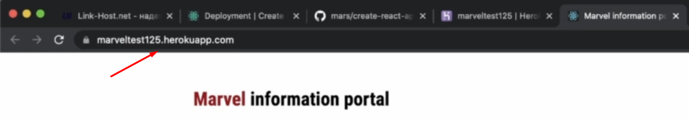

#API #React 

## 001 Что такое API и как работают реальные приложения

**API (Application Programming Interface)** - это набор готовых функций и свойств, которые можно использовать. Либо это можно назвать договором - мы обязуемся использовать правильный синтаксис и использовать допустимые запросы для того, чтобы получить нужные данные или что-то выполнить, а АПИ обязуется выполнить то, что мы ему отправили. 

Вот пример открытого [API](https://anapioficeandfire.com/), который готов нам выдать информацию с сервера, если мы только правильно введём fetch-запрос с нужной ссылкой - контракт - я правильно запрашиваю, а ты выдаёшь


>[!note] Конкретно в мире веб-разработки API говорит нам, как мы будем реализовывать общение фронт-енд части приложения с сервером


Так же ещё примеры АПИ-сервисов:
- [Marvel](https://developer.marvel.com)
- [JSONPlaceholder](https://jsonplaceholder.typicode.com)
- [Pokemon](https://pokeapi.co)
- Сервис новостей [News](https://newsapi.org)
- Сервис погоды [Open Weather](https://openweathermap.org/api)

Так же есть отдельная страница на гитхабе, где есть огромный список всех публичных [API](https://github.com/public-apis/public-apis)

## 002 Новый проект и работа с сервером


Будет разрабатываться реальный сайт на основе данных, полученных с сайта по вселенной [Marvel](https://developer.marvel.com/). Отсюда нам нужно только произвести настройку доступности отправляемых запросов (ставим ото всюду `*.`) и сам ключ для совершения запросов `abfdaba95091affea928543eb9253ded`


Чтобы не писать путь до изображения, можно просто вставить его как объект - вебпак поймёт


Далее нужно реализовать сервис, который будет отвечать за взаимодействие фронта с бэком


И тут мы описываем класс, который будет содержать методы, получающие данные с сервера

`src > services > marvel.service.js`
```JS
// это класс для взаимодействия фронта с апи марвела  
class MarvelService {  
   api = 'abfdaba95091affea928543eb9253ded';  
  
   // данная функция будет фетчить данные с сервера и возвращать их  
   getResource = async (url) => {  
      let res = await fetch(url);  
  
      if (!res.ok) {  
         throw new Error(`Couldn't fetch ${url}, status: ${res.status}`);  
      }  
  
      return await res.json();  
   };  
  
   // эта функция будет получать всех персонажей по переданной ссылке  
   getAllCharacters = async () => {  
      return await this.getResource(`https://gateway.marvel.com:443/v1/public/characters?limit=9&offset=36&apikey=${this.api}`);  
   };  
  
   // эта функция будет получать одного персонажа по id  
   getCharacter = async (id) => {  
      return await this.getResource(`https://gateway.marvel.com:443/v1/public/characters/${id}?apikey=${this.api}`);  
   };  
}  
  
export default MarvelService;
```

Получим для примера ответ от сервера в виде объекта:

`src > index.js`
```JSX
// создаём инстанс класса  
const marvelService = new MarvelService();  
  
// получаем персонажей с сервера и выводим их в консоль  
marvelService.getAllCharacters().then(res => console.log(res));  
  
// получаем одного персонажа с сервера  
marvelService.getCharacter(1009567).then(res => console.log(res));  
  
const root = ReactDOM.createRoot(document.getElementById('root'));  
  
root.render(  
   <React.StrictMode>  
      <App />  
   </React.StrictMode>  
);
```

Первым нам вышел персонаж по `id`, а вторым ответом мы получили ограниченный массив персонажей (9 штук)


Далее нам нужно доработать метод - вынесем повторяющиеся данные в отдельные поля класса

`src > services > marvel.service.js`
```JS
// это класс для взаимодействия фронта с апи марвела  
class MarvelService {  
   _apiBase = 'https://gateway.marvel.com:443/v1/public/';  
   _apiKey = 'apikey=abfdaba95091affea928543eb9253ded';  
  
   // данная функция будет фетчить данные с сервера и возвращать их  
   getResource = async (url) => {  
      let res = await fetch(url);  
  
      if (!res.ok) {  
         throw new Error(`Couldn't fetch ${url}, status: ${res.status}`);  
      }  
  
      return await res.json();  
   };  
  
   // эта функция будет получать всех персонажей по переданной ссылке  
   getAllCharacters = async () => {  
      return await this.getResource(`${this._apiBase}characters?limit=9&offset=36&${this._apiKey}`);  
   };  
  
   // эта функция будет получать одного персонажа по id  
   getCharacter = async (id) => {  
      return await this.getResource(`${this._apiBase}characters/${id}?${this._apiKey}`);  
   };  
}  
  
export default MarvelService;
```

И далее попробуем вывести массив имён из того ответа, который приходит нам с сервера:

`src > index.js`
```JS
marvelService.getAllCharacters().then(res => res.data.results.forEach(item => console.log(item.name)));
```


## 003 Трансформация данных и компонент со случайным персонажем


Самое первое, что нужно реализовать - это получение данных по персонажу с сервера:
- Метод `_transformCharacter()` принимает в себя данные с сервера и возвращает данные отформатированные под тот формат, что нужно использовать в приложении. Такой подход заменит работу с интерфейсом.
- Методы `getAllCharacters()` и `getCharacter()` модифицируем таким образом, чтобы они как и раньше принимали и сохраняли в себе результат запроса и возвращали во внешние модули только отформатированный запрос через `_transformCharacter()`

`src > services > marvel.service.js`
```JS
class MarvelService {  
   _apiBase = 'https://gateway.marvel.com:443/v1/public/';  
   _apiKey = 'apikey=abfdaba95091affea928543eb9253ded';  
  
   getResource = async (url) => {  
      let res = await fetch(url);  
  
      if (!res.ok) {  
         throw new Error(`Couldn't fetch ${url}, status: ${res.status}`);  
      }  
  
      return await res.json();  
   };  
  
   getAllCharacters = async () => {
		const res = await this.getResource(
			`${this._apiBase}characters?limit=9&offset=36&${this._apiKey}`,
		);

		// тут мы возвращаем массив персонажей, где каждый отдельный элемент массива проходится через трансформацию
		return res.data.results.map(this._transformCharacter);
	};
  
   // эта функция будет получать одного персонажа по id  
   getCharacter = async (id) => {  
      const res = await this.getResource(`${this._apiBase}characters/${id}?${this._apiKey}`);  
      return this._transformCharacter(res.data.results[0]);  
   };  
  
   // тут мы будем возвращать только ограниченное количество данных при запросе на сервер  
   _transformCharacter = (char) => {  
      return {  
         name: char.name,  
         description: char.description,  
         thumbnail: char.thumbnail.path + '.' + char.thumbnail.extension,  
         homepage: char.urls[0].url,  
         wiki: char.urls[1].url,  
      };  
   };  
}  
  
export default MarvelService;
```

Далее переходим к отображению данных на фронте:
- создаём классовый компонент
- создадим его состояние, которое будет хранить в себе объект персонажа
- далее инициализируем сервис по работе с сервером
- далее создадим функцию `onCharLoaded`, которая будет менять состояние персонажа компонента
- в функции `updateChar` мы генерируем `id` персонажа и дёргаем сервер, получая информацию о персонаже (уже заранее отформатированную сервисом) и далее устанавливаем состояние в компоненте
- метод `sliceDescription` обрежет строку, так как описание полученное с сервера, может выходить за пределы карточки

`src > components > randomChar > RandomChar.js`
```JS
import './randomChar.scss';  
import mjolnir from '../../resources/img/mjolnir.png';  
import { Component } from 'react';  
import MarvelService from '../../services/marvel.service';  
  
class RandomChar extends Component {  
   constructor(props) {  
      super(props);  
      // вызываем функцию обновления при создании компонента  
      this.updateChar();  
   }  
  
   // состояние данных персонажа  
   state = {  
      char: {},  
   };  
  
   // создаём инстанс сервиса для общения с сервером  
   marvelService = new MarvelService();  
  
   // этот метод будет просто менять состояние персонажа  
   onCharLoaded = (char) => {  
      this.setState({ char });  
   };  
  
   // метод, который будет общаться с сервером, получать данные и записывать их в стейт  
   updateChar = () => {  
      // получаем рандомный id персонажа из определённого диапазона  
      // рандом * (маисмум - минимум) + минимум      
      const id = Math.floor(Math.random() * (1011400 - 1011000) + 1011000);  
  
      // вызываем получение персонажа по id с нашего сервиса и меняем состояние компонента  
      // здесь мы можем вставить просто res, так как мы трансформировали данные в сервисе через _transformCharacter      
      this.marvelService.getCharacter(id).then(this.onCharLoaded);  
   };  
   
  // эта функция обрежет строку, если та длинее 150 символов
   sliceDescription = (description) => {  
      if (description.length > 150) {  
         return description.slice(0, 150) + '...';  
      }  
      return description;  
   };  
  
   render() {  
	   // деструктурируем значения из состояния, чтобы внести их в компонент
      const {  
         char: { name, description, thumbnail, homepage, wiki },  
      } = this.state;  
  
      return (  
         <div className='randomchar'>  
            <div className='randomchar__block'>  
                 
               <div className='randomchar__info'>  
                  <p className='randomchar__name'>{name}</p>  
                  <p className='randomchar__descr'>  
                     {description  
                        ? this.sliceDescription(description)  
                        : 'Данных про данного персонажа нет'}  
                  </p>  
                  <div className='randomchar__btns'>  
                     <a href={homepage} className='button button__main'>  
                        <div className='inner'>homepage</div>  
                     </a>  
                     <a href={wiki} className='button button__secondary'>  
                        <div className='inner'>Wiki</div>  
                     </a>  
                  </div>  
               </div>  
            </div>  
            <div className='randomchar__static'>  
               <p className='randomchar__title'>  
                  Random character for today!  
                  <br />  
                  Do you want to get to know him better?  
               </p>  
               <p className='randomchar__title'>Or choose another one</p>  
               <button className='button button__main'>  
                  <div className='inner'>try it</div>  
               </button>  
                 
            </div>  
         </div>  
      );  
   }  
}  
  
export default RandomChar;
```

Так же хочется отметить про несколько видов записей функций: если мы просто вставим в функцию вызов другой функции, то вложенная функция вызовется с переданным дефолтным аргументом родительской функции (первой)

```JS
// длинная запись
this.marvelService.getCharacter(id).then((res) => {  
   this.onCharLoaded(res);  
});

// короткая запись
this.marvelService.getCharacter(id).then(this.onCharLoaded);
```

И тут нужно сразу сказать, что такой подход, который был описан выше - неправильный. Работать со стейтом, подписываться на события и создавать сервисы при конструировании компонента *является плохой практикой*


Итог: мы имеем при перезагрузке страницы рандомного персонажа


>[!note] Оформление работы с сервером:
> - Если наше приложение взаимодействует с сервером, то сетевую логику нужно отделять от реализации фронтенда
> - В остальных компонентах нужно использовать только результаты работы данного сервиса 


## 004 Хороший тон приложения (спиннер, ошибки...)

Далее на сайт нужно добавить спиннер, который будет показывать пользователю, что информация загружается - это его успокоит и упростит взаимодействие с сайтом

Можно просто скачать любой спиннер на [выбор](https://icons8.com/preloaders/)


А можно создать [свой](https://loading.io/) спиннер


Первым делом создаём компонент со спиннером, который будем использовать на странице

`src > components > Spinner > Spinner.js`
```JS
const Spinner = () => {  
   return (  
      <svg         xmlns='http://www.w3.org/2000/svg'  
         style={{ margin: '0 auto', background: 'none', display: 'block' }}  
         width='200px'  
         height='200px'  
         viewBox='0 0 100 100'  
         preserveAspectRatio='xMidYMid'  
      >  
         <g transform='translate(80,50)'>  
            <g transform='rotate(0)'>  
               <circle cx='0' cy='0' r='7' fill='#1c4595' fillOpacity='1'>  
                  <animateTransform  
                     attributeName='transform'  
                     type='scale'  
                     begin='-0.875s'  
                     values='1.5 1.5;1 1'  
                     keyTimes='0;1'  
                     dur='1s'  
                     repeatCount='indefinite'  
                  ></animateTransform>  
                  <animate                     attributeName='fillOpacity'  
                     keyTimes='0;1'  
                     dur='1s'  
                     repeatCount='indefinite'  
                     values='1;0'  
                     begin='-0.875s'  
                  ></animate>  
               </circle>  
            </g>  
         </g>  
         <g transform='translate(71.21320343559643,71.21320343559643)'>  
            <g transform='rotate(45)'>  
               <circle cx='0' cy='0' r='7' fill='#1c4595' fillOpacity='0.875'>  
                  <animateTransform  
                     attributeName='transform'  
                     type='scale'  
                     begin='-0.75s'  
                     values='1.5 1.5;1 1'  
                     keyTimes='0;1'  
                     dur='1s'  
                     repeatCount='indefinite'  
                  ></animateTransform>  
                  <animate                     attributeName='fillOpacity'  
                     keyTimes='0;1'  
                     dur='1s'  
                     repeatCount='indefinite'  
                     values='1;0'  
                     begin='-0.75s'  
                  ></animate>  
               </circle>  
            </g>  
         </g>  
         <g transform='translate(50,80)'>  
            <g transform='rotate(90)'>  
               <circle cx='0' cy='0' r='7' fill='#1c4595' fillOpacity='0.75'>  
                  <animateTransform  
                     attributeName='transform'  
                     type='scale'  
                     begin='-0.625s'  
                     values='1.5 1.5;1 1'  
                     keyTimes='0;1'  
                     dur='1s'  
                     repeatCount='indefinite'  
                  ></animateTransform>  
                  <animate                     attributeName='fillOpacity'  
                     keyTimes='0;1'  
                     dur='1s'  
                     repeatCount='indefinite'  
                     values='1;0'  
                     begin='-0.625s'  
                  ></animate>  
               </circle>  
            </g>  
         </g>  
         <g transform='translate(28.786796564403577,71.21320343559643)'>  
            <g transform='rotate(135)'>  
               <circle cx='0' cy='0' r='7' fill='#1c4595' fillOpacity='0.625'>  
                  <animateTransform  
                     attributeName='transform'  
                     type='scale'  
                     begin='-0.5s'  
                     values='1.5 1.5;1 1'  
                     keyTimes='0;1'  
                     dur='1s'  
                     repeatCount='indefinite'  
                  ></animateTransform>  
                  <animate                     attributeName='fillOpacity'  
                     keyTimes='0;1'  
                     dur='1s'  
                     repeatCount='indefinite'  
                     values='1;0'  
                     begin='-0.5s'  
                  ></animate>  
               </circle>  
            </g>  
         </g>  
         <g transform='translate(20,50.00000000000001)'>  
            <g transform='rotate(180)'>  
               <circle cx='0' cy='0' r='7' fill='#1c4595' fillOpacity='0.5'>  
                  <animateTransform  
                     attributeName='transform'  
                     type='scale'  
                     begin='-0.375s'  
                     values='1.5 1.5;1 1'  
                     keyTimes='0;1'  
                     dur='1s'  
                     repeatCount='indefinite'  
                  ></animateTransform>  
                  <animate                     attributeName='fillOpacity'  
                     keyTimes='0;1'  
                     dur='1s'  
                     repeatCount='indefinite'  
                     values='1;0'  
                     begin='-0.375s'  
                  ></animate>  
               </circle>  
            </g>  
         </g>  
         <g transform='translate(28.78679656440357,28.786796564403577)'>  
            <g transform='rotate(225)'>  
               <circle cx='0' cy='0' r='7' fill='#1c4595' fillOpacity='0.375'>  
                  <animateTransform  
                     attributeName='transform'  
                     type='scale'  
                     begin='-0.25s'  
                     values='1.5 1.5;1 1'  
                     keyTimes='0;1'  
                     dur='1s'  
                     repeatCount='indefinite'  
                  ></animateTransform>  
                  <animate                     attributeName='fillOpacity'  
                     keyTimes='0;1'  
                     dur='1s'  
                     repeatCount='indefinite'  
                     values='1;0'  
                     begin='-0.25s'  
                  ></animate>  
               </circle>  
            </g>  
         </g>  
         <g transform='translate(49.99999999999999,20)'>  
            <g transform='rotate(270)'>  
               <circle cx='0' cy='0' r='7' fill='#1c4595' fillOpacity='0.25'>  
                  <animateTransform  
                     attributeName='transform'  
                     type='scale'  
                     begin='-0.125s'  
                     values='1.5 1.5;1 1'  
                     keyTimes='0;1'  
                     dur='1s'  
                     repeatCount='indefinite'  
                  ></animateTransform>  
                  <animate                     attributeName='fillOpacity'  
                     keyTimes='0;1'  
                     dur='1s'  
                     repeatCount='indefinite'  
                     values='1;0'  
                     begin='-0.125s'  
                  ></animate>  
               </circle>  
            </g>  
         </g>  
         <g transform='translate(71.21320343559643,28.78679656440357)'>  
            <g transform='rotate(315)'>  
               <circle cx='0' cy='0' r='7' fill='#1c4595' fillOpacity='0.125'>  
                  <animateTransform  
                     attributeName='transform'  
                     type='scale'  
                     begin='0s'  
                     values='1.5 1.5;1 1'  
                     keyTimes='0;1'  
                     dur='1s'  
                     repeatCount='indefinite'  
                  ></animateTransform>  
                  <animate                     attributeName='fillOpacity'  
                     keyTimes='0;1'  
                     dur='1s'  
                     repeatCount='indefinite'  
                     values='1;0'  
                     begin='0s'  
                  ></animate>  
               </circle>  
            </g>  
         </g>  
      </svg>  
   );  
};  
  
export default Spinner;
```

Так будет выглядеть компонент ошибки:

`src > components > ErrorMessage > ErrorMessage.js`
```JS
import React from 'react';  
import ErrorIcon from './error.gif';  
  
const ErrorMessage = () => {  
   return (  
        
   );  
};  
  
export default ErrorMessage;
```


Так же можно отметить, что мы можем положить нужное изображение в паблик папку и получить нужное нам изображение через переменную окружения


И тут мы реализуем два новых состояния и метод `onError`, которые будут отвечать за отображение ошибки и спиннера 

`src > components > randomChar > RandomChar.js`
```JS
import './randomChar.scss';  
import mjolnir from '../../resources/img/mjolnir.png';  
import { Component } from 'react';  
import MarvelService from '../../services/marvel.service';  
import Spinner from '../Spinner/Spinner';  
import ErrorMessage from '../ErrorMessage/ErrorMessage';  
  
class RandomChar extends Component {  
   constructor(props) {  
      super(props);  
      this.updateChar();  
   }  
  
   state = {  
      char: {},  
      loading: true, // состояние загрузки компонента  
      error: false, // состояние ошибки  
   };  
  
   marvelService = new MarvelService();  
  
   onCharLoaded = (char) => {  
      // так же тут дополняем информацию по загрузке  
      this.setState({ char, loading: false });  
   };  
  
   // этот метод будет срабатывать при ошибке  
   onError = () => {  
      this.setState({ loading: false, error: true });  
   };  
  
   updateChar = () => {  
      const id = Math.floor(Math.random() * (1011400 - 1011000) + 1011000);  
      // const id = 10;  
  
      // так же дополняем обработку ответа от сервера реагированием на ошибку      this.marvelService.getCharacter(id).then(this.onCharLoaded).catch(this.onError);  
   };  
  
   render() {  
      const { char, loading, error } = this.state;  
  
      const showError = error ? <ErrorMessage /> : null;  
      const showLoading = loading ? <Spinner /> : null;  
      const showContent = !(error || loading) ? <View char={char} /> : null;  
  
      return (  
         <div className='randomchar'>  
            {/* показываем на странице то, что подошло под условия */}  
            {showContent}  
            {showLoading}  
            {showError}  
            <div className='randomchar__static'>  
               <p className='randomchar__title'>  
                  Random character for today!  
                  <br />  
                  Do you want to get to know him better?  
               </p>  
               <p className='randomchar__title'>Or choose another one</p>  
               <button className='button button__main'>  
                  <div className='inner'>try it</div>  
               </button>  
                 
            </div>  
         </div>  
      );  
   }  
}  
  
// динамическую информацию нашего компонента вынесем в отдельный компонент  
const View = ({ char }) => {  
   const { name, description, thumbnail, homepage, wiki } = char;  
  
   const sliceDescription = (description) => {  
      if (description.length > 150) {  
         return description.slice(0, 150) + '...';  
      }  
      return description;  
   };  
  
   return (  
      <div className='randomchar__block'>  
           
         <div className='randomchar__info'>  
            <p className='randomchar__name'>{name}</p>  
            <p className='randomchar__descr'>  
               {description  
                  ? sliceDescription(description)  
                  : 'Данных про данного персонажа нет'}  
            </p>  
            <div className='randomchar__btns'>  
               <a href={homepage} className='button button__main'>  
                  <div className='inner'>homepage</div>  
               </a>  
               <a href={wiki} className='button button__secondary'>  
                  <div className='inner'>Wiki</div>  
               </a>  
            </div>  
         </div>  
      </div>  
   );  
};  
  
export default RandomChar;
```

Итог: мы имеем отображение загрузки и ошибки


## 005 Жизненный цикл компонентов


Сейчас воспроизведём одну проблему в работе компонентов:
- переведём компонент `App` в классовый и внутри него создадим возможность удалять компонент со страницы, показывая `null` вместо него


- Далее в самом компоненте будем внутри конструктора по интервалу вызвать запрос на получение данных `updateChar`


- И несколько раз скроем и покажем компонент


В итоге мы получим ситуацию, когда запрос на получение данных со страницы уходит на просто за раз по два раза (что уже плохо), но так же и компоненты, которые мы насоздавали - не исчезают и продолжают отправлять запросы на сервер, что приводит к отправке более чем двух запросов в секунду. Такой подход создаёт сильную угрозу утечки данных

И тут нам нужно перейти к жизненному циклу компонента, чтобы понять, каким образом у нас происходят данные ошибки 

Жизненный цикл компонента делится на 3 этапа (если не включать состояние ошибки) и предполагает под собой 3 хука этих состояний:
- `componentDidMount` - компонент появляется на странице
- `componentDidUpdate` - компонент обновляется
- `componentWillUnmount` - компонент уходит со страницы


И данную структуру нужно знать:
- Первым этапом у нас идёт монтирование
	- вызывается конструктор
	- после конструктора идёт `render` компонента
	- потом обновляется DOM-дерево
	- и в конце вызывается `componentDidMount`
- Вторым этапом у нас идёт обновление компонента
	- обновление компонента вызвают:
		- изменение пропсов
		- установление нового состояния через `setState()`
		- насильное обновление через `forceUpdate()`
	- И мы опять попадаем в метод `render`, который монтирует наш компонент
	- Дальше обновляется дерево
	- И срабатывает хук `componentDidUpdate`
- Третьим этапом мы просто размонтируем компонент и стираем со страницы
	- тут вызывается хук `componentWillUnmount`


Расставим на всех контрольных точках приложения логи определённого этапа монтирования компонента

Сейчас закомментируем вызов функции обновления персонажа на странице, чтобы у нас нормально работал компонент. 

```JS
class RandomChar extends Component {  
   constructor(props) {  
      super(props);  
      // this.updateChar();  
      console.log('constructor');  
   }  
  
   componentDidMount() {  
      console.log('mount');  
   }  
  
   componentWillUnmount() {  
      console.log('unmount');  
   }  
  
   state = {  
      char: {},  
      loading: true,  
      error: false,  
   };  
  
   marvelService = new MarvelService();  
  
   onCharLoaded = (char) => {  
      console.log('update');  
      this.setState({ char, loading: false });  
   };  
  
   onError = () => {  
      this.setState({ loading: false, error: true });  
   };  
  
   updateChar = () => {  
      const id = Math.floor(Math.random() * (1011400 - 1011000) + 1011000);  
  
      this.marvelService.getCharacter(id).then(this.onCharLoaded).catch(this.onError);  
   };  
  
   render() {  
      console.log('render');  
  
      const { char, loading, error } = this.state;  
  
      const showError = error ? <ErrorMessage /> : null;  
      const showLoading = loading ? <Spinner /> : null;  
      const showContent = !(error || loading) ? <View char={char} /> : null;  
  
      return (  
         <div className='randomchar'>  
            {showContent}  
            {showLoading}  
            {showError}  
            <div className='randomchar__static'>  
               <p className='randomchar__title'>  
                  Random character for today!  
                  <br />  
                  Do you want to get to know him better?  
               </p>  
               <p className='randomchar__title'>Or choose another one</p>  
               <button className='button button__main'>  
                  <div className='inner'>try it</div>  
               </button>  
                 
            </div>  
         </div>  
      );  
   }  
}
```

И тут можно увидеть, что компонент рендерится ровно один раз


Но если мы вернём в конструктор данную запись, то можно увидеть, что компонент обновился два раза, что и привело к двойному срабатыванию функции отправки запроса на сервер.

Это происходит потому, что мы обновляем состояние и запрашиваем рендер компонента до того, как он отрендерился в первый раз. Из-за такого наслоения вместо одного рендера происходит перерендер с новым состоянием.

Нам можно использовать обновления состояний компонента **только** на этапе =="commit"==

```JS
constructor(props) {  
   super(props);  
   this.updateChar();  
   console.log('constructor');  
}
```


И чтобы поправить ошибку, просто вызовем функцию отправки запроса на сервер на этапе коммита компонента, а именно в методе `componentDidMount()`

```JS
constructor(props) {  
   super(props);  
   console.log('constructor');  
}  
  
componentDidMount() {  
   this.updateChar();  
   console.log('mount');  
}
```


Ну и чтобы при размонтировании компонента у нас остановился и таймер, нужно останавливать этот таймер на этапе размонтирования компонента

>[!warning] Так же нужно отметить:
>- Что данную отписку нужно выполнять всегда, так как она продолжит работать, даже если мы перейдём на другую страницу (все компоненты уничтожатся, а подписка останется)
>- Что если мы добавили подписку через стандартное DOM-api (например, `addEventListener`), то и удалять эту подписку нужно через DOM-api (тут - `removeEventListener`)

```JS
componentDidMount() {  
   this.updateChar();  
   this.timerId = setInterval(this.updateChar, 3000);  
   console.log('mount');  
}  
  
componentWillUnmount() {  
   clearInterval(this.timerId);  
   console.log('unmount');  
}
```


## 006 Практика с жизненным циклом, componentDidUpdate


Сейчас нам нужно реализовать загрузку списка персонажей на странице, а так же реализовать вывод информации по ним при нажатии на карточку в боковом меню страницы

В компоненте `App` добавим состояние `selectedChar`, которое будет хранить `id` выбранного персонажа и метод `onSelectedChar`, который мы будем вызывать внутри компонента `CharList`, чтобы получить этот нужный нам `id` персонажа

`src > components > app > App.js`
```JS
class App extends Component {  
   // это состояние выбранного персонажа  
   state = {  
      selectedChar: null,  
   };  
  
   // это метод, который будет вызываться из CharList и передаст в родительский компонент id выбранного персонажа  
   onSelectedChar = (id) => {  
      this.setState({ selectedChar: id });  
   };  
  
   render() {  
      return (  
         <div className='app'>  
            <AppHeader />  
            <main>               
	           <RandomChar />  
               <div className='char__content'>  
                  <CharList onCharSelected={this.onSelectedChar} />  
                  <CharInfo charId={this.state.selectedChar} />  
               </div>  
                 
            </main>  
         </div>  
      );  
   }  
}  
  
export default App;
```

Таким образом реализована логика списка персонажей на странице

Так же при клике на карточку будет вызваться функция `onCharSelected()`, которая вернёт в компонент `App` нужный нам `id` персонажа

`src > components > charList > CharList.js`
```JS
import './charList.scss';  
import { Component } from 'react';  
import MarvelService from '../../services/marvel.service';  
import ErrorMessage from '../ErrorMessage/ErrorMessage';  
import Spinner from '../Spinner/Spinner';  
  
class CharList extends Component {  
   state = {  
      charList: [],  
      loading: true,  
      error: false,  
   };  
  
   marvelService = new MarvelService();  
  
   componentDidMount() {  
      this.marvelService.getAllCharacters().then(this.onCharListLoaded).catch(this.onError);  
   }  
  
   onCharListLoaded = (charList) => {  
      this.setState({  
         charList,  
         loading: false,  
      });  
   };  
  
   onError = () => {  
      this.setState({  
         error: true,  
         loading: false,  
      });  
   };  
  
   // это метод рендера отдельных элементов карточек  
   renderItems(arr) {  
      const items = arr.map((item) => {  
         let imgStyle = { objectFit: 'cover' };  
         if (  
            item.thumbnail ===  
            'http://i.annihil.us/u/prod/marvel/i/mg/b/40/image_not_available.jpg'  
         ) {  
            imgStyle = { objectFit: 'unset' };  
         }  
  
         return (  
            <li  
               className='char__item'  
               key={item.id}  
            // при клике будет срабатывать колл-бэк функция, которая мы передали из App  
               onClick={() => this.props.onCharSelected(item.id)}  
            >               
			     
               <div className='char__name'>{item.name}</div>  
            </li>  
         );  
      });  
  
      // А эта конструкция вынесена для центровки спиннера/ошибки  
      return <ul className='char__grid'>{items}</ul>;  
   }  
  
   render() {  
      const { charList, loading, error } = this.state;  
  
      const items = this.renderItems(charList);  
  
      const errorMessage = error ? <ErrorMessage /> : null;  
      const spinner = loading ? <Spinner /> : null;  
      const content = !(loading || error) ? items : null;  
  
      return (  
         <div className='char__list'>  
            {errorMessage}  
            {spinner}  
            {content}  
            <button className='button button__main button__long'>  
               <div className='inner'>load more</div>  
            </button>  
         </div>  
      );  
   }  
}  
  
export default CharList;
```


Так же добавим получение комиксов с сервера

`src > service > marvel.service.js`
```JS
_transformCharacter = (char) => {  
   return {  
      id: char.id,  
      name: char.name,  
      description: char.description  
         ? char.description.slice(0, 150) + '...'  
         : 'No description for this person',  
      thumbnail: char.thumbnail.path + '.' + char.thumbnail.extension,  
      homepage: char.urls[0].url,  
      wiki: char.urls[1].url,  
      comics: char.comics.items,  
   };  
};
```

И далее нам нужно реализовать рендер компонента информации персонажей:
- при загрузке страницы `componentDidMount` обновляем персонажа `updateChar`
- при обновлении пропсов так же через `componentDidUpdate` обновляем персонажа

`src > components > charInfo > CharInfo.js`
```JS
import { Component } from 'react';  
import './charInfo.scss';  
import MarvelService from '../../services/marvel.service';  
import ErrorMessage from '../ErrorMessage/ErrorMessage';  
import Spinner from '../Spinner/Spinner';  
import Skeleton from '../skeleton/Skeleton';  
  
// это основной компонент логики и состояния  
class CharInfo extends Component {  
   state = {  
      char: null,  
      loading: false,  
      error: false,  
   };  
  
   marvelService = new MarvelService();  
  
   componentDidMount() {  
      this.updateChar();  
   }  
  
   // получает при срабатывании предыдущее состояние и предыдущие пропсы  
   componentDidUpdate(prevProps, prevState, screenshot) {  
      // если текущий ID персонажа из пропсов не равен предыдущим, то обновляем компонент  
      // это условие исключит бесконечный цикл обновлений, который может начаться      
      if (this.props.charId !== prevProps.charId) {  
         this.updateChar();  
      }  
   }  
  
   // этот метот будет обновлять выводимого в компоненте персонажа  
   updateChar = () => {  
      const { charId } = this.props;  

	  // если id персонажа нет, то возвращаемся из функции
      if (!charId) return;  

	  // активируем загрузку
      this.onCharLoading();  

	  // получаем персонажа по запросу
	  this.marvelService.getCharacter(charId)
		.then(this.onCharLoaded)
		.catch(this.onError);  
   };  
  
   // три стандартных метода для обновления состояния персонажа:  
   onCharLoaded = (char) => {  
      this.setState({ char, loading: false });  
   };  
  
   onCharLoading = () => {  
      this.setState({ loading: true });  
   };  
  
   onError = () => {  
      this.setState({ loading: false, error: true });  
   };  
  
   render() {  
      const { char, loading, error } = this.state;  
  
      const showSkeleton = !(error || loading || char) ? <Skeleton /> : null;  
      const showError = error ? <ErrorMessage /> : null;  
      const showLoading = loading ? <Spinner /> : null;  
      const showContent = !(error || loading || !char) ? <View char={char} /> : null;  
  
      return (  
         <div className='char__info'>  
            {showSkeleton}  
            {showLoading}  
            {showContent}  
            {showError}  
         </div>      
	  );  
   }  
}  
  
// а это компонент интерфейса  
const View = ({ char }) => {  
   const { name, description, thumbnail, homepage, wiki, comics } = char;  
  
   // определяем стили для картинки, если она не найдена  
   let imgStyle = { objectFit: 'cover' };  
   if (thumbnail === 'http://i.annihil.us/u/prod/marvel/i/mg/b/40/image_not_available.jpg') {  
      imgStyle = { objectFit: 'contain' };  
   }  
  
   return (  
      <>  
         <div className='char__basics'>  
              
            <div>               <div className='char__info-name'>{name}</div>  
               <div className='char__btns'>  
                  <a href={homepage} className='button button__main'>  
                     <div className='inner'>homepage</div>  
                  </a>  
                  <a href={wiki} className='button button__secondary'>  
                     <div className='inner'>Wiki</div>  
                  </a>  
               </div>  
            </div>  
         </div>  
         <div className='char__descr'>{description}</div>  
         <div className='char__comics'>Comics:</div>  
         <ul className='char__comics-list'>  
            {comics.length < 1 ? 'No comics for this person' : null}  
            {comics.map((c, i) => (  
               <li key={i} className='char__comics-item'>  
                  {c.name}  
               </li>  
            ))}  
         </ul>  
      </>  
   );  
};  
  
export default CharInfo;
```

Итог: до нажатия на персонажей - отображается скелетон, а уже при нажатии на персонажа, у нас подгружаются данные в `info` для отображения 


## 007 Предохранители (Error Boundaries)

Попробуем воспользоваться методом, который срабатывает при появлении ошибки в компоненте `componentDidCatch`. В нём мы установим состояние ошибки компонента и выведем информацию о полученных аргументах.

`src > component > charInfo > CharInfo.js`
```JS
// сработает при ошибке  
// error - сама ошибка / errorInfo - информация о компоненте, в котором произошла ошибка  
componentDidCatch(error, errorInfo) {  
   console.log(error, errorInfo);  
   this.setState({ error: true });  
}  
  
updateChar = () => {  
   const { charId } = this.props;  
  
   if (!charId) return;  
  
   this.onCharLoading();  
  
   this.marvelService.getCharacter(charId).then(this.onCharLoaded).catch(this.onError);  
  
   // ошибка  
   this.foo.bar = 0;  
};
```

И, как мы видим, ошибка всё равно выскакивает и в консоли нет информации из метода. Логика данного хука была изменена в 16 версии реакта и теперь она не предотвращает краш всей страницы. Это было сделано с целью предотвращения отправки на сервер некорректных данных. 


И тут мы переходим к такому подходу, как **Error Boundary** (предохранители) - это функционал, который собой оборачивает наш компонент, и если в нём происходит ошибка, то он её отлавливает

>[!note] Подобный компонент можно сделать только через класс - в функциональном подходе он ещё не реализован 

И так выглядит реализация классового компонента `ErrorBoundary`:
- создаём состояние ошибки
- метод `componentDidCatch` будет совершать определённое действие при отлове ошибки (выведет нам объекты в консоль и запишет состояние ошибки)
- далее по условию выведем компонент ошибки, если переловили ошибку, а если не переловили, то выведем просто обёрнутый компонент

Метод `getDerivedStateFromError` тут не нужен, но он может пригодиться, если нам нужно только записать состояние внутри данного класса

`src > component > ErrorBoundary > ErrorBoundary.js`
```JS
import React, { Component } from 'react';  
import ErrorMessage from '../ErrorMessage/ErrorMessage';  
  
class ErrorBoundary extends Component {  
   // состояние ошибки  
   state = {  
      error: false,  
   };  
  
   // эта функция может выполнить только изменение состояния - больше ничего  
   static getDerivedStateFromError(error) {  
      return { error: true };  
   }  
  
   // сейчас метод перелова ошибки сработает  
   componentDidCatch(error, errorInfo) {  
      console.log(error, errorInfo);  
      this.setState({ error: true });  
   }  
  
   render() {  
      // возвращаем ошибку  
      if (this.state.error) {  
         return <ErrorMessage />;  
      }  
  
      // возвращаем компонент, который был вложен внутрь этого компонента  
      return this.props.children;  
   }  
}  
  
export default ErrorBoundary;
```

И далее нам нужно просто обернуть предполагаемый компонент с ошибкой внутрь `ErrorBoundary`

`src > component > app > App.js`
```JS
render() {  
   return (  
      <div className='app'>  
         <AppHeader />  
         <main>            
	        <ErrorBoundary>  
               <RandomChar />  
            </ErrorBoundary>  
            <div className='char__content'>  
               <ErrorBoundary>  
                  <CharList onCharSelected={this.onSelectedChar} />  
               </ErrorBoundary>  
               <ErrorBoundary>                  
	               <CharInfo charId={this.state.selectedChar} />  
               </ErrorBoundary>  
            </div>  
              
         </main>  
      </div>  
   );  
}
```

Итог: на месте, где у нас появилась ошибка будет отображаться компонент ошибки


Но так же важно знать:

>[!warning] Предохранитель ловит ошибки только в:
>- Методе `render()`
>- В методах жизненного цикла
>- В конструкторах дочерних компонентов
>- На серверном рендеринге


## 008 Пагинация данных (дозагрузка персонажей)


>[!note] #tips  
>Когда мы меняем состояние через методы, можно обращаться по полному пути к состоянию 
> 
> А можно деструктурировать нужное нам свойство
> 
> 

Далее в сервисе укажем отдельным полем число оффсета и вставим его в запрос. По умолчанию оффсет внутри метода будет принимать в себя значение поля

`src > service > marverl.service.js`
```JS
_baseOffsetForPerson = 210;  

getAllCharacters = async (offset = this._baseOffsetForPerson) => {  
   const res = await this.getResource(  
      `${this._apiBase}characters?limit=9&offset=${offset}&${this._apiKey}`,  
   );  
  
   return res.data.results.map(this._transformCharacter);  
};
```

Далее нужно добавить функционал пагинации в наше приложение. Пагинация - это дозагрузка контента страницы по запросу пользователя.

- изменим состояние `charList` на массив, добавим 3 состояния: `newItemLoading` (состояние загрузки новых персонажей), `offset` (отступ), `charEnded` (кончился ли список персонажей)
- Добавим метод `onRequest`, который будет осуществлять запрос на сервер. Он будет принимать в себя тот оффсет, который нужно отступить
- Добавим спиннер при загрузке списка перснажей `onCharListLoading`
- Модифицируем метод `onCharListLoaded` так, чтобы он редактировал состояния при загрузке персонажей и проверял, кончился ли список
- Далее в рендере добавляем на кнопку по условию атрибут `disabled`, которая заблокирует кнопку, если список грузится, добавим стили под блокировку кнопки и добавим функцию `onRequest`, которая дозагрузит персонажей 

`src > components > charList > CharList.js`
```JS
class CharList extends Component {  
   state = {  
      charList: [],  
      loading: true,  
      error: false,  
      newItemLoading: false, // загрузка новых персонажей  
      offset: 210, // начальное положение от которого считается отступ  
      charEnded: false, // отвечает за то состояние, когда кончился список персонажей  
   };  
  
   marvelService = new MarvelService();  
  
   // при монтировании компонента вызваем запрос на сервер  
   componentDidMount() {  
      this.onRequest(this.state.offset);  
   }  
  
   // это метод, который теперь отвечает за запросы на сервер для получения данных  
   onRequest = (offset) => {  
      this.onCharListLoading(); // при запросе запускается спиннер загрузки  
      this.marvelService.getAllCharacters(offset)
	      .then(this.onCharListLoaded)
	      .catch(this.onError);  
   };  
  
   // запускаем спиннер при загрузке персонажей  
   onCharListLoading = () => {  
      this.setState({  
         newItemLoading: true,  
      });  
   };  
  
   onCharListLoaded = (newCharList) => {  
      // если сервер вернул меньше 9 персонажей, то список кончился  
      let ended = false;  
      if (newCharList.length < 9) ended = false;  
  
      // теперь мы устанавливаем в стейт новые и старые данные  
      this.setState(({ offset, charList }) => ({  
         // сюда разворачиваем новые и старые элементы  
         charList: [...charList, ...newCharList],  
         loading: false,  
         newItemLoading: false, // когда загрузился - отключаем  
         offset: offset + 9, // тут уже меняем состояние пагинации  
         charEnded: ended, // устанавливаем состояние окончания списка (кончился / не кончился)  
      }));  
   };  
  
   onError = () => {  
      this.setState({  
         error: true,  
         loading: false,  
      });  
   };  
  
   renderItems(arr) {  
      const items = arr.map((item) => {  
         let imgStyle = { objectFit: 'cover' };  
         if (  
            item.thumbnail ===  
            'http://i.annihil.us/u/prod/marvel/i/mg/b/40/image_not_available.jpg'  
         ) {  
            imgStyle = { objectFit: 'unset' };  
         }  
  
         return (  
            <li  
               className='char__item'  
               key={item.id}  
               onClick={() => this.props.onCharSelected(item.id)}  
            >                 
               <div className='char__name'>{item.name}</div>  
            </li>  
         );  
      });  
  
      return <ul className='char__grid'>{items}</ul>;  
   }  
  
   render() {  
      const { charList, loading, error, offset, newItemLoading, charEnded } = this.state;  
  
      const items = this.renderItems(charList);  
  
      const errorMessage = error ? <ErrorMessage /> : null;  
      const spinner = loading ? <Spinner /> : null;  
      const content = !(loading || error) ? items : null;  
  
      return (  
         <div className='char__list'>  
            {errorMessage}  
            {spinner}  
            {content}  
            <button  
               className='button button__main button__long'  
               // кнопка заблокирована, если загружает что-либо  
               disabled={newItemLoading}  
               // при нажатии на кнопку будут подгружаться данные  
               onClick={() => this.onRequest(offset)}  
               style={{ display: charEnded ? 'none' : 'block' }}  
            >  
               <div className='inner'>load more</div>  
            </button>  
         </div>  
      );  
   }  
}  
  
export default CharList;
```

Ну и так же накинем на кнопку фильтр, чтобы пользователь понимал, что она некликабельна через `:disabled`

`styles > button.scss`
```SCSS
@import './variables';  
  
.button {  
    &:disabled {  
        filter: grayscale(.5);  
    }  
}
```

Итог: у нас подгружаются новые персонажи и кнопка становится тёмной


## 009 Проверка типов с помощью PropTypes
#PropTypes

Установка модуля:

```bash
npm i prop-types
```

И так выглядит самая простая реализация типизации пропсов:

```JS
import PropTypes from 'prop-types';

CharInfo.propTypes = {  
   charId: PropTypes.number,  
   onCharSelected: PropTypes.func.isRequired,  
};
```

И если у нас будет свойство `charId: PropTypes.string`, то мы получим подобную ошибку 


## Проверка типов с помощью PropTypes

>[!warning] Примечание:
> 
> С версии React 15.5 `React.PropTypes` были вынесены в отдельный пакет. Так что используйте [библиотеку `prop-types`](https://www.npmjs.com/package/prop-types).
> 
> Вы можете использовать [codemod-скрипт](https://ru.reactjs.org/blog/2017/04/07/react-v15.5.0.html#migrating-from-reactproptypes), чтобы провести замену в коде на использование этой библиотеки.

По мере роста вашего приложения вы можете отловить много ошибок с помощью проверки типов. Для этого можно использовать расширения JavaScript вроде [Flow](https://flow.org/) и [TypeScript](https://www.typescriptlang.org/). Но, даже если вы ими не пользуетесь, React предоставляет встроенные возможности для проверки типов. Для запуска этой проверки на пропсах компонента вам нужно использовать специальное свойство `propTypes`:

```JS
import PropTypes from 'prop-types';

class Greeting extends React.Component {
  render() {
    return (
      <h1>Привет, {this.props.name}</h1>
    );
  }
}

Greeting.propTypes = {
  name: PropTypes.string
};
```

В данном примере проверка типа показана на классовом компоненте, но она же может быть применена и к функциональным компонентам, или к компонентам, созданным с помощью [`React.memo`](https://ru.reactjs.org/docs/react-api.html#reactmemo) или [`React.forwardRef`](https://ru.reactjs.org/docs/react-api.html#reactforwardref).

`PropTypes` предоставляет ряд валидаторов, которые могут использоваться для проверки, что получаемые данные корректны. В примере мы использовали `PropTypes.string`. Когда какой-то проп имеет некорректное значение, в консоли будет выведено предупреждение. По соображениям производительности `propTypes` проверяются только в режиме разработки.

### PropTypes

Пример использования возможных валидаторов:

```JS
import PropTypes from 'prop-types';

MyComponent.propTypes = {
  // Можно объявить проп на соответствие определённому JS-типу.
  // По умолчанию это не обязательно.
  optionalArray: PropTypes.array,
  optionalBool: PropTypes.bool,
  optionalFunc: PropTypes.func,
  optionalNumber: PropTypes.number,
  optionalObject: PropTypes.object,
  optionalString: PropTypes.string,
  optionalSymbol: PropTypes.symbol,

  // Все, что может быть отрендерено:
  // числа, строки, элементы или массивы
  // (или фрагменты) содержащие эти типы
  optionalNode: PropTypes.node,

  // React-элемент
  optionalElement: PropTypes.element,

  // Тип React-элемент (например, MyComponent).
  optionalElementType: PropTypes.elementType,
  
  // Можно указать, что проп должен быть экземпляром класса
  // Для этого используется JS-оператор instanceof.
  optionalMessage: PropTypes.instanceOf(Message),

  // Вы можете задать ограничение конкретными значениями
  // при помощи перечисления
  optionalEnum: PropTypes.oneOf(['News', 'Photos']),

  // Объект, одного из нескольких типов
  optionalUnion: PropTypes.oneOfType([
    PropTypes.string,
    PropTypes.number,
    PropTypes.instanceOf(Message)
  ]),

  // Массив объектов конкретного типа
  optionalArrayOf: PropTypes.arrayOf(PropTypes.number),

  // Объект со свойствами конкретного типа
  optionalObjectOf: PropTypes.objectOf(PropTypes.number),

  // Объект с определённой структурой
  optionalObjectWithShape: PropTypes.shape({
    color: PropTypes.string,
    fontSize: PropTypes.number
  }),
  
  // При наличии необъявленных свойств в объекте будут вызваны предупреждения
  optionalObjectWithStrictShape: PropTypes.exact({
    name: PropTypes.string,
    quantity: PropTypes.number
  }),   

  // Можно добавить`isRequired` к любому приведённому выше типу,
  // чтобы показывать предупреждение,
  // если проп не передан
  requiredFunc: PropTypes.func.isRequired,

  // Обязательное значение любого типа
  requiredAny: PropTypes.any.isRequired,

  // Можно добавить собственный валидатор.
  // Он должен возвращать объект `Error` при ошибке валидации.
  // Не используйте `console.warn` или `throw` 
  // - это не будет работать внутри `oneOfType`
  customProp: function(props, propName, componentName) {
    if (!/matchme/.test(props[propName])) {
      return new Error(
        'Проп `' + propName + '` компонента' +
        ' `' + componentName + '` имеет неправильное значение'
      );
    }
  },

  // Можно задать свой валидатор для `arrayOf` и `objectOf`.
  // Он должен возвращать объект Error при ошибке валидации.
  // Валидатор будет вызван для каждого элемента в массиве
  // или для каждого свойства объекта.
  // Первые два параметра валидатора 
  // - это массив или объект и ключ текущего элемента
  customArrayProp: PropTypes.arrayOf(function(propValue, key, componentName, location, propFullName) {
    if (!/matchme/.test(propValue[key])) {
      return new Error(
        'Проп `' + propFullName + '` компонента' +
        ' `' + componentName + '` имеет неправильное значение'
      );
    }
  })
};
```

### Требование одного дочернего элемента

С помощью `PropTypes.element` вы можете указать, что только один дочерний элемент может быть передан компоненту в качестве потомка.

```JS
import PropTypes from 'prop-types';

class MyComponent extends React.Component {
  render() {
    // Это должен быть ровно один элемент, иначе вы увидите предупреждение.
    const children = this.props.children;
    return (
      <div>
        {children}
      </div>
    );
  }
}

MyComponent.propTypes = {
  children: PropTypes.element.isRequired
};
```

### Значения пропсов по умолчанию

Вы можете задать значения по умолчанию для ваших `props` с помощью специального свойства `defaultProps`:

```JS
class Greeting extends React.Component {
  render() {
    return (
      <h1>Привет, {this.props.name}</h1>
    );
  }
}

// Задание значений по умолчанию для пропсов:
Greeting.defaultProps = {
  name: 'Незнакомец'
};

// Отрендерит "Привет, Незнакомец":
const root = ReactDOM.createRoot(document.getElementById('example'));
root.render(<Greeting />);
```

C ES2022 вы можете объявить `defaultProps` как статическое свойство внутри классового React компонента. Подробнее можно узнать в статье про [публичные статические поля класса](https://developer.mozilla.org/ru/docs/Web/JavaScript/Reference/Classes/Public_class_fields#%D0%BF%D1%83%D0%B1%D0%BB%D0%B8%D1%87%D0%BD%D1%8B%D0%B5_%D1%81%D1%82%D0%B0%D1%82%D0%B8%D1%87%D0%B5%D1%81%D0%BA%D0%B8%D0%B5_%D0%BF%D0%BE%D0%BB%D1%8F). Для поддержки этого современного синтаксиса в старых браузерах потребуется компиляция.

```JS
class Greeting extends React.Component {
  static defaultProps = {
    name: 'Незнакомец'
  }

  render() {
    return (
      <div>Привет, {this.props.name}</div>
    )
  }
}
```

Определение `defaultProps` гарантирует, что `this.props.name` будет иметь значение, даже если оно не было указано родительским компонентом. Сначала применяются значения по умолчанию, заданные в `defaultProps`. После запускается проверка типов с помощью `propTypes`. Так что проверка типов распространяется и на значения по умолчанию.

### Функциональные компоненты

К функциональным компонентам можно также применять PropTypes.

Допустим, есть такой компонент:

```JS
export default function HelloWorldComponent({ name }) {
  return (
    <div>Hello, {name}</div>
  )
}
```

Для добавления PropTypes нужно объявить компонент в отдельной функции, которую затем экспортировать:

```JS
function HelloWorldComponent({ name }) {
  return (
    <div>Hello, {name}</div>
  )
}

export default HelloWorldComponent
```

А затем добавить PropTypes напрямую к компоненту `HelloWorldComponent`:

```JS
import PropTypes from 'prop-types'

function HelloWorldComponent({ name }) {
  return (
    <div>Hello, {name}</div>
  )
}

HelloWorldComponent.propTypes = {
  name: PropTypes.string
}

export default HelloWorldComponent
```


## 010 Вставка элементов через props.children


Пропс `children` в ==React== содержит в себе все те элементы, что мы передали внутрь компонента между тегами `<тег>ЭТО_CHILDREN</тег>`

Создадим компонент `DynamicGreating`, который будет выводить элементы в определённой карточке. Внутри него мы будем выводить дочерние элементы через `props.children`.
Далее вызовем этот компонент в `App` и обернём внутрь него определённые данные


Так же, если мы передаём несколько элементов в качестве ребёнка, то они образуют собой массив, для которого работают стандартные методы высшего порядка

`map` вызывается для каждого непосредственного потомка, содержащегося в `children` передавая их по очереди в `thisArg`. Если `children` — это массив, он будет пройден, и функция будет вызвана для каждого потомка в массиве. Если `children` равен `null` или `undefined`, этот метод вернёт `null` или `undefined`, а не массив.

```JS
React.Children.map(children, function[(thisArg)])
```

Метод `cloneElement` клонирует и возвращает новый React-элемент, используя элемент в качестве отправной точки. `config` должен содержать все новые пропсы, `key`, а также `ref` Полученный элемент будет иметь пропсы исходного элемента, а новые пропсы будут поверхностно слиты воедино. Новые дочерние элементы заменят существующие. `key` и `ref` из исходного элемента будут сохранены, если в `config` не было передано `key` и `ref`.

```JS
React.cloneElement(
  element,
  [config],
  [...children]
)
```

**Первый подход**
Тут будет пройден массив из всех переданных элементов внутрь компонента `DynamicGreating` и на каждого ребёнка будут повешены классы стилей


**Второй подход**
Мы так же можем заранее вписать в определённую заготовку нужные нам пропсы, которые она будет принимать


И далее просто пропсами передаём вёрстку


И на выходе мы получим данную переданную вёрстку, отображённую внутри заготовки


## 011 Специализация и наследование

Наследование в ==React== у нас обычно происходит от `Component` для классов


Композиция же предполагает под собой специализирование компонента за счёт использования другого компонента.
Тут мы из компонента динамического приветствия реализовали специфическое `HelloGreating` 


>[!note] Что лучше использовать: композицию или наследование?
> - В React реализованы все инструменты для удобного использования композиции (когда мы специфицируем один компонент за счёт использования его внутри другого).
> - Сами разработчики React не находили надобности в развитии наследования компонентов 


## 012 Render-props паттерн


Обычно, чтобы передавать состояние из одного компонента в другой, мы пользуемся таким подходом:


Но иногда нам может понадобиться логика определённого компонента сразу в нескольких местах, что заставит нас переделывать один и тот же компонент

Чтобы можно было воспользоваться логикой одного компонента внутри другого компонента и не делать жёсткую вёрстку, можно воспользоваться следующим подходом:

```JS
// это функция, которая выводит сообщение с определённым каунтером
const Message = (props) => {
    return (
        <h2>The counter is {props.counter}</h2>
    )
}

// Это сам каунтер с кнопкой
class Counter extends Component {
    state = {
        counter: 0
    }

    changeCounter = () => {
        this.setState(({counter}) => ({
            counter: counter + 1
        }))
    }

    render() {
        return (
            <>
                <button
                    className={'btn btn-primary'}
                    onClick={this.changeCounter}>
                    Click me
                </button>
                
                {/* тут мы вызваем рендер одного компонента внутри другого и передаём в него нужный пропс */}
                {this.props.render(this.state.counter)}
            </>
        )
    }
}

function App() {
  return (
    <Wrapper>
    
		{/* тут мы используем подход, когда независимый компонент передаёт состояние в другой независимый компонент */}
        <Counter render={counter => (
            <Message counter={counter}/>
        )}/>

        <HelloGreating/>
        <BootstrapTest
            left = {
                <DynamicGreating color={'primary'}>
                    <h2>This weel was hard</h2>
                    <h2>Hello world!</h2>
                </DynamicGreating>
            }
            right = {
                <DynamicGreating color={'primary'}>
                    <h2>RIGHT!</h2>
                </DynamicGreating>
            }
        />

        <WhoAmI name='John' surname="Smith" link="facebook.com"/>
        <WhoAmI name='Alex' surname="Shepard" link="vk.com"/>
    </Wrapper>
  );
}

export default App;
```


>[!note] Такой подход называется Render-props, когда мы передаём внутрь одного компонента в качестве пропса другой компонент на отрисовку
> - При таком подходе мы передаём в компонент функцию, которая при вызове возвращает вёрстку и на вход принимает аргументы от родителя 


## 013 Что такое ref и зачем он нужен


Стартовый проект:

```JS
import React, { Component } from 'react';
import { Container } from 'react-bootstrap';
import './App.css';

class Form extends Component {
	constructor(props) {
		super(props);
	}

	render() {
		return (
			<Container>
				<form className='w-50 border mt-5 p-3 m-auto'>
					<div className='mb-3'>
						<label htmlFor='exampleFormControlInput1' className='form-label'>
							Email address
						</label>
						<input
							type='email'
							className='form-control'
							id='exampleFormControlInput1'
							placeholder='name@example.com'
						/>
					</div>
					<div className='mb-3'>
						<label htmlFor='exampleFormControlTextarea1' className='form-label'>
							Example textarea
						</label>
						<textarea
							className='form-control'
							id='exampleFormControlTextarea1'
							rows='3'
						></textarea>
					</div>
				</form>
			</Container>
		);
	}
}

function App() {
	return <Form />;
}

export default App;
```

`ref` - это ссылка на элемент вёрстки из ДОМ-дерева на странице

Чтобы создать ссылку в функциональном компоненте, нужно вызвать через React функцию `createRef()`. Далее на нужный нам элемент навешиваем данный реф.


Так же можно рефы указывать в полях класса


И далее мы можем воспользоваться стандартными функциями API браузера на элементах вёрстки


И сейчас можно увидеть, что фокус срабатывает на форме


Если нам нужно будет навесить `ref` на компонент React, то тут уже придётся проделать определённые манипуляции 


И теперь, чтобы мы смогли воспользоваться рефом компонента у нас есть два пути:
- обернуть функциональный компонент в `forwardRef` и прокинуть вторым аргументом `ref` в нужное нам поле компонента
- можно просто сделать компонент классовым


Но проблема теперь будет заключаться в том, что мы не сможем воспользоваться стандартным API и вызвать `focus()`, так как он вызывается сейчас на компоненте, а не на элементе ДОМ-дерева. Однако мы можем вызвать функции самого компонента, поэтому можно будет вызывать фокус в самом компоненте.


Так же мы имеем такой подход как коллбэк-реф. Это подход, при котором мы должны навешивать реф к элементу через функцию. 
Так же тут нужно сказать, что у нас будет отсутствовать свойство `current` и `ref` будет хранить чистую ссылку на элемент вне объекта


И далее реализуем выделение карточки персонажа через клавиатуру и навешивание на него стилей

`src > components > charList > CharList.js`
```JS
class CharList extends Component {  
   state = {  
      charList: [],  
      loading: true,  
      error: false,  
      newItemLoading: false,  
      offset: 210,  
      charEnded: false,  
   };  
  
   marvelService = new MarvelService();  
  
   componentDidMount() {  
      this.onRequest();  
   }  
  
   onRequest = (offset) => {  
      this.onCharListLoading();  
      this.marvelService.getAllCharacters(offset)
	      .then(this.onCharListLoaded)
	      .catch(this.onError);  
   };  
  
   onCharListLoading = () => {  
      this.setState({  
         newItemLoading: true,  
      });  
   };  
  
   onCharListLoaded = (newCharList) => {  
      let ended = false;  
      if (newCharList.length < 9) {  
         ended = true;  
      }  
  
      this.setState(({ offset, charList }) => ({  
         charList: [...charList, ...newCharList],  
         loading: false,  
         newItemLoading: false,  
         offset: offset + 9,  
         charEnded: ended,  
      }));  
   };  
  
   onError = () => {  
      this.setState({  
         error: true,  
         loading: false,  
      });  
   };  

   // массив элементов ссылок
   itemRefs = [];  

   // функция установки рефа
   setRef = (ref) => {  
      this.itemRefs.push(ref);  
   };  

   // при фокусе на элемент
   focusOnItem = (id) => {  
      // Я реализовал вариант чуть сложнее, и с классом и с фокусом  
      // Но в теории можно оставить только фокус, и его в стилях использовать вместо класса      
      // На самом деле, решение с css-классом можно сделать, вынеся персонажа в отдельный компонент. Но кода будет больше, появится новое состояние и не факт, что мы выиграем по оптимизации за счет бОльшего кол-ва элементов  
      // По возможности, не нужно злоупотреблять рефами
      this.itemRefs.forEach((item) => item.classList.remove('char__item_selected'));  
      this.itemRefs[id].classList.add('char__item_selected');  
      this.itemRefs[id].focus();  
   };  
    
   renderItems(arr) {  
      const items = arr.map((item, i) => {  
         let imgStyle = { objectFit: 'cover' };  
         if (  
            item.thumbnail ===  
            'http://i.annihil.us/u/prod/marvel/i/mg/b/40/image_not_available.jpg'  
         ) {  
            imgStyle = { objectFit: 'unset' };  
         }  
  
         return (  
            <li  
               className='char__item'  
               // делаем элемент кликабельным
               tabIndex={0}  
               // устанавливаем его в массив рефов через метод
               ref={this.setRef}  
               key={item.id}  
               // при клике на элемент вызваем функции
               onClick={() => {  
                  this.props.onCharSelected(item.id);  
                  // добавляем функцию фокуса
                  this.focusOnItem(i);  
               }}  
               // и те же функции будем вызывать при нажатии на кнопку
               onKeyDown={(e) => {  
                  if (e.key === ' ' || e.key === 'Enter') {  
                     this.props.onCharSelected(item.id);  
                     this.focusOnItem(i);  
                  }  
               }}  
            >               
	                 
               <div className='char__name'>{item.name}</div>  
            </li>  
         );  
      });  

		// тут уже выводим все элементы списка
		return <ul className='char__grid'>{items}</ul>;  
   }  
  
   render() {  
      const { charList, loading, error, offset, newItemLoading, charEnded } = this.state;  
  
      const items = this.renderItems(charList);  
  
      const errorMessage = error ? <ErrorMessage /> : null;  
      const spinner = loading ? <Spinner /> : null;  
      const content = !(loading || error) ? items : null;  
  
      return (  
         <div className='char__list'>  
            {errorMessage}  
            {spinner}  
            {content}  
            <button  
               className='button button__main button__long'  
               disabled={newItemLoading}  
               style={{ display: charEnded ? 'none' : 'block' }}  
               onClick={() => this.onRequest(offset)}  
            >  
               <div className='inner'>load more</div>  
            </button>  
         </div>  
      );  
   }  
}
```

Итог: мы имеем выделение персонажей при клике


## 014 Порталы


Так выглядит стартовое приложение:

```JS
import React, { Component } from 'react';
import { Container } from 'react-bootstrap';
import './App.css';

class Form extends Component {
	render() {
		return (
			<Container>
				<form
					className='w-50 border mt-5 p-3 m-auto'
					style={{ overflow: 'hidden', position: 'relative' }}
				>
					<div className='mb-3'>
						<label htmlFor='exampleFormControlInput1' className='form-label'>
							Email address
						</label>
						<input
							type='email'
							className='form-control'
							id='exampleFormControlInput1'
							placeholder='name@example.com'
						/>
					</div>
					<div className='mb-3'>
						<label htmlFor='exampleFormControlTextarea1' className='form-label'>
							Example textarea
						</label>
						<textarea
							className='form-control'
							id='exampleFormControlTextarea1'
							rows='3'
						></textarea>
					</div>
					<div
						style={{
							width: '500px',
							height: '150px',
							backgroundColor: 'red',
							position: 'absolute',
							right: '-50%',
							bottom: '-50%',
						}}
					>
						Hello
					</div>
				</form>
			</Container>
		);
	}
}

function App() {
	return <Form />;
}

export default App;
```

Порталы позволяют отрендерить определённые элементы вне своего родительского компонента

Конкретно сейчас мы имеем выскакивающее модальное окно, которое скрывается внутри нашего компонента


Вынесем модальное окно в отдельный компонент


И далее реализуем портал:
- он принимает в себя пропс
- далее мы создаём ноду, в которой он отрендерится
- добавляем ноду в тело страницы
- возвращаем созданный портал через метод `createPortal`, который в себя принимает вёрстку (`children`) и место вставки (`node`)


И добавляем портал в вёрстку родителя


Таким образом модальное окно отрендерилось внутри своего компонента, но в другом месте, отдельно от родительского компонента


Так же тут нужно упомянуть, что событие, которое было сгенерировано изнутри портала будет распространяться и на родителя

То есть, если мы на родителя повесим событие `onClick` и внутри этого же родителя находится портал, то метод будет срабатывать и на дочернем элементе


## 015 “Бандлинг” и выгрузка проекта на сервер


Для выгрузки сайта на сервер, нужно две вещи:
- Имя сайта - домен
- Место хранения сайта - хостинг

Хостинг для обычного сайта подойдёт любой. Однако, если мы собираемся заливать веб-приложения, то нам нужны WPS-сервера, которые выделяют нам отдельный виртуальный ПК.

Но чтобы что-то выгрузить на сервер, нужно сначала собрать проект.

`npm run eject` - позволит получить доступ к настройкам вебпака в `create-react-app`. Эта операция необратима, поэтому нужно использовать её только в крайних случаях.


`npm run build` - сбилдит проект, который можно будет выгрузить на сервер


И сейчас мы можем попробовать открыть сбилженный проект

```bash
npm i -g http-server
http-server build/
```


>[!info] Весь процесс [деплоя](https://create-react-app.dev/docs/deployment/) сайта на сервер можно просмотреть на сайте документации CRA

Чтобы залить приложение на сервер, перейдём в heroku


далее запишем домен


И далее мы можем залить на хироку сайт прямо с гитхаба или через утилиту

И тут нужно оставить примечание, что все зависимости в нашем проекте должны стоять в нужных местах, и если они нужны для работы сайта, то их нужно перенести в `dependencies`


Устанавливаем утилиту и со страницы деплоя берём команду


И тут мы можем увидеть статус деплоя нашего приложения


И сейчас мы имеем доступ к нашему сайту с хироку


