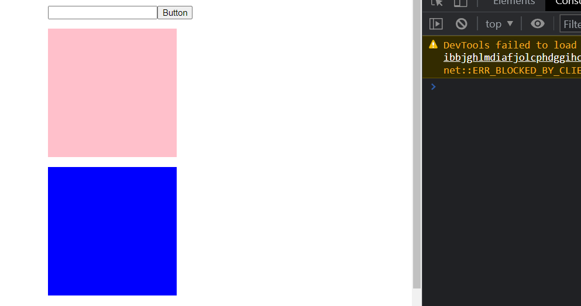

# React + TypeScript
#React #TypeScript 

## Первый компонент. Типизация пропсов. Interface CardProps

Для типизации пропсов создаётся отдельный файл, в котором находятся все типы компонента

Конкретно тут мы описываем тот объект с пропсами, который попадает в наш компонент с помощью интерфейса

Для описания того объекта, который передаётся между тегами (`<Tag>Этот объект</Tag>`) используется типизация свойства `children`, который имеет тип `ReactNode` 

`components > Card > CardProps.ts`
```TS
import { ReactChild, ReactNode } from 'react';

export interface ICardProps {
	children: ReactNode | ReactChild;
	width: string;
	height: string;
}
```

Далее при создании компонента нужно просто тому объекту, который передаётся деструктуризированным в качестве пропса присвоить тип в виде имени интерфейса

`components > Card > Card.tsx`
```TSX
import React from 'react';
import { ICardProps } from './CardProps';

const Card = ({ children, width, height }: ICardProps) => {
	return (
		<div style={{width, height, backgroundColor: 'cyan'}}>
			{children}
		</div>
	);
};

export default Card;
```

И теперь компилятор будет подсказывать, какие свойства обязательно должны быть переданы в компонент

`components > App > App.tsx`
```TSX
import React from 'react';
import Card from '../Card/Card';

const App = () => {
	return (
		<div>
			<Card width={'400px'} height={'400px'}>
				<button>Workink!</button>
			</Card>
		</div>
	);
};

export default App;
```


## React.FunctionComponent. React.FC

Если передаваемое свойство пропса имеет всего несколько фиксированных значений, то под них стоит выделить `enum` (перечисление). 

Типизация пропса-функции выглядит просто как: `(arg: type) => returnType`

`components > Card > CardProps.ts`
```TS
import { ReactChild, ReactNode } from 'react';

export enum CardVariant {
	OUTLINED = 'outlined',
	PRIMARY = 'primary',
}

export interface ICardProps {
	children: ReactNode | ReactChild;
	width: string;
	height: string;
	variant: CardVariant;
	onClick: () => void;
}
```

И более правильным вариантом для типизации самой функции и пропса, который она принимает, является использование `FunctionComponent<IПропс>` - эта запись покажет, что константа хранит функцию компонента с дженериком в виде его пропсов

`components > Card > Card.tsx`
```TSX
import React, { FunctionComponent } from 'react';
import { CardVariant, ICardProps } from './CardProps';

const Card: FunctionComponent<ICardProps> = ({ children, width, height, variant, onClick }) => {
	return (
		<div
			style={{
				width,
				height,
				backgroundColor: variant === CardVariant.OUTLINED ? 'lightgray' : 'cyan',
				border: variant === CardVariant.OUTLINED ? '1px solid black' : 'none',
			}}
			onClick={onClick}
		>
			{children}
		</div>
	);
};

export default Card;
```

Так же `FunctionComponent` имеет сокращённый вариант записи в виде `FC<>`

Ну и так же сама функция возвращает `JSX.Element` - это тоже можно указать

`components > App > App.tsx`
```TSX
import React from 'react';
import Card from '../Card/Card';
import { CardVariant } from '../Card/CardProps';

const App: FC = (): JSX.Element => {
	return (
		<div>
			<Card
				width={'400px'}
				height={'400px'}
				variant={CardVariant.OUTLINED}
				onClick={() => console.log('Card')}
			>
				<button>Workink!</button>
			</Card>
		</div>
	);
};

export default App;
```


## Компонент UserList. IUser, IAddress

Так же все глобальные сущности, которые используются сразу в нескольких компонентах, принято выносить отдельно в папку `types` 

`types > index.ts`
```TS
export interface IAddress {
	street: string;
	city: string;
	zipcode: string;
}

export interface IUser {
	id: number;
	name: string;
	email: string;
	address: IAddress;
}
```

И в одних интерфейсах спокойно можно использовать другие интерфейсы для описания принимаемых значений

`components > UserList > UserListProps.ts`
```TS
import { IUser } from '../../types';

export interface IUserList {
	users: IUser[];
}
```

И так выглядит вывод нескольких персонажей

`components > UserList > UserList.tsx`
```TSX
import React, { FC } from 'react';
import { IUserList } from './UserListProps';

const UserList: FC<IUserList> = ({ users }) => {
	return (
		<div>
			{users.map((user) => (
				<div key={user.id} style={{ padding: 15, border: '1px solid gray' }}>
					{user.id}. {user.name} ({user.email}) проживает в {user.address.city}/
					{user.address.street}
				</div>
			))}
		</div>
	);
};

export default UserList;
```

А тут происходит передача моковых данных в компонент списка пользователей

`components > App > App.tsx`
```TSX
import React, { useState } from 'react';
import Card from '../Card/Card';
import { CardVariant } from '../Card/CardProps';
import UserList from '../UserList/UserList';
import { IUser } from '../../types';

const App: FC = (): JSX.Element => {
	const users: IUser[] = [
		{
			id: 1,
			name: 'Antony',
			email: 'slice@ya.ru',
			address: { city: 'Penza', street: 'Value Street', zipcode: '123' },
		},
		{
			id: 2,
			name: 'Alexy',
			email: 'alexy.su@ya.ru',
			address: { city: 'Penza', street: 'Value Street', zipcode: '321' },
		},
	];

	return (
		<div>
			<Card
				width={'400px'}
				height={'400px'}
				variant={CardVariant.OUTLINED}
				onClick={() => console.log('Card')}
			>
				<button>Workink!</button>
			</Card>
			<UserList users={users} />
		</div>
	);
};

export default App;
```


## Компонент UserItem.

Тут мы создаём отдельный `UserItem`, который используется для вывода в `UserList`

`components > UserItem > UserItemProps.tsx`
```TS
import { IUser } from '../../types';

export interface IUserItemProps {
	user: IUser;
}
```

`components > UserItem > UserItem.tsx`
```TSX
import React, { FC } from 'react';
import { IUserItemProps } from './UserItemProps';

const UserItem: FC<IUserItemProps> = ({ user }) => {
	return (
		<div key={user.id} style={{ padding: 15, border: '1px solid gray' }}>
			{user.id}. {user.name} ({user.email}) проживает в {user.address.city}/
			{user.address.street}
		</div>
	);
};

export default UserItem;
```

`components > UserList > UserList.tsx`
```TSX
const UserList: FC<IUserList> = ({ users }) => {
	return (
		<div>
			{users.map((user) => (
				<UserItem user={user} />
			))}
		</div>
	);
};
```

## Типизация запроса axios. Типизация хука UseState()

Все запросы axios типизируются через дженерик `axios.get<Тип>()`

Примерно таким же образом выглядит типизация хука состояния, однако тут ещё в него нужно заранее поместить смежный с данными тип (`null`, `[]`): `useState<IUsers[]>([])`

`components > App > App.tsx`
```TSX
import React, { FC, useEffect, useState } from 'react';
import Card from '../Card/Card';
import { CardVariant } from '../Card/CardProps';
import UserList from '../UserList/UserList';
import { IUser } from '../../types';
import axios from 'axios';

const App: FC = (): JSX.Element => {
	const [users, setUsers] = useState<IUser[]>([]);

	async function fetchUsers() {
		try {
			const response = await axios.get<IUser[]>('https://jsonplaceholder.typicode.com/users');
			setUsers(response.data);
		} catch (e) {
			console.error(e);
		}
	}

	useEffect(() => {
		fetchUsers();
	}, []);

	return (
		<div>
			<Card
				width={'400px'}
				height={'400px'}
				variant={CardVariant.OUTLINED}
				onClick={() => console.log('Card')}
			>
				<button>Workink!</button>
			</Card>
			<UserList users={users} />
		</div>
	);
};

export default App;
```


## Переиспользуемый компонент List. Generics, Обобщенные типы в typescript

Создадим ещё один глобальный интерфейс тудушки

`types > index.ts`
```TS
export interface ITodo {
	id: number;
	title: string;
	completed: boolean;
}
```

И создадим общий компонент, который будет принимать в себя массив элементов динамического типа `<T>` и будет принимать в себя функцию для рендера одного элемента 

Данный компонент `List` будет рендерить любой массив элементов, который в него передали. Таким образом, мы создаём компонент с использованием обобщённых типов

`components > List > ListProps.ts`
```TS
import { ReactNode } from 'react';

export interface IListProps<T> {
	items: T[];
	renderItem: (item: T) => ReactNode;
}
```

`components > List > List.tsx`
```TSX
import React, { FC } from 'react';
import { IListProps } from './ListProps';

export default function List<T>(props: IListProps<T>) {
	return <div>{props.items.map(props.renderItem)}</div>;
}
```

Тут мы создаём компонент с отдельной тудушкой

`components > TodoItem > TodoItemProps.tsx`
```TS
import { ITodo } from '../../types';

export interface ITodoItemProps {
	todo: ITodo;
}
```

`components > TodoItem > TodoItem.tsx`
```TSX
import React, { FC } from 'react';
import { ITodoItemProps } from './TodoItemProps';

const TodoItem: FC<ITodoItemProps> = ({ todo }) => {
	return (
		<div>
			<input type='checkbox' checked={todo.completed} />
			{todo.id}. {todo.title}
		</div>
	);
};

export default TodoItem;
```

А тут уже подставляем компонент `List` для обоих массивов списков (персонажей и тудушек)

`components > App > App.tsx`
```TSX
import React, { FC, useEffect, useState } from 'react';
import Card from '../Card/Card';
import { CardVariant } from '../Card/CardProps';
import { ITodo, IUser } from '../../types';
import axios from 'axios';
import List from '../List/List';
import UserItem from '../UserItem/UserItem';
import TodoItem from '../TodoItem/TodoItem';
import './App.css';

const App: FC = (): JSX.Element => {
	const [users, setUsers] = useState<IUser[]>([]);
	const [todos, setTodos] = useState<ITodo[]>([]);

	async function fetchUsers() {
		try {
			const response = await axios.get<IUser[]>('https://jsonplaceholder.typicode.com/users');
			setUsers(response.data);
		} catch (e) {
			console.error(e);
		}
	}

	async function fetchTodos() {
		try {
			const response = await axios.get<ITodo[]>(
				'https://jsonplaceholder.typicode.com/todos?_limit=10',
			);
			setTodos(response.data);
		} catch (e) {
			console.error(e);
		}
	}

	useEffect(() => {
		fetchUsers();
		fetchTodos();
	}, []);

	return (
		<div className={'wrapper'}>
			<Card
				width={'400px'}
				height={'400px'}
				variant={CardVariant.OUTLINED}
				onClick={() => console.log('Card')}
			>
				<button>Workink!</button>
			</Card>
			<List
				items={users}
				renderItem={(user: IUser) => <UserItem user={user} key={user.id} />}
			/>
			<List
				items={todos}
				renderItem={(todo: ITodo) => <TodoItem todo={todo} key={todo.id} />}
			/>
		</div>
	);
};

export default App;
```


## Типизация событий. MouseEvents, DragEvents, ChangeEvents

>[!warning] Очень важно в начале указать, что все ивенты нужно доставать из **React**, потому что зачастую по умолчанию они достаются из **DOM**

Для атрибута `onChange` в TS присвоен тип `ChangeEvent<T>`, который в качестве дженерик-типа принимает тот тег, к которому применяется типизация

Для всех событий drag и drop используется один тип:
- `onDrag` - `DragEvent`
- `onDrop` - `DragEvent`
- `onDragOver` - `DragEvent`
- `onDragLeave` - `DragEvent`

`components > EventsEx > EventsEx.tsx`
```TSX
import React, { ChangeEvent, EventHandler, FC, useState } from 'react';

const EventsEx: FC = (): JSX.Element => {
	const [value, setValue] = useState<string>('');
	const [isDrag, setIsDrag] = useState<boolean>(false);

	// будет записывать в стейт значение из инпута
	const changeHandler = (e: React.ChangeEvent<HTMLInputElement>) => {
		setValue(e.target.value);
	};

	// будет выводить стейт в консоль
	const clickHandler = (e: React.MouseEvent<HTMLButtonElement>) => {
		console.log(value);
	};

	// при попытке драга, будет выводиться лог в консоль
	const dragHandler = (e: React.DragEvent<HTMLDivElement>) => {
		console.log('DRAG');
	};

	// будет срабатывать при 
	const dropHandler = (e: React.DragEvent<HTMLDivElement>) => {
		e.preventDefault();
		setIsDrag(false);
		console.log('DROP');
	};

	const leaveHandler = (e: React.DragEvent<HTMLDivElement>) => {
		e.preventDefault();
		setIsDrag(false);
		console.log('LEAVE');
	};

	const dragWithPreventHandler = (e: React.DragEvent<HTMLDivElement>) => {
		e.preventDefault();
		setIsDrag(true);
		console.log('DRAG OVER');
	};

	return (
		<div>
			<input type='text' value={value} onChange={changeHandler} />
			<button onClick={clickHandler}>Button</button>
			<div
				onDrag={dragHandler}
				draggable
				style={{
					width: 200,
					height: 200,
					backgroundColor: 'pink',
					margin: '15px 0px 15px 0px',
				}}
			></div>
			<div
				// сработает при попытке дропа в блок
				onDrop={dropHandler}
				// сработает, когда мы покинем блок
				onDragLeave={leaveHandler}
				// при нахождении внутри блока
				onDragOver={dragWithPreventHandler}
				style={{ width: 200, height: 200, backgroundColor: isDrag ? 'pink' : 'blue' }}
			></div>
		</div>
	);
};

export default EventsEx;
```

Введённая строка из инпута при нажатии на кнопку попадает в консоль


А уже тут при драге первого блока на второй меняется цвет последнего 




## Типизация хука useRef. Неуправляемый компонент

`useRef` принимает внутрь дженерика тип элемента, с которым он взаимодействует

`components > EventsEx > EventsEx.tsx`
```TSX
import React, { ChangeEvent, EventHandler, FC, useRef, useState } from 'react';

const EventsEx: FC = (): JSX.Element => {
	const [value, setValue] = useState<string>('');
	const [isDrag, setIsDrag] = useState<boolean>(false);

	const inputRef = useRef<HTMLInputElement>(null);

	// будет выводить стейт в консоль
	const clickHandler = (e: React.MouseEvent<HTMLButtonElement>) => {
		console.log(inputRef.current?.value);
	};

	/// CODE ...

	return (
		<div>
			<input ref={inputRef} type='text' placeholder={'Неуправляемый'} />
			<input type='text' value={value} onChange={changeHandler} placeholder={'Управляемый'} />
			
			/// CODE ...

		</div>
	);
};
```


## Типизация react-router-dom. UseHistory, useParams, BrowserRouter

Далее нам нужно будет реализовать многостраничность с помощью `react-router-dom` библиотеки

Для начала, нужно в `UserItem` установить обязательным наличие функции `onClick`, с помощью которой дальше мы будем навигироваться через `useNavigate` и переходить на страницу отдельного пользователя

`components > UserItem > UserItemProps.ts`
```TSX
import { IUser } from '../../types';

export interface IUserItemProps {
	user: IUser;
	onClick: (user: IUser) => void;
}
```

`components > UserItem > UserItem.tsx`
```TSX
import React, { FC } from 'react';
import { IUserItemProps } from './UserItemProps';

const UserItem: FC<IUserItemProps> = ({ user, onClick }) => {
	return (
		<div
			onClick={() => onClick(user)}
			key={user.id}
			style={{ padding: 15, border: '1px solid gray' }}
		>
			{user.id}. {user.name} ({user.email}) проживает в {user.address.city}/
			{user.address.street}
		</div>
	);
};

export default UserItem;
```

Это главная страница, с которой можно перейти на нужные ссылки

`components > pages > MainPage.tsx`
```TSX
import React, { FC } from 'react';
import { Link } from 'react-router-dom';

const MainPage: FC = () => {
	return (
		<div>
			<Link to={'/users'}>Пользователи</Link>
			<Link to={'/todos'}>Тудушки</Link>
		</div>
	);
};

export default MainPage;
```

Это компонент страницы с тудушками

`components > pages > TodosPage.tsx`
```TSX
import React, { FC, useEffect, useState } from 'react';
import { ITodo } from '../../types';
import axios from 'axios';
import TodoItem from '../TodoItem/TodoItem';
import List from '../List/List';

const TodosPage: FC = () => {
	const [todos, setTodos] = useState<ITodo[]>([]);

	async function fetchTodos() {
		try {
			const response = await axios.get<ITodo[]>(
				'https://jsonplaceholder.typicode.com/todos?_limit=10',
			);
			setTodos(response.data);
		} catch (e) {
			console.error(e);
		}
	}

	useEffect(() => {
		fetchTodos();
	}, []);

	return (
		<List items={todos} renderItem={(todo: ITodo) => <TodoItem todo={todo} key={todo.id} />} />
	);
};

export default TodosPage;
```


Это компонент списка пользователей

Тут уже задаём при клике по элементу списка навигирование на отдельную страницу с данными по пользователю 

`components > pages > UsersPage.tsx`
```TSX
import React, { FC, useEffect, useState } from 'react';
import axios from 'axios';
import { IUser } from '../../types';
import UserItem from '../UserItem/UserItem';
import List from '../List/List';
import { useNavigate } from 'react-router-dom';

const UsersPage: FC = () => {
	const [users, setUsers] = useState<IUser[]>([]);

	const navigate = useNavigate();

	async function fetchUsers() {
		try {
			const response = await axios.get<IUser[]>('https://jsonplaceholder.typicode.com/users');
			setUsers(response.data);
		} catch (e) {
			console.error(e);
		}
	}

	useEffect(() => {
		fetchUsers();
	}, []);

	return (
		<List
			items={users}
			renderItem={(user: IUser) => (
				<UserItem onClick={() => navigate(`${user.id}`)} user={user} key={user.id} />
			)}
		/>
	);
};

export default UsersPage;
```

Это компонент отдельной страницы пользователя

`components > pages > UserItemPage.tsx`
```TSX
import React, { FC, useEffect, useState } from 'react';
import { IUser } from '../../types';
import axios from 'axios';
import { Link, useNavigate, useParams } from 'react-router-dom';

interface IUserItemPageParams {
	id: string;
}

const UserItemPage: FC = () => {
	const [user, setUser] = useState<IUser | null>(null);

	// получаем параметры из ссылки
	const params = useParams<keyof IUserItemPageParams>();
	// получаем доступ к функции назначения ссылок на переходы в браузере
	const navigate = useNavigate();

	async function fetchUser() {
		try {
			const response = await axios.get<IUser>(
				'https://jsonplaceholder.typicode.com/users/' + params.id,
			);
			setUser(response.data);
		} catch (e) {
			console.error(e);
		}
	}

	useEffect(() => {
		fetchUser();
	}, []);

	return (
		<div>
			{/* устанавливаем ссылку для возвращения по кнопке */}
			<button onClick={() => navigate('/users')}>back</button>
			<h1>Страница пользователя {user?.name}</h1>
			<h4>Проживает в {user?.address.city}</h4>
		</div>
	);
};

export default UserItemPage;
```

Тут нужно сказать, что `useParams` в дженерик принимает строку с тем ключом, который к нему придёт, поэтому выше используется `keyof` от интерфейса

```TS
type Params = 'a' | 'b' | 'c';
// ...
const params = useParams<Params>();
```

Тут мы уже должны реализовать пути перехода ссылок в приложении

`components > App > App.tsx`
```TSX
import React, { FC } from 'react';
import './App.css';
import { BrowserRouter, Route, Routes } from 'react-router-dom';
import TodosPage from '../pages/TodosPage';
import UsersPage from '../pages/UsersPage';
import MainPage from '../pages/MainPage';
import UserItemPage from '../pages/UserItemPage';
import TodoItemPage from '../pages/TodoItemPage';

const App: FC = (): JSX.Element => {
	return (
		<BrowserRouter>
			<div>
				<Routes>
					<Route path={'/'} element={<MainPage />} />
					<Route path={'/todos'} element={<TodosPage />} />
					<Route path={'/users'} element={<UsersPage />} />
					<Route path={'/users/:id'} element={<UserItemPage />} />
					<Route path={'/todos/:id'} element={<TodoItemPage />} />
				</Routes>
			</div>
		</BrowserRouter>
	);
};

export default App;
```

На главной странице мы имеем две ссылки на разные списки:


Первая ссылка переводит на список пользователей

По каждому отдельному пользователю можно нажать и перейти на его страницу


После перехода на страницу появится краткая информация по пользователю. Кнопка *back* вернёт обратно на список пользователей


## Типизация Redux Toolkit / React-Redux

Типизации в индексном файле почти нет

`index.tsx`
```TSX
import React from 'react';
import ReactDOM from 'react-dom/client';
import './index.css';
import App from './App';
import reportWebVitals from './reportWebVitals';

import { Provider } from 'react-redux';
import store from './store';

const root = ReactDOM.createRoot(document.getElementById('root') as HTMLElement);
root.render(
	<Provider store={store}>
		<App />
	</Provider>,
);

reportWebVitals();
```

В самом `store` нужно будет только создать два типа, которые будут переиспользоваться внутри приложения (внутри кастомных хуков, которые будут типизировать стандартные функции `react-redux`)

`store > index.ts`
```TS
import { configureStore } from '@reduxjs/toolkit';
import todoReducer from './todoSlice';

const store = configureStore({
	reducer: {
		todos: todoReducer,
	},
});

export default store;

// RootState будет равен возвращаемому типу из store.getState
// то есть RootState будет принимать в себя ровно тот тип, который хранит объект хранилища
export type RootState = ReturnType<typeof store.getState>;

// тут мы определяем тип диспетча
export type AppDispatch = typeof store.dispatch;
```

Типизация `useDispatch` и `useSelector` занимает достаточно приличное время, и чтобы не типизировать каждый раз хуки из `react-redux`, можно сделать свои кастомные типизированные хуки

`hooks > index.ts`
```TS
// импортируем хуки для создания кастомных хуков
import { useDispatch, useSelector, TypedUseSelectorHook } from 'react-redux';

// импортируем типы из стора
import type { AppDispatch, RootState } from '../store';

// принято добавлять App в кастомные хуки, заменяющие оригинальные хуки библиотеки
export const useAppDispatch = () => useDispatch<AppDispatch>();

// теперь useSelector будет знать всё о структуре нашего приложения
export const useAppSelector: TypedUseSelectorHook<RootState> = useSelector;
```

Так выглядит нетипизированный срез:

`store > todoSlice.js`
```JS
import { createSlice } from '@reduxjs/toolkit';

const todoSlice = createSlice({
	name: 'todos',
	initialState: {
		todos: [],
	},
	reducers: {
		addTodo(state, action) {
			state.todos.push({
				id: new Date().toISOString(),
				title: action.payload.text,
				completed: false,
			});
		},
		toggleComplete(state, action) {
			const toggledTodo = state.todos.find((todo) => todo.id === action.payload.id);
			toggledTodo.completed = !toggledTodo.completed;
		},
		removeTodo(state, action) {
			state.todos = state.todos.filter((todo) => todo.id !== action.payload.id);
		},
	},
});

export const { addTodo, toggleComplete, removeTodo } = todoSlice.actions;

export default todoSlice.reducer;
```

Таким образом мы типизируем срез:

С помощью `PayloadAction` мы можем задать тип приходящего значения в `payload` 

`store > todoSlice.ts`
```TS
import { createSlice, PayloadAction } from '@reduxjs/toolkit';

// типизация addTodo пуша
type Todo = {
	id: string;
	title: string;
	completed: boolean;
};

// типизация initialState
type TodosState = {
	list: Todo[];
};

const initialState: TodosState = { list: [] };

const todoSlice = createSlice({
	name: 'todos',
	initialState,
	reducers: {
		// добавление тудушки
		addTodo(state, action: PayloadAction<string>) {
			state.list.push({
				id: new Date().toISOString(),
				title: action.payload,
				completed: false,
			});
		},
		// переключение выполненности
		toggleComplete(state, action: PayloadAction<string>) {
			const toggledTodo = state.list.find((todo) => todo.id === action.payload);
			// только если элемент toggledTodo не undefined, то поменяем состояние выполненности
			if (toggledTodo) toggledTodo.completed = !toggledTodo.completed;
		},
		// удаление тудушки по id, который приходит в виде строки
		removeTodo(state, action: PayloadAction<string>) {
			state.list = state.list.filter((todo) => todo.id !== action.payload);
		},
	},
});

export const { addTodo, toggleComplete, removeTodo } = todoSlice.actions;

export default todoSlice.reducer;
```

И теперь рут будет всегда знать, что должно находиться внутри него  


Используем вместо хука `useDispatch` наш кастомный типизированный `useAppDispatch()`

`components > TodoItem.tsx`
```TSX
import { useAppDispatch } from '../hooks';
import { toggleComplete, removeTodo } from '../store/todoSlice';
import { FC } from 'react';

interface ITodoItemProps {
	id: string;
	title: string;
	completed: boolean;
}

const TodoItem: FC<ITodoItemProps> = ({ id, title, completed }) => {
	const dispatch = useAppDispatch();

	return (
		<li>
			<input
				type='checkbox'
				checked={completed}
				onChange={() => dispatch(toggleComplete(id))}
			/>
			<span>{title}</span>
			<span onClick={() => dispatch(removeTodo(id))}>&times;</span>
		</li>
	);
};

export default TodoItem;
```

И так же используем вместо `useSelector` типизированную версию `useAppSelector()`

`components > TodoList.tsx`
```TSX
import TodoItem from './TodoItem';  
import { FC } from 'react';  
import { useAppSelector } from '../hooks';  
  
const TodoList: FC = () => {  
   const todos = useAppSelector((state) => state.todos.list);  
  
   return (  
      <ul>{todos.map((todo) => (  
            <TodoItem key={todo.id} {...todo} />  
         ))}  
      </ul>   
	);  
};  
  
export default TodoList;
```

И благодаря тому, что `useAppSelector` знает, что находится внутри стора, то мы всегда можем получить актуальное значение из него (работает автокомплит, видны типы)


Ну и простая типизация компонента:

`components > NewTodoForm.tsx`
```TSX
import { FC } from 'react';

interface INewTodoItemProps {
	value: string;
	updateText: (arg: string) => void;
	handleAction: () => void;
}

const NewTodoForm: FC<INewTodoItemProps> = ({ value, updateText, handleAction }) => {
	return (
		<label>
			<input
				placeholder='new todo'
				value={value}
				onChange={(e) => updateText(e.target.value)}
			/>
			<button onClick={handleAction}>Add todo</button>
		</label>
	);
};

export default NewTodoForm;
```

Тут так же нужно будет передать `payload` вне скобок `{}` и использовать `useAppDispatch()`

`App.tsx`
```TSX
import { useState } from 'react';

import { addTodo } from './store/todoSlice';
import NewTodoForm from './components/NewTodoForm';
import TodoList from './components/TodoList';

import './App.css';
import { useAppDispatch } from './hooks';

function App() {
	const [text, setText] = useState<string>('');
	const dispatch = useAppDispatch();

	const handleAction = () => {
		if (text.trim().length) {
			dispatch(addTodo(text));
			setText('');
		}
	};

	return (
		<div className='App'>
			<NewTodoForm value={text} updateText={setText} handleAction={handleAction} />
			<TodoList />
		</div>
	);
}

export default App;
```

И теперь тудушка работает так, как должна


## Типизация асинхронного Redux Toolkit

Стандартный Thunk в [проекте](https://github.com/michey85/redux-toolkit-todo/blob/asyncthunk/src/store/todoSlice.js) выглядел подобным образом:

`store > todoSlice.js`
```JS
/// CODE ...

export const fetchTodos = createAsyncThunk(
    'todos/fetchTodos',
    async function(_, {rejectWithValue}) {
        try {
	        // делаем запрос на сервер
            const response = await fetch('https://jsonplaceholder.typicode.com/todos?_limit=10');

			// если ответ не океюшный, то выплёвываем ошибку
            if (!response.ok) {
                throw new Error('Server Error!');
            }

			// это наши данные
            const data = await response.json();

			// возвращаем данные
            return data;
        } catch (error) {
	        // в противном случае выплёвываем ошибку
            return rejectWithValue(error.message);
        }
    }
);

/// CODE ...

const todoSlice = createSlice({
    name: 'todos',
    initialState: {
        todos: [],
        status: null,
        error: null,
    },
    reducers: {
        addTodo(state, action) {
            state.todos.push(action.payload);
        },
        toggleComplete(state, action) {
            const toggledTodo = state.todos.find(todo => todo.id === action.payload.id);
            toggledTodo.completed = !toggledTodo.completed;
        },
        removeTodo(state, action) {
            state.todos = state.todos.filter(todo => todo.id !== action.payload.id);
        }
    },
    extraReducers: {
        [fetchTodos.pending]: (state) => {
            state.status = 'loading';
            state.error = null;
        },
        [fetchTodos.fulfilled]: (state, action) => {
            state.status = 'resolved';
            state.todos = action.payload;
        },
        [fetchTodos.rejected]: setError,
        [deleteTodo.rejected]: setError,
        [toggleStatus.rejected]: setError,
    },
});
```

И тут уже типизируем все асинхронные функции редакса:

`store > todoSlice.tsx`
```TSX
import { AnyAction, createAsyncThunk, createSlice, PayloadAction } from '@reduxjs/toolkit';
import { stat } from 'fs';

type Todo = {
	id: string;
	title: string;
	completed: boolean;
};

type TodosState = {
	list: Todo[];
	loading: boolean;
	error: string | null;
};

// запрос на сервер на получение списка задач
// дженерик - то, что получаем с сервера / первый аргумент функции (опции) / типизируем второй аргумент функции Thunk'а (чтобы они были не unknown)
export const fetchTodos = createAsyncThunk<Todo[], undefined, { rejectValue: string }>(
	'todos/fetchTodos',
	async function (_, { rejectWithValue }) {
		const response = await fetch('https://jsonplaceholder.typicode.com/todos?_limit=10');

		if (!response.ok) {
			return rejectWithValue('Server Error!');
		}

		const data = await response.json();

		return data;
	},
);

// удаление задачи
export const deleteTodo = createAsyncThunk<string, string, { rejectValue: string }>(
	'todos/deleteTodo',
	async function (id, { rejectWithValue }) {
		const response = await fetch(`https://jsonplaceholder.typicode.com/todos/${id}`, {
			method: 'DELETE',
		});

		if (!response.ok) {
			return rejectWithValue("Can't delete task. Server error.");
		}

		return id;
	},
);

// переключение статуса задачи
export const toggleStatus = createAsyncThunk<
	Todo,
	string,
	{ rejectValue: string; state: { todos: TodosState } }
>('todos/toggleStatus', async function (id, { rejectWithValue, dispatch, getState }) {
	const todo = getState().todos.list.find((todo) => todo.id === id);

	if (todo) {
		const response = await fetch(`https://jsonplaceholder.typicode.com/todos/${id}`, {
			method: 'PATCH',
			headers: {
				'Content-Type': 'application/json',
			},
			body: JSON.stringify({
				completed: !todo.completed,
			}),
		});

		if (!response.ok) {
			return rejectWithValue("Can't toggle status. Server error.");
		}

		return (await response.json()) as Todo;
	}

	return rejectWithValue('No such todo in list');
});

// добавление нового todo
export const addNewTodo = createAsyncThunk<Todo, string, { rejectValue: string }>(
	'todos/addNewTodo',
	async function (text, { rejectWithValue, dispatch }) {
		const todo = {
			title: text,
			userId: 1,
			completed: false,
		};

		const response = await fetch('https://jsonplaceholder.typicode.com/todos', {
			method: 'POST',
			headers: {
				'Content-Type': 'application/json',
			},
			body: JSON.stringify(todo),
		});

		if (!response.ok) {
			return rejectWithValue("Can't add task");
		}

		// Возвратом от сервера будет одна задача из списка
		return (await response.json()) as Todo;
	},
);

const initialState: TodosState = { list: [], loading: false, error: null };

const todoSlice = createSlice({
	name: 'todos',
	initialState,
	reducers: {},
	// сюда уже стоит передать наши асинхронные редьсюеры
	// тут уже стоит использовать не объект для реализации функций редьюсера, а builder
	extraReducers: (builder) => {
		builder
			.addCase(fetchTodos.pending, ({ error, loading }, action) => {
				loading = true;
				error = null;
			})
			.addCase(fetchTodos.fulfilled, (state, action) => {
				state.list = action.payload;
				state.loading = false;
			})
			.addCase(fetchTodos.rejected, (state, action) => {
				state.loading = false;
				state.error = 'Error';
			})
			.addCase(addNewTodo.pending, (state, action) => {
				state.loading = true;
				state.error = null;
			})
			.addCase(addNewTodo.fulfilled, (state, action) => {
				state.list.push(action.payload);
			})
			.addCase(toggleStatus.fulfilled, (state, action) => {
				const toggleTodo = state.list.find((todo) => todo.id === action.payload.id);
				if (toggleTodo) {
					toggleTodo.completed = !toggleTodo.completed;
				}
			})
			.addCase(deleteTodo.fulfilled, (state, action) => {
				state.list = state.list.filter((todo) => todo.id === action.payload);
			})
			// реализуем reject для всех состояний
			.addMatcher(isError, (state, action: PayloadAction<string>) => {
				state.loading = false;
				state.error = action.payload;
			});
	},
});

// эта функция будет проверять, прилетела ли нам ошибка
function isError(action: AnyAction) {
	return action.type.endsWith('rejected');
}

export default todoSlice.reducer;
```

- Первый тип - это возвращаемое значение из функции
- Второй тип - это тот `action.payload`, который попадает в функцию 
- Третий тип - это те функции, которые мы вытаскиваем из Thunk'а


Теперь нужно тут заменить старый функционал на `toggleStatus` и `deleteTodo`

`components > TodoItem.tsx`
```TSX
import { useAppDispatch } from '../hooks';
import { toggleStatus, deleteTodo } from '../store/todoSlice';
import { FC } from 'react';

interface ITodoItemProps {
	id: string;
	title: string;
	completed: boolean;
}

const TodoItem: FC<ITodoItemProps> = ({ id, title, completed }) => {
	const dispatch = useAppDispatch();

	return (
		<li>
			<input
				type='checkbox'
				checked={completed}
				onChange={() => dispatch(toggleStatus(id))}
			/>
			<span>{title}</span>
			<span onClick={() => dispatch(deleteTodo(id))}>&times;</span>
		</li>
	);
};

export default TodoItem;
```

И тут добавляем новые функции запроса на сервер для получения задач `fetchTodos` и добавления новых задач `addNewTodo`

`App.tsx`
```TSX
import { useEffect, useState } from 'react';

import { fetchTodos, addNewTodo } from './store/todoSlice';
import NewTodoForm from './components/NewTodoForm';
import TodoList from './components/TodoList';

import './App.css';
import { useAppDispatch, useAppSelector } from './hooks';
import { useSelector } from 'react-redux';

function App() {
	const [text, setText] = useState<string>('');
	const { loading, error } = useAppSelector((state) => state.todos);
	const dispatch = useAppDispatch();

	useEffect(() => {
		dispatch(fetchTodos());
	}, [dispatch]);

	const handleAction = () => {
		if (text.trim().length) {
			dispatch(addNewTodo(text));
			setText('');
		}
	};

	return (
		<div className='App'>
			<NewTodoForm value={text} updateText={setText} handleAction={handleAction} />

			{loading && <h2>Loading...</h2>}
			{error && <h2>An error occurred: {error}</h2>}

			<TodoList />
		</div>
	);
}

export default App;
```

И теперь наше приложение полностью построено на асинхронных функциях


