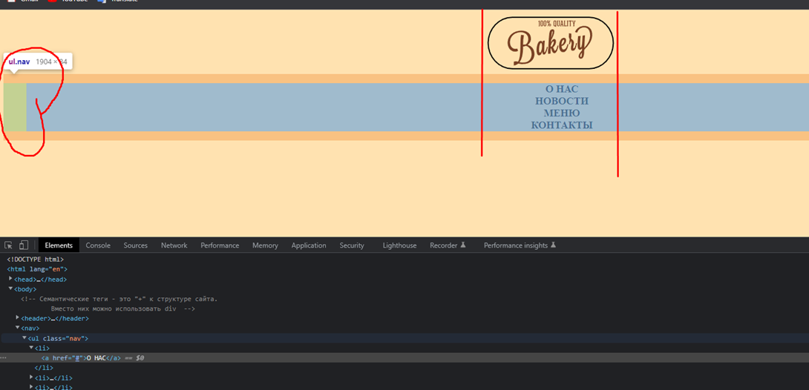
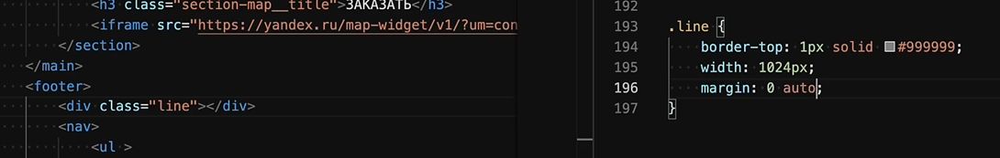

#HTML #CSS 

### 3.3 Правильная структура файлов и папок проекта

В `dist` будет храниться конечный сайт со сжатыми и вырезанными изображениями, без лишних файлов. В `src` мы ведём работу над сайтом

### 3.4 Как использовать плагины VS Code

Настройка постоянного автосохранения

### 3.5 Как работают семантические теги

Семантические теги позволяют нам делить сайт на понятные человеку блоки

### 3.6 Как работать с цветом в верстке

Мы либо вводим конкретные цвета с макета, либо подбираем встроенным в ВС плагином

### 3.7 Как добавить изображение на сайт через тег IMG

### 3.8 Как работает консоль разработчика в браузере

Консоль разработчика представляет из себя многофункциональный инструмент. Слева кнопка для быстрого выбора элемента и чуть правее для проверки адаптива. Код можно изменять в реальном времени (до перезагрузки страницы). CSS-код можно менять в правом верхнем блоке (для элемента), второй блок – это стили по умолчанию, третий – это проверка отступов

Кнопка мобильника даёт доступ к функционалу для проверки адаптива

### 3.9 Как создать меню и ссылки

Вот мы добавили список с навигацией без точек и вертикально

У каждого блока со списком есть такая особенность, что сбоку есть определённый отступ, который нужно уже самостоятельно убирать

### 3.10 Теги списков UL и OL

### 3.11 Как задавать отступы элементам с помощью margin и padding

В систему отступов входят: `margin`, `border` и `padding`. Чтобы их задать можно использовать одноимённые наименования инструкций. Вписываются значения инструкций по часовой стрелке (первое значение отвечает за значение `top`)

### 3.12 Как работают блочные и строчные элементы

Строчные элементы располагаются рядом до тех пор, пока не закончится строка

Блочные элементы занимают полностью всё пространство в ширину

Внутрь блочных элементов можно положить строчные, а наоборот - нельзя

Так же у строчных и блочных элементов может отличаться поведение при отступах и изменениях размеров. Только блочные элементы реагируют на задание `width` и `height`

А в данной вкладке можно увидеть, какие стили неприменимы к определённым тегам. Тут можно увидеть, что строчный тип всегда инлайновый, высоту поменять ему не получится и ширину тоже

Но блочный элемент можно так же сделать строчным и строчный блочным. За это отвечает инструкция `display: inline/block`

Либо, что куда чаще используется, можно элемент сделать инлайново-блоковым. То есть у элемента сохранятся отступы, но он не будет съедать всю строку, что даст расположить другие элементы рядом с ним

- Итого:

| Строчные                                                                  | Блочные                            |
| ------------------------------------------------------------------------- | ---------------------------------- |
| Строчные элементы занимают только то место, которое они заняли            | Блочные занимают всю строку        |
| В строчные элементы нельзя вкладывать блочные элементы                    | В блочные можно вставлять строчные |
| У строчных элементов нельзя сделать вертикальные отступы с помощью margin |                                    |
| Строчным элементам нельзя задать ширину                                   |                                    |

> Любой строчный или блочный элемент можно превратить в блочный или строчный

### 3.13 Что такое Cхлопывание margin

Очень частой проблемой в отступах является схлопывание марджинов. Дело в том, что при соприкосновении двух марджинов (на рисунках 100 нижнее соприкасается с 40 верхнего), самый бОльший марджин съедает самый меньший. На изображении отступ вместо 140 будет равен 100, так как остаётся только бОльший

### 3.14 Правильная организация отступов в верстке ч.1

Если мы используем марджины, то стараемся их использовать слева-направо и сверху-вниз. То есть **_мы используем_** `margin-right` **_и_** `margin-bottom`.

Например, если нам нужно опустить навигационное меню ниже от логотипа, то отступ будем задавать не списку, а логотипу. То есть `margin-bottom` пропишем для логотипа.
Правило: **_элемент не может двигать сам себя, его должен двигать другой элемент_**

И теперь мы можем себе позволить сделать ровное меню. Делаем отступы от логотипа вниз 20 пикселей и от навигационного меню вниз. Обнуляем паддинг слева у списка. Делаем элементы списка `li` инлайновыми (чтобы они шли в ряд) и добавляем расстояние между элементами 100 пикселей

### 3.15 Как использовать Псевдоклассы

Псевдоклассы – это определённые модификаторы селекторов обращения, которые позволяют выделить определённый элемент или функцию объекта тега. Например, чтобы выровнять навигационную панель, нам нужно убрать отступ у последнего элемента списка (`100px`). Чтобы не вписывать класс этому элементу, мы отдельно допишем надстройку, которая будет влиять только на этот последний элемент

### 3.16 Правильная организация отступов в верстке ч.2

> 3 Правило. Например, нам нужно подвинуть ниже логотип. Чтобы пододвинуть этот логотип, нам нужно задать паддинг родительского элемента (body) на нужное для нас расстояние

### 3.17 Как быстро сбросить кеш вашего браузера

Данный функционал может пригодиться в тех случаях, когда наш сайт загружен в кеш и нам нужно отобразить новый контент, который не хочет отображаться. Нужно открыть консоль разработчика и с ПКМ тыкнуть по перезагрузке страницы

### 3.18 Как добавить изображение используя свойство background-image

`background-size: contain` – растягивает в высоту (сохраняя пропорции), `cover` – растягивает в ширину (сохраняя пропорции)

Если `Attachment` задать как фиксированный, то задник будет прокручиваться вместе с полосой прокрутки

И сейчас мы можем нормально вставить фон для сайта в нужное нам место. Через первую инструкцию мы подключили фотографию из другой папки, второй отпозиционировали фотографию по-центру (потому как была видна только обрезанная часть булки хлеба), третьей отключили повторение фотографии при растягивании, последняя инструкция позволила нормально растягивать фотографию так, чтобы она всегда сохраняла растягивание по ширине (по высоте будет меняться видимость фотографии при приближении/отдалении сайта)

Если мы хотим всё написать одной инструкцией, то нам нужно разделять `size` и `position` через слэш

И краткая инструкция по тому, как использовать данный инструментарий

### 3.19 Позиционирование элементов на веб странице

Для минимального позиционирования мы используем марджины и паддинги

Для более продвинутого позиционирования мы должны использовать уже три измерения, чтобы накладывать объекты друг на друга

Тут описаны все значения инструкции `position`

Позиционирование `relative` позволяет изменять положение элемента от его положения в коде либо от соседей (например, третий блок оттолкнулся от второго сверху, первый блок оттолкнулся от родительского элемента сверху и слева)

Уже значение `absolute` вырывает объект из потока элементов, которые присутствуют на странице. Все смещения положения осуществляются относительно `body` (на первом рисунке блок занял положение по 2 пикселя от начала страницы, а не от его враппера). Но уже когда мы указали у родителя данного блока значение `relative`, то отсчёт смещения начался от `wrapper`.

Элемент абсолютно вырывается из потока и его можно расположить в любом месте на странице. Он уже не опирается ни на что в браузере. Можно считать, что для него уже нет других элементов в браузере

Используется такое позиционирование только тогда, когда не получится использовать `margin` и `padding` (например, во всплывающих уведомлениях)

Фиксированное положение заставляет блок висеть в определённом месте постоянно. Блок фиксируется на одном месте и сохраняет его при прокрутке (можно использовать для хэдера)

Стики позволяет прилепить блок к верху браузера при прокрутке. Тут уже обязательно нужно указать хоть какое-то положение блока, чтобы стики начал работать

### 3.20 Как работает z-index

Эта инструкция позволяет указать индекс объекта в трёхмерном пространстве (отображает выше тот, у которого выше значение). Применяется она только на все ПОЗИЦИОНИРОВАННЫЕ объекты (любое значение кроме `static`). По умолчанию стоит значение «0»

### 3.21 Как добавить градиентную заливку через CSS

Градиентная заливка добавляется через инструкцию `background` со значением `linear-gradient`. Первое значение обозначает градус, под которым пойдёт цвета, а все остальные значения – это цвета. Цвет пишется вместе с процентом его заполнения (оранжевый заполняет первые 30% блока, от 30 до 40% идёт смешивание цветов и остальное пространство делится напополам синий с красным)

Для сайта делаем точно так же, но тут мы укажем цвет с прозрачностью (альфаканал)

### 3.22 Выравнивание элементов по горизонтали

Мы знаем такую инструкцию как `text-align`, с помощью которой мы выравниваем объекты. Основная проблема заключается в том, что она выравнивает только строковые элементы.

Чтобы выровнять по горизонтали БЛОЧНЫЙ элемент, нужно использовать: `margin 0 auto`

Но оно будет работать только тогда, когда у элемента будет задано свойство `width`! То есть у блочного элемента должна быть конкретная ширина, иначе отступы не получится сделать

Чтобы сделать отступ внутри, придётся сделать `padding` в родителе. Высота бокса родителя = 190 пикселей, а внутренний бокс имеет высоту 160 пикселей. Получается, нам нужно сделать паддинг в родителе равным 15 пикселям, чтобы внутренний бокс находился по середине и по вертикали. Однако, как мы видим, бокс начал расширяться снизу. Чтобы решить эту проблему, придётся прибегнуть к использованию `box-sizing`

### 3.23 Box-sizing. Отступы внутри размера элемента

По умолчанию в спецификации CSS размеры при использовании `padding` и `margin` складываются. Так при высоте бокса в 190 пикселей и добавлении верхнего `padding` 15 пикселей – конечным значением размера бокса будет 205 пикселей

При использовании данной инструкции, у нас все `poadding` и `margin` будут учитываться в размере элемента.

То есть элемент был 190 по размеру. Если мы добавим паддинг в 15 пикселей, то и размер самого бокса уменьшится до 175 пикселей, чтобы вписаться в размер элемента

> Практика

И сейчас мы впишем нужный текст. У текстовых блоков так же есть начальные `margin` - обнуляем их. Вставляем нужный фонт-сайз и делаем нужные нам `padding` и `margin` по правилу отталкивания от других объектов

### 3.24 Единицы измерения CSS

В CSS есть две основные единицы измерения: px и %. Проценты изменяют значение относительно изначального

По макету мы можем выставить отталкивание в пикселях, но так же нам никто не мешает посчитать %-ное соотношение между шириной макета и положением блока (положение_блока / ширина_макета)

И теперь, если выставить %-ное позиционирование на сайте нашего блока, то при любых размерах этот блок будет находиться на одном статичном месте

### 3.25 Селекторы CSS

Первое, что хочется отметить, так это то, что в одну строку можно вставлять несколько названий классов. Новое название пишется через пробел. Таким образом можно создать универсальный класс, который просто можно быстро вставить, и который будет хранить определённые css-инструкции.

Если вписать селектор класса и после него вписать селектор тега, то обращение будет идти к элементам внутри этого класса. Так же можно дописать и псевдокласс.

Тут строчные `img` запихнули в див и перевели изображения в инлайновый блок, чтобы задать им расстояния между друг другом и распределение по центру задали через строчное выравнивание (`img` сейчас работает как блочный и строчный элемент)

### 3.26 Тег span

Тут мы можем увидеть определённую интересную особенность. Теги `p` и `h2` изначально являются блоковыми, так что если мы на них используем инструкцию `text-align: center`, то внутри этих блоков будет выровнен текст. Это позволяет нам не пихать эту инструкцию в родителя. Грубо говоря, эти теги и есть родители для текста внутри них

Тег span используется в качестве выделителя определённого участка текста

### 3.27 Can i use

Иногда нам может потребоваться сделать сайт, который должен поддерживаться большинством сайтов (включая ослик). Есть такие свойства CSS-кода, которые не поддерживаются всеми сайтами и потому нам на помощь может прийти данный сайт, который покажет совместимость свойства и браузера определённой версии

Уже данный сервис позволяет взглянуть на наш сайт через любой другой сайт любой другой версии

### 3.28 Normalize.css и Reset.css - Сброс стилей браузера

Как мы видим, есть очень много элементов, у которых есть свои стили и отступы, и за которыми уследить крайне сложно даже на самом маленьком проекте

Поэтому люди придумали использовать: `reset.css` – сброс отступов у всех блоков, `normalize.css` – сброс стилей для всех элементов

Так же хочется упомянуть, что можно подключать стили и фотографии, которые располагаются на других информационных ресурсах из сети

### 3.29 Как добавить интерактивную карту на сайт

Тут описано, как вставить яндекс-карту

### 3.30 Тег HR или как отрисовать линию

В первую очередь нам нужно понять, что сделать линию можно многими способами (благодарим многолетние развитие технологий)

Однако есть отдельный тег, который был создан специально для отображения линий. Его так же можно редактировать через свойство border

Так же тут хочется упомянуть, что марджины и паддинги не смогут доть нам дополнительное пространство снизу, поэтому можно задать на глаз высоту для отдельного отсека - футера

### 3.31 Как использовать разные шрифты на сайте

Стоит отметить, что шрифт разделяется по весу. В CSS вес определяется цифрой

Меняем шрифт через `font-family`. Если название шрифта состоит из одного слова, то можно написать без кавычек. Если из двух, то с кавычками. Посмотреть шрифт можно прямо в инспекторе (там же можно найти в `font-weight` во вкладке *comuted*). Шрифты берутся из базы шрифтов на нашем компьютере (по-другому мы их не увидим)

Такая запись уже будет означать, что сайт будет искать на компьютере сначала Эриал, потом, если не найдёт, то Хельветику, а если не найдёт и её, то будет искать любой шрифт без засечек

Вот так через гугл фонтс можно скопировать линк и подключить шрифт. В первом блоке хранится ссылка на шрифт, во втором правила для CSS для подключения шрифта (скопировать-вставить)

Ну и третий способ подключения шрифтов: локальный. Мы закидываем нужные нам шрифты в папку fonts. Далее в CSS-коде пропишем подключение нашего шрифта. Дальше можем его использовать в проекте (то название, которое мы вписали в фонт-фэмили). Вторая инструкция будет искать у пользователя на компьютере данный шрифт при включении сайта

И покажем чуть более продвинутый третий способ. Тут уже качаем все три формата одного начертания шрифта. Это делается для поддержки большей части браузеров

Чтобы браузер понял, какое начертание нам нужно, нужно указать вес каждого шрифта

### 3.32 Как устанавливать шрифты на компьютер

Единственное о чем мы не поговорили в прошлом видео это о том как установить шрифт скачанный из интернета, на ваш компьютер, так чтобы установленный, новый шрифт, можно было использовать в любой программе, такой как Microsoft Office Word.

Чтобы установить новый шрифт, вам нужно:

1) Скачать файл шрифта из интернета, например в формате TTF, с любого сайта, например с fonts.google.

2) Нажать 2 раза на скачанный файл шрифта, левой кнопкой мыши.

3) В открывшемся окне, нажать на кнопку, установить.

Теперь, установленный шрифт, автоматически попадет во все программы.

### 3.33 Загружаем сайт на реальный хостинг. Выбор и настройка домена (смотреть видео)

Чтобы загрузить сайт, нам нужно найти любой сайт с доменами и купить на нём домен. Если есть возможность, приобретаем там же место на хостинге и SSL-защиту (она превратит http в https (защищённое подключение))

Далее через IPSManager нам нужно закинуть сайт на хостинг

Стоит следовать инструкции из видео

### 3.34 Как редактировать сайт загруженный на хостинг, через VS Code (смотреть видео)

В VSCode есть возможность редактировать уже загруженный на сервер сайт. То есть можно не перескачивать сайт каждый раз. Достаточно просто подключиться к нему. Делается это с помощью плагина SFTP

`Ctrl+Shift+P` – SFTP – переходим в файл конфигурации

Тут мы должны ввести обязательно хост, порт, имя пользователя, путь до сайта (в айпиэске смотреть), пароль (не обязательно, но это ускорит работу) и последняя настройка будет загружать автоматически все изменения при сохранении на сервер (если тру)

И отсюда уже идёт подключение к серверной папке

Чтобы включить режим редактирования, нужно разрешить редактирование. Чтобы загрузить изменения (если фолс на автозагрузке), нужно нажать на аплоад

