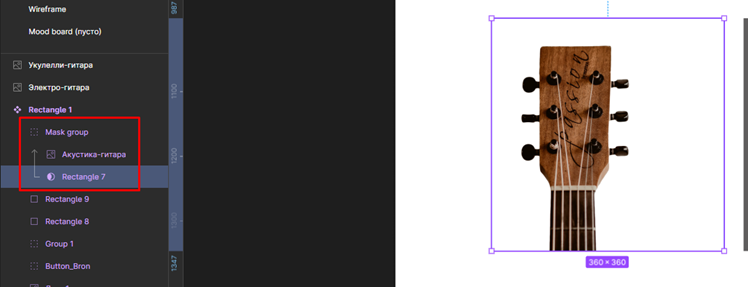
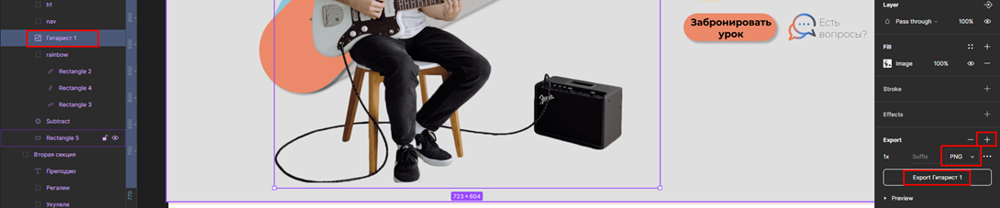

#FlexBox #Design 

### 4.4 Какой размер у сайта

Размер контента стоит умещать в 1000-1300 пикселей

Добавить новое шаблонное поле можно через вкладку с решёткой

### 4.5 Как сохранить свой проект

Проект сохраняется всегда автоматически. Можно отдельно сохранить определённую версию сайта, чтобы была возможность откатиться к ней

### 4.6 Как работать с сетками и направляющими

В режиме ==add component== (сверху посередине) мы переходим в режим, в котором мы сможем сбоку добавить элемент сетки. Выбираем колонки, их количество, непрозрачность, тип растягивания, марджины по бокам и расстояние между колонками

### 4.8 Mood board и поиск вдохновения

Муд борд обычно создают второй страницей в фигме для удобства использования. В основе своей примеры работ берут с Pinterest и Dribble

### 4.9 Создаем wireframe проекта

Делаем простой небольшой набросок сайта ректанглами и лайнами. Чтобы сетка нормально работала на отдельном пейдже, нужно будет сделать все элементы сначала, а не простокопировать

### 4.10 Стоковые площадки. Где найти идеальное фото

- Unsplash, 
- Pexels, 
- Freepik

### 4.11 Как работать с изображениями в figma

Через данный пункт можно вставить изображение в фигме. Изображение можно вставить сразу в определённый блок для него или можно просто закинуть в любое место

Два раза кликнув по изображению, выйдут его настройки. Стоит поставить фит, чтобы изображение на съёживалось и сохраняло размер

Так же хочется упомянуть, что в качестве ограничителя стоит выставить линию в 800 пикселей. Обычно именно такой размер имеет обычный блок на сайте

### 4.12 Иерархия элементов в figma

Чтобы удобно копировать и создавать объекты (пропорционально и от центра), используем `alt/shift/ctrl`. Чтобы менять положение в иерархии, используем `ctrl+/` (на однй ступень) либо просто `/` (в самый низ/верх)

### 4.13 Как работать с цветом в figma

### 4.14 Разница UX и UI

> UI (user interface) – отвечает за интерфейс, его внешний вид и красоту.

> UX (user experience) – отвечает за удобство использования интефрейса.

### 4.15 Как создавать текст в figma

### 4.16 Линии и обводка фигур

### 4.17 Как группировать элементы

Выделяем несколько элементов и нажимаем на `Ctrl+G`

При создании групп может быть такая проблема, что при изменении размеров макета может поехать и его группа. Чтобы избежать таких проблем, нужно удерживать `Ctrl` при изменении размера нашего макета или блока

### 4.19 Как работать с иконками

Во-первых, можно поискать иконки во вкладке коммьюнити фигмы

Дальше берём нужные нам иконки и закидываем в проект. Если мы будем работать с СВГ (векторными) иконками, то у нас будет возможность менять им цвет и редактировать их прямо в фигме

Так же можно добавить строук на наши иконки (или убрать его)

### 4.20 Как работать с градиентом

В разделе изменения цвета можно задать градиент четырёх разных типов

### 4.21 Как работатет инструмент subtract

### 4.22 Стоковая площадка по иконкам. Поиск иконок

Стоит пользоваться площадкой [flaticon](https://www.flaticon.com/). На ней так же можно менять цвет иконок (если зарегистрирован)

### 4.23 Как работать с масками слоя

Выбираем два элемента, нажимаем на данную кнопочку и имеем сбоку отображение группы маски

Так же между объектами маски можно вставлять другие элементы. Они будут тоже обрезаться начальной маской

Если нажать на объект и удерживать `alt`, то можно увидеть расстояние до каждого объекта

### 4.24 Как использовать рыбный текст в figma

Отметим междустрочный интервал. Его можно сделать кастомный, а можно выставить настройку авто

Чтобы добавить рыбный текст, можно использовать [специальный сайт-рыбу](fishtext.tu)

### 4.25 Как добавлять эффекты к элементам

В нижней вкладке эффектов тыкаем на плюсик и выбираем нужный эффект

### 4.26 Экспорт из figma и передача в разработку

Поделиться с любым человеком дизайном можно через шейр

Чтобы скопировать себе скинутую работу, нужно нажать на создание дубликата в мои драфты (тем самым можно править чужой дизайн под себя)

Чтобы экспортировать изображение, нужно воспользоваться палитрой экспорта

Так же можно получить справочную информацию для вёрстки

Так же можно сохранить вёрстку на ПК

Импорт локального файла в фигму

 