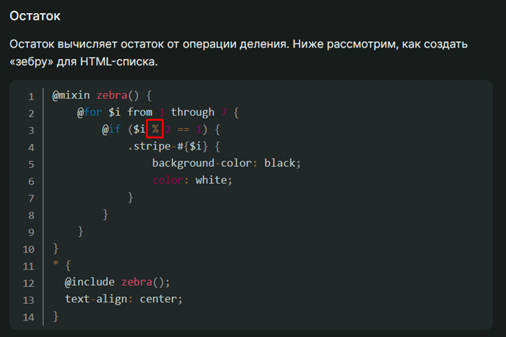
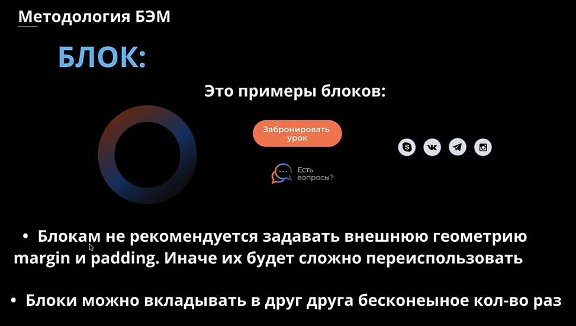
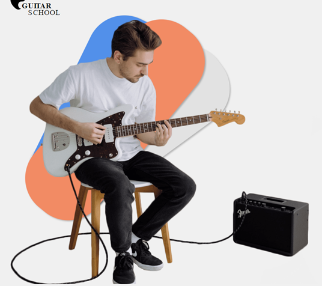
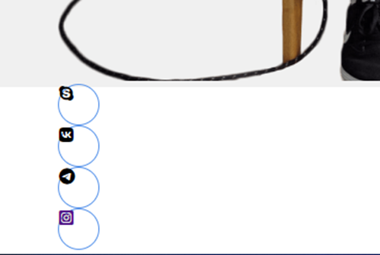
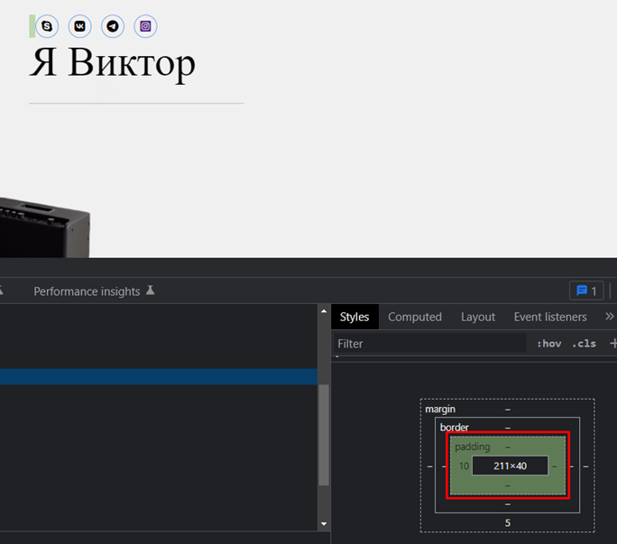
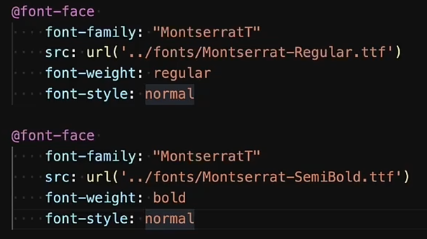

## **5. Продвинутая верстка SASS  БЭМ  FlexBox**

### **5.2 Препроцессор SASS ч.1**
#SASS 

- Чтобы у нас была возможность компилировать sass-файлы, нам нужно установить сасс-компилятор. После его установки снизу нажимаем на кнопку Watching

- **Нужно взять за правило проверять настройки плагинов, если что-то не устраивает!** В настройках программы находим плагин нашего компилятора и указываем путь до изменяемых файлов

- И дальше тут у нас должен появиться технический документ

- И чтобы у нас появился нормальный сас-синтаксис в вскоде, нужно установить Sass

### **5.3 Препроцессор SASS ч.2**

- У технологии САСС есть ряд преймуществ. Первое из них – ненадобность использовать скобки. Вместо них за отображение вложенности (инструкции или элемента в другом элементе) используется таб (именно таб, а не 4 пробела).

Так же слово block можно заменить одним знаком &, что тоже ускоряет написание кода и позволяет более эффективно использовать методологию БЭМ. Слово block берётся из верхнего названия родителя, т.е. если класс родителя будет называться box, то амперсанда будет обозначать box 

т.е. амперсанд = класс, к которому он применён

- Так же есть очень крутая особенность в сасе: переменные и миксины.

Переменные позволяют в себе хранить заданные значения и использовать их во всё проекте (например, вставлять основные цвета и при изменении офис-дизайна у заказчика можно быстро поменять цвет из одного места)

Миксины – это переменные, которые хранят в себе целые инструкции. Это очень удобно для стилизации различающихся на малость блоков

- Дальше идёт наша оптимизация кода. Теперь можно выкинуть нормалайз и ресет css, ведь теперь мы можем сохранить «.scss» их версию (не сасовскую, так как в этих файлах есть кавычки) и подключать эти файлы к нашему style.css через импорт, что будет куда удобнее (однако при каждом сохранении цсс версия файлов всё равно будет генерироваться)

- И вот таким вот образом создаются комментарии

### **5.2-3 Препроцессор SASS -** **Full**

[https://tproger.ru/translations/complete-sass-guide/#sass-preprocessor](https://tproger.ru/translations/complete-sass-guide/#sass-preprocessor)

### **5.4 FlexBox. Новый способ позиционирования элементов**
#FlexBox 

- И сейчас наконец-то будет описана технология, которая позволяет нормально выравнивать объекты на странице. Дело в том, что прошлые попытки выровнять через марджин или текст-алайн имели достаточно костыльную реализацию расположения контента на странице. Однако придумали и добавили в CSS такую технологию как FlexBox.

Чтобы применить её, нужно воспользоваться «**display****:** **flex**;»

- Помочь с изучением данной технологии может сайт Flexbox Froggy

- Используя свойство **justify-content**, мы выравниваем элементы горизонтально, а также оно принимает следующие значения:

·         **flex-start**: Элементы выравниваются по левой стороне контейнера.

·         **flex-end**: Элементы выравниваются по правой стороне контейнера.

·         **center**: Элементы выравниваются по центру контейнера.

·         **space-between**: Элементы отображаются с одинаковыми отступами между ними.

·         **space-around**: Элементы отображаются с одинаковыми отступами вокруг них.

- Теперь используем **align-items** - это CSS свойство выравнивает элементы вертикально и принимает следующие значения:

·         **flex-start**: Элементы выравниваются по верхнему краю контейнера.

·         **flex-end**: Элементы выравниваются по нижнему краю контейнера.

·         **center**: Элементы выравниваются вертикально по центру контейнера.

·         **baseline**: Элементы отображаются на базовой линии контейнера.

·         **stretch**: Элементы растягиваются, чтоб заполнить контейнер.

- **Flex-direction** - это CSS свойство задает направление, в котором будут расположены элементы в контейнере, и принимает следующие значения:

·         **row**: элементы размещаются по направлению текста.

·         **row-reverse**: элементы отображаются в обратном порядке к направлению текста.

·         **column**: элементы располагаются сверху вниз.

·         **column-reverse**: элементы располагаются снизу вверх.

-

- Иногда изменения порядка отображения элементов в контейнере недостаточно. В таких случаях мы можем применить свойство **order** для конкретных элементов. По умолчанию, значение этого свойства у элементов равно **0**, но мы можем задать положительное или отрицательное целое число этому свойству.

- Еще одно свойство, которое можно применить к определенному элементу это **align-self**. Это свойство принимает те же значения, что и **align-items**.

-

- Если объектов слишком много и их сплющило на одном ряду лилий, то раздвинуть их можно помощью свойства **flex-wrap**, которое принимает следующие значения:

·         **nowrap**: Размеры элементов устанавливаются автоматически, чтоб они поместились в один ряд.

·         **wrap**: Элементы автоматически переносятся на новую строку.

·         **wrap-reverse**: Элементы автоматически переносятся на новую строку, но строки расположены в обратном порядке.

- Два свойства **flex-direction** и **flex-wrap** используются так часто вместе, что было создано свойство **flex-flow** для их комбинирования. Это свойство принимает значения двух этих свойств, разделеные пробелом.

Например, можно использовать **flex-flow: row wrap**, чтоб элементы располагались в ряд и автоматически переносились на новую строку.

- Лягушат раскидало по всему пруду, но лилии сгруппированы в верхней части. Ты можешь использовать **align-content**, чтобы указать, как несколько рядов должны отделяться друг от друга. Данное свойство принимает следующие значения:

·         **flex-start**: Ряды группируются в верхней части контейнера.

·         **flex-end**: Ряды группируются в нижней части контейнера.

·         **center**: Ряды группируются вертикально по центру контейнера.

·         **space-between**: Ряды отображаются с одинаковыми расстояниями между ними.

·         **space-around**: Ряды отображаются с одинаковыми расстояниями вокруг них.

·         **stretch**: Ряды растягиваются, чтоб заполнить контейнер равномерно.

Это может запутать, но **align-content** отвечает за расстояние между рядами, в то время как **align-items** отвечает за то, как элементы в целом будут выровнены в контейнере. Когда только один ряд, **align-content** ни на что не влияет.

- В последнем примере стоит обратить внимание на wrap-reverse

- Шпаргалка по FlexBox

### **5 Что такое** **Grid** **и как его использовать**
#CSSGrid 

- Кратка шпаргалка по всем свойствам гридов

- Очень классная шняга. $ - подставит число в класс, {$} – впишет число внутрь тега (или любой другой текст)

- Для начала инициализируем несколько объектов нашей сетки

- Первым делом, чтобы у нас всё заработало, нужно воспользоваться «display: grid», который включит сеточное отображение

Дальше, чтобы были видны изменения, нам нужно создать шаблон через grid-template-columns, в котором мы укажем размеры наших колонок. Сколько размеров мы укажем, столько размеров и будет. Единицы измерения поддерживаются любые

- Но чтобы равномерно поделить колонки, используются фракции – «fr». Они определяют какую часть будет занимать колонка от всей части таблицы

- Так же можно описать куда больше колонок (число колонок, размер)

Так же можно вписать несколько размеров и они будут чередоваться

- Когда мы задаём теплейт на строки, то мы меняем их размер (сколько значений – столько и размер каждой отдельной строки)

- Так же мы можем добавить gapы по колонкам или строкам отдельно

Либо мы можем просто добавить гэпы сразу для всех одинаковые

- grid-auto-rows указывает размер для тех строк, для которых он явно не задан

- Для задания размера строки так же рекомендуется использовать функцию minmax(), которая позволяет задать размер для них и расширять строки под размер контента

- Данные два параметра работают только если их родителю (тут - контейнеру) заданы фиксированные параметры размеров

justify-content – выравнивает элементы колонки по оси Y

align-content - выравнивает элементы колонки по оси X

- align-items позволяет сделать выравнивание относительно ячейки и она будет подстраиваться под контент, который в контейнере

Justify-items же выравнивает колонки по икс-координате

- И при комбинировании инструкций align-self и justify-self, которые влияют на сам объект отдельно, мы спокойно можем создавать макеты любой сложности

- Данные инструкции уже конкретно показывают, какое положение будет занимать определённый блок грида в таблице.

1) Указывает, с какой колонки начинается элемент

2) Указывает окончание колонки (последняя видимая колонка в таблице + 1)

3) Указываем номер строки, с которой начинается объект

4) И на которой заканчивается

И вот пример. Мы можем менять положение объектов из одного места в другое

- А вот пример короткой записи прошлых значений, где через слэш мы пишем: откуда начинается/где заканчивается.

- Так же девтулз спокойно отображает количество занимаемых строк и столбцов

- Так же есть ещё один крайне полезный инструмент – это grid-template-areas

-

### **5.5 Методология БЭМ и как ее использовать**
#BEM 

- БЭМ (Блок, Элемент, Модификатор) — компонентный подход к веб-разработке. В его основе лежит принцип разделения интерфейса на независимые блоки. Он позволяет легко и быстро разрабатывать интерфейсы любой сложности и повторно использовать существующий код, избегая «Copy-Paste».

**БЭМ – это:**

·       **Блок**

·       **Элемент**

·       **Модификатор**

- Используется БЭМ, чтобы реализовать методологию, по которой мы будем переиспользовать элементы много раз и не разводить копи-пасту

- Блок – это заранее заготовленный элемент, который хранит в себе контент. Ему можно определить размер, расположение контента внутри него и всё остальное, что влияет только на контент внутри него.

Внутри блока находятся либо его дочерние элементы, либо другие блоки.

Блоки создаём, когда один и тот же элемент повторяется на странице несколько раз

- Элемент показывает нам, что перед нами находится. Данный класс позволяет стилизировать и работать с определённым элементом блока отдельно. Ему позволяется задавать отступы и размеры. Стилизовать же желательно через миксы (например, создать класс text, которым мы будем модифицировать только текст)

Элементами блока называем все вложенные элементы, которые принадлежат родителю. Например, блок навигационного меню «**nav**» и его дочерние элементы «**nav__item**», внутри дочерних элементов ссылки «**nav__link**» (вкладывать родительские элменты – нельзя **«nav__item__link»** - неправильно**)

- Если описывать более конкретно, то слева у нас Блок – Блок – Элемент – это **неправильно**. У нас идёт Блок – Элемент – Элемент и пример справа нам показывает это. Справа мы видим привязку элемента к блоку, а не элемента к элементу (как слева, где элемент выражается как блок)  

- Модификатор уточняет сам объект. Если у нас несколько блоков текста внутри блока, то мы прописываем первым классом – блок__элемент, а вторым классом – блок__элемент_модификатор

Модификатор отдельно выделяет один конкретный объект среди многих, чтобы задать этому отдельному элементу уникальные стили

- Миксы позволяют совмещать поведение и стили

В данном примере «header-button__text» является как элементом блока «header-button», так и отдельным независимым элементом за счёт класса «text»

Такой подход позволяет задать внешнюю геометрию или позиционирование в «header-button__text», а сами стили прописать в «text», что позволяет использовать класс «text» для стилизирования отдельных таких же элементов на странице

### **5.6 Используем FlexBox и БЭМ в новом проекте**

- Нормализаторы кода закидываем в таком порядке

- Ну и включаем все отступы (паддинги и марджины) в счёт размеров наших блоков

- И сразу нужно объяснить, какую роль тут играет методология БЭМ.

Во-первых, мы сделали main-section, который будет отвечать за содержимое только нашей основной секции, в которой будет располагаться контент первого отдела.

Во-вторых, мы сделали внутри отдельный контейнер, который уже будет отвечать за центрирование и ограничение в ширину всего контента, который будет в нём находиться. Так же мы дописали ещё один класс (описательный - БЭМ), чтобы работать конкретно с ним (потому как класс контейнер мы будем переиспользовать по всему сайту)

Ну и дальше в хедере мы будем хранить то, что будет располагаться в хедере

- Ну и тут мы уже описываем наше навигационное меню.

Во-первых, мы добавили после хэдера секцию нав, которая будет иметь БЭМовский класс (в котором у нас указано где находится и кому принадлежит навигационная строка) и отдельный класс для стилизации (он поможет сделать шаблон стиля навигационного меню, который в дальнейшем получится переиспользовать)

Во-вторых, мы сделали сам список. Для ul мы прописываем флекс-бокс свойство для расположения списка в строку. Каждому элементу списка приписываем отступ справа (по правилу право-низ) и описываем размер шрифта. Далее так же удобно прописываем псевдокласс через амперсанду и для последнего элемента убираем отступ.

В-третьих. В классе мэин-секшн делаем отступ сверху 16 пикселей (чтобы отодвинуть навигационное меню). Дальше обращаемся к контейнеру, который будет у нас регулировать расположение header и nav. Располагаем хедер и футер в строку (row) и через джастифай располагаем их в разных концах страницы (space-between – располагает элементы на равном удалении, равномерно заполняя строку, в которой элементы находятся). Далее выставляем высоту данного меню и центрируем лого и список

Конкретно этими двумя строчками мы задаём высоту контейнера с навигационным меню и располагаем элементы относительно друг друга по центру (текст становится вровень с логотипом)
 
### **5.7 Как превратить растровый логотип в векторный с помощью Illustrat**

- Если нам отправили некачественное изображение, да ещё и в png (несжатый формат с альфаканалом), то оно во-первых весит много и во-вторых имеет свойство пикселизироваться. Поэтому стоит заиметь его .svg версию. Сделать её мы можем сами в иллюстраторе

- Ну и для того, чтобы отобразить логотип на сайте, нам нужно задать ему хотя бы минимальный размер (взять ширину из нашего макета). Вписать размер нужно, так как данный формат может бесконечно скейлиться

### **5.8 Закругление, поворот и тени для элементов**
- Закругление

**border-radius: 100px**

- Тени:
**box-shadow: 0px 4px 4px 4px rgba(0, 0, 0, 0.25)**

Отступ по горизонтали, по вертикали, ширина тени, растяжение тени и последнее значение – цвет тени

- Поворот:

Тут уже стоит отдельно зайти на справочник и взглянуть на множество вариантов использования **transform**: https://html5book.ru/css3-transform/

- Реализация самого контента первого блока уже будет поделена на две части: левую и правую.

Во-первых, мы создадим второй контейнер и дадим ему второй класс по БЭМу. В этом контейнере зададим два дива, где поделим блок пополам (гитарист с блоками – слева, текст - справа). В левый блок закинем картинку с нашим гитаристом. Под картинку закинем три дива, которые будут представлять у нас блоки позади гитариста (их мы будем стилизовать так же, как в фигме)

Во-вторых, приступаем к вёрстке стилей. Первым делом нашему родителю назначим позиционирование релэйтив (для того, чтобы абсолютно спозиционированные объекты отталкивались от него, а таких объектов у нас будет 3 – и это блоки). Дальше нам нужно накинуть релэйтив на нашу картинку. Позиционировать абсолютно мы её не будем, но нам нужно задать ей индекс, чтобы позиционированные блоки оказались под гитаристом.

В-третьих, стилизуем блоки. Большинство стилей, а именно цвет, поворот, размер и тени – берём из фигмы (задать им обязательно размер, чтобы они в принципе отображались на странице). Обязательно позиционируем их абсолютно на странице (топ и лефт определяем экспериментальным способом). И так же не забываем указать им правильный z-index

### **5.9 Что такое иконочные шрифты**

- И далее воспользуемся сервисом, который предоставляет иконки в виде шрифтов. Первым делом добавим js код к нам после стилей

- Далее находим нужную иконку и копируем её код в наш блок

- Основной особенностью этих иконок является то, что они представляют собой текст и редактируются как текст, но так как мы поместили их в блочные элементы, то и работать мы будем с текстом в блоках

- Далее опишем бордеры для наших иконок (высота, ширина **блока**, бордер и закругление)

- Далее к нашему контейнеру применим расположение объектов в ряд (левый и правый враппер будут находиться в одной строке)

- Две эти записи идентичны и дают одинаковый результат. Однако стоит пользоваться первым способом для выравнивания только мелких объектов. Выравнивать целые блоки (например, наш правый и левый враппер) не стоит, так как могут возникнуть конфликты с тем же марджином (у нашего контейнера может обнулиться марджин, выравнивающий его по центру страницы)
 
- Данный код позволит выровнять иконки (текст) внутри блоков по центру

- Через фонт-сайз меняем размер иконки (так как она - текст). Ну и делаем отступы между иконками

### **5.10 Создаем первую кнопку**

- В первую очередь под нашими социальными сетями прописываем новый заголовок и прямо внутри заголовка можно прописать тег hr. Далее основная наша проблема: позиционирование элементов, а именно – текстовый блок над фотографией. Делается это через накидывание релэйтива на нашего родителя и через абсолют на наш райт-враппер (так же допишем ширину блока и положение от абсолюта)
 
- Чтобы оттолкнуть иконки от блока райт-враппер, можно сделать внутренний паддинг. Так же нам нужно оттолкнуть текст от иконок, но уже через марджин-боттом

- Сам тайтл уже преобретает больший шрифт и релэйтив позиционирование, так как нужно указать положение hr относительно нашего текста. Hr указываем позиционирование, ширину, положение снизу, уберём марджины, сбросим внешний вид линии и с одной стороны настраиваем линию (потому что если будем менять через просто бордер, то у нас задастся по всем 4ём сторонам он)

- Текст под тайтлом добавляем с небольшим отступом от нашего основного тайтла. В качестве отталкивающего элемента мы выбираем бэм-блок (стилизуем все элементы через модификаторы)

- И таким образом мы выравниваем кнопки и элементы внутри них в линию

- Далее мы стилизуем нашу кнопку

- Выравниваем, отодвигаем

### **5.11 Используем модификатор БЭМ. Новое свойство overflow**

- Тут мы уже вспомним про использование модификаторов БЭМ. Стилизация и БЭМизацция элементов.

В основных стилях мы описали размеры, градиент и закругление блока. Выравнивание сделали для внутреннего круга (который имеет цвет фона), который будет у нас отвечать за вырез в круге.

Первым делом мы создали первый блок кругов внутри контент-контейнера (располагаются под текстом).

Второй уже блок кругов мы расположили в мэйн-секшн, который отвечает впринципе за все элементы в основном блоке. 

- Данный фрагмент кода отвечает за позиционирование круговых элементов на сайте. Спозиционировали круги мы относительно нашей основной секции на странице

- Так же дополнительно стоит обратить внимание, что при изменении ширины страницы, у нас появляется данное выползание круга из-за границы. Это нужно исправлять

- **Важно!** Существует такая инструкция как overflow, которая регулирует отображение элементов за краями блока. С помощью данной инструкции мы можем скрыть всё, что находится вне блока

### **5.12 MinMax – HeightWidth**

- Тут представлен код с max-width. Данный пераметр указывает, что максимально размер элемента может растянуться до 1000 пикселей, но при уменьшении страницы, он будет уменьшаться

- Это уже работа min-width. Минимально – 1000 пикселей, но растягивается до максимального значения

- Но как мы можем увидеть, если наш элемент помещается в максимум 1000 пикселей, то он может и не вместиться в родительский элемент

- Но так же минимальную высоту можно установить и для родительского элемента и тогда он будет размером с занимаемое пространство с два этих бокса

- Такой подход с размерами для элементов страницы нужен, например, чтобы не угадывать с размерами блоков сайта. Потому что заказчик может вместо текста рыбы вставить свой текст

### **5.13 Практика. Создаем вторую секцию сайта**

- **Лайфхак!** Так же в браузере есть интересный лайфхак, который позволяет в реальном времени двигать объекты на странице, что позволяет их нормально спозиционировать без подгадываний и высчитываний

- А чтобы быстро найти класс, не забываем пользоваться поиском

- Секции лучше именовать секциями

- Перед использованием изображений, лучше их кропнуть и потом выгрузить в таком формате

- Пример структуры:

- **Лайфхак!** Так же в консоли разработчика имеется подсказка флекс-расположений. Если на неё нажать, то можно выбрать предустановки отступов и посмотреть на них, что крайне удобно

- Так же если нам нужно сделать равномерное расстояние между объектами (без привязки к margin-right), то можно воспользоваться данным свойством

### **5.14 Практика. Создаем третью секцию сайта**

- Небольшое пояснение. Если мы хотим расположить абсолютно-спозиционированный элемент под обычным, то нам достаточно просто указать «z-index: -1». Однако если у нас прописан бэкграунд, то родительскому элементу нужно указать не просто релативную позицию, но и указать «z-index: 0»

### **5.15 Практика. Создаем footer сайта**

- Сейчас нужно пояснить за структуру и почему стоит пихать высоту блока в контейнер, если мы выравниваем положение через флексы всего одного элемента. Дело в том, что фотографию тут мы абсолютно спозиционировали и теперь нам нужно отодвинуть один текстовый блок в бок и если мы не зададим высоту внутри блока, то он будет иметь размеры сугубо равные нашему текстовому блоку

- Ну и так же можно подключить шрифты таким способом

### **5.16 Добавляем якорные ссылки на навигационное меню**

- Якорные ссылки добавляются через id элемента и позволяют создать связь между ссылкой и элементом на странице

### **5.17 Что такое fav-icons, и как их установить в свой проект**

- Фавиконки генерируются из изображений 512 на 512 пикселей.

-  И подключаются через линки
