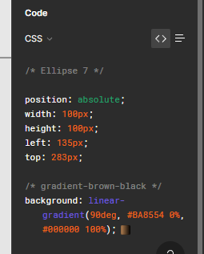
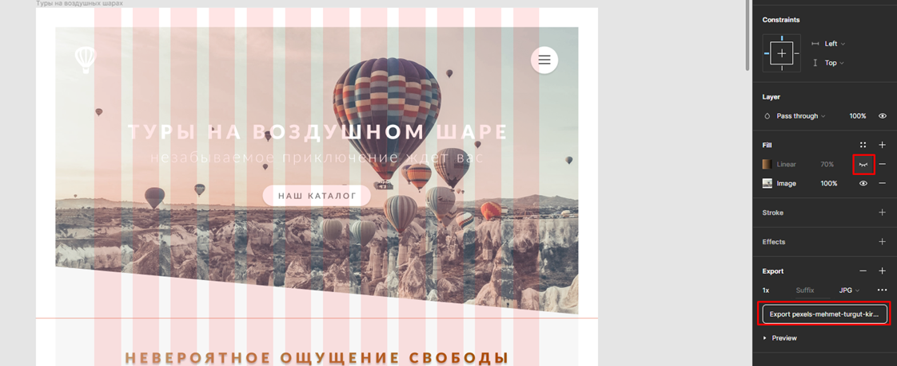
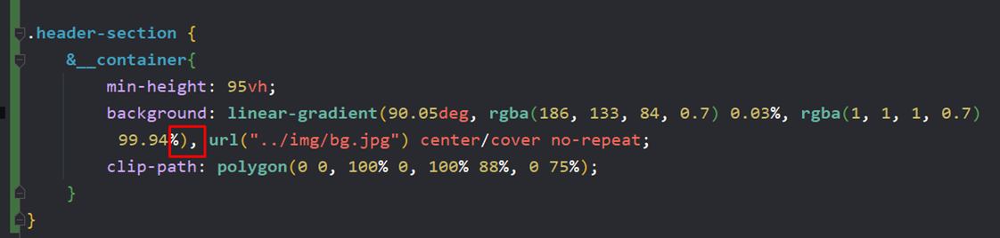

### 1.3 Новое свойство clip-path. Начинаем создавать первую секцию сайта

- Чтобы скопировать некоторые цвета, иногда нужно будет отцеплять линки

- А можно и просто заглянуть в Inspector (лучше заглядывать сразу на нужном изображении или кнопке)

- Перед экспортом из фигмы, стоит отключить все эффекты с изображений (чтобы не применять их)

- Тут хочется сразу отметить, что мы можем взять из фигмы линейный градиент с непрозрачностью и вставить его до url(), **но нельзя забывать про запятую! между** **linear-gradient** **и** **url()**
 
- На скрине представлен сайт, который визуализирует свойство CSS «clip-path: polygon()».

Внутри данного свойства через запятую указываются значения положения точек. Каждое положение точки указывается в % от положения X и Y координат. То есть красная точка располагается в 0% по X и 0% по Y

- Так же можно выбрать и другие фигуры

- Пример свойства в коде. Пример обрезки чуть выше
