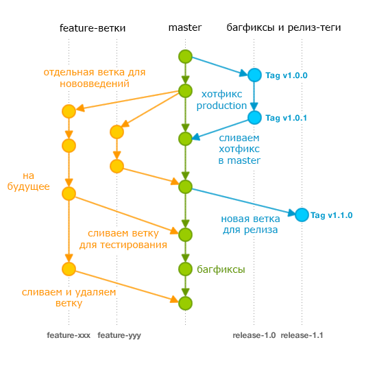

Ветки представляют из себя параллельную часть нашего проекта. Они дают нам возможность не портить основной проект, а допиливать какой-то свой функционал, в котором мало уверенности. 

Например, можно представить ситуацию, что мы имеем основную ветку с проектом, где идёт разработка основного функционала. Далее мы имеем побочную ветку, где мы хотим сделать свои какие-то анимации. Наша ветка с анимациями абсолютно обособлена и не протит историю коммитов основной ветки. Когда анимации мы сделаем и будем в них уверены, то побочную ветку можно будет слить с основной.

Такой подход можно встретить при делении каких-либо фич на проекте, багов/фиксов или отделять людей в разные ветки

