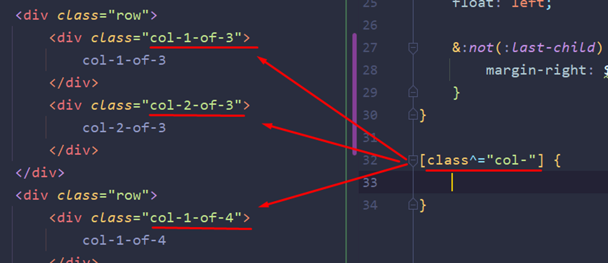

### **3.10 Создаем собственную систему grid**

- И сейчас будем делать собственную систему колонок. Если бутстрап работает по флексам, то наша будет работать через float.

Нам нужно описать классы с подобными именами:

- Далее нужно повторить картинку сверху.

row будет отвечать за строку, которая содержит колонки

«col-» будет содержать стили для каждой колонки отдельно (самое главное – разную математику для высчитывания ширины)

- И вот клирфикс из кода сверху. Куда удобнее будет вставить его так, потому что он понадобится дальше по проекту. Тут внутри мы сразу обращаемся к псевдоэлементу

- Данный псевдокласс заменит нам «**:****last****-****child**». Только он уже отвечает за то, что свойства будут применяться ко всем элементам **кроме(какого).** Конкретно тут применяется боттом ко всем строкам, но **не** к последнему дочернему элементу

- Функция calc() в SASS позволяет складывать значения с разными типами (%, обычные числа, px). Чтобы использовать внутри этой функции переменные, их нужно заносить в «#{}»

- Имбовая конструкция, которая позволит

1) Обратиться по атрибуту тега (а не просто по классу)

2) Обратиться ко всем элементам с классом, который начинаются на… (тут на «col-»)

Конкретно «^» отвечает за обращение ко всем атрибутам со значением, которое начинается на то, что находится в кавычках

«$» в свою очередь обращается ко всем классам, которые заканчиваются на «col-»

«*» отфильтрует все элементы, в атрибуте класса которых есть «col-»

- И такой подход обращения к классам позволит повторяющиеся стили запихнуть в этот атрибут стилей

- И вот итоговая математика страницы через флоаты
