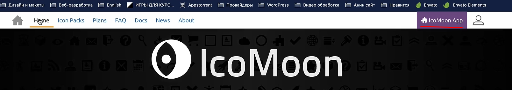

### **3.14 Как создавать собственные иконочные шрифты**

Чтобы сделать свой иконочный шрифт, нужно зайти во-первых на сайт, закинуть в него svg-изображения и сгенерировать файл со шрифтами




После скачивания папки со шрифтами, нам нужно переименовать файл со стилями и закинуть фонты и стили в папку CSS. 
Можно закинуть и в другую папку, но придётся поменять пути в стилях


И чтобы отобразить нашу иконку, нужно в тег "i" вложить класс нашей иконки из стилей с сайта. 
Далее стилизуем наши иконки как обычный текст


Так же нужно рассмотреть значение *skew()* свойства *transform*, которое позволяет скрутить объект


Через подобную запись мы обращаемся ко всем потомкам написанного селектора (без самого родителя)

```CSS
class > * {  
   //...
}
```

Однако лучше сделать скос так же через clip-path, так как прошлый способ косит и изображение

