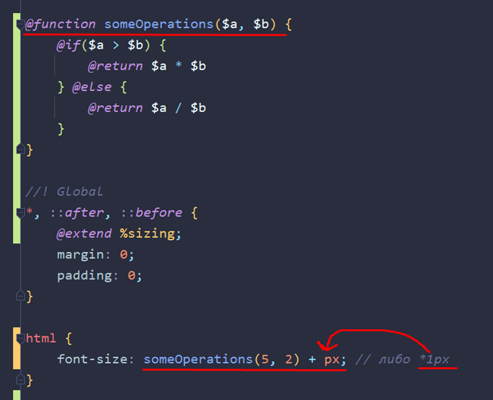

### **3.6 Как работают SASS функции**

- В САССе есть свои встроенные функции, которые выполняются определённые операции. Примером одной из таких функций является **darken**, который затемняет вложенный в него цвет

- Так же есть функция **lighten**, которая работает так же как и прошлая, но высветляет цвет

- Ну и ещё функции, например:

**transparentize****(цвет, 0.2)** – добавляет прозрачность на определённый цвет (например, через него задать в анимации прозрачность без свойства opacity)

- Так же мы можем написать свои функции и спокойно использовать их в проекте
