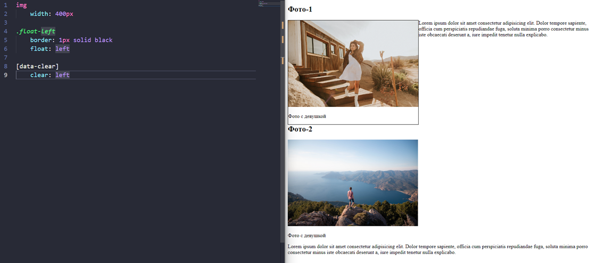

### **3.9 Как работает float**
#Float 

- Как, собственно, работает float? Флоат вырывает объект из потока элементов на странице и располагает его в том месте, куда мы ему указали расположиться (слева/справа)

- И когда мы говорим про «вырывание», конкретно в этом случае, объект позиционируется сугубо там, где он располагается и теснит все остальные объекты. Притом отсчёт для остальных элементов идёт от этого спозиционированного элемента

- Чтобы исправить ситуацию и расположить элементы под спозиционированным, нам нужно на следующий элемент навесить свойство «clear: left», которое очистит пространство от элемента слева

- Однако тут у нас остаётся проблема в том, что отступы присутствуют, а они не работают на спозиционированных элементах

- Чтобы поправить ситуацию, нужно создать новый див и уже для этого пустого элемента очистить отступ

- Так же этот же самый спозиционированный элемент не дополняет див родителя и не влияет на него

- Чтобы исправить ситуацию, нужно либо так же вставить див после спозиционированного элемента

- Либо добавить фикс через псевдоэлемент
