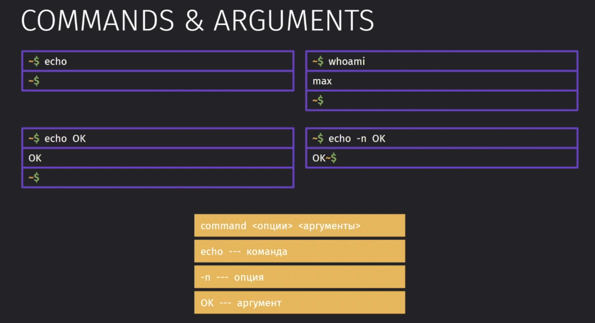

## 2 Иерархия файловой системы (FHS)

Вся иерархия файловой структуры начинается с корневой папки `/`

- `/mnt` - наш сетевой подключенный сетевой диск 
- `/tmp` - папка временных файлов
- `/opt` - папка разархивированных исходников
- `/etc` - настройки программы (хранение файлов конфигураций)
- `/home/<user>` - персональные данные пользователя
- `/var` - хранит изменяемые файлы программ (зачастую логи и кэш)
- `/boot` - файлы загрузки системы
- `/dev` - файлы устройства
- `/lib` - библиотеки исполняемых файлов системы
- `/media` - сюда подключаются USB / CDROM
- `/proc` - процессы, которые исполняются в системе
- `/root` - домашний каталог суперпользователя
- `/run` - запущенные процессы
- `/sbin` - системные утилиты
- `/srv` - службы, которые размещают свои данные
- `/sys` - инф. об устройствах и драйверах
- `/usr` - ещё одна папка для данных пользователя (утилиты многопользовательского режима)

## 3 Об оболочке и командах 

Для каждого пользователя в системе создаётся свой каталог в `/home`. Изначально `/home` отображается в терминале как `~`

Команды строятся следующим образом: `команда -параметры ...аргументы[]`

Есть 3 основных типа команд:
- Встроенные, системные
- Алиасы, которые под собой скрывают команду + дополнительные параметры
- Внешние команды, которые идут с оболочкой или из других пакетов

Shell ищет исполняемые команды по записанным путям в переменной `$PATH` 

## 4 Основные команды 

- `pwd` - отображает текущий каталог
- `ls` - отображает содержимое директории
- `mkdir` - создание новой директории. Если нет нужной директории, в которую поместим создаваемый файл, то нужно добавить параметр `-p`. Так же мы можем просто передать сразу несколько аргументов, чтобы создать сразу несколько файлов.

- `cd` - переход в нужную директорию

Переход по каталогам с сохранением истории

- `pushd` - переходит каталог и сохраняет в список
- `popd` - возвращается обратно по списку

Команда `mv` занимается переименованием либо переносом файлов. Для неё можно использовать как абсолютный, так и относительный путь. Чтобы переименовать файл, достаточно просто написать первым аргументом целевой файл, а вторым аргументом передать конечное наименование.

Команда `cp` даёт нам возможность скопировать файлы из нужной нам директории. Параметр `-r` позволяет нам скопировать файл или папку и все внутрилежащие элементы в другую папку. 

- `touch` - позволяет создать файл
- `cat` - выводит данные из файла, либо если использовать `>`, то создаст файл и даст ввести в него данные. Чтобы выйти из режима ввода, нужно воспользоваться `Ctrl+D`

Команды `more` или `less` позволяют просматривать большие файлы, подгружая только необходимые части

Так же мы можем отображать подробные списки с информацией по нашим файлам

## 8 Настройка и клонирование 

## 9 Упражнение - Команды 

## 10 Об оболочке Bash 

## 11 HELP в Командной Строке

