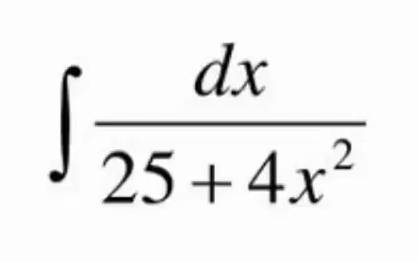
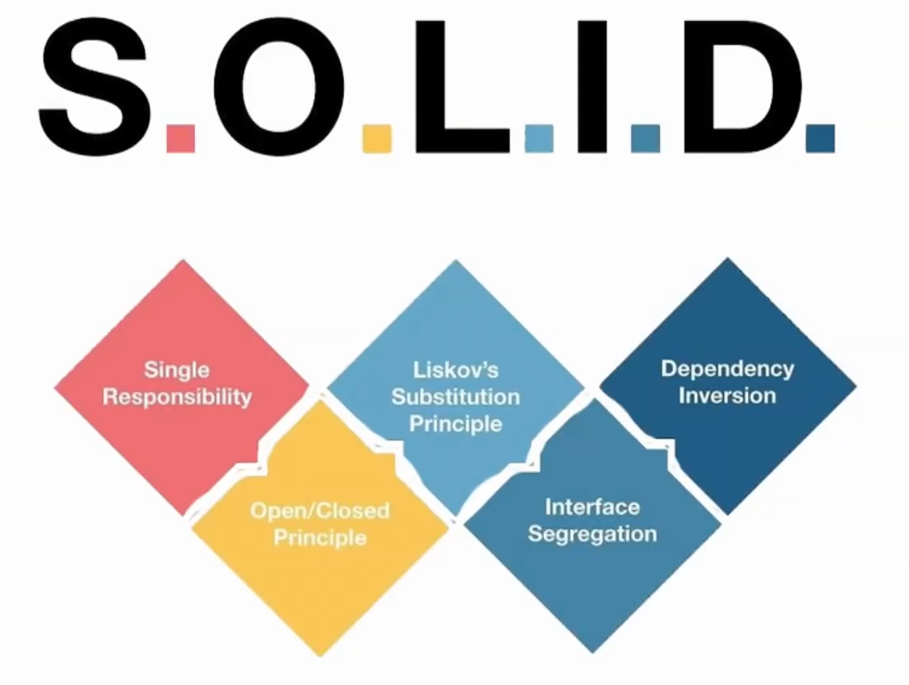

#Patterns #SOLID 

### Введение

Паттерны, принципы, архитектура - это инструменты, которые позволяют разработчикам общаться на одном и том же языке. Определённая архитектура позволяет быстрее въехать разработчику в проект, так как она диктует общие принципы и правила, по которым мы пишем приложение. 
Все эти парадигмы позволяют нам строить системы примерно похоже. Очень многие ошибки начинают сходиться и повторяться, отчего их проще находить и исправлять

Мир без паттернов можно представить так: мы каждый раз выводим формулу для решения определённой задачи, вместо того, чтобы использовать определённый алгоритм решения собственно этой задачи

Однако за нас эти формулы уже вывели и нам не нужно этого делать. Мы просто открываем формулы и используем их для решения задачи

Паттерны помогают нам творить хороший и чистый код

Принципы SOLID:

### SRP (Single Resposibility Principle)

Это принцип, при котором мы назначаем одной сущности (классу, функции) ровно одну задачу 

Представим, что у нас есть система, которая имеет свои данные и она должна уметь сохранять себя, отправлять свои данные, печатать их, логировать и так далее. Если писать всё в одном классе, то дополнять систему в будущем и править её не будет представляться возможным - система станет кашей, которую невозможно будет править и поддерживать, а нововведения от заказчика станут недобавляемы

Поэтому нам нужно будет делить модель данных и поведение сущности

И вот самый простой пример: в первом случае, весь функционал пользователя находится в нём самом, а во втором мы вынесли логику в другие классы

Либо вот пример с `DataFetcher`, который реализует в себе использование большого числа отдельных методов

В идеальном варианте, стоит сделать отдельный класс, который будет выполнять всю избыточную логику класса

###### Примеры на фронте

Мы имеем компонент, который отвечает за отрисовку формы отправки реквизитов

Далее в него мы добавляем функционал по отправке реквизитов, обнулению формы и валидации данных.
Пока всё нормально, так как вся вложенная логика относится к одной форме

И далее нам приходит задача обрабатывать одним способом русские реквизиты и иностранные, что требует от нас проверку компонента на разные локали

Для более правильной реализации данной задачи нужно вынести логику функций в отдельные модули

И уже из этих модулей вызывать нашу форму с подходящими функциями

Такой способ позволит сохранить подход единственной ответственности в приложении

А сюда мы выносим отдельное создание реквизитов под разные локали

> [!success] Преимущества подхода:
> - Избавление от антипаттерна GodObject
> - Приложение разбивается на отдельные модули (декомпозиция), что приводит к лучшей читабельности
> - Логика выполнения определённых операций инкапсулируется в определённых функциях, что так же упрощает написание тестов
> - Становится легче вносить изменения в проект

### OCP (Opened-Closed Principle)

Все программные сущности (классы, компоненты, модули, сущности) должны быть открыты для расширения, но закрыты для изменения

Мы должны добавлять новый функционал за счёт добавления новой сущности, которая будет посредством определённой логики связана с другой сущностью

Теперь можно удалить выбор типа из конструктора

И создаём новое оружие через отдельный класс 

### LSP

### ISP

### DIP

### SOLID итоги

