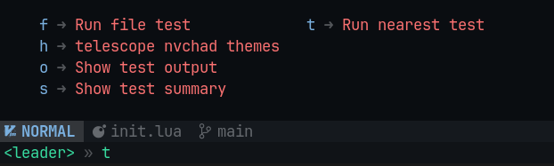

## TMUX

Условно за `leader` в tmux отвечает сочетание `ctrl + b`. В конфиге сочетание изменится на `ctrl+a`.

Первым дело нужно установить сам плагин

```bash
brew isntall tmux
```

Далее нужно будет скопировать пакетный менеджер tmux

```bash
git clone https://github.com/tmux-plugins/tpm ~/.tmux/plugins/tpm
```

Потом нужно удалить все сессии tmux

```bash
tmux
tmux kill-server
```

Далее нужно будет скопировать конфиг

`~/.tmux.conf`
```bash
set -g default-terminal "screen-256color"

# Основной префикс
set -g prefix C-a

# Сортировка по имени
bind s choose-tree -sZ -O name

# Изменение индексов
set -g base-index 1
setw -g pane-base-index 1

# Переназначение клавиш
unbind %
bind | split-window -h # | разделит вертикально

unbind '"'
bind - split-window -v # - разделит горизонтально

unbind r
bind r source-file ~/.tmux.conf

bind -r j resize-pane -D 5
bind -r k resize-pane -U 5
bind -r l resize-pane -R 5
bind -r h resize-pane -L 5

bind -r m resize-pane -Z

set -g mouse on

set-window-option -g mode-keys vi

bind-key -T copy-mode-vi 'v' send -X begin-selection 
bind-key -T copy-mode-vi 'y' send -X copy-selection 

unbind -T copy-mode-vi MouseDragEnd1Pane
# Плагины
set -g @plugin 'tmux-plugins/tpm'
set -g @plugin 'tmux-plugins/tmux-sensible'
## бесшовное переключение между окнами вима и tmux
set -g @plugin 'christoomey/vim-tmux-navigator'
## настройка красивой сессии
set -g @plugin 'jimeh/tmux-themepack'
# следующие 3 плагина сохраняют сессии даже после перезагрузки ПК
set -g @plugin 'tmux-plugins/tmux-resurrect' 
set -g @plugin 'tmux-plugins/tmux-continuum'
set -g @plugin 'tmux-plugins/tmux-sessionist'

set -g @themepack 'powerline/default/purple'

set -g @resurrect-capture-pane-contents 'on'
set -g @continuum-restore 'on'

# Старт менеджера плагинов
run '~/.tmux/plugins/tpm/tpm'
```

Для установки всех плагинов нужно использовать: `tmux` и потом `leader + shift + i`.

Переход в tmux осуществляется следующей одноимённой командой

```bash
tmux
```

`leader + s` - открывает окно с сессиями терминалов. В нижнем окне можно кратко просмотреть сессию.

Одинним из способов создать новую сессию может стать ввод в этом окне команды `new -s <имя>`


`leader + shift + c` - создание новой сессии
`leader + shift ) или (` - переключение между сессиями
`leader + g` - позволяет включить поиск нужной сессии. Нужно, чтобы долго не искать нужную
`leader + shift + ,` - переименование вкладки


`leader + c` - создать новую вкладку
`leader + 0...9` - перейти в нужную вкладку


Так же кроме ==сессий== и ==вкладок== мы можем делать ==сплиты== с помощью `leader + | и -` (кастомные сочетания)


`leader + ctrl + s` - сохранение текущего окружения


##### Команды tmux

Удаление сессии

`tmux kill-session -t <имя>` - удаление сессии
`tmux kill-server` - удаление сервера tmux


## Описание плагинов

1. Neotest - плагин для удобного запуска тестов в приложении

`leader` + `t` запускает множество команд для прогонки тестов



2. DAP - плагин для дебага приложения

Первым делом получаем сокет с активным дебагом от нашего приложения


`leader` + `d` + `b` - ставим точку остановы


`leader` + `d` + `u` - открытие окна с дебагом
`leader` + `d` + `s` - запуск дебага

И когда выполнение кода дойдёт до точки, то окно заполнится нужными данными


3. Neodev - подсказка сигнатуры вызова метода


4. Flog - дерево гита

`:Flog` - откроет удобное для просмотра дерево коммитов


5. Diffview - показывает изменения между файлами для гита

`lead + g + f` - откроет историю изменений файла. Очень удобно смотреть на различные изменения файла в течение времени


6. better-bqf

`g + f` - позволяет быстро найти все определения функции / метода в коде и удобно предоставляет список внизу с окошком

На `o` можно перейти на нужный референс


7. Todo Comments

Подсвечивает тудушки и остальные ключевые слова в проекте

`:TodoQuickFix`


