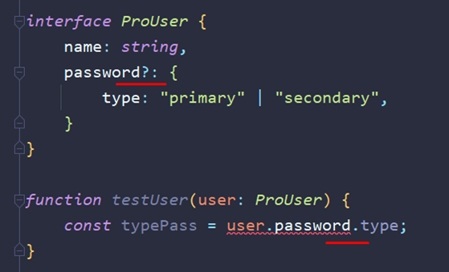
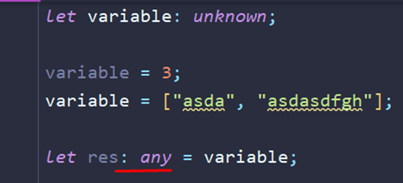

## **04 Продвинутые типы**
### **020** **Union**
- Юнион – это способ определения типа данных, когда мы в переменную можем поместить один из перечисленных через «|» типов данных

Сразу хочется отметить, что при использовании такого типа данных, в обычных условиях, компилятор не понимает, что в нём находится и не предлагает нормальный автокомплит

- Сужение типов. Для того, чтобы использовать методы строк, или чисел, или булеана, нам нужно сузить типы, с которыми мы работаем (потому что юнион объект – это ни рыба, ни мясо)

Сузить можно через условие, в котором мы пропишем, что оно будет срабатывать при равности типа указанному

- Так же можно увидеть, что мы исключили возможность того, что тип может быть строчным и компилятор нам показывает, что нынешний аргумент у нас либо число, либо булеан значение

- Больше примеров богу примеров. Это пример выборки либо строки, либо массива из передаваемых типов

- А вот уже пример с типизацией объектов. Тут мы можем проверить в придачу в принципе наличие определённого ключа в объекте + его типа и обработать это всё

- Ну и так же мы можем проверять два разных типа на разные действия при их соответствии

### **021** **Literal** **Types**
- Литеральные типы данных – это типы данных, которые выражаются в определённых значениях. Эти типы определяют, что будет находиться в этой переменной. По умолчанию константы имеют тип данных равный значению. Если let присвоить литеральный тип данных (например, 1), то и хранить сможет только число «1»

- Используются литеральные типы, чтобы не делать на каждый чих енамы

- Литеральные типы принимают в себя только значения, которые мы зададим для этих значений. Так же мы можем задать фиксированные значения на получения таковых из функции

- Однако тут нужно так же и помнить, что при отправке тех же данных в функцию, где аргумент имеет литеральный тип, может привести к неочевидным результатам. Если мы захотим отправить не чистый аргумент, а переменную, объявленную через let, то мы словим приколыч, так как у нас сравниваюся типы при отправке (аргумент ведь имеет только два типа – тут пост и гет). Лет тут является стрингой, а стринга не является постом или гетом

Чтобы исправить ситуацию, нужно будет поменять лет на конст и тогда значение автоматом присвоится в тип данных переменной

Либо можно кастануть переменную и задать ей определённый тип данных. Это уже стоит делать только в том случае, если мы данные получаем не из переменной, а из объекта. Делается каст через оператор «as»

Однако берём в учёт, что мы не должны использовать каст в роли фикса от ТСки. Используем только по надобности, когда нет возможности привести типы

### **022** **Type** **Aliases**

- И вот пример тайп элиаса (псевдонима). Через ключевое слово «type» мы можем как обычную переменную задать любой тип и использовать этот псевдоним

- Элиасы позволяют сократить достаточно сильно код и делать свои шаблоны типизированных объектов. На первом примере стандартное объявление одного объекта. На втором примере можно увидеть тайп элиас (с помощью которого можно объявить сразу несколько новых объектов)

- Так же есть и интерсекшн типы. На первом скрине можно увидеть, как были соединены два типа через юнион **«|»** и теперь мы можем запихнуть в объект либо первый тип, либо второй, либо все вместе. Уже оператор **«&»** определяет интерсекшн, который говорит нам, что в данной переменной должны находиться сразу оба типа вместе и никак иначе

Интерсекшн откидывает повторяющиеся поля

### **023** **Interfaces**

- Интерфейсы – это технология, которая позволяет записать типизацию объекта в виде подобным классам. Так же интерфейсы экстендятся как классы (в тайпах нужно было использовать интерсекшн)

- Пометочка: функции так же можно вписывать и в тайпах

- Уже таким образом мы можем создать объект-словарь

1) Неопределённое количество свойств – [наименование: тип]

2) Значение – тут Юзер

Однако словари создаются обычно через третью запись (дженерик)

### **024** **Types** **или** **Interfaces**

- Первой отличительной особенностью интерфейсов является их возможность мёрджа. Если мы объявим два одинаковых интерфейса, то они слипнутся и будут себя вести как один интерфейс

- Так же тайпы крайне просто работают с простыми типами и позволяют их быстро задать. Интерфейсы же подходят только для работы с объектами

- Если подытожить, то для создания объектов стоит использовать интерфейсы. Они чаще используются так же вместе с классами. Тайпы стоит использовать для простых типов и быстрой реализации

### **025** **Optional**

- Оператор «?», который мы пишем сразу после наименований ключей, свойств, аргументов и так далее говорит нам о том, что этот параметр не обязателен.

Конкретно в примере с интерфейсом нам не обязательно теперь в объекте подобного типа указывать свойство пароля. И, как можно было подумать, записать без «?», но пометить, что свойство должно быть андефайндом мы не можем (в объекте придётся явно указать, что значением будет андефайнд)

В функции же «?» говорит, что нам необязательно передавать такой аргумент. Однако в функции мы уже можем указать, что второй аргумент может быть неопределённым типом и это будет работать подобно «?»

- Так же нужно упомянуть, что при обращении к свойству объекта с «?», нам нужно обязательно прописывать опциональный чейн, так как значения может и не быть (ТС выдаст ошибку в компайл-тайме)

- «!» – этот оператор, в свою очередь, говорит, что мы точно знаем, что вернётся не undefined, а именно наше значение, которое было задано нашему объекту

- Так же мы можем устроить проверку и через короткую запись

- «??» - оператор, который проверяет на null или undefined. Конкретно тут используется такая конструкция, так как парам – это опциональный аргумент и его мы можем не передать, а значить проверить на его наличие нам нужно

### **026 Упражнение - Типизируем ответ сервера**

- Это первый способ типизации. Он имеет небольшие минусы в виде того, что нам нужно будет как-то разделять успешный запрос от неуспешного

- Это уже более удачный вариант запроса, который поделен на два разных интерфейса

- И вот примерно так реализуется вывод удачного и неудачного запроса на сервер (функция возвращает объекты по типу этих двух интерфейсов)

### **027** **Void**

- **void** – это особый тип данных, который нам говорит, что функция ничего не возвращает. Функция может возвращать какое-либо значение, но мы ни в коем случае не будем его принимать и не будем ничего возвращать. **void** **!=** **undefined**

Конкретно в этом случае, константа «а» будет иметь тип войд

- А уже в этом примере вернётся хотя бы undefined

### **028** **Unknown**

- unknown – это более строгий тип any. Он запрещает себя присваивать в другие типы, которые не являются такими же unknown или any. Используется этот тип в тех случаях, когда мы не знаем, что за тип нам предстоит получить в переменную. И вообще, когда не понятно, что мы получаем, этот тип стоит вставлять

- Привычное сужение типов указать для переменной не получится (в одном условии получится указать тип, но в остальных так же останется unknown)

- Ну и дальше идёт кейс по ошибкам. Раньше еррор имел тип эни, но с версии «4.4», еррор – это непонятный тип. Теперь чтобы работать с ошибкой, нужно добавлять дополнительную конструкцию, которая будет проверять нам, что мы работаем конкретно с ошибкой

1) Проверяем ошибку по инстансу объекта

2) Делаем проверку через присваивание переменной к ошибке (не самый лучший вариант)

- И тут нужно пояснить, что или «|» выбирает тип для переменной из более общего значения (всегда будет unknown), а «&» выбирает самое меньшее (string более конкретный тип данных)

### **029** **Never**

- И как можно увидеть по первым примерам, тип данных **never** говорит нам, что функция никогда не возвращает значение. Объекты с таким типом абсолютно никогда ничего не возвращают и ничего возвращать нельзя

- Если void вполне себе может хранить undefined, так как войд – это отсутствие значения, то невер запрещает возвращать значение

- И вот первый кейс, где можно использовать тип невер. Он позволяет показать, что программа не заходит в данную ветку

Тут нужно пометить, что если константу назвать «_», то компилятор не будет ругаться на то, что в ней нет значений

- И тут представлен пример, когда мы явно задаём аргументу типы строки и числа. На выходе мы должны получить булеан значение. Внутри функции мы проверили получаемое значение и видим, что компилятор говорит нам, что может вернуться из функции «undefined» (если нет ретёрна, то функция возвращает андефайн, тут - третий ретёрн)

Однако, если мы добавим срабатывание функции, которая будет иметь тип невер (никогда ничего не возвращается), то наш третий андефайн будет закрыт этой функцией

- Невер используется для явной блокировки определённых веток выполнения программы

### **030** **Null**

- Первым делом нужно отметить, что в ТС нельзя (в отличие от нативки) присвоить любому типу налл. Мы это можем сделать только изначально наллу или для эни.

- Однако это спокойно настраивается из под настроек компилятора ТС

- Однако эту проверку убирать не стоит. Она может во многом помочь.

Конкретно в данном коде мы возвращаем с вероятностью в 50% либо пустое значение, либо объект (который возвращаем в качестве юзера, так как мы не задали тип для функции)

- Однако стоит разграничить между друг другом эти понятия: null и undefined. Первый мы используем осознанно (подставляем самостоятельно) и не можем получить в результате выполнения кода JS. Второй же мы можем получить в результате выполнения кода JS

И примерно так уже должна выглядеть правильное написание кода, когда мы точно знаем, что можем не вернуть значение и впоследствии проверяем на это

### **031 Приведение типов**

- Обычное приведение типов в нативке

- Тут нужно отметить, что при создании новой переменной через интерфейс конструктора, тип данных будет не «string», а «String»

- Типизирование объекта тремя способами:

Последний способ лучше не использовать – он будет конфликтовать с Реактом


- И так же тут представлен пример создания отдельного пользователя через деструктуризацию прошлого объекта. Однако тут у нас получится объект шире, чем изначальный

- Рекомендуется возвращать объекты через функцию (тогда в админе останутся только данные свойства)

### **032** **Type** **Guard**

- Это представлено обычное сужение типов, через которое мы можем обратиться к нужному нам типу определённого значения

- Тут уже показана реализация тайпгуарда. Он всегда возвращает нужный нам тип объекта (проводит проверку на тип). По сути своей он заменяет нам работу булеана на более прозрачную и показывает нам точно, что должна вернуть такая проверка

- И вот пример, где мы создали гуардиана для более сложного типа данных

- А уже тут проверка идёт через присвоение юзера к админу и если у юзера имеется нужное нам свойство (не = андефайнду), то вернётся админ (нужный интерфейс)

### **033 Упражнение - Делаем typeguard ответа**
- Отправная точка написания кода
```TypeScript
interface IPayment {  
   sum: number;  
   from: number;  
   to: number;  
}  
  
enum PaymentStatus {  
   Success = 'success',  
   Failed = 'failed',  
}  
  
interface IPaymentRequest extends IPayment { }  
  
interface IDataSuccess extends IPayment {  
   databaseId: number;  
}  
  
interface IDataFailed {  
   errorMessage: string;  
   errorCode: number;  
}  
  
interface IResponseSuccess {  
   status: PaymentStatus.Success;  
   data: IDataSuccess;  
}  
  
interface IResponseFailed {  
   status: PaymentStatus.Failed;  
   data: IDataFailed;  
}
```
- Задание. Написать функцию, которая будет возвращать число (id ответа от респонса)
```TypeScript
type f = (res: IResponseSuccess | IResponseFailed) => number;
```
- Решение. Сразу хочется сказать, что это излишний код для проверки свойства
```TypeScript
type res = IResponseSuccess | IResponseFailed;  
function responseChecker(res: res): number {  
   if (responseGuard(res)) {  
      return res.data.databaseId; // в фейле нет свойства databaseId  
   } else {  
      throw new Error(res.data.errorMessage); // только в фейле есть свойство ошибки  
   }  
}  
  
function responseGuard(res): res is IResponseSuccess {  
   if (res.data === "IDataFailed") {  
      return true;  
   }  
   return false;  
}
```
