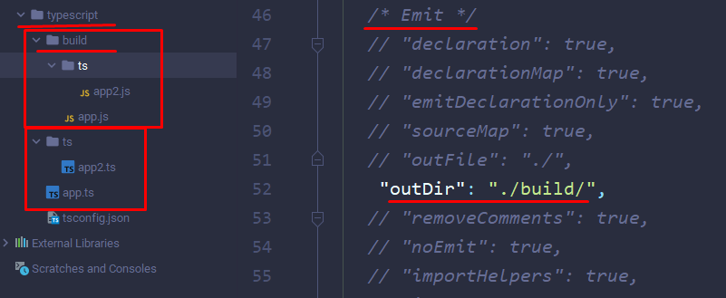

## **06 Компилятор TypeScript**
#tsconfig

### **051 Вводное видео**

Сама архитектура ТС:


### **052 Включение и исключение файлов**

Нужно упомянуть, что мы можем сами выбирать, какие файлы мы можем компилировать

```bash
tsc // скомпилирует весь проект
tsc имя_файла1 имя_файла2 // скомпилирует определённые файлы
```

Так же нужно упомянуть, что файл tsconfig - олицетворяет для ТС проект и его удаление приведёт к ошибке компиляции 

И тут уже стоит пойти про модификацию тсконфига. Первым делом нужно сказать, что внутри конфига (вне опций компилятора) мы можем определять, какие файлы будут подлежать компиляции. Свойство "*files*" принимает в себя массив значений, которые будем компилировать


Уже *include* поддерживает паттерны, через которые можно определить, какие файлы мы будем компилировать


*Exclude* исключает из компиляции те указанные файлы в инклюде и в файлс


Данный параметр позволяет нам дополнить наш основной конфиг другим ТСКонфигом (дополнение и переопределение существующих параметров внешним)

```JSON
"extends": "",
```

Так же нужно упомянуть полезные параметры внутри опций компилятора. Они позволяют аккуратно переводить старый проект на нативном JS в TS и делать его проверки


### **053 Вывод компиляции**

Первым делом нужно разобрать отдел Emit в настройках компиляции. Он отвечает за вывод компиляции

Первый параметр - *outDir*. Он определяет папку вывода компиляции. 
Уже outFile используют куда реже, так как те же модули не получится через него скомпилировать



*"removeComments": true* - ремувнет комментарии в выводимом файле

*"noEmit": true* - позволяет проверить файлы, но не выводить их куда-либо

*"noEmitOnError": true* - запрещает компиляцию при ошибке в коде

*"importHelpers": true* - импортирует хелперы один раз для всего проекта. Позволяет уменьшить размер файла
*Хелперы* - это дополнительные функции из ТС-либы, которые выступают полифиллами между ТС и JS 
*"noEmitHelpers": true* - не компилирует хелперы ТС. 

*"importsNotUsedAsValues": "remove"* - удаляет импорты типов из JS (будущая тема). Есть исключения, когда их нужно сохранить, но это бывает редко

*"sourceMap": true* - связывает JS-файлы с TS файлами (генерирует вместе с обычным JS файлом ".map", который и реализует связь)


*"inlineSourceMap": true* - заменяет стоковый сурсмап на инлайновый, но уже внутри скомпилированного JS (использовать можно только прошлую настройку, либо эту - вместе они не работают)

```JS
"use strict";  
//# sourceMappingURL=data:application/json;base64,eyJ2ZXJzaW9uIjozLCJmaWxlIjoiYXBwMi5qcyIsInNvdXJjZVJvb3QiOiIiLCJzb3VyY2VzIjpbIi4uLy4uL3RzL2FwcDIudHMiXSwibmFtZXMiOltdLCJtYXBwaW5ncyI6IiJ9
```

*"inlineSources": true* - впишет вообще весь сурс-код ТС в компилируемый файл (в виде инлайн-строки). Эта настройка больше актуальна для бэка

*"sourceRoot": ""* - будет искать сурс по определённому пути
*"mapRoot": ""* - будет искать мапу по нужному пути

"declaration": true - создаёт файл, где будет показана декларация всех интерфейсов и классов (без определённой реализации)


*"emitDeclarationOnly": true* - компилирует только декларации ТС

*"declarationDir": "./types/"* - сохраняет декларации по определённому пути


*"stripInternal": true* - не компилирует модуль, который был помечен комментарием - " / * @internal * / "  
```TS
/* @internal */  
class Delivery {  
    constructor(  
        public date: Date  
    ) {  
    }
}
```

*"preserveConstEnums": true* - сохраняет отдельно код енамов в виде объекта констант в JS

### **054 Язык и окружение**

Блок настроек язык и окружение отвечает за общую внешнюю работу компилятора 

В таргете мы указываем в какую версию JS мы компилируем файл


Настройка *lib* хранит в себе массив тех библиотек, которые будут подключены к TS. Изначально библиотека с консолью или Math уже подключены к нашему файлу, но если нам нужно будет немного обособить среду или добавить свои полифиллы, то нам нужно будет самостоятельно подключить все нужные библиотеки к нашей среде


Ниже идут настройки непосредственно jsx компиляции ТС
*"jsx": "preserve"*
*"jsxFactory": "",*                               
*"jsxFragmentFactory": "",*                       
*"jsxImportSource": ""*

*"noLib": true* - отключает все библиотеки в ТС

*"useDefineForClassFields": true* - включение использования ECMAScript формата классов (эни компилируется в объект с defineProperty)


### **055 Модули**

Блок настроек *Modules* определяет как будет компилироваться проект из модулей относительно друг друга

*"module": "commonjs"* - способ модулирования (стандартный)

*"rootDir": "./"* - расположение компиляции всего проекта

*"baseUrl": "./"* - базовый url для резолва модулей. Часто комбинируется с путями
"paths": {} - пути. Позволяют задать алиасы для путей в проектах, где используются модули и репозитории. Очень удобно использовать, чтобы не переписывать постоянно длинные пути

```JSON
"baseUrl": "./",
"paths": {  
	// ключ - алиас, значение - путь
	"@lib": ["./lib/lib-path"]  
},
```

```TS
import {} from "@lib/файл.js";
```

*"rootDirs": []* - используется замен рутдира для объединения проекта в одну дирректорию

*"typeRoots": []* - ищет дополнительные типы для библиотек, которые будем устанавливать

*"resolveJsonModule": true* - позволяет импортировать JSON в ТС, конвертировать его в объект и сразу с ним работать. Используется опция для работы с конфигурациями

### **056 Strict режим**

```JSON
/* Type Checking */  
"strict": true, 
 "noImplicitAny": true,  
 "strictNullChecks": true, 
 "strictFunctionTypes": true,   
 "strictBindCallApply": true,  
 "strictPropertyInitialization": false,
```

*"noImplicitAny": true* - запрещаем неявно задавать any (автоматическая подстановка any). Желательно  закомментировать в новых ТС проектах либо поставить true. Мы сможем как и прежде использовать any, но мы будем знать, что мы не смогли типизировать объект 

"strictNullChecks": true - позволяет избегать неявного возвращения из функции null или undefined.


*"strictFunctionTypes": true* - проверяет вкладываемые типы в функцию
Вот пример, когда мы присваиваем функцию в определённый тайп с выключенной настройкой

А вот с включённой настройкой


*"strictBindCallApply": true* - отвечает за типизацию тех же тестов в ТС и их корректность

```TS
test.apply(undefined, [1, 3]); // Error
```

*"strictPropertyInitialization": false* - обязует инициализировать свойства классов. Обычно ставят false для использования контрактной системы и классов в качестве интерфейсов

*"noImplicitThis": true* - проверяет переменные контекста this
Конкретно в данном случае, запись функции через function() определяет контекст вызова внутри себя (свои переменные) \


`"useUnknownInCatchVariables": true` - определяет современное поведение error (он имеет тип unknown). Стоит всегда оставлять true, так как еррор приобретёт тип any. Данный тип, например, позволит обратиться error.massage, а тот, в свою очередь, не всегда будет содержать ошибку

`"alwaysStrict": true` - добавляет дирриктиву стрикта в JS  

### **057 Проверки кода**

`"noUnusedLocals": true` - подсвечивает объявленные, но не прочитанные свойства (помогает избавиться от лишних переменных)

`"noUnusedParameters": true` - подсвечивает аргументы функции, которые мы не используем в самой функции

Так же у нас имеется `@ts-ignore`, который игнорирует ошибки в одной следующей строке после комментария

```TS
// @ts-ignore  
const defualtUser = new User("Defult");
```

Так же нужно упомянуть, что мы можем сократить запись конструктора и сразу создать внутреннее свойство - публичный нейм, добавить его в конструктор и присвоить при инициализации

```TS
class User {  
    name: string;  
  
    constructor(name: string) {  
        this.name = name;  
    }  
}
```

```TS
class User {  
    constructor(public name: string) {  
        this.name = name;  
    }  
}
```

Однако, если мы с настройкой `noUnusedParameters` попробуем записать приватное поле сразу в конструкторе, то опять получим ошибку (так как параметр не получится присвоить и он будет пустой)

```TS
class User {  
    constructor(private name: string) {  // Error
        this.name = name;  
    }  
}
```

`"exactOptionalPropertyTypes": true` - запрещает присваивать опциональным свойствам класса значение undefined


"noFallthroughCasesInSwitch": true - не выполняет следующий кейс, если мы не написали break или return (без настройки в данном примере выполнились бы сразу оба кейса)


"allowUnreachableCode": true - код, который не получится достичь и выполнить, будет подсвечиваться как недостижимый


"noUncheckedIndexedAccess": true - если мы будем обращаться к объекту, интерфейс которого нечётко задан, мы можем позволить себе вернуть undefined

В этот интерфейс попадает любой объект со свойством строка и значением булеан. Конкретно тут со включенной настройкой, мы получим юнион между *(boolean | undefined)*, что позволит нам избежать ошибок в коде (так как у нас нет свойства 'drive' в константе 'c')


"noPropertyAccessFromIndexSignature": true - запрещает обращаться к несуществующему ключу объекта через точечную запись (не создаст новый ключ при обращении).
Требует использования обращения через 

```TS
c["имя_ключа"]
```

"noImplicitOverride": true - заставляет всегда явно задавать оверрайд при наследовании (стоит всегда включать)