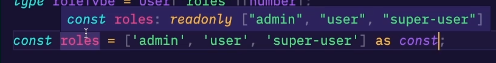

### 068 Keyof

`keyof` говорит нам, что мы берём от определённого объекта только ключи. 
Конкретно тут в примере, в константу `key` мы можем положить только ключи интерфейса `IUser`

```TS
interface IUser {  
    name: string;  
    age: number;  
}  
  
type keyOfUser = keyof IUser;  
  
const key: keyOfUser = "name"; // or "age"
```

И вот пример, в котором мы хотим получить в константе `userName` имя пользователя, но встречаемся с такой проблемой, что можем написать в качестве аргумента любое значение и не увидим ошибки от компилятора

```TS
interface IUser {  
    name: string;  
    age: number;  
}  
  
type keyOfUser = keyof IUser;  
  
function getValue(obj, key) {  
    return obj[key];  
}  
  
const user: IUser = {  
    name: 'John',  
    age: 23  
}  
  
const userName = getValue(user, 'names'); // Error
```

И теперь, используя дженерики, мы можем обозначить, что наша функция должна принимать в себя первое значение - типа `T`, и второе - типа `K`. Второе значение (`K`) будет расширяться ключами, содержащимися в типе `T`.

Конкретно в эту функцию мы первым аргументом передаём объект (ключи: name, age) и вторым аргументом мы должны передать один из ключей объекта (name или age). И функция нам по-итогу вернёт значение ключа нужного нам объекта (тут - `user[name] -> return 'John'`)

В данном случае, компилятор нам будет явно указывать, что при вызове метода `getValue()`, второе значение обязательно должно быть одним из ключей первого аргумента

```TS
interface IUser {  
    name: string;  
    age: number;  
}  
  
type keyOfUser = keyof IUser;  
  
function getValue<T, K extends keyof T>(obj: T, key: K): T[K] {  // !
    return obj[key];  
}  
  
const user: IUser = {  
    name: 'John',  
    age: 23  
}  
  
const userName = getValue(user, 'name'); // 'John'
```

### 069 Упражнение - Пишем функцию группировки

Необходимо написать функцию группировки, которая принимает массив объектов и его ключ, производит группировку по указанному ключу и возвращает сгруппированный объект.

Пример:

```js
[
    { group: 1, name: 'a' },
    { group: 1, name: 'b' },
    { group: 2, name: 'c' },
];
```

При группироке по `group`:

``` js
{
    '1': [ { group: 1, name: 'a' }, { group: 1, name: 'b' } ],
    '2': [ { group: 2, name: 'c' } ]
}
```

```TS
// Начальные условия  
interface Data {  
    group: number;  
    name: string;  
}  
  
const data: Data[] = [  
    {group: 1, name: 'a'},  
    {group: 1, name: 'b'}, // key  
    {group: 2, name: 'c'},  
];  
  
// Реализация  
interface IGroup<T> {  
    [key: string]: T[]; // Создаём мапу свойств объекта  
}  
  
type key = 'string' | 'number' | 'symbol';  
  
function group<T extends Record<key, any>>(array: T[], key: keyof T): IGroup<T> {  
    return array.reduce<IGroup<T>>((map: IGroup<T>, item) => {  
        const itemKey = item[key];  
        let currentEl = map[itemKey];  
        if (Array.isArray(currentEl)) {  
            currentEl.push(item);  
        } else {  
            currentEl = [item];  
        }        map[itemKey] = currentEl;  
        return map;  
    }, {});  
}  
  
const res = group<Data>(data, 'group');  
console.log(res);
```


### 070 `Typeof`

Тут сразу нужно сказать, что компилятор ТС, когда мы пишем юнион тип данных покажет нам, что тип юнион. Однако уже внутри других структур (например, условий) мы явно увидим тип переменной (от значения внутри)

```TS
let strOrNum: string | number = 5; // string | number  
  
if (strOrNum) { // number  
}
```

Стоковый `typeof` из JS выполняет для нас операцию проверки типа данных в переменной. Однако есть и `typeof`, который используется в типах и он уже имеет свою реализацию только в ТС

```TS
let strOrNum: string | number; // string | number  
  
if (Math.random() > 0.5) { // number  
    strOrNum = 5;  
} else {  
    strOrNum = "str";  
}  
  
if (typeof strOrNum === "string") {  
    console.log(strOrNum + " some way of");  
} else {  
    console.log(strOrNum);  
}
```

Типовый `typeof` внутри ТС позволяет задать тип одной переменной отталкиваясь от другой переменной

```TS
let date: string | number;  
let birthDate: typeof date; // string | number
```

И обычно используется `typeof` в паре с `keyof`. В примерах ниже мы получаем типы наших объектов. Конкретно мы можем достать в качестве типа ключ объекта. Обычный `keyof` достанет только само наименование ключа из объекта, а не тип.

```TS
const user = {  
    name: 'John',  
}  
  
type userName = keyof typeof user; // "name"
```
```TS
enum Direction {  
    Up,   
	Down  
}  

type direction = keyof typeof Direction; // "Up" | "Down"
```

### 071 Indexed Access Types

Мы имеем в основе своей два компонента ТС: то, что попадает непосредственно в рантайм после компиляции

```TS
// Попадаает в рантайм JS
interface Role {  // 
    name: string;  
}  
  
interface User {  
    name: string;  
    roles: Role[];  
}  
  
const user: User = {  
    name: 'Вася',  
    roles: []  
}  
  
const nameUser = user['name'];  
const roleNames = 'roles';
```

И то, что не попадает в рантайм (существует только внутри ТС). 
Тут хочется упомянуть, что второй тайп работать не будет, так как тут он принимает в себя не тип, а значение от рантайм-части языка

```TS
const nameUser = user['name']; // 1 
const roleNames = 'roles'; // 2

// Работа с точки зрения типов  
//1
type roleType = User['roles'];  // Получаем тип ролей пользователя
//2
type roleType2 = User[roleNames]; // Error
```

Конкретно в этом примере `roleType2` работать будет, так как мы обращаемся к внутреннему средству языка - типам и через `typeof` получаем тип объекта

```TS
const nameUser = user['name'];  
const roleNames = 'roles';  // === 'roles'
  
type roleType = User['roles'];  
type roleType2 = User[typeof roleNames]; // Ok
```

Тут уже нужно напомнить, что константы принимают в себя литеральные типы данных (тип константы = содержащемуся в ней значению). Однако тот же трюк, что и выше, но с `let` - не пройдёт

```TS
const nameUser = user['name'];  
let roleNames = 'roles';  // ! === 'string'
  
type roleType = User['roles'];  
type roleType2 = User[typeof roleNames]; // Error
```

Однако с `let` получится сделать тайпоф, но нужно будет конкретно задать тип для переменной в виде нашего значения

```TS
let roleNames: 'roles' = 'roles';  
type roleType2 = User[typeof roleNames]; // OK
```

Однако в ТС опять же есть механизм из JS, который применим только для типов.
В обычных условиях `[значения][индекс_значения]` позволяет нам обратиться к значению по индексу во вторых скобках.
Но через `type name = Interface[значения][number]`, где значением является массив - в ТС мы говорим, что обращаемся к ключам объекта массив, которые представляют собой числа (0: значение, 1: значение)

```TS
// Обращаемся к первому элементу  
const userName = user['name'][0]; 
// Обращаемся ко всем элементам, получая тип
type roleType = User['roles'][number]; // === Role
```

Дальше представим, что мы хотим сделать юнион из всех элементов массива внутри константы
Первым делом, мы можем кастануть наш массив как константу, тем самым создав юнион тип у переменной
И дальше в тайпе через тайпоф определим массив нашей константы и будем просить отдельные элементы в качестве юнионов

Такой подход удобен, когда нам нужно проверять тип пользователя, которого мы получаем (например) 





И так же мы можем получать вложенные типы из наших интерфейсов. Наш интерфейс User имеет свойство, которое принимает в себя интерфейс Permission. Сам же Permission представляет из себя объект, который принимает в себя свойство с типом Дата. 
Через тайп `['permissions']['endDate']` мы получаем вложенный внутри свойства permission тип свойства endDate, который уже равен Дате

```TS
interface Role {  
    name: string;  
}  
  
interface Permission {  
    endDate: Date;  
}  
  
interface User {  
    name: string;  
    roles: string[];  
    permissions: Permission;  
}  
  
const user: User = {  
    name: 'Вася',  
    roles: [],  
    permissions: {  
        endDate: new Date(), // === Date  
    }  
}  
  
type roleType = User['roles'][number]; // === roles  
type dateType = User['permissions']['endDate']; // === Date
```

### 072 Conditional Types

*Conditional*-условия нам позволяют в одну строку записать какие-то короткие для выполнения условия
*Conditional* же в типах позволяет нам определить какой тип будет у объекта при определённых вводных. Конкретно в примере, `data` будет иметь тип строки, если в дженерик передали `success`

```TS
// Работа в JS
const a: number = Math.random() > 0.5 ? 1 : 0;  

// Работа в ТС с тайпами
interface HTTPResponse<T extends 'success' | 'failed'> {  
    code: number;  
    data: T extends 'success' ? string : Error;  // !
    data2: T extends 'success' ? string : number;  // !
}
```

И теперь, в зависимости от типа передаваемого дженерика, мы можем определить, какие типы мы можем поместить внутрь производного от интерфейса объекта

```TS
const success: HTTPResponse<'success'> = {  // если success
    code: 200,  
    data: 'success',  
    data2: 'done'  
}  
  
const error: HTTPResponse<'failed'> = {  // если failed
    code: 400,  
    data: new Error(),  
    data2: 0  
}
```

Так же кондишенелы могут нам пригодиться для упрощения перегрузок больших функций. Конкретно тут в примере, мы проверяем функцию на то, какое значение мы в неё вложили - число или строку

```TS
class User {  
    id: number;  
    name: string;  
}  
  
class UserPersistend {  
    dbId: string;  
}  
  
function getUser(Id: number): User;  
function getUser(dbId: string): UserPersistend;  
function getUser(dbIdOrId: string | number): User | UserPersistend {  
    if (typeof dbIdOrId === 'number') {  
        return new User();  
    } else {  
        return new UserPersistend();  
    }  
}
```

Тут уже приведён пример использования кондишенл типов для проверки возвращаемого типа из тайпа. Данный тайп содержит в себе `generic`, который при расширении от `number` будет возвращать `User`, а в остальных случаях - `UserPersistend`
Однако нам нужно обязательно будет скастовать `return` к нашему возвращаемому типу, так как `type` не работают в рантайме и выдают ошибку

```TS
class User {  
    id: number;  
    name: string;  
}  
  
class UserPersistend extends User {  
    dbId: string;  
}  
  
type UserOrUserPersistend<T extends number | string> = T extends number ? User : UserPersistend; // !  
  
function getUser<T extends number | string>(id: T): UserOrUserPersistend<T> { // !  
    if (typeof id === 'number') {  
        return new User() as UserOrUserPersistend<T>; // !  
    } else {  
        return new UserPersistend() as UserOrUserPersistend<T>; // !  
    }  
}  
  
const res1 = getUser(1);  
const res2 = getUser('sedsafs');
```

### 073 Infer

Представим, что у нас есть определённая транзакция, которая происходит от одного значения к другому

```TS
function runTransaction(transaction: {  
    fromTo: [string, string] // [string, string]  
}) {  
    console.log(transaction);  
}  
  
const transaction = {  
    fromTo: ['1', '2'], // string[]  
}  
  
runTransaction(transaction); // Error
```

Чтобы всё заработало, нужно явно типизировать нашу транзакцию так:

```TS
const transaction: { fromTo: [string, string] } = {  
    fromTo: ['1', '2'],
}  
```

Либо так:

```TS
const transaction = {  
    fromTo: ['1', '2'] as [string, string],
} 
```

`infer` занимается тем, что он псевдообъявляет переменную типа `First` внутри нашего тайпа и позволяет его вытащить в наш возвращаемый тип (использовать в кондишенеле возвращения)

```TS
type getFirstArg<T> = T extends (first: infer First, ...args: any[]) => any ? First : never
```

И чисто фактически мы вытащили тип в возвращаемое значение. В саму переменную транзакции мы запихнём дженерик от функции нашего тайпа. 


`infer` обычно используется в каких-то плохо-типизируемых библиотеках для получения определённого аргумента и использования этого аргумента

### 074 Mapped Types

Мы создали систему, где раздаём пользователям права на редактирование отдельных элементов системы. Где-то пользователь может только читать, где-то изменять или создавать. 
Нам нужно реализовать проверку того, что у пользователя есть определённое право в принципе.

```TS
type Modifier = 'read' | 'update' | 'create';  
  
type UserRoles = {  
    customers?: Modifier,  
    projects?: Modifier,  
    adminPanel?: Modifier,  
}
```

Мы можем задать проверку наличия доступа у пользователя к определённым элементам системы либо так: пишем каждое свойство из объекта и проверяем его через булеан.

```TS
type UserAccess = {  
    customers?: boolean,  
    projects?: boolean,  
    adminPanel?: boolean,  
}
```

Либо так. Конкретно этот тайп говорит нам о том, что каждое свойство в объекте должно иметь boolean-значения.

```TS
// Мапа
type ModifierToAccess<Type> = {  
    [Property in keyof Type]: boolean;  
}

// непосредственное использование
type UserAccess = ModifierToAccess<UserRoles>; 
```

И вот пример использования самого простого мапа, который будет проверять все значения нашего объекта, чтобы они были boolean 


Так же мы можем регулировать необязательность свойств и добавлять модификаторы

```TS
// уберёт необязательность со всех свойств
[Property in keyof Type]-?: boolean;  

// добавить на все свойства необязательность свойств
[Property in keyof Type]+?: boolean; 

// Добавит модификатор ридонли
+readonly [Property in keyof Type]+?: boolean; 
```

Так же через прокаст можно поменять наименование ключей в объекте

```TS
type ModifierToAccess<Type> = {  
    +readonly [Property in keyof Type as `canAccess${string & Property}`]-?: boolean;  
}
```


Так же через синтаксис `Exclude<>` мы можем убрать из маны ненужные нам значения. Первый аргумент - сами принимаемые значения, второй аргумент - то, что мы должны исключить из выборки

```TS
type ModifierToAccess<Type> = {  
    +readonly [Property in keyof Type as Exclude<`canAccess${string & Property}`, 'canAccessadminPanel'>]+?: boolean;  
}
```


Так же через вилку можно добавить ещё значения для исключения из `map`


### 075 Упражнение - Валидация форм

Нам нужно провалидировать форму. Форма в себя обязательно принимает имя и пароль. Мы отдельно создали форму с именем и паролем. 
Дальше нам нужно написать тайп, который будет проверять валидна ли форма. Ключ у нас находится в множестве типа Т. Значением у свойства могут быть два объекта (которые записаны через вилку "`|`")
И уже конечный блок кода выполняет саму валидацию полученных значений

```TS
interface IForm {  // Интерфейс формы
    name: string;  
    password: string;  
}  
  
const form: IForm = {  // Форма
    name: 'Вася',  
    password: '123',  
}  
  
type Validation<T> = {  // Тайп валидации
	[K in keyof T]: {  
	    isValid: true  
	} | {  
	    isValid: false;  
	    errorMessage: string;  
	} 
} 

const formValidation: Validation<IForm> = { // Валидация формы  
    name: { isValid: true },  
    password: { isValid: false,  errorMessage: 'Должен быть длиннее 5 символов' },  
}
```

### 076 Template Literal Types

Шаблоны литеральных типов представляют из себя плэйсхолдеры для других типов, которые позволяют нам модифицировать уже имеющиеся типы под другие сущности

```TS
type ReadOrWrite = 'read' | 'write';  
  
type Access = `can${ReadOrWrite}`;
```


Так же мы можем модифицировать типы внутри этих шаблонов (например, перевести полученные типы в заглавные буквы)

```TS
type ReadOrWrite = 'read' | 'write';  
  
type Access = `can${Uppercase<ReadOrWrite>}`;
```


Дженерик `Capitalize<>` переводит первые буквы в заглавные

```TS
type ReadOrWrite = 'read' | 'write';  
  
type Access = `can${Capitalize<ReadOrWrite>}`;
```


Так же добавив ещё один шаблон, мы увеличим количество типов вдвое (через `Bulk` добавятся неизменные варианты - пустая строка и варианты с `Bulk`)

```TS
type ReadOrWrite = 'read' | 'write';  
type Bulk = 'bulk' | '';  
  
type Access = `access${Capitalize<ReadOrWrite>}${Capitalize<Bulk>}`;
```


Самый простой и частый пример использования таких темплейтов - это задание шаблонов значения для разных типов ответов (например, нам нужно реализовать `error` в *http* и для другой структуры)

Или на том же фронте отделить ==fade-In== и ==fade-Out== через такую конструкцию


Так же мы можем **распаковать наш составной тип** и работать с его изначальным значением. 
То есть в этом примере через `infer` (в `ReadOrWriteBulk`) мы достали значение и и убрали его

```TS
type ReadOrWrite = 'read' | 'write';  
type Bulk = 'bulk' | '';  
  
type Access = `access${Capitalize<ReadOrWrite>}${Capitalize<Bulk>}`;  
  
type ReadOrWriteBulk<T> = T extends `can${infer R}` ? R : never; // !  
  
type T = ReadOrWriteBulk<Access>;
```

