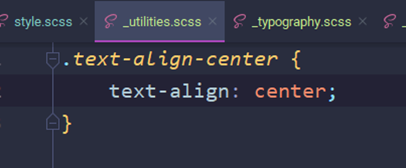
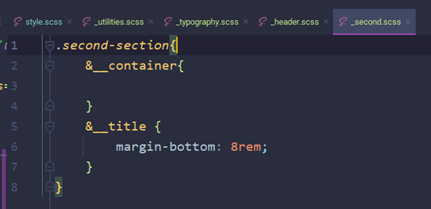
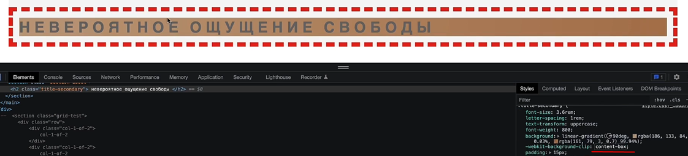
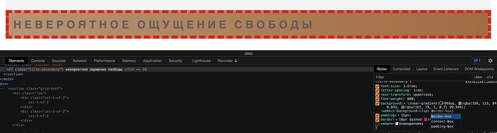

### **3.11 Применение градиента к тексту. Backgroud-clip**
- Так же стоит упомянуть, для чего мы делали блок утилит. Они будут отвечать у нас за отдельно взятые свойства, в которые мы будем вкладывать определённую для них функцию

- И вот примерно так будет выглядеть наш конечный стилизированный тайтл

Инлайн-блок ему был задан просто для примера, чтобы добавить отдельную утилиту, через которую выровняем текст

- Свойство «-webkit-background-clip» настраивает ограчнение применения градиента по разным границам. В нашем примере, мы ограничили применение цвета бэкграунда одним текстом (text). Так же мы можем ограничить по другим границам

Ну и так же мы можем задать ограничение по контенту

По границе и так далее

- Однако одного ограничения цвета бэкграунда нам не хватает. Дело в том, что бэкграунд находится позади текста, оттого и скрыт. Поэтому нам нужно ещё и вписать

«color: transparent;»

Он сделает сам цвет текста прозрачным, но текст не скроет (как сделал бы это opacity)

- Так же стоит пояснить, что «-webkit-» (вендерный префикс) мы подставляем под экспериментальные свойства, которые ещё не одобрены в CSS. То есть эти свойства можно просто так вставить в браузер, но если значение этого свойства не одобрено (как background-clip выше, который работает без этой приставки с остальными свойствами, но не работает с «text»), то с обычной версией наименования свойства – наше экспериментальное работать не будет

-webkit-background-clip: text – работает только с приставкой, так как экспериментальное свойство

background-clip: border-box – работает без приставки

Так же у каждого браузера свои вендерные префиксы и их стоит учитывать

- Вот так вот выглядит текст с анимацией
 