# WebStorm
#WebStorm

### Начало работы

Создать проект мы можем с несколькими предустановками либо создать полностью пустой проект

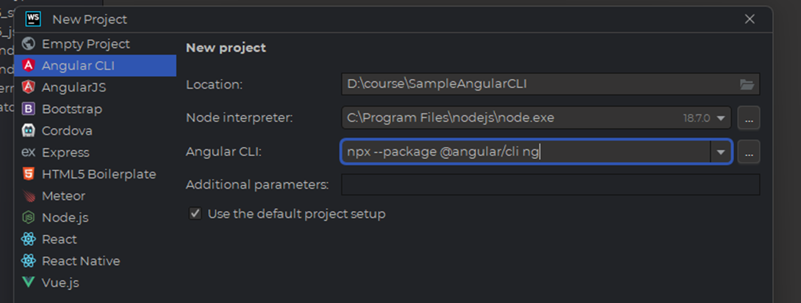

### Настройки редактора

Тут непосредственно можно определить стиль, который мы соблюдаем и настроить под него редактор

 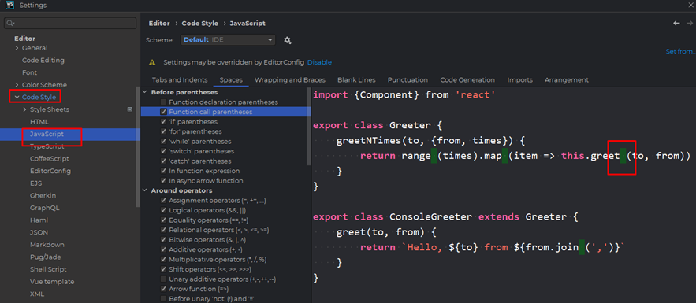
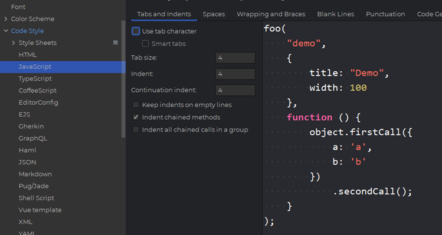

Тут можно выбрать версию js, на котором мы пишем

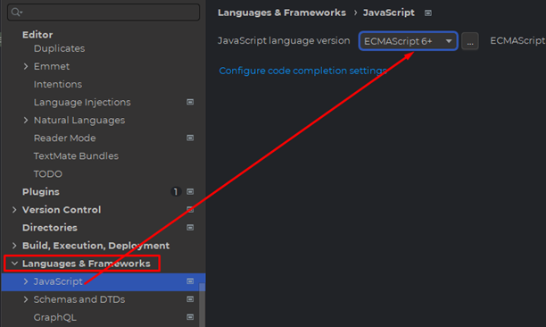

Чтобы подключить ноду к шторму, нужно тут поставить галочку перед началом работы

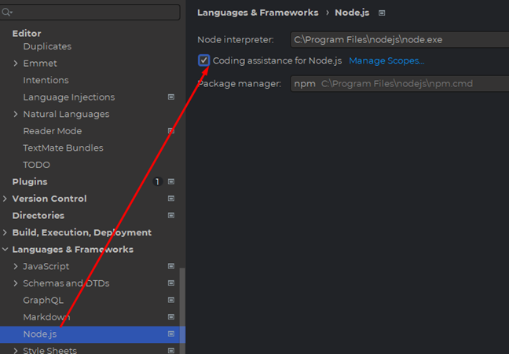

Тут можно открыть несколько прикольных видов редактора (полноэкранный, «Дзен»)

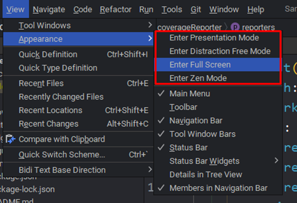

В папке проекта есть несколько кнопок: найти положение в проекте открытого файла, развернуть все папки, свернуть все папки, настройки

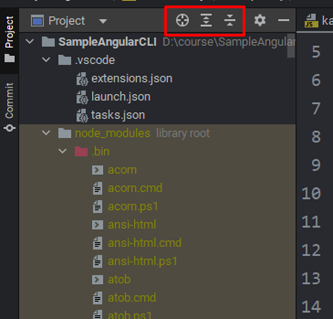

Структура показывает нам структуру самого js-файла (методы, классы, переменные и так далее) и показывает тип данных файлов (если работаем с ts)

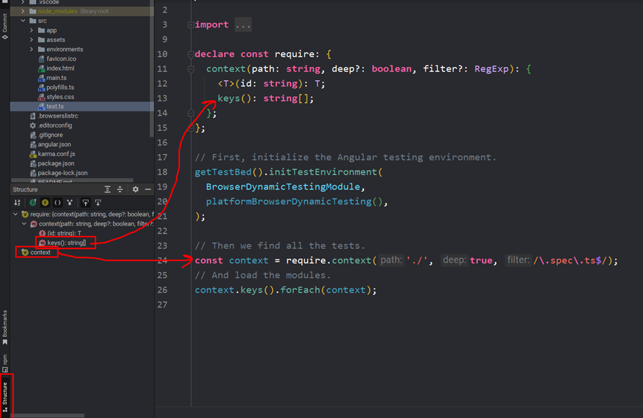

А тут вебшторм нам показывает функции нашей npm, которые он пропарсил и быстро готов нам предоставить их функционал

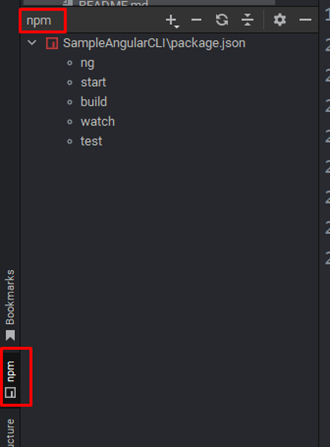

Тут можно настроить боковое меню

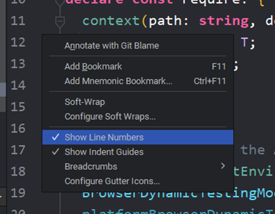

На двойной шифт у нас вылазит менюшка, которой можно менять некоторые настройки программы, а так же искать любые объекты файлов либо сами файлы в проекте

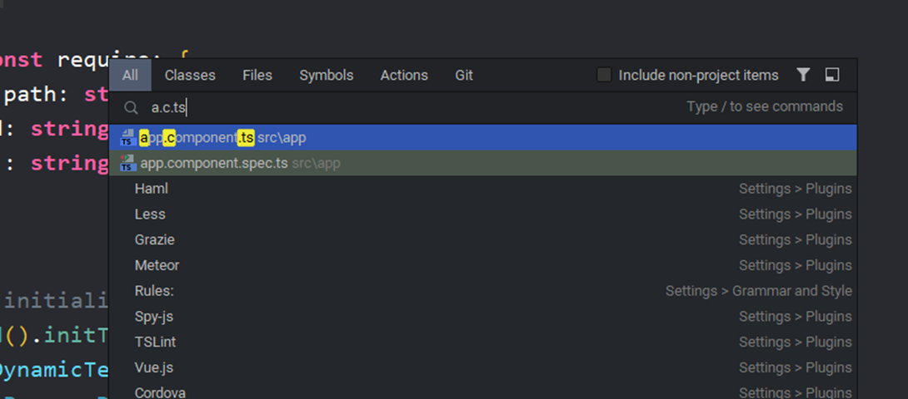

На alt+enter можно вызывать окно рефакторинга

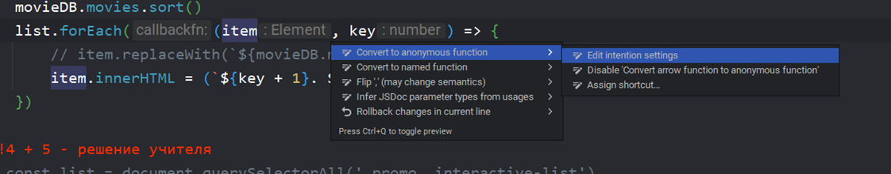

Ctrl+Alt+Shift+F7 – вызывает меню поиска определённого элемента по всему проекту

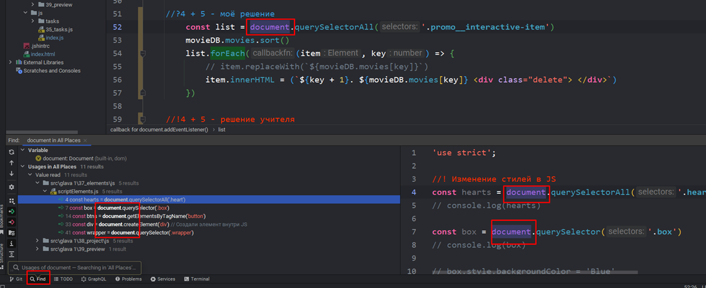

Shift+F6 – переименование переменной во всём проекте. Ctrl+R – переименует только в открытом файле

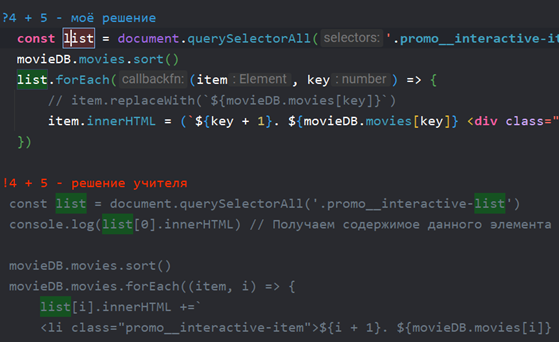 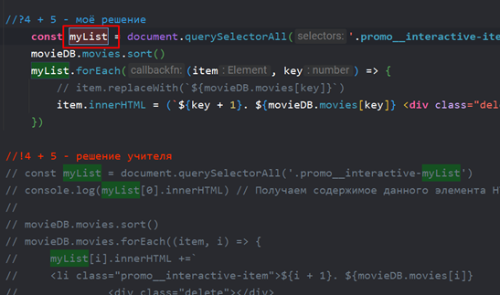

Так же у нас есть функциональные комментарии. Есть отдельная вкладка, которая хранит в себе комментарии //todo

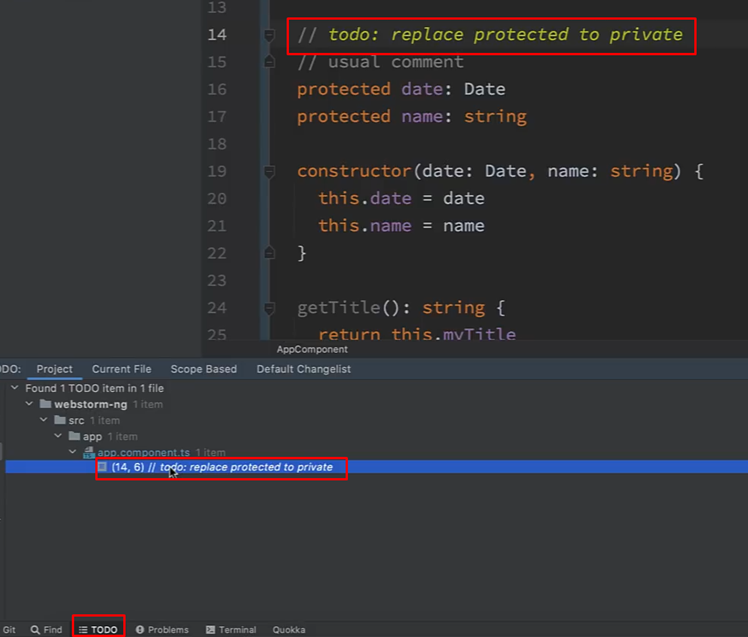

Так же через F11 можно отдельные строчки кода добавлять в закладки

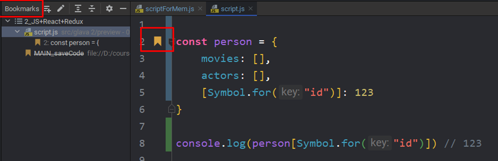

Так же можно задавать спецсимволы для маркеров

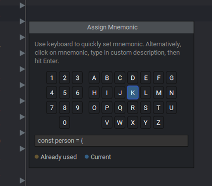

## Работа с кодом

Alt+Insert - генерация кода. Конкретно тут показано, как сделать геттер и сеттер для приватного свойства внутри класса

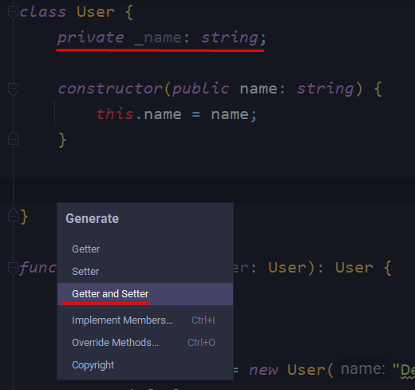
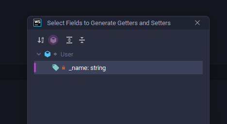

Ctrl+Shift+СтрелкиВниз/Вверх – перемещают строку вниз/верх

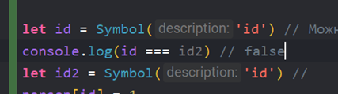

Alt+Enter - окно быстрых опций для редактирования кода

29:20