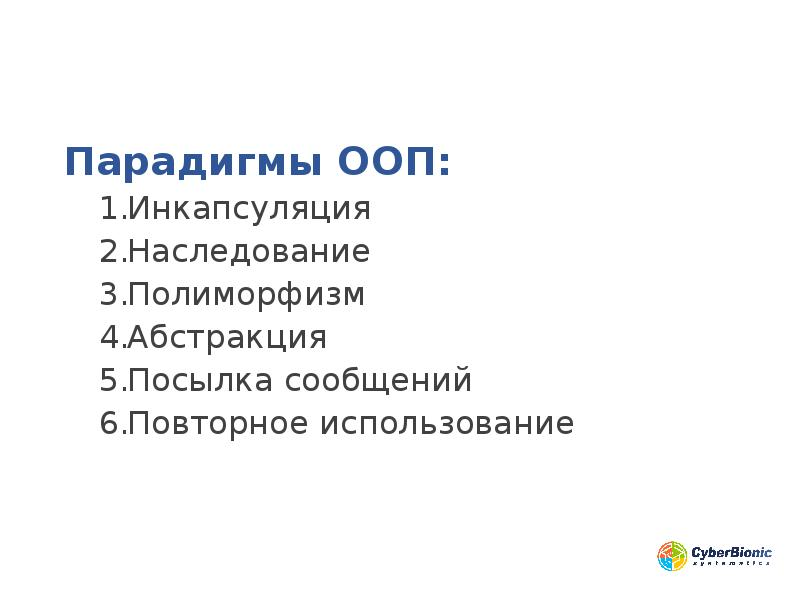

# ООП
#OOP

Самая используемая и продвинутая в мире методология написания легкорасширяемого и безопасного кода, которая состоит из нескольких парадигм

Материал:
[Немного про ООП (by ExtremeCode)](../../Programming%20Principes/ООП/Великое%20ООП/Немного%20про%20ООП%20(by%20ExtremeCode).md)
[ООП на простых примерах. Объектно-ориентированное программирование](../../Programming%20Principes/ООП/ООП%20в%20TypeScript/ООП%20на%20простых%20примерах.%20Объектно-ориентированное%20программирование.md)