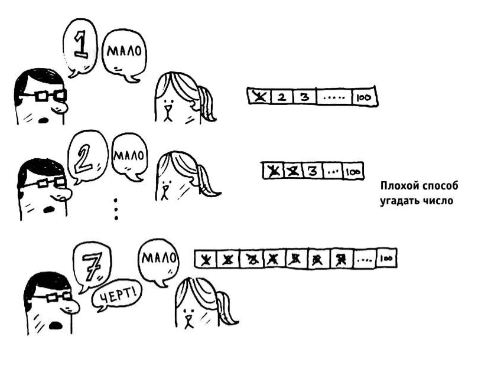

# Грокаем алгоритмы - Адитья Бхаргава

#Book

## **Знакомство с алгоритмами**

Алгоритмом называется набор инструкций для выполнения какой-либо задачи

### Бинарный поиск

==Бинарный поиск== - это алгоритм, который работает с _отсортированным списком элементов_. Если элемент, который вы ищете, присутствует в списке, то бинарный поиск возвращает ту позицию, в которой он был найден. В противном случае бинарный поиск возвращает `null`.

Самый простой пример: нам нужно отгадать число в диапазоне из 100. Мы получаем только ответы "мало", "много" и "угадал"

1. Первый вариант - неэффективный - перебрать все элементы с 1
   

2. Второй способ - бинарный поиск - загадываем число в середине диапазона и исключаем половину оставшихся чисел
   

Итог: мы выполнили всего 7 операций


На основании прошлой логики делаем следующий вывод:

> [!note] В общем случае для списка из ==n== элементов бинарный поиск выполняется за ==log<sub>2</sub>n== шагов, тогда как простой поиск будет выполнен за ==n== шагов.

```JS
"use strict";
/**
 * Searches recursively number from the list
 * @param {Array} list Source array
 * @param {number} item Search item
 * @returns {(number|null)} Number if the value is found or NULL otherwise
 */
function binarySearch = (list, item) => {
  let low = 0;
  let high = list.length - 1;

	// пока миниум меньше максимума
  while (low <= high) {
	  // считаем среднее значение между миниумуом и максимумом
    const mid = Math.floor((low + high) / 2);
    // желаемое значение
    const guess = list[mid];

	// если искомое число совпадает с найденным, то возвращаем наше среднее значение
    if (guess === item) {
      return mid;
      // а если догадка была слишком велика, то обновляется переменная high
    } else if (guess > item) {
      high = mid - 1;
      // если названное число было слишком мало, то переменная low обновляется
    } else {
      low = mid + 1;
    }
  }

	// если ничего не нашли, то вернём null
  return null;
}

const my_list = [1, 3, 5, 7, 9];

console.log(binary_search(my_list, 3)); // 1
console.log(binary_search(my_list, -1)); // null
```

### "О-Большое"

## **Сортировка выбором**

## **Рекурсия**

## **Быстрая сортировка**

## **Хеш-таблицы**

## **Поиск в ширину**

## **Алгоритм Дейкстры**

## **Жадные алгоритмы**

## **Динамическое программирование**

## **Алгоритм k ближайших соседей**

## **Остальные алгоритмы**
