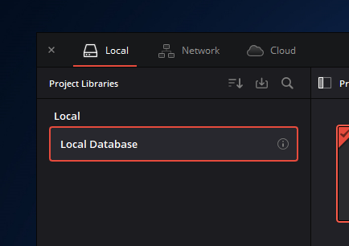
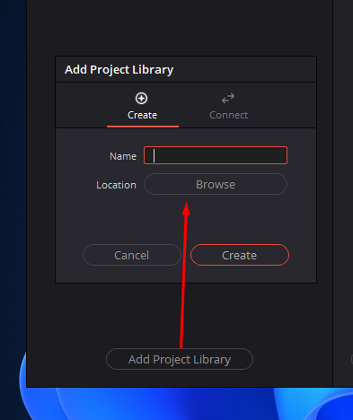
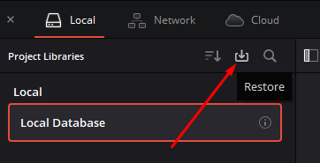
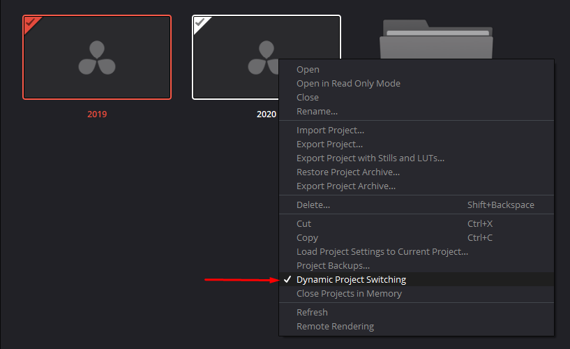
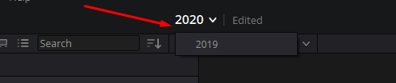
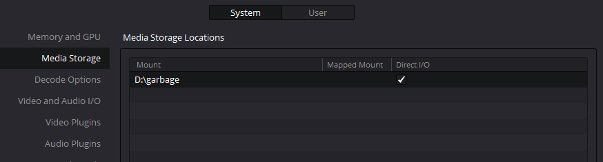
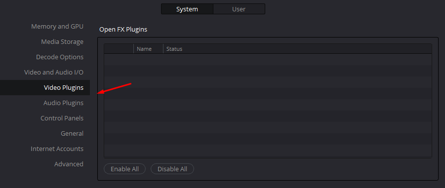
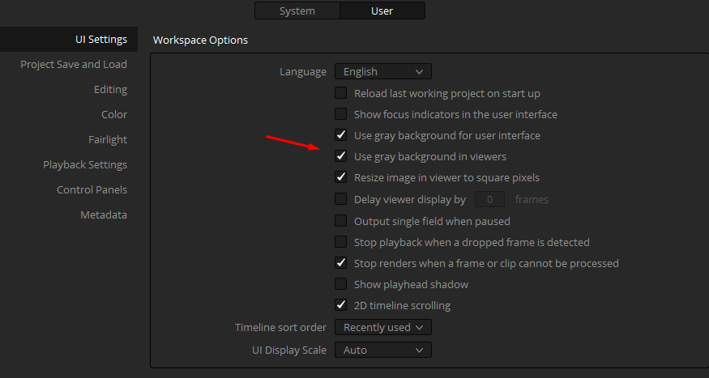
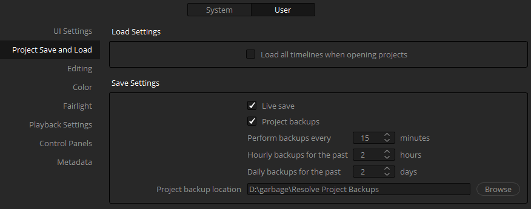
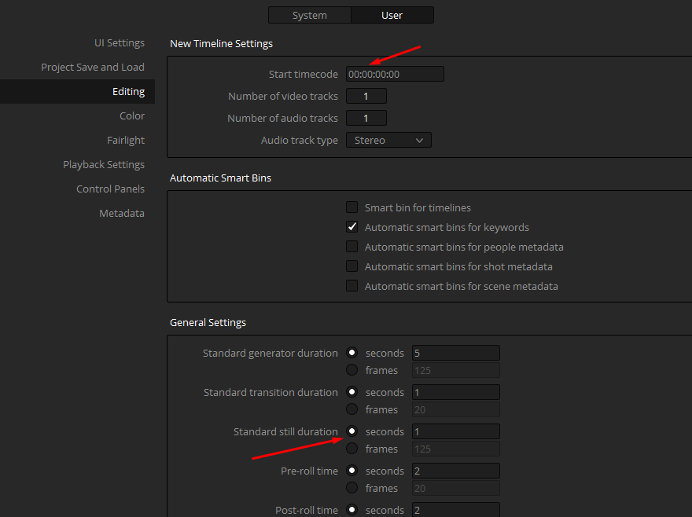

# 1 Введение

## Project manager создание проекта, databases

Проекты хранятся внутри баз данных и по ним же и делятся

Так же мы можем создать новую коллекцию (БД с проектами) в нужном нам месте

Эта кнопка позволит восстановить базу данных, которую мы перенесли с другого ПК

Так же мы можем в контекстном меню:

- импортировать / экспортировать проекты
- просматривать историю бэкапов проектов
- обновлять его
- включить динамическое переключение по проектам, что даст возможность переключаться между несколькими проектами, предварительно загрузив их в память

И тут уже можно переключать два проекта между друг другом.

Эта функция может быть полезна, если нам нужно скопировать что-то из одного проекта в другой, чтобы буфер обмена не пропадал

## Настройки программы

Папка хранилища медиаданных

Видео и аудиоплагины

Настройки интерфейса

Настройки для сохранений

Настройки редактирования

